主要：十进制和二进制转换
Java二进制，0b开头

一、Positional number system
| The Hindu-Arabic numeral system, | Base 10 |
|----------------------------------|---------|
| The ancient Babylonians          | Base 60 |
| The Mayans                       | Base 20 |

二、Converting base
1,To convert a number in base 10 to any other base, we need to figure out how many units of each power it has
案例
<table>
<colgroup>
<col style="width: 44%" />
<col style="width: 55%" />
</colgroup>
<thead>
<tr class="header">
<th>
E.g. convert 1004 from base 10 to base 12

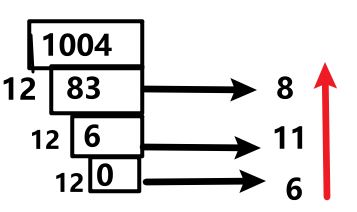

• So the answer is 6-11-8 or 6elv8
</th>
<th>
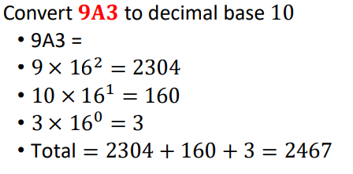

</th>
</tr>
</thead>
<tbody>
</tbody>
</table>

三、Bit Manipulation
1，In Java an int is represented as 32 bits
• Starting from the right, each bit represents increasing powers of 2
• **The leftmost bit is special.** **MSB**
0101100101 is 357
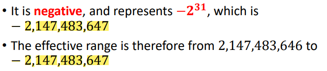
2,
<table>
<colgroup>
<col style="width: 52%" />
<col style="width: 47%" />
</colgroup>
<thead>
<tr class="header">
<th>

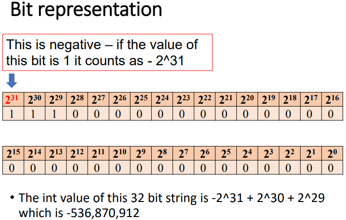
</th>
<th>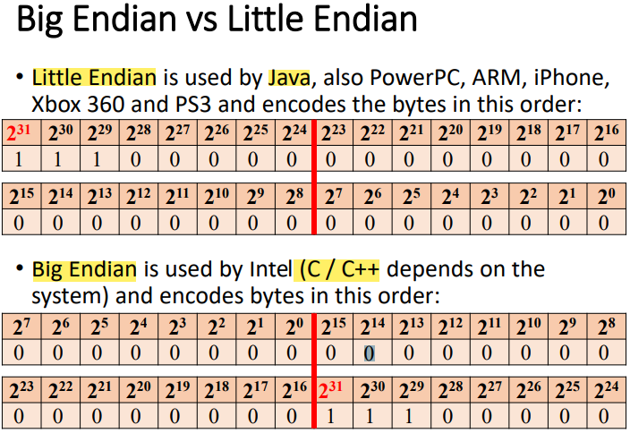</th>
</tr>
</thead>
<tbody>
</tbody>
</table>

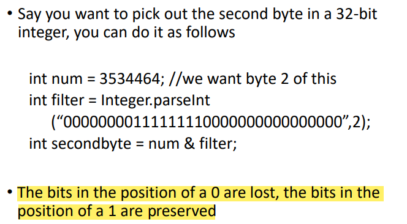

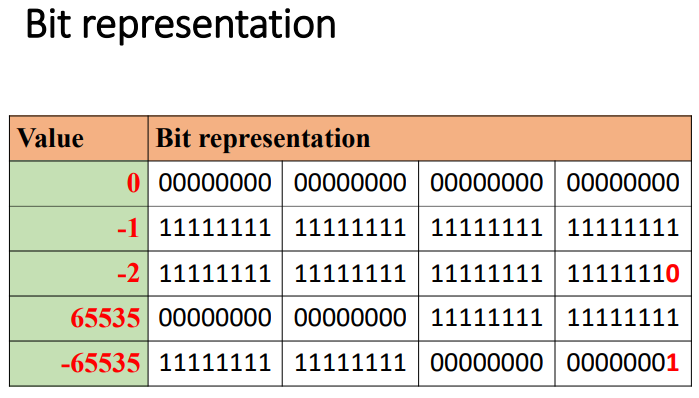
3,operator
3.1，基本
| 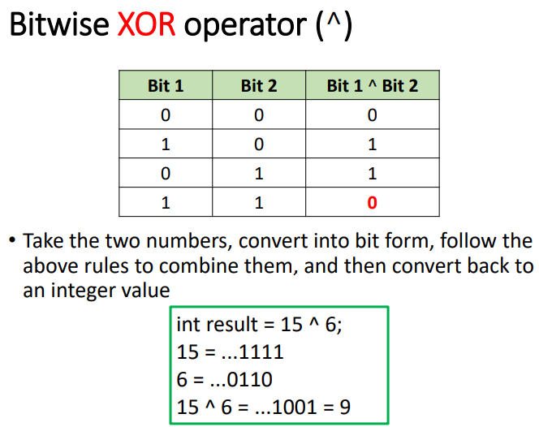 | 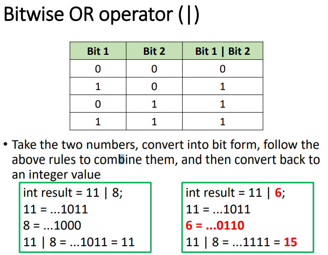 | 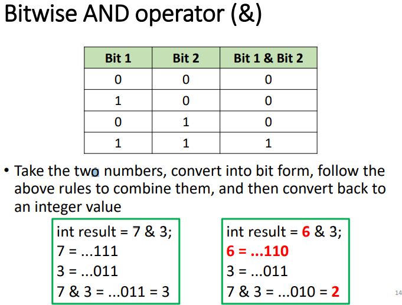 |
|--------------------------------------------------------------------------------------------------------------------------------------------------------------------------------------------------------------------------------------------------------------------------------------------------------------------------------------------------------------------|--------------------------------------------------------------------------------------------------------------------------------------------------------------------------------------------------------------------------------------------------------------------------------------------------------------------------------------------------------------------------------------------------------------------------------------|----------------------------------------------------------------------------------------------------------------------------------------------------------------------------------------------------------------------------------------------------------------------------------------------------------------------------------------------------------------------------------------------------------------------------|

案例
| 2 & 2=2   |
|-----------|
| 8\|7=15   |
| 11^3=8    |
| 11^-3=-10 |

3.2，左移乘，右移除

| 1\) Bitwise left shift(\<\<)                                                                                                                                                                 |
|----------------------------------------------------------------------------------------------------------------------------------------------------------------------------------------------|
| 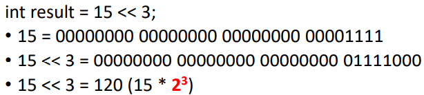 |

| Bitwise **signed** right shift (\>\>)                                                                                                                                                                                                                                                                                                                            | Bitwise **unsigned** right shift (\>\>\>)                                                                                                                                                                                                                                                                                                              |
|------------------------------------------------------------------------------------------------------------------------------------------------------------------------------------------------------------------------------------------------------------------------------------------------------------------------------------------------------------------|--------------------------------------------------------------------------------------------------------------------------------------------------------------------------------------------------------------------------------------------------------------------------------------------------------------------------------------------------------|
| 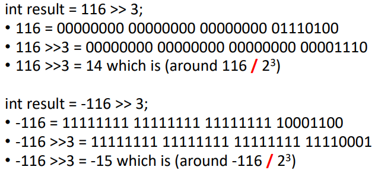 | 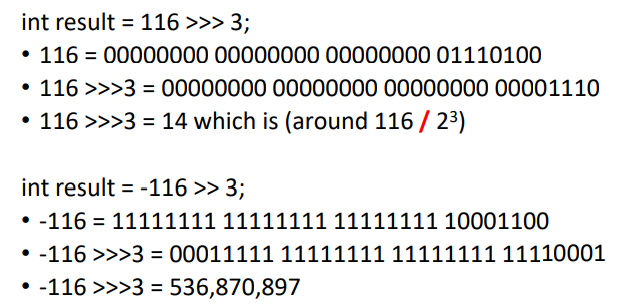 |

3.3，Bitwise complement (~)
取反
**~n=-(n+1);**
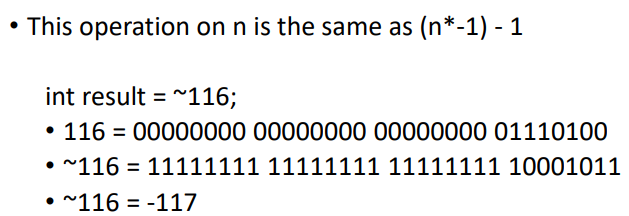

| 2 \<\< 3=16 |
|-------------|
| 8 \>\> 2=2  |
| ~7=-8       |
| ~-4=3       |
| ~4=-5       |

-11 \>\>\> 1=2147483642 given that -1 \>\>\> 1 is 2,147,483,647
**~n=-(n+1);n\>0**
| 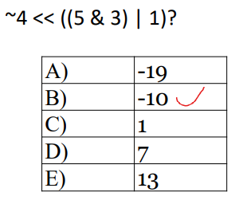 | ~4=-5 |
|------------------------------------------------------------------------------------------------------------------------------------------------------------------|-------|
三、Interview question
1,
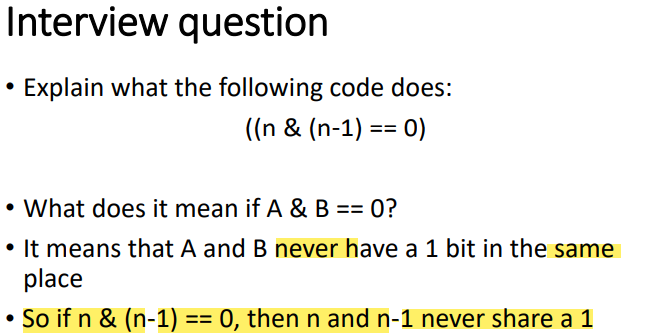

<table>
<colgroup>
<col style="width: 52%" />
<col style="width: 47%" />
</colgroup>
<thead>
<tr class="header">
<th>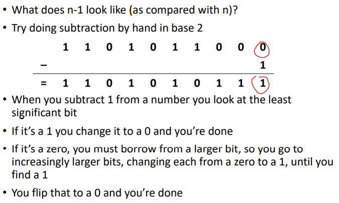</th>
<th>
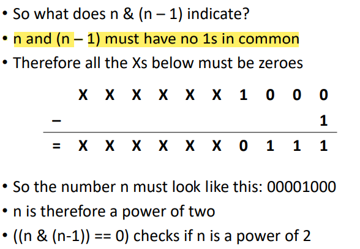

</th>
</tr>
</thead>
<tbody>
<tr class="odd">
<td>
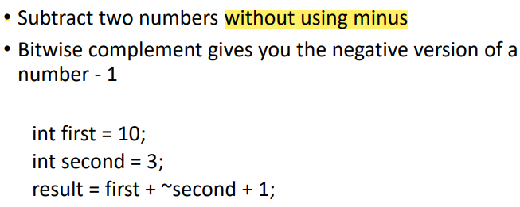

</td>
<td>
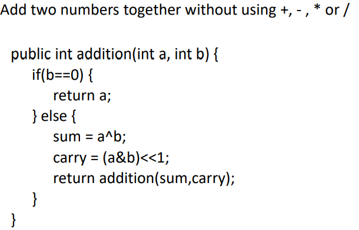

</td>
</tr>
</tbody>
</table>

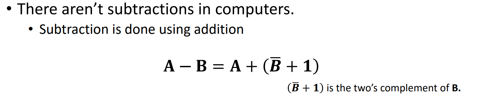

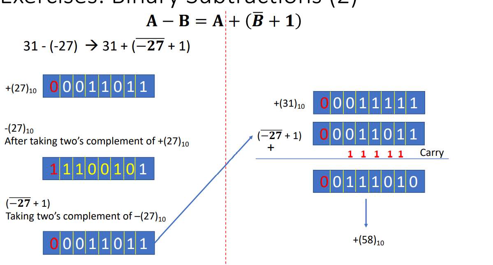

