一、基本内容
1，Big 𝑶 is always concerned with **worst case time requirement**

2，Big O计算：
看最高次项，忽略系数
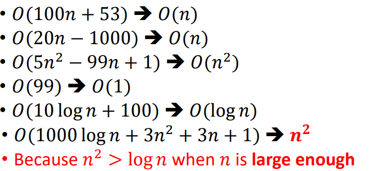

平行的O相加，内嵌的O相乘

<table>
<colgroup>
<col style="width: 48%" />
<col style="width: 51%" />
</colgroup>
<thead>
<tr class="header">
<th>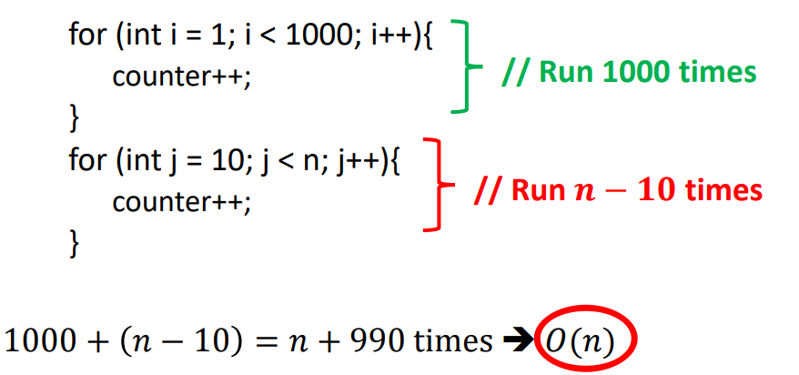</th>
<th>
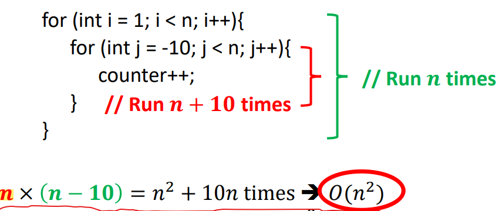

</th>
</tr>
</thead>
<tbody>
</tbody>
</table>

3，search
<table>
<colgroup>
<col style="width: 42%" />
<col style="width: 57%" />
</colgroup>
<thead>
<tr class="header">
<th>linear Search</th>
<th>Binary Search</th>
</tr>
</thead>
<tbody>
<tr class="odd">
<td>
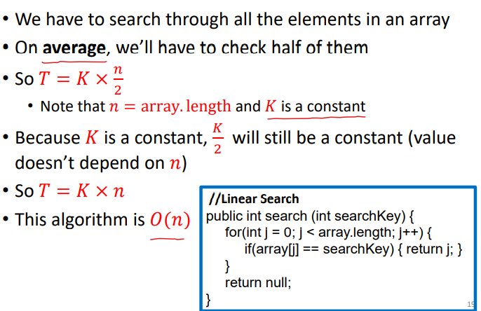

</td>
<td>
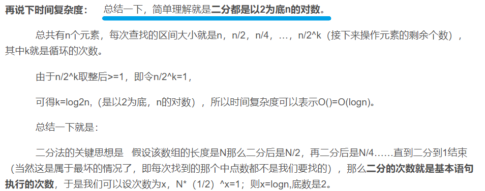

</td>
</tr>
</tbody>
</table>

4，基本操作的big O
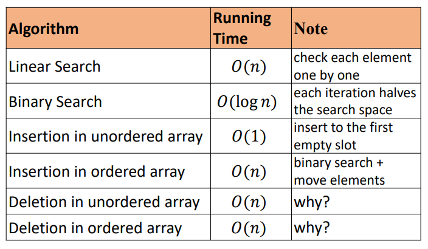

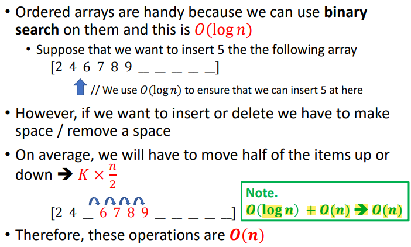

二、Formalities

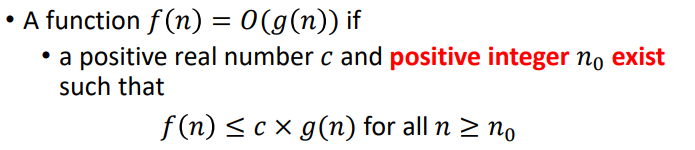

<table>
<colgroup>
<col style="width: 48%" />
<col style="width: 49%" />
<col style="width: 1%" />
</colgroup>
<thead>
<tr class="header">
<th>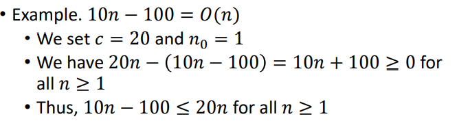</th>
<th>
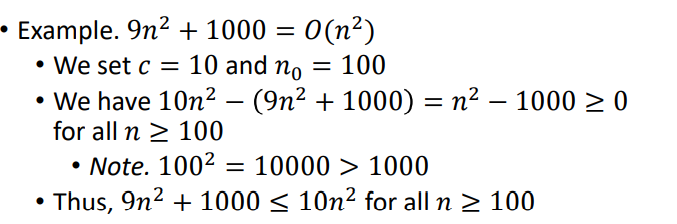

</th>
<th>

</th>
</tr>
</thead>
<tbody>
</tbody>
</table>

<table>
<colgroup>
<col style="width: 50%" />
<col style="width: 49%" />
</colgroup>
<thead>
<tr class="header">
<th>
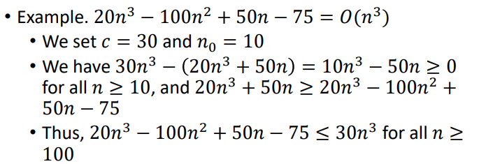

</th>
<th>

</th>
</tr>
</thead>
<tbody>
<tr class="odd">
<td>
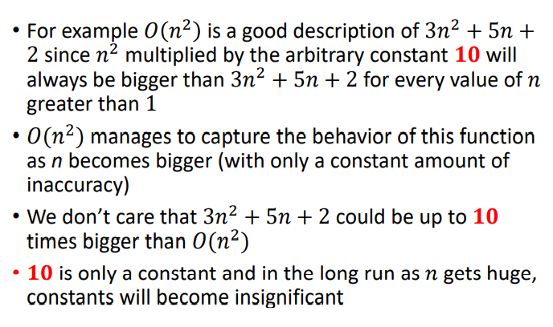

</td>
<td>
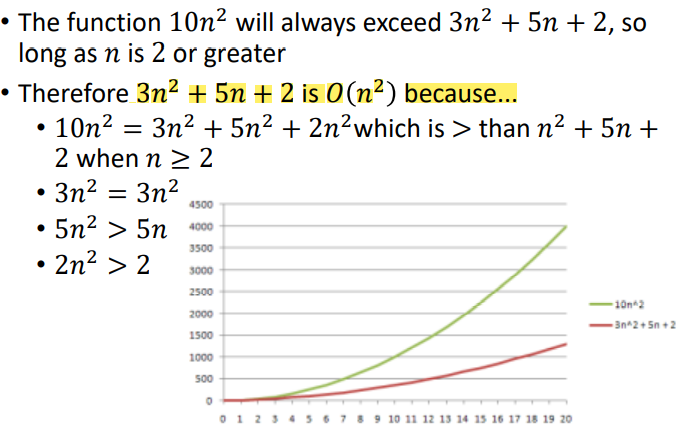

</td>
</tr>
</tbody>
</table>

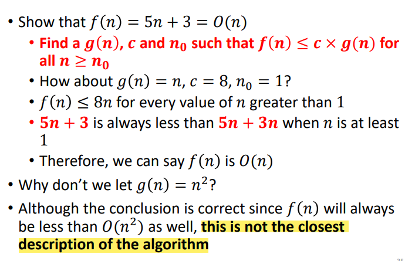

三、Usage
1,一直用最简形式来描述O-notation
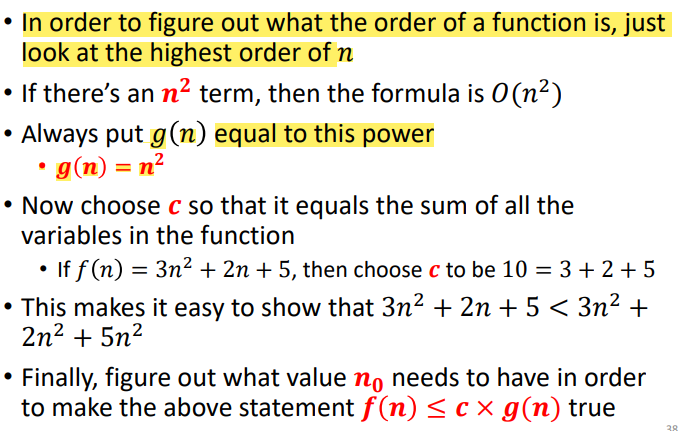

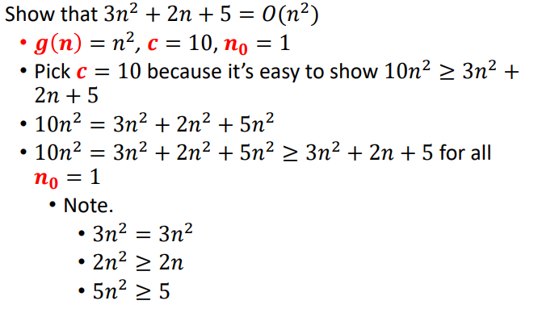

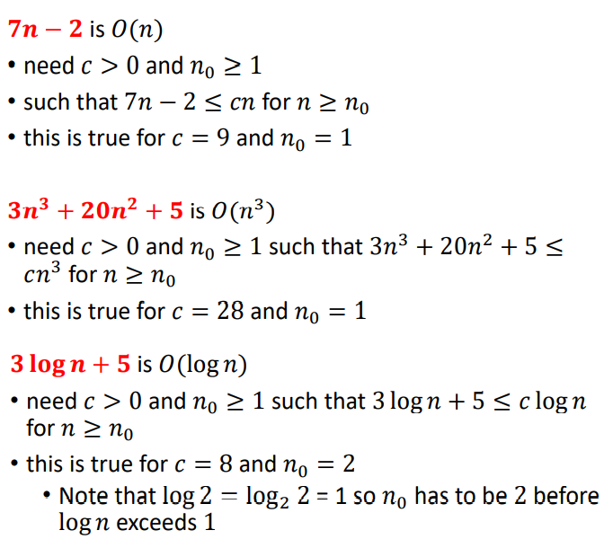

五、Getting Big O of a program
1，
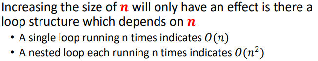

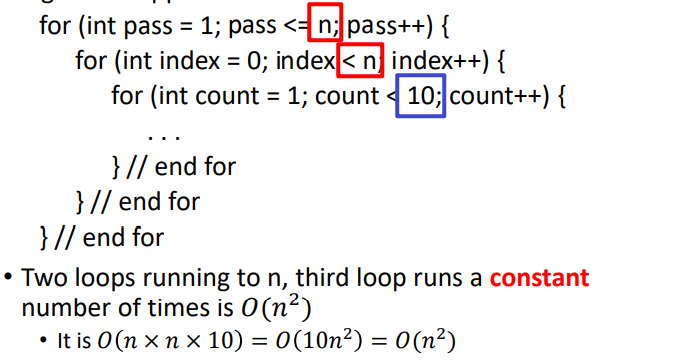

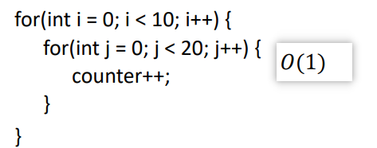

重点
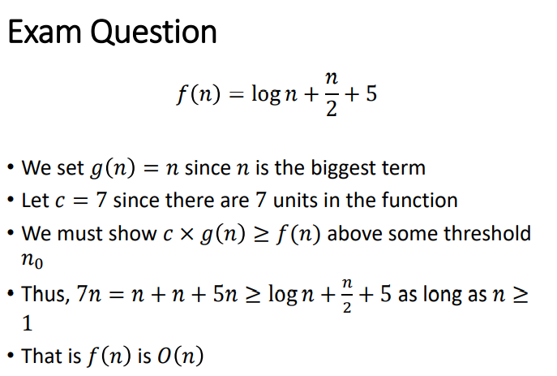

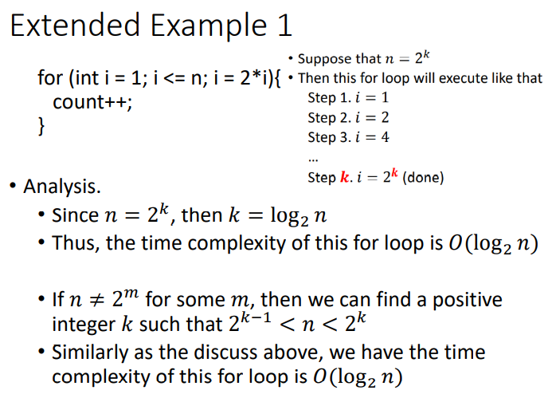

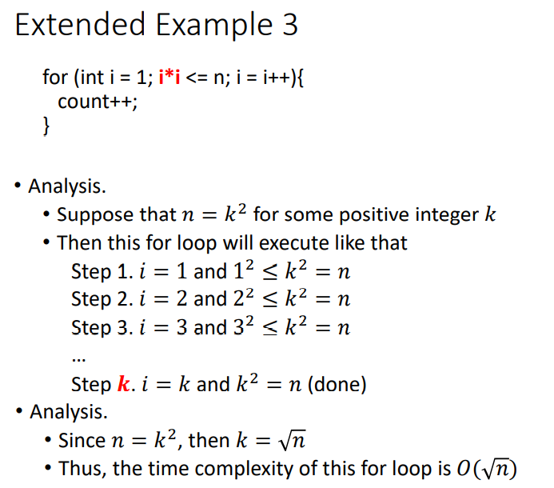

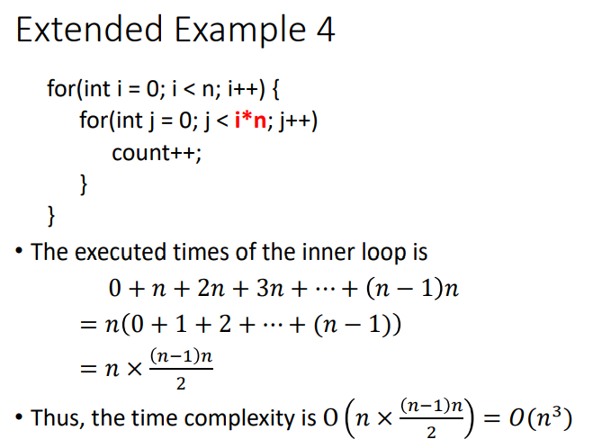

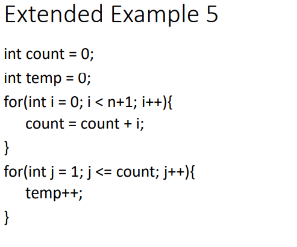

