**Part A-search**
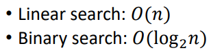

**Part B-sorting**
Comparison based sort
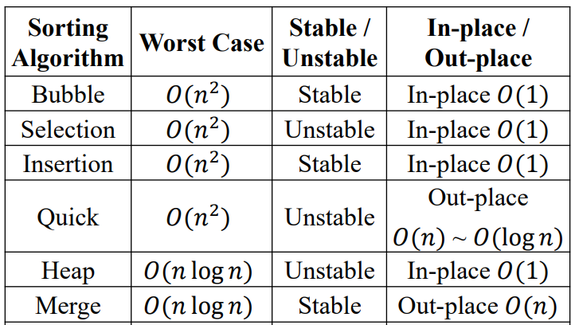

**1，Bubble Sort**
思路
<table>
<colgroup>
<col style="width: 45%" />
<col style="width: 54%" />
</colgroup>
<thead>
<tr class="header">
<th>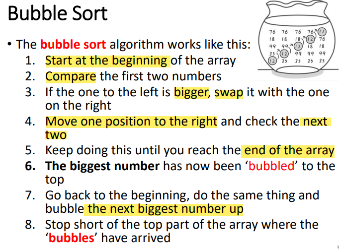</th>
<th>
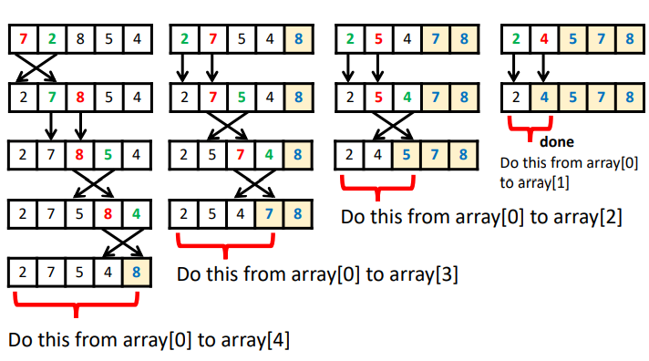

</th>
</tr>
</thead>
<tbody>
</tbody>
</table>

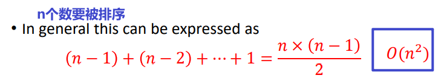

<table>
<colgroup>
<col style="width: 100%" />
</colgroup>
<thead>
<tr class="header">
<th>
代码

public static void bubbleSort(int arr[]) {

<blockquote>

for(int i=0;i&lt;arr.length-1;i++) {

for(int j=0;j&lt;arr.length-1-i;j++) {

if(arr[j]&gt;arr[j+1]) {

int temp=arr[j];

arr[j]=arr[j+1];

arr[j+1]=temp;

}

}

}

</blockquote>

}
</th>
</tr>
</thead>
<tbody>
</tbody>
</table>

**2，selection sort**
一直把最小的放在前面
<table>
<colgroup>
<col style="width: 53%" />
<col style="width: 46%" />
</colgroup>
<thead>
<tr class="header">
<th>
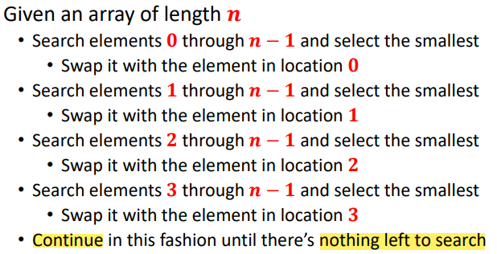

</th>
<th>
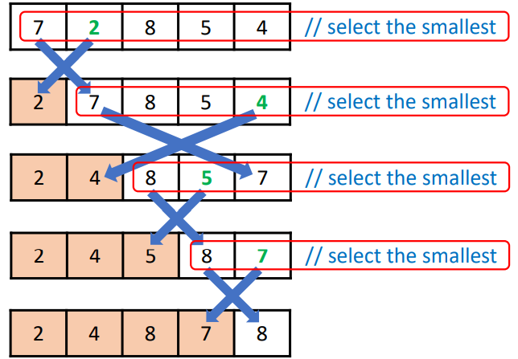

</th>
</tr>
</thead>
<tbody>
</tbody>
</table>

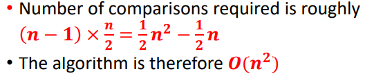

**3，insertion sort**
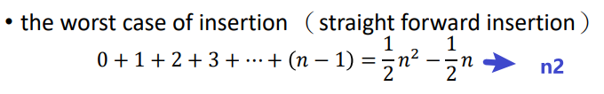

<table>
<colgroup>
<col style="width: 51%" />
<col style="width: 48%" />
</colgroup>
<thead>
<tr class="header">
<th>
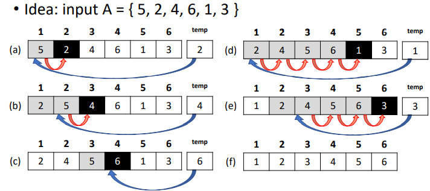

</th>
<th>

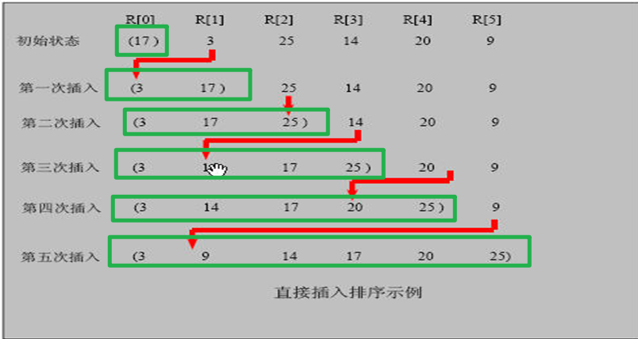

</th>
</tr>
</thead>
<tbody>
</tbody>
</table>
<table>
<colgroup>
<col style="width: 100%" />
</colgroup>
<thead>
<tr class="header">
<th>
<strong>public static void InsertSort(int arr[1]) {</strong>

<strong>int insertVal=0;</strong>

<strong>int insertIndex=0;</strong>

<strong>for(int i=1;i&lt;arr.length;i++) {</strong>

<strong>//定义待插入的数</strong>

<strong>insertVal=arr[i];</strong>

<strong>insertIndex=i-1;//前一个数的下标</strong>

<strong></strong>

<strong>// 给 insertVal 找到插入的位置</strong>

<strong>// 说明</strong>

<strong>//1.insertIndex&gt;=0 保证在给 insertVal 找插入位置，不越界</strong>

<strong>//2.insertVal&lt;arr[insertIndex] 待插入的数，还没有找到插入位置</strong>

<strong>//3. 就需要将 arr[insertIndex] 后移</strong>

<strong>while(insertIndex&gt;=0&amp;&amp;insertVal&lt;arr[insertIndex]) {</strong>

<strong>arr[insertIndex+1]=arr[insertIndex];</strong>

<strong>insertIndex--;</strong>

<strong>}</strong>

<strong>// 当退出 while 循环时，说明插入的位置找到,insertIndex+1</strong>

<strong>//这里我们判断是否需要赋值</strong>

<strong>if(insertIndex+1!=i) {</strong>

<strong>arr[insertIndex+1]=insertVal;</strong>

<strong>}</strong>

<strong>}</strong>
</th>
</tr>
</thead>
<tbody>
</tbody>
</table>

4，Quick sort

<table>
<colgroup>
<col style="width: 100%" />
</colgroup>
<thead>
<tr class="header">
<th>
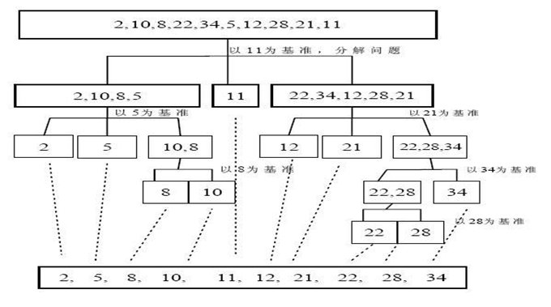

<strong>public static void QuickSortDemo(int []arr,int left,int right) {</strong>

<strong>int l=left;//左下标</strong>

<strong>int r=right;//右下标</strong>

<strong>int temp=0;</strong>

<strong>int pivot=arr[(left+right)/2];//选取它，其他数和它比较分类</strong>

<strong>//while 循环的目的是让比 pivot 值小放到左边 ，比 pivot 值大放到右边</strong>

<strong>while(l&lt;r) {</strong>

<strong>//在 pivot 的左边一直找,找到大于等于 pivot 值,才退出</strong>

<strong>while(arr[l]&lt;pivot) {</strong>

<strong>l+=1;</strong>

<strong>}</strong>

<strong>//在 pivot 的右边一直找,找到大于等于 pivot 值,才退出</strong>

<strong>while(arr[r]&gt;pivot) {</strong>

<strong>r-=1;</strong>

<strong>}</strong>

<strong>//如果 l&gt;=r 说明 pivot 的左右两的值，已经按照左边全部是</strong>

<strong>//小于等于 pivot 值，右边全部是大于等于 pivot 值</strong>

<strong>if(l&gt;=r) {</strong>

<strong>break;</strong>

<strong>}</strong>

<strong></strong>

<strong>//交换</strong>

<strong>temp=arr[l];</strong>

<strong>arr[l]=arr[r];</strong>

<strong>arr[r]=temp;</strong>

<strong></strong>

<strong>//如果交换完后，发现这个 arr[l]==pivot 值 相等 r--， 前移</strong>

<strong>//可以理解为：指定的pivot，里面有一个数和它相等，假如左边卡住，无法移动，右边退一步来推动查询</strong>

<strong>if(arr[l]==pivot) {</strong>

<strong>r-=1;</strong>

<strong>}</strong>

<strong>//如果交换完后，发现这个 arr[r]==pivot 值 相等 l++， 后移</strong>

<strong>if(arr[r]==pivot) {</strong>

<strong>l+=1;</strong>

<strong>}</strong>

<strong></strong>

<strong>}</strong>

<strong>// 如果 l==r, 必须 l++,r--, 否则为出现栈溢出</strong>

<strong>if(l==r) {</strong>

<strong>l+=1;</strong>

<strong>r-=1;</strong>

<strong>}</strong>

<strong>if(left&lt;r) {</strong>

<strong>QuickSortDemo(arr,left,r);</strong>

<strong>}</strong>

<strong>if(right&gt;l) {</strong>

<strong>QuickSortDemo(arr, l, right);</strong>

<strong>}</strong>

<strong>}</strong>

</th>
</tr>
</thead>
<tbody>
</tbody>
</table>

**5，Merge sort**\[no code\]
Divide and Conquer Approach
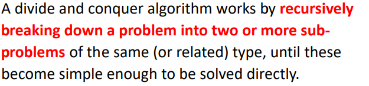

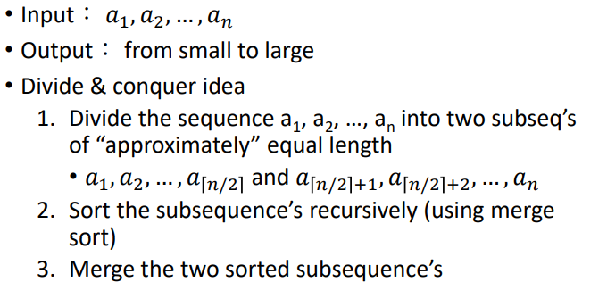
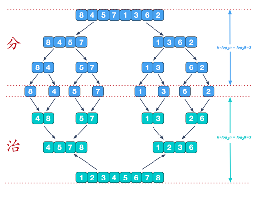

| Stable/unstable      | A stable sorting algorithm is any sorting algorithm that preserves the relative ordering of items with equal values. |
|----------------------|----------------------------------------------------------------------------------------------------------------------|
| In-place / Out-place | an in-place algorithm is an algorithm which transforms input using no auxiliary data structure.                      |
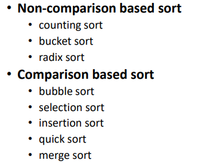

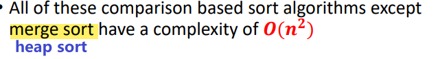

总结
<table>
<colgroup>
<col style="width: 50%" />
<col style="width: 49%" />
</colgroup>
<thead>
<tr class="header">
<th>
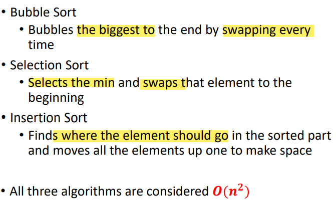

</th>
<th>
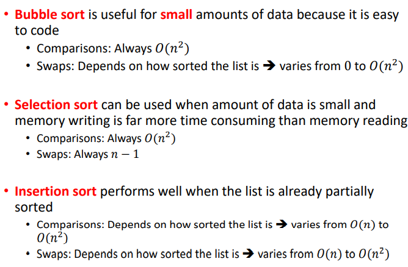

</th>
</tr>
</thead>
<tbody>
</tbody>
</table>

**Non-comparison**
1,counting sort(类似桶排序)
<table>
<colgroup>
<col style="width: 14%" />
<col style="width: 85%" />
</colgroup>
<thead>
<tr class="header">
<th>

</th>
<th>
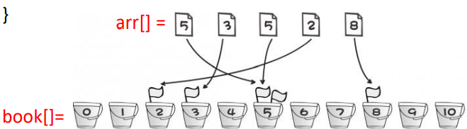

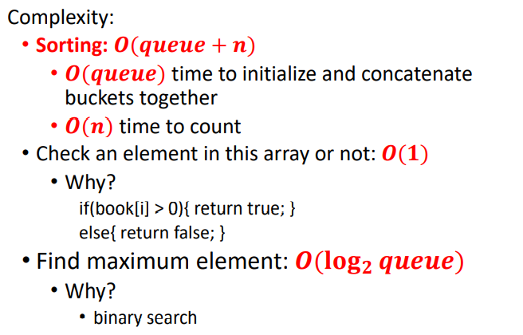

</th>
</tr>
</thead>
<tbody>
</tbody>
</table>

2，bucket sort【stable】

<table>
<colgroup>
<col style="width: 44%" />
<col style="width: 55%" />
</colgroup>
<thead>
<tr class="header">
<th>
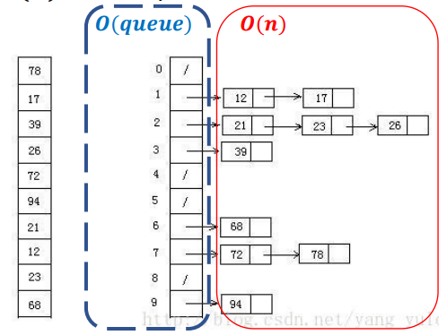

</th>
<th>

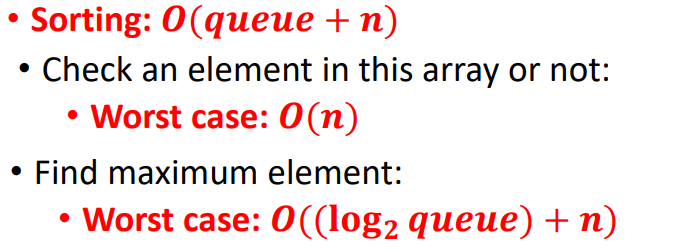

</th>
</tr>
</thead>
<tbody>
</tbody>
</table>

3，Radix Sort【从右到左】
<table>
<colgroup>
<col style="width: 97%" />
<col style="width: 2%" />
</colgroup>
<thead>
<tr class="header">
<th>
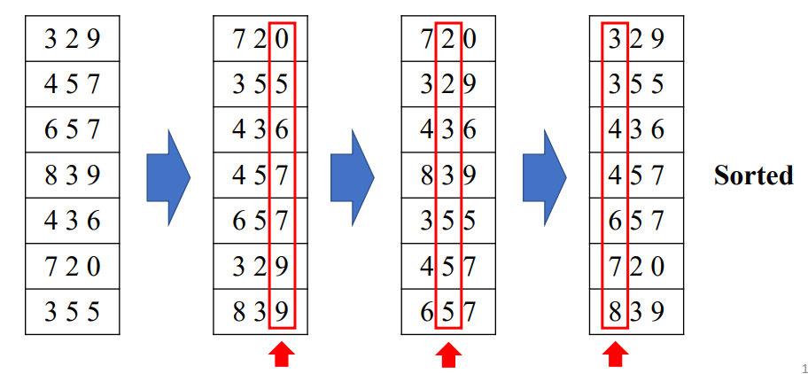

</th>
<th></th>
</tr>
</thead>
<tbody>
</tbody>
</table>

