LinkedList和array的优缺点
<table>
<colgroup>
<col style="width: 7%" />
<col style="width: 40%" />
<col style="width: 52%" />
</colgroup>
<thead>
<tr class="header">
<th></th>
<th>Linked List</th>
<th>Array</th>
</tr>
</thead>
<tbody>
<tr class="odd">
<td>优点</td>
<td>
1，they can adapt their ordering by changing the items they point to – no memory is wasted

3，extra links can easily be added
</td>
<td>
1，New elements can be stored anywhere and a reference is created for the new element using pointers.

2，Random accessing is possible.

3，Memory is allocated during the run-time (Dynamic memory allocation).

4，Array elements can be accessed randomly using the array index.

5，Insertion and Deletion operations are fast and easy.

</td>
</tr>
<tr class="even">
<td>缺点</td>
<td>
1，With a linked list, if we need to find the special link, we have to start at the beginning of the chain, and work the way along in order to find an item

2，Binary search not possible – big disadvantage of linked lists
</td>
<td>
1. waste space

2. not easy to extend an array.

Size of the array must be specified at the time of array declaration/initialization.

3. to insert a new element is not easy
</td>
</tr>
</tbody>
</table>

<table>
<colgroup>
<col style="width: 10%" />
<col style="width: 23%" />
<col style="width: 65%" />
</colgroup>
<thead>
<tr class="header">
<th>Linked List</th>
<th>头节点=空数据+第一个link的reference</th>
<th>
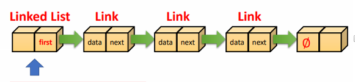

</th>
</tr>
</thead>
<tbody>
<tr class="odd">
<td>Double-Ended Linked Lists</td>
<td>头节点=first reference+last reference</td>
<td>
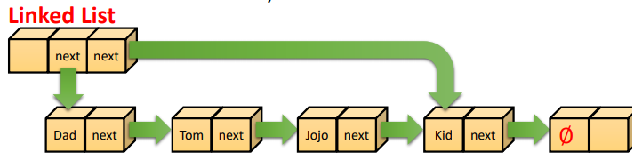

</td>
</tr>
<tr class="even">
<td>Singly Linked List</td>
<td>无上述的头节点，直接第一个开始【data+reference】</td>
<td>
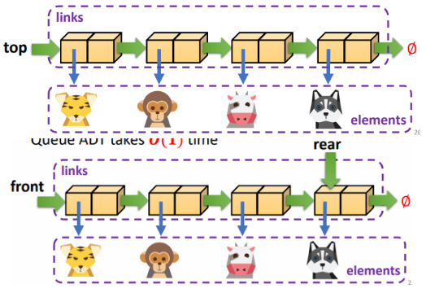

</td>
</tr>
<tr class="odd">
<td>Sorted Lists</td>
<td></td>
<td></td>
</tr>
<tr class="even">
<td>Doubly Linked Lists</td>
<td>头节点=first reference+last reference</td>
<td>
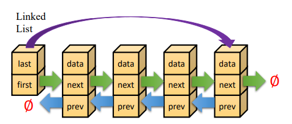

</td>
</tr>
</tbody>
</table>

一、Linked List
1， A linked list is an abstract data structure consisting of **a sequence of links**
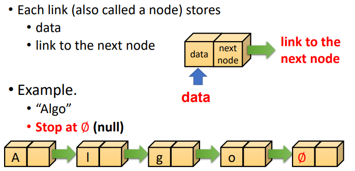

• Link objects are created for each link in the list
• All contain **references** to the next link in the list

2，结构
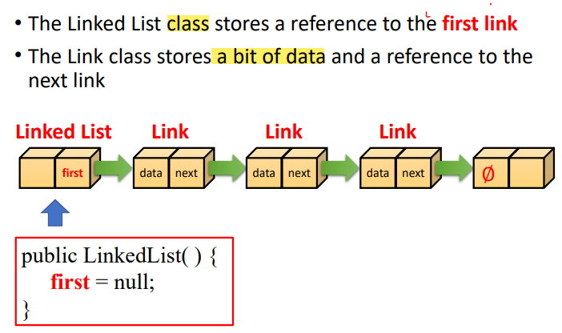
这里的first相当于head，头结点,不存储数据，只是一个指向头
this is only a reference to the next Link，**does not represent the actual object itself**

• Linked list only contains a reference to the first link
• This is originally set to null
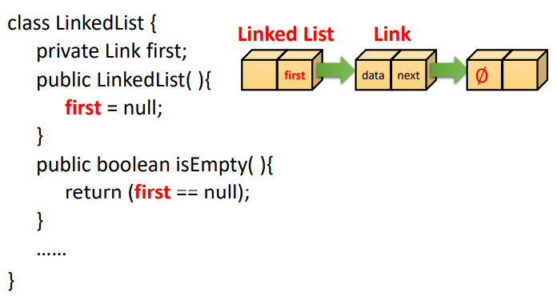

2，操作
• The head is the first link
• The tail is the last link

<table>
<colgroup>
<col style="width: 51%" />
<col style="width: 48%" />
</colgroup>
<thead>
<tr class="header">
<th>Inserting at the Head</th>
<th></th>
</tr>
</thead>
<tbody>
<tr class="odd">
<td>
• 1. Create a new link

• 2. Have new link point to old first link

• 3. Update Linked List to point to new link

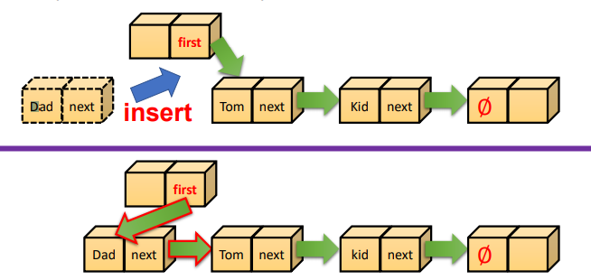

</td>
<td>
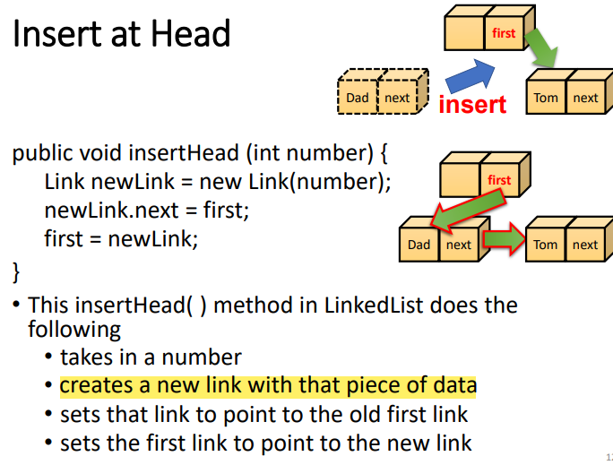

</td>
</tr>
</tbody>
</table>

<table>
<colgroup>
<col style="width: 45%" />
<col style="width: 54%" />
</colgroup>
<thead>
<tr class="header">
<th>Deleting at the Head</th>
<th></th>
</tr>
</thead>
<tbody>
<tr class="odd">
<td>
• Update head to point to next node in the list

• Garbage collector will now reclaim the former first node

</td>
<td>
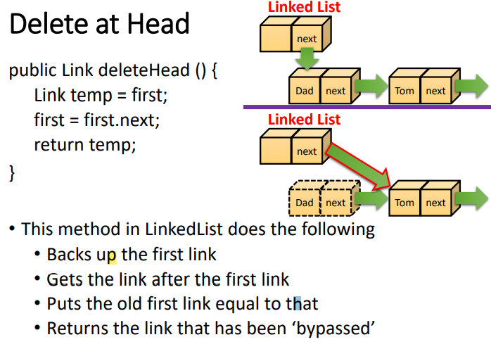

</td>
</tr>
</tbody>
</table>

<table>
<colgroup>
<col style="width: 18%" />
<col style="width: 81%" />
</colgroup>
<thead>
<tr class="header">
<th>Traversing a linked list</th>
<th></th>
</tr>
</thead>
<tbody>
<tr class="odd">
<td>
必须从头开始遍历，

而且二分法不能用【大大滴缺点】
</td>
<td>
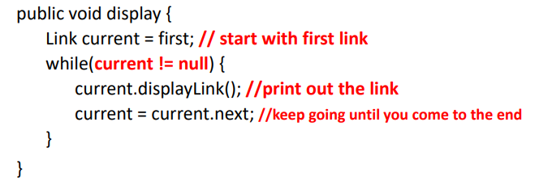

</td>
</tr>
</tbody>
</table>

<table>
<colgroup>
<col style="width: 44%" />
<col style="width: 55%" />
</colgroup>
<thead>
<tr class="header">
<th>find or delete one particular node</th>
<th></th>
</tr>
</thead>
<tbody>
<tr class="odd">
<td>
• Take in the value to be found or deleted

• Start at the beginning of the list

• Keep moving down the links until we find the correct

one

• All the while keep tracking the current link and the

previous link (so we can join them up when required)

• Now update the references to bypass the link to be

deleted

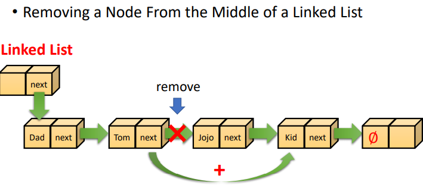

</td>
<td>
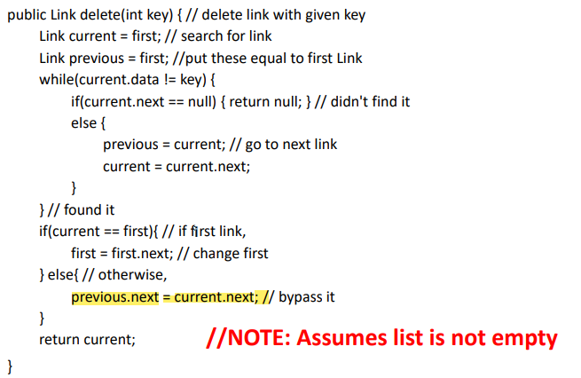

</td>
</tr>
</tbody>
</table>

二、Double-Ended Linked Lists 双头链表
1，• It as a reference to the last link as well as the first
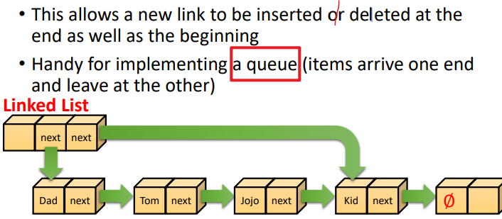

2，操作
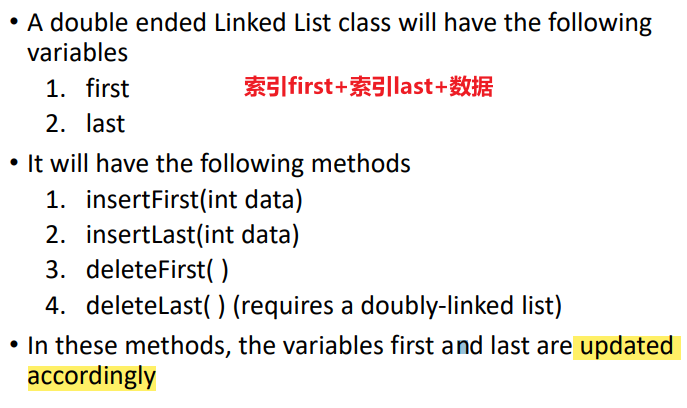

<table>
<colgroup>
<col style="width: 46%" />
<col style="width: 53%" />
</colgroup>
<thead>
<tr class="header">
<th>Inserting at the Tail</th>
<th></th>
</tr>
</thead>
<tbody>
<tr class="odd">
<td>
• Create a new link

• Have new link point to null

• Have old <strong>last link point to new node</strong>

• Update tail of Linked List object to point to new node
</td>
<td>
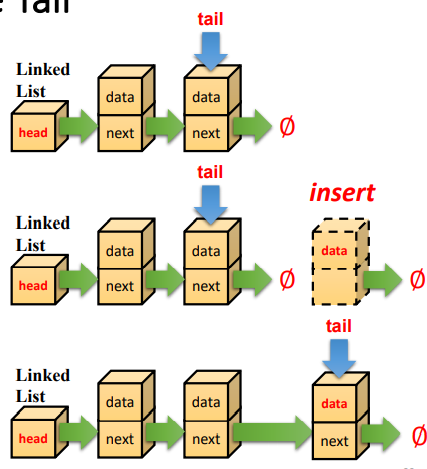

</td>
</tr>
</tbody>
</table>

<table>
<colgroup>
<col style="width: 14%" />
<col style="width: 85%" />
</colgroup>
<thead>
<tr class="header">
<th>Removing at the Tail</th>
<th></th>
</tr>
</thead>
<tbody>
<tr class="odd">
<td>
• Removing at the tail of a singly-linked double ended list

<strong>is not efficient!</strong>

• There is no constant time way to update the tail to point

to the previous node

• We need to use

double links (that point to <strong>both next and previous link</strong>)
</td>
<td>
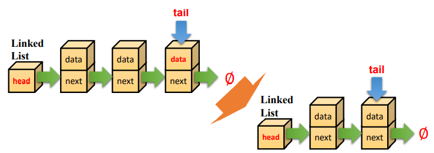

</td>
</tr>
</tbody>
</table>

三、Linked-List Efficiency
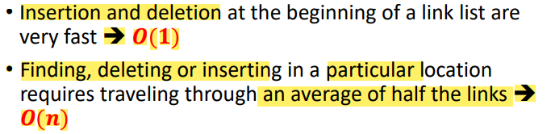
用堆栈来实现均可
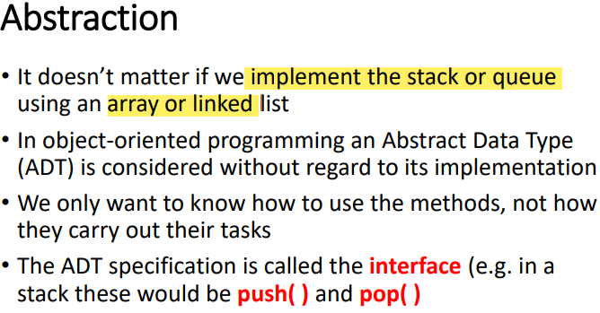

四、Singly Linked List
1，**Stack with a Singly Linked List**
此时无头结点
• The top element is stored at the first node of the list
• The space used is 𝑶(𝒏) and each operation of the Stack ADT takes 𝑶(𝟏) time
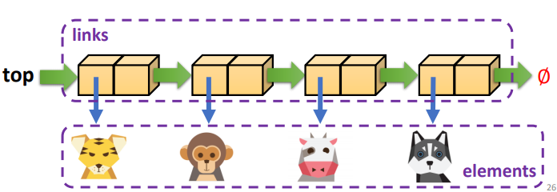

2，Queue with a Singly Linked List
• The front element is stored at the first node
• The rear element is stored at the last node
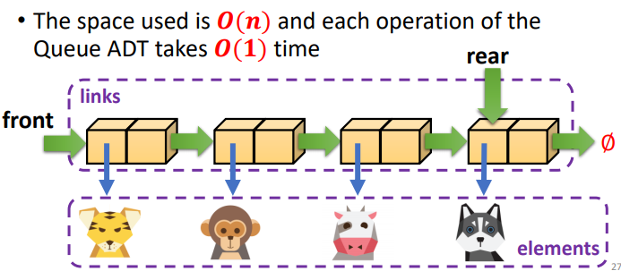

五、Sorted Lists
priority queue – this required the items to be sorted
1，Only way to find the correct location is to **search through the list**
– can’t use binary search
• When you find the correct location (i.e. when you find a value bigger than the one you want to insert) update the pointers of the relevant links

2，操作
<table>
<colgroup>
<col style="width: 50%" />
<col style="width: 49%" />
</colgroup>
<thead>
<tr class="header">
<th>Insertion</th>
<th></th>
</tr>
</thead>
<tbody>
<tr class="odd">
<td>
The new element must be set to point to the next

element in the linked list

The previous element must be updated to point to

the new element

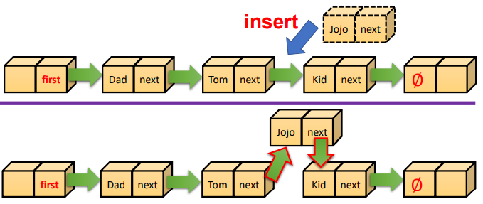

</td>
<td>
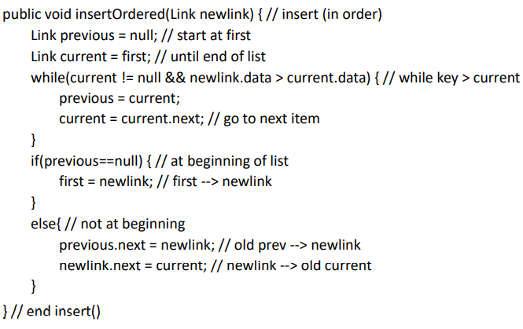

</td>
</tr>
</tbody>
</table>

3、Efficiency of Sorted Linked Lists
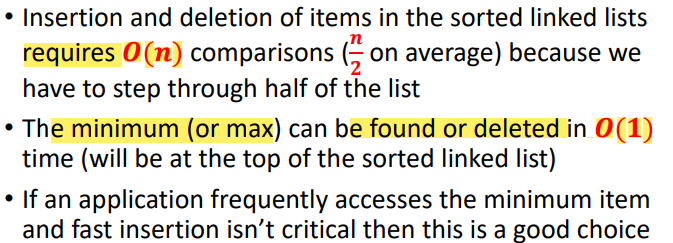

4，Using linked lists for array sorting
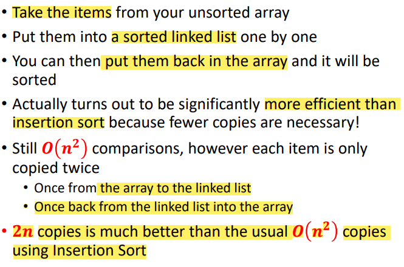

六、Doubly Linked Lists 双链表
单链表不能backwards
1，A linked list where you can traverse it forwards or
backwards is a **doubly linked list** (references going both ways)
<table>
<colgroup>
<col style="width: 37%" />
<col style="width: 62%" />
</colgroup>
<thead>
<tr class="header">
<th>
现在是data+（next reference和prev reference）

操作的时候记得更新两个索引

list中，

<strong>first头结点的next是第一个link</strong>

<strong>第一个link的pre是空，</strong>
</th>
<th></th>
</tr>
</thead>
<tbody>
</tbody>
</table>

2，操作
<table>
<colgroup>
<col style="width: 47%" />
<col style="width: 52%" />
</colgroup>
<thead>
<tr class="header">
<th>Insertion at begining</th>
<th></th>
</tr>
</thead>
<tbody>
<tr class="odd">
<td>
– Change prev of first link

– Change next of new link

– Change first of Linked List

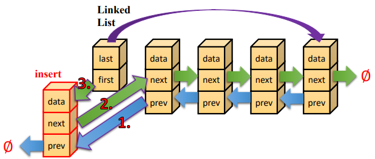

</td>
<td>
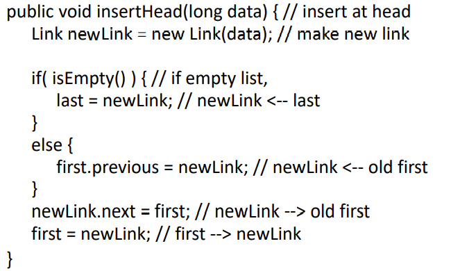

</td>
</tr>
</tbody>
</table>

<table>
<colgroup>
<col style="width: 50%" />
<col style="width: 49%" />
</colgroup>
<thead>
<tr class="header">
<th>Insertion in order</th>
<th></th>
</tr>
</thead>
<tbody>
<tr class="odd">
<td>
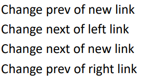

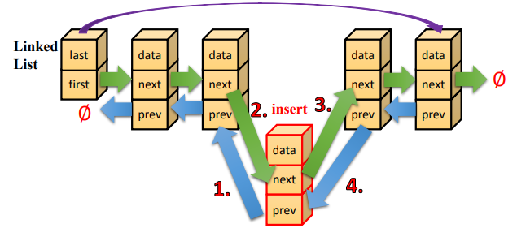
</td>
<td>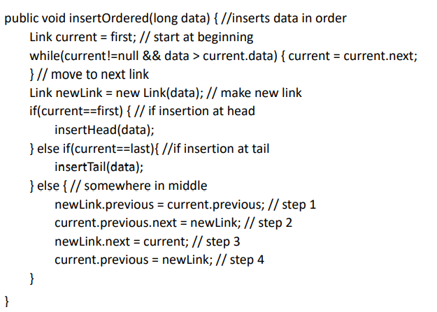</td>
</tr>
</tbody>
</table>

<table>
<colgroup>
<col style="width: 51%" />
<col style="width: 48%" />
</colgroup>
<thead>
<tr class="header">
<th>Deletion</th>
<th></th>
</tr>
</thead>
<tbody>
<tr class="odd">
<td>
– Change next of left link

– Change prev of right link

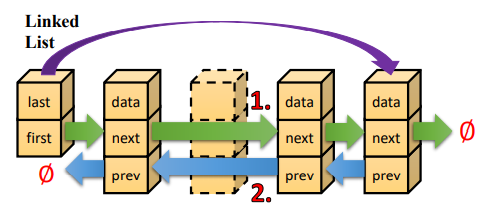

</td>
<td>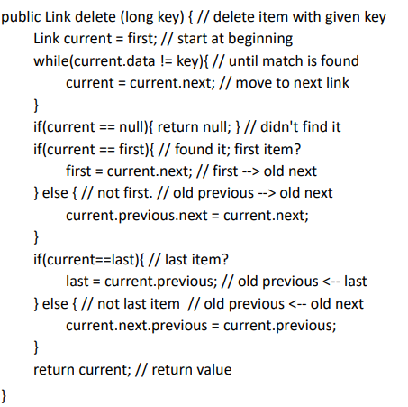</td>
</tr>
</tbody>
</table>

七、Iterators\[!!重点，看不懂\]

1，• Iterators always **point to some link** in the list
• They are associated with the list but are **not part of it**

2，Objects containing references to items in data structures, used to
traverse these structures, are commonly called iterators
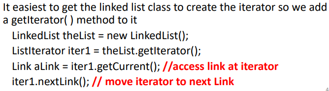

• If our linked list **isn’t doubly-linked** then the iterator
**should store both current and previous** so that it can
delete links
• It is also handy for the iterator to store a reference to the
linked list class so it can access the first element of the
list
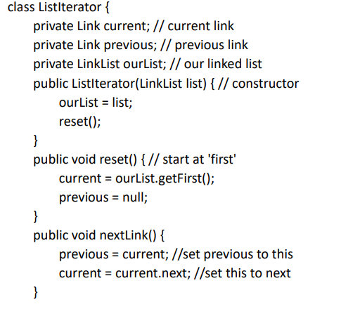

3，操作
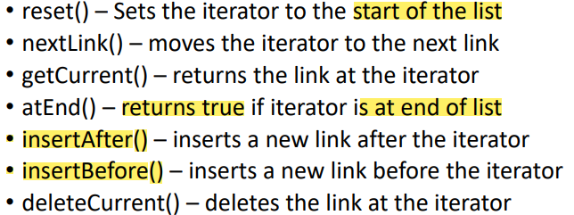

<table>
<colgroup>
<col style="width: 100%" />
</colgroup>
<thead>
<tr class="header">
<th>Removing a Link using the Iterator【注意】</th>
</tr>
</thead>
<tbody>
<tr class="odd">
<td>
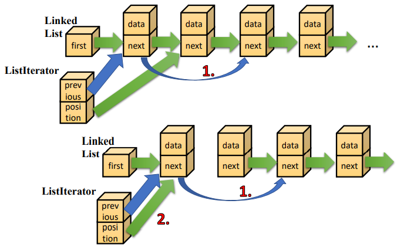

</td>
</tr>
</tbody>
</table>

| Adding a Link using the Iterator【注意】                                                                                                                                                                                                                                                                                                                                                                                |
|-------------------------------------------------------------------------------------------------------------------------------------------------------------------------------------------------------------------------------------------------------------------------------------------------------------------------------------------------------------------------------------------------------------------------|
| 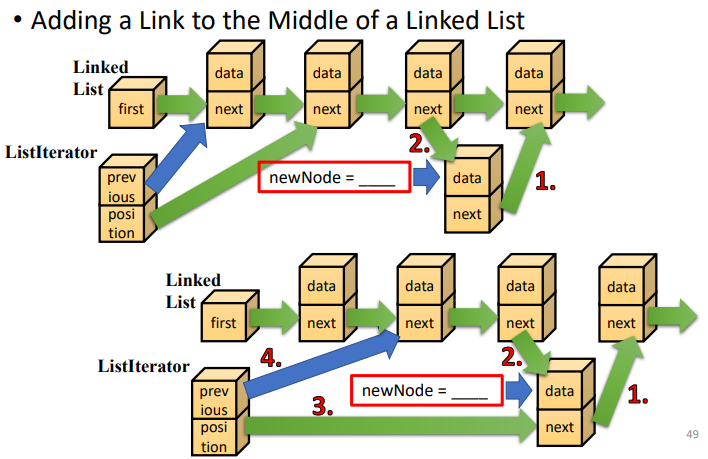 |

<table>
<colgroup>
<col style="width: 100%" />
</colgroup>
<thead>
<tr class="header">
<th>The atEnd() Method</th>
</tr>
</thead>
<tbody>
<tr class="odd">
<td>
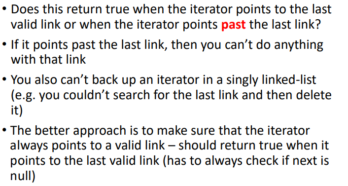

</td>
</tr>
</tbody>
</table>

<table>
<colgroup>
<col style="width: 100%" />
</colgroup>
<thead>
<tr class="header">
<th>Stacks using Linked Lists</th>
</tr>
</thead>
<tbody>
<tr class="odd">
<td>
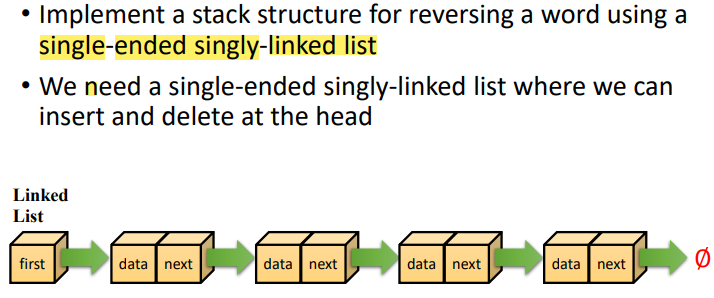

</td>
</tr>
</tbody>
</table>

Linked List代码
<table>
<colgroup>
<col style="width: 100%" />
</colgroup>
<thead>
<tr class="header">
<th>
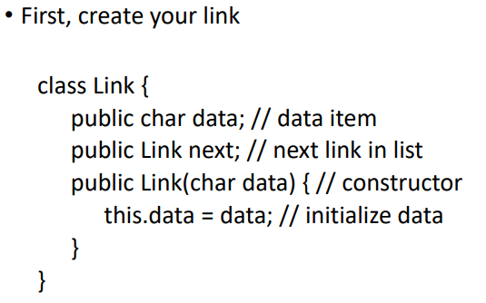

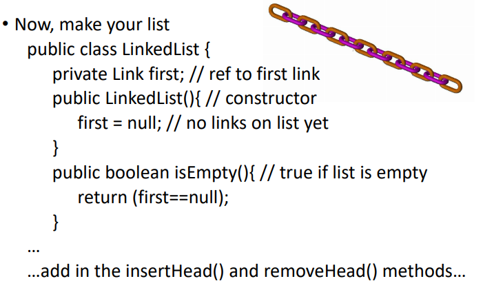

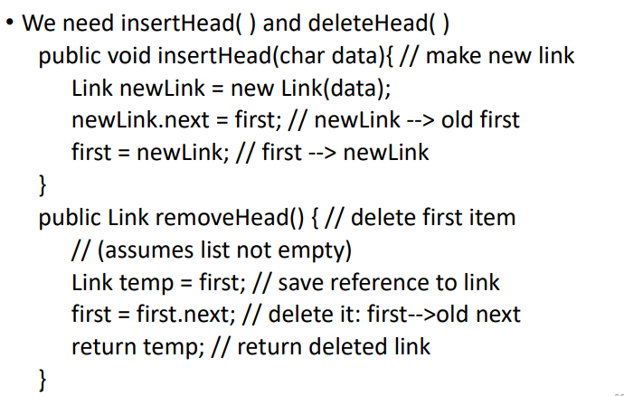

</th>
</tr>
</thead>
<tbody>
</tbody>
</table>

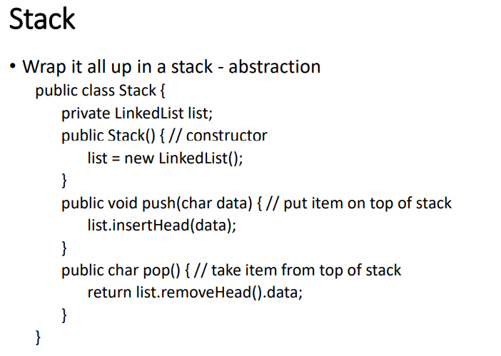

