9-recursion
2020年12月28日
9:51

<table>
<colgroup>
<col style="width: 9%" />
<col style="width: 28%" />
<col style="width: 62%" />
</colgroup>
<thead>
<tr class="header">
<th></th>
<th>iterate</th>
<th>recursion</th>
</tr>
</thead>
<tbody>
<tr class="odd">
<td>优点</td>
<td>速度快，结构简单，效率高</td>
<td>代码更简洁清晰，可读性更好。</td>
</tr>
<tr class="even">
<td>缺点</td>
<td>
1，不容易 理解 ，编写复杂问题时困难。

2，并不能解决所有的问题
</td>
<td>由于递归需要系统堆栈，所以空间消耗要比非递归代码要大很多。而且，如果递归深度太大，可能系统撑不住。</td>
</tr>
</tbody>
</table>

<table>
<colgroup>
<col style="width: 9%" />
<col style="width: 36%" />
<col style="width: 53%" />
</colgroup>
<thead>
<tr class="header">
<th></th>
<th>Iterative</th>
<th>recursion</th>
</tr>
</thead>
<tbody>
<tr class="odd">
<td>优点</td>
<td>It has fast speed, simple structure and high efficiency.</td>
<td>The code is cleaner and more readable.</td>
</tr>
<tr class="even">
<td>缺点</td>
<td>
1. It is not easy to understand and it is difficult to solve complex problems.

2. It cannot solve all the problems
</td>
<td>Because recursion requires a system stack, space consumption is much larger than for non-recursive code. Also, if the recursion depth is too deep, the system may not hold.</td>
</tr>
</tbody>
</table>

一、Recursion
1，定义
Recursion is when a method calls itself
• The method keeps calling itself until it reaches the base
case and then it filters back up

<table>
<colgroup>
<col style="width: 100%" />
</colgroup>
<thead>
<tr class="header">
<th>
• The characteristics of a recursive method are

<blockquote>

• It calls itself

• When it calls itself, it does so to solve a smaller problem

• There’s some version of the problem that is simple enough that the routine can solve it and return without calling itself

</blockquote></th>
</tr>
</thead>
<tbody>
</tbody>
</table>

2，递归程序必须有base case【让递归结束的判断】，否则程序无法停止

二、案例
1，triangular numbers
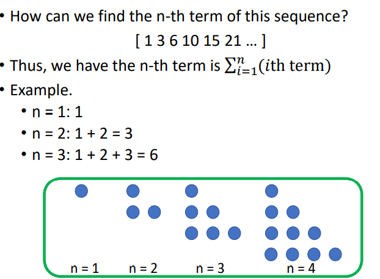

<table>
<colgroup>
<col style="width: 44%" />
<col style="width: 55%" />
</colgroup>
<thead>
<tr class="header">
<th>
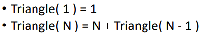

</th>
<th></th>
</tr>
</thead>
<tbody>
</tbody>
</table>

2，Fibonacci Series
1）The Fibonacci series is as follows: 1, 1, 2, 3, 5, 8, 13…

<table>
<colgroup>
<col style="width: 65%" />
<col style="width: 34%" />
</colgroup>
<thead>
<tr class="header">
<th>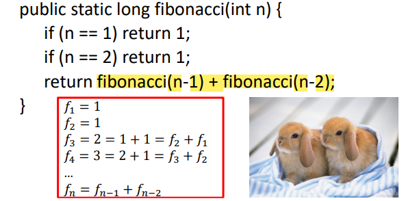</th>
<th>
public static void test(int n) {

<blockquote>

int f1=1;

int f2=1;

int current=0;

if(n==1||n==2) {

System.out.println(1);

return;

}

for(int i=2;i&lt;n;i++) {

current=f1+f2;

int temp=f2;

f2=current;

f1=temp;

}

System.out.println(current);

</blockquote>

}
</th>
</tr>
</thead>
<tbody>
</tbody>
</table>

数较小的时候用递归较好，数较大的时候用递归需要等待很久
Lesson: recursion can simplify code **but is not always more efficient**
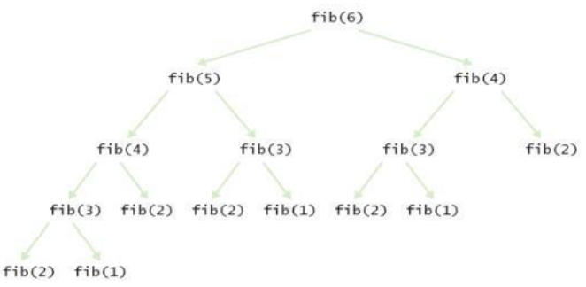

| Bottom-Up solution for Fibonacci Series                                                                                                                                                                                                                                                             | Top-Down recursive approach                                                                                                                                                                                                                                                               |
|-----------------------------------------------------------------------------------------------------------------------------------------------------------------------------------------------------------------------------------------------------------------------------------------------------|-------------------------------------------------------------------------------------------------------------------------------------------------------------------------------------------------------------------------------------------------------------------------------------------|
| 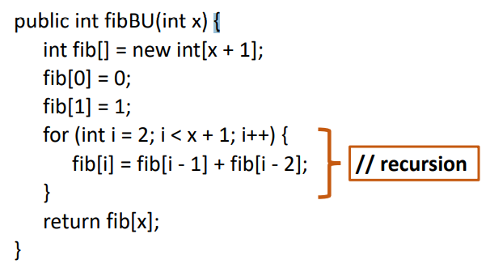 | 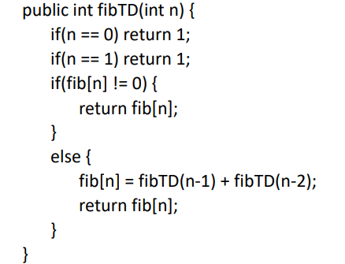 |

2）The efficiency of recursion

2，检查是否回文palindrome
<table>
<colgroup>
<col style="width: 100%" />
</colgroup>
<thead>
<tr class="header">
<th>检查是否回文palindrome</th>
</tr>
</thead>
<tbody>
<tr class="odd">
<td>
public static boolean isPalindrome(String s) {

if(s.length()&lt;=1) {

return true;

}else {

char first=s.charAt(0);

char last=s.charAt(s.length()-1);

if(first!=last) {

return false;

}else {

return isPalindrome(s.substring(1,s.length()-1));

}

}

}
</td>
</tr>
</tbody>
</table>

3，Raising to a power
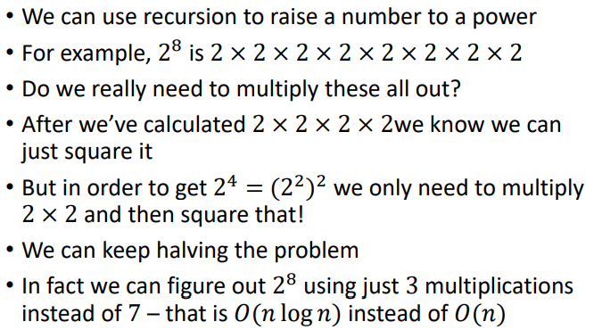

<table>
<colgroup>
<col style="width: 76%" />
<col style="width: 23%" />
</colgroup>
<thead>
<tr class="header">
<th>
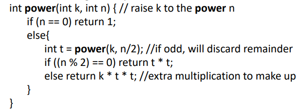

</th>
<th>
In the previous example, the power was always even, so could be

easily divided by two

• If the power happens to be odd then we need to subtract one

from the power, solve that, and then multiply it again to account

for the power we subtracted
</th>
</tr>
</thead>
<tbody>
</tbody>
</table>

三、动态规划 dynamic programming
1**，Dynamic programming** (dynamic optimization) is a method for solving a complex problem by breaking it down into a collection of simpler subproblems, solving each of those subproblems just once, and storing their solutions
把大问题分成小问题，让多个重复的小问题不重复解决，将解决过的问题存储起来，直接使用
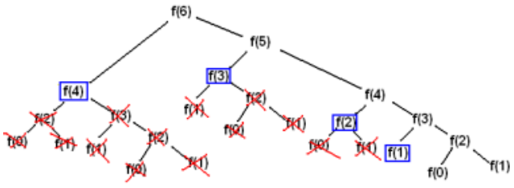

注意
1\. The problem involves overlapping sub-problems that need to be solved again and again.
In dynamic programming we solve these sub problems **only once** and **store it for future** use

2\. If a big problem can be solved by using the solutions of the sub problems then we say that problem also has an optimal substructure property

四、分治算法
Divide and Conquer
1，
The big problem is **divided into two smaller problems** and each one is solved separately
These are then divided into even smaller problems etc。The process continues until you get to the base case
which can be solved easily with no further division

2，案例
<table>
<colgroup>
<col style="width: 100%" />
</colgroup>
<thead>
<tr class="header">
<th>
1--Binary Search

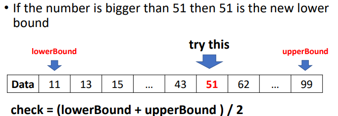

<table>
<colgroup>
<col style="width: 58%" />
<col style="width: 41%" />
</colgroup>
<thead>
<tr class="header">
<th>
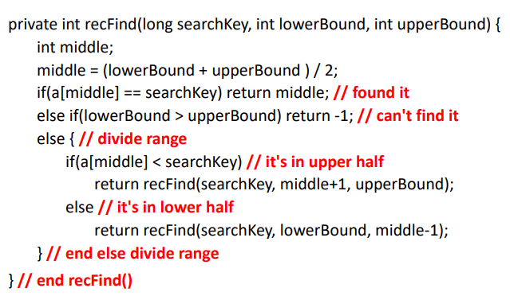

</th>
<th>
private static int binarySearch(int[] arr, int target) {

<blockquote>

int left=0;

int right=arr.length-1;

while(left&lt;=right) {

int mid=(left+right)/2;

if(target==arr[mid]) {

return mid;

}else if(target&lt;arr[mid]) {

right=mid-1;

}else {

left=mid+1;

}

}

return -1;

</blockquote>

}
</th>
</tr>
</thead>
<tbody>
</tbody>
</table></th>
</tr>
</thead>
<tbody>
<tr class="odd">
<td>
2--汉诺塔Towers of Hanoi

1，问T

<table>
<colgroup>
<col style="width: 51%" />
<col style="width: 48%" />
</colgroup>
<thead>
<tr class="header">
<th>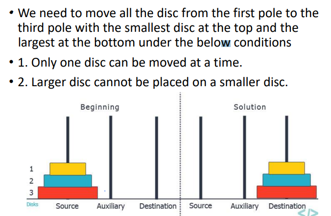</th>
<th>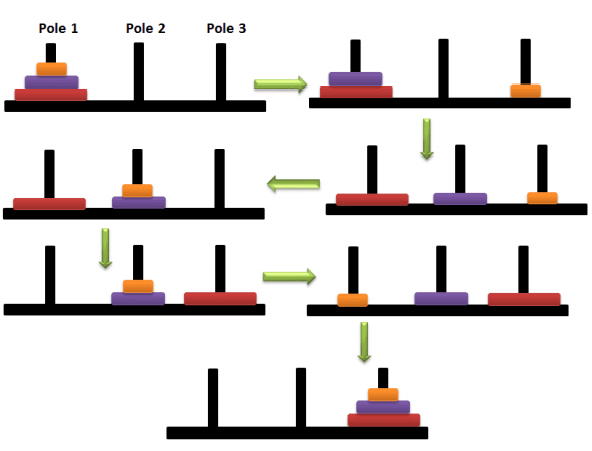</th>
</tr>
</thead>
<tbody>
</tbody>
</table>

古代的做法

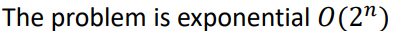

2，算法

<table>
<colgroup>
<col style="width: 43%" />
<col style="width: 41%" />
<col style="width: 15%" />
</colgroup>
<thead>
<tr class="header">
<th>
• Assuming there are n disks, the algorithm is

<blockquote>

• 1. Move the subtree of the top n-1 disks from source rod to

intermediate rod

• 2. Move the remaining largest disk from source rod to

destination rod

• 3. Now solve moving the subtree from intermediate rod to

destination rod

</blockquote>

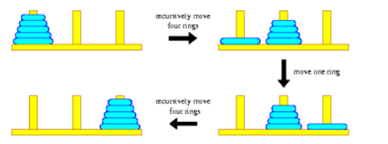
</th>
<th>
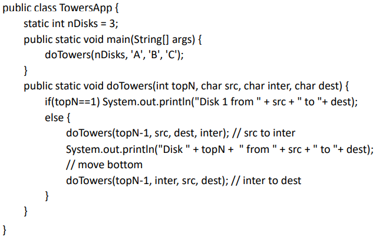

<blockquote>

</blockquote></th>
<th>
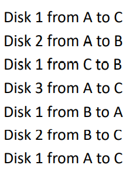

</th>
</tr>
</thead>
<tbody>
</tbody>
</table></td>
</tr>
<tr class="even">
<td>
3--Mergesort

<table>
<colgroup>
<col style="width: 60%" />
<col style="width: 39%" />
</colgroup>
<thead>
<tr class="header">
<th>
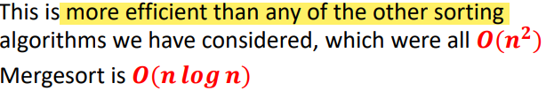

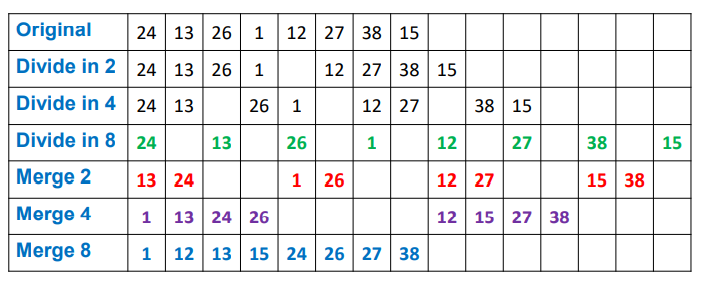

</th>
<th></th>
</tr>
</thead>
<tbody>
</tbody>
</table>

1,思路

<strong>divide an array in half and sort each half</strong>

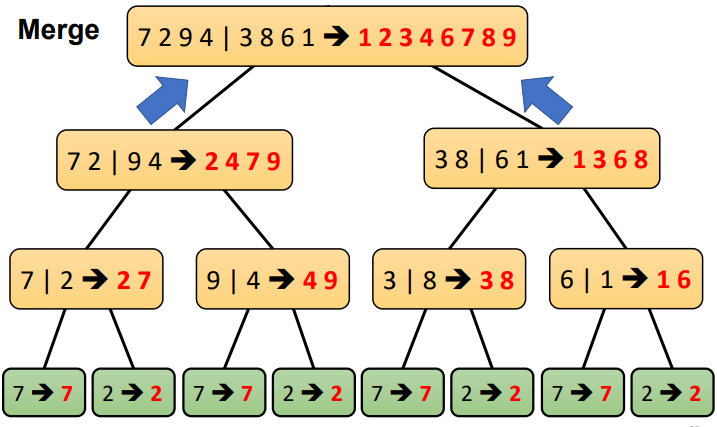

<strong>1）merge</strong>

• So, if we want to marge any two lists s1 and s2,

we need at most <strong>s1.length() + s2.length() steps</strong>

<table>
<colgroup>
<col style="width: 59%" />
<col style="width: 40%" />
</colgroup>
<thead>
<tr class="header">
<th>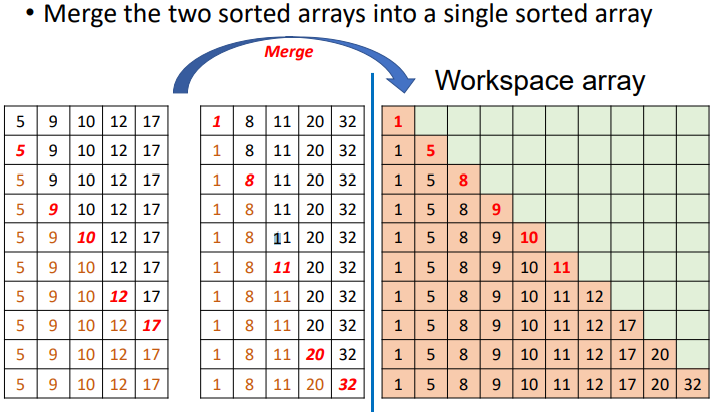</th>
<th>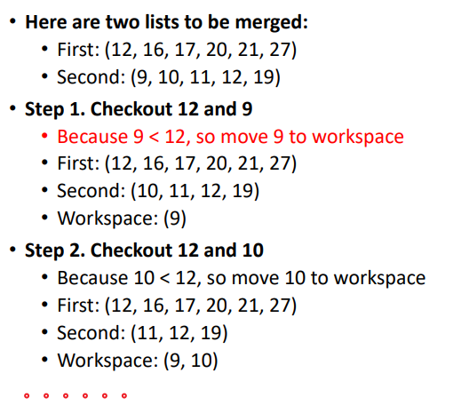</th>
</tr>
</thead>
<tbody>
</tbody>
</table>

<table>
<colgroup>
<col style="width: 47%" />
<col style="width: 52%" />
</colgroup>
<thead>
<tr class="header">
<th>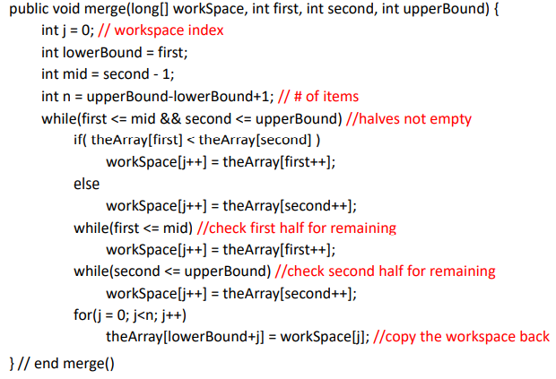</th>
<th>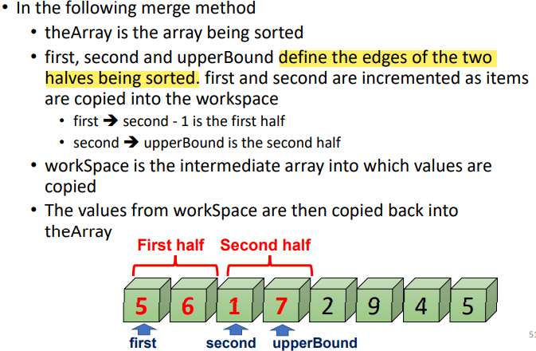</th>
</tr>
</thead>
<tbody>
</tbody>
</table>

2)分开

<table>
<colgroup>
<col style="width: 55%" />
<col style="width: 44%" />
</colgroup>
<thead>
<tr class="header">
<th>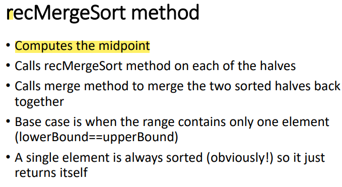</th>
<th>
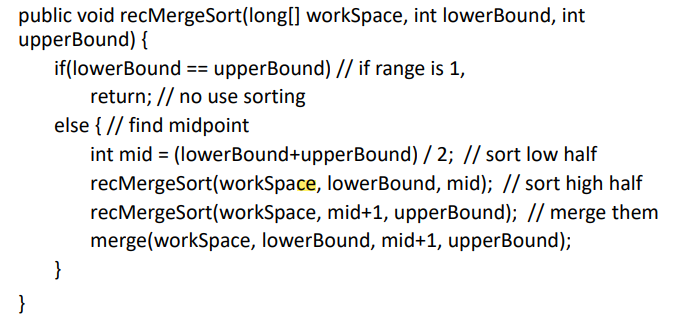

</th>
</tr>
</thead>
<tbody>
</tbody>
</table>

用循环来解

<table>
<colgroup>
<col style="width: 49%" />
<col style="width: 50%" />
</colgroup>
<thead>
<tr class="header">
<th>
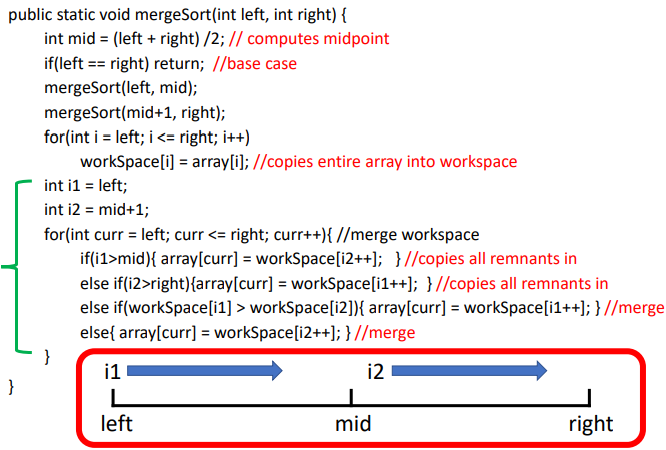

</th>
<th>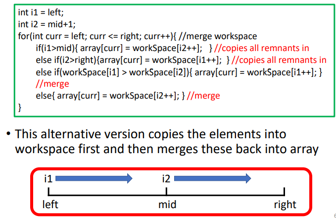</th>
</tr>
</thead>
<tbody>
</tbody>
</table>

3)Copies and Comparisons

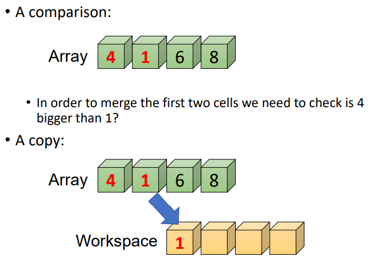

2,分析

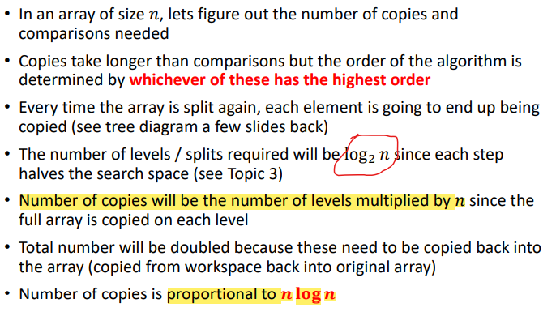

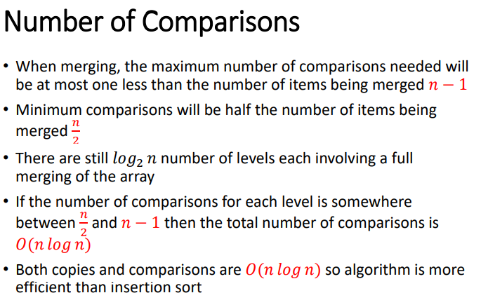

<table>
<colgroup>
<col style="width: 50%" />
<col style="width: 49%" />
</colgroup>
<thead>
<tr class="header">
<th>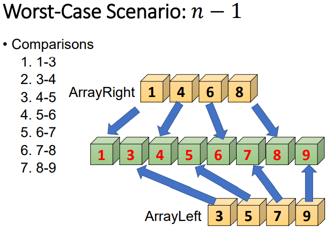</th>
<th>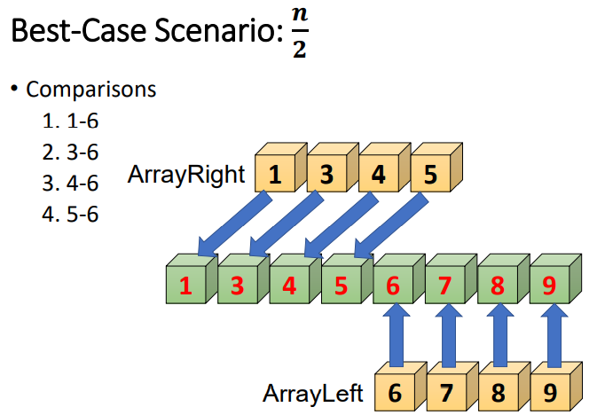</th>
</tr>
</thead>
<tbody>
</tbody>
</table></td>
</tr>
</tbody>
</table>

[时间复杂度分析](https://blog.csdn.net/qq_32534441/article/details/95098059)
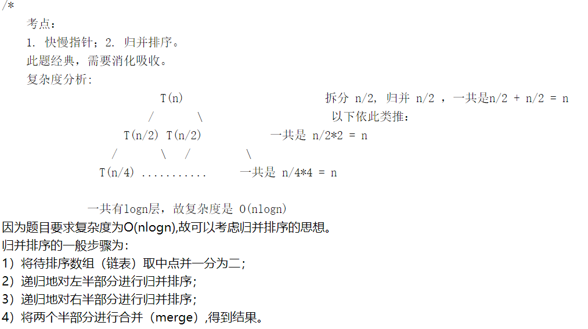

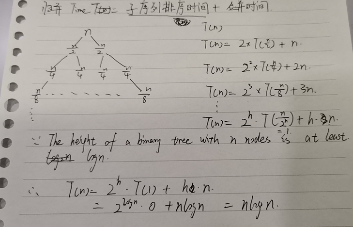

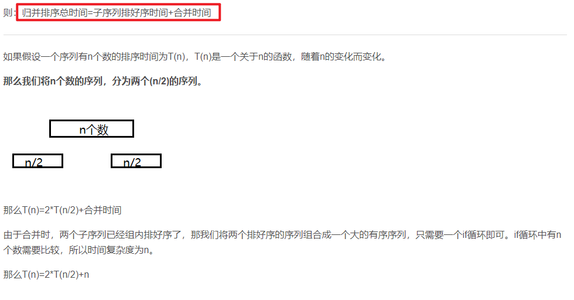

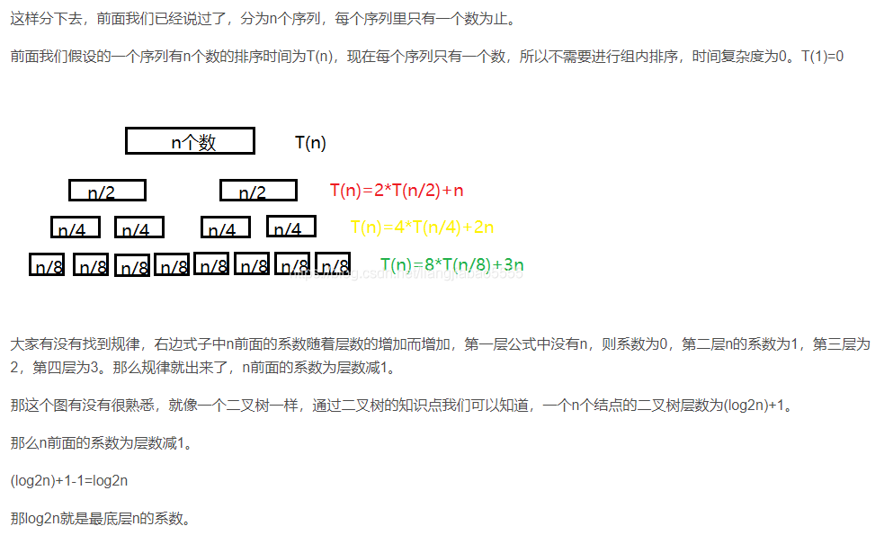
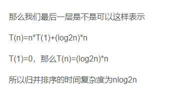

