# 0，目录

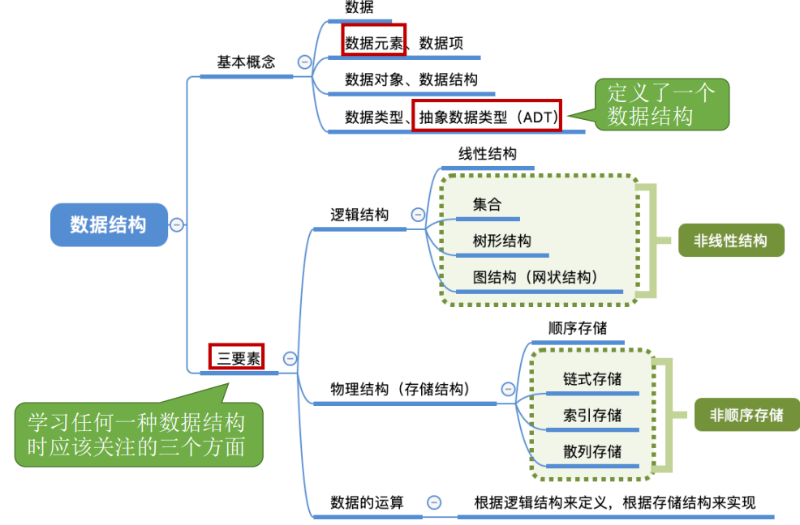
# 1，数据结构
<table>
<colgroup>
<col style="width: 15%" />
<col style="width: 84%" />
</colgroup>
<thead>
<tr class="header">
<th>数据</th>
<th>数据是<strong>信息的载体</strong>，是描述客观事物属性的数、字符及<strong>所有能输入到计算机中并被计算机程序识别</strong> 和处理的符号的集合。数据是计算机程序加工的原料。</th>
</tr>
</thead>
<tbody>
<tr class="odd">
<td>数据元素、数据项</td>
<td>
<strong>数据元素</strong>是数据的基本单位，通常作为一个整体进行考虑和处理。

一个数据元素可由若干<strong>数据项</strong>组成，数据项是构成数据元素的不可分割的最小单位
</td>
</tr>
<tr class="even">
<td>数据结构</td>
<td>数据结构是<strong>相互之间</strong>存在<strong>一种或多种</strong>特定关系的数据元素的集合。</td>
</tr>
<tr class="odd">
<td>数据对象</td>
<td>具有相同性质的数据元素的集合，是数据的一个子集。</td>
</tr>
</tbody>
</table>

# 2，三要素

<table>
<colgroup>
<col style="width: 90%" />
<col style="width: 9%" />
</colgroup>
<thead>
<tr class="header">
<th>
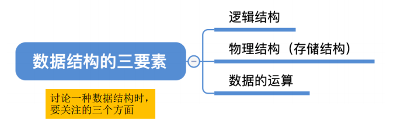

</th>
<th></th>
</tr>
</thead>
<tbody>
</tbody>
</table>
## 1，数据的逻辑结构
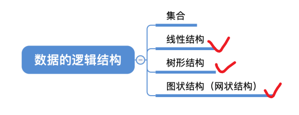
<table>
<colgroup>
<col style="width: 19%" />
<col style="width: 80%" />
</colgroup>
<thead>
<tr class="header">
<th>集合</th>
<th>
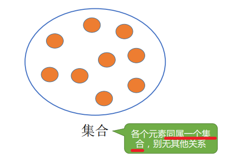

</th>
</tr>
</thead>
<tbody>
<tr class="odd">
<td>线性结构</td>
<td>
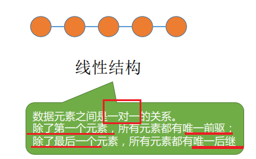

</td>
</tr>
<tr class="even">
<td>树形结构</td>
<td>
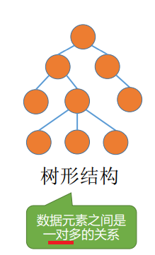

</td>
</tr>
<tr class="odd">
<td>图结构</td>
<td>
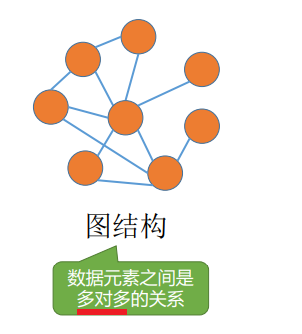

</td>
</tr>
</tbody>
</table>

## 2，数据的物理结构（存储结构）
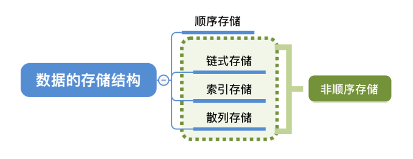

<table>
<colgroup>
<col style="width: 5%" />
<col style="width: 51%" />
<col style="width: 43%" />
</colgroup>
<thead>
<tr class="header">
<th>顺序存储</th>
<th>
把<strong>逻辑上相邻</strong>的元素存储在<strong>物理位置 上也相邻</strong>的存储单元中，元素之间的关系由存储 单元的邻接关系来体现

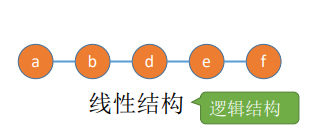

</th>
<th>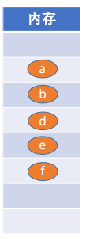</th>
</tr>
</thead>
<tbody>
<tr class="odd">
<td>链式存储</td>
<td>
<strong>逻辑上相邻</strong>的元素在<strong>物理位置上可以 不相邻</strong>，借助指示元素存储地址的指针来表示元 素之间的逻辑关系。

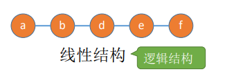

</td>
<td>

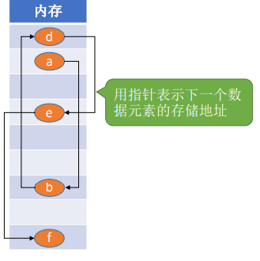

</td>
</tr>
<tr class="even">
<td>索引存储</td>
<td>
在存储元素信息的同时，还建立附加 的索引表。索引表中的每项称为索引项，

<strong>索引项 的一般形式是（关键字，地址）</strong>

</td>
<td>
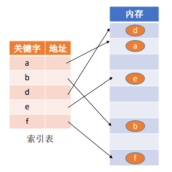

</td>
</tr>
<tr class="odd">
<td>散列存储</td>
<td>根据元素的关键字直接计算出该元素 的存储地址，又称哈希（Hash）存储</td>
<td></td>
</tr>
</tbody>
</table>

理解
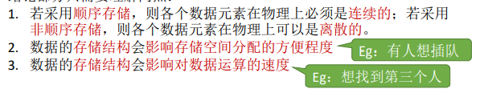
## 3，数据运算
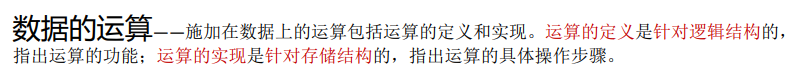

# 4，数据类型和抽象数据类型
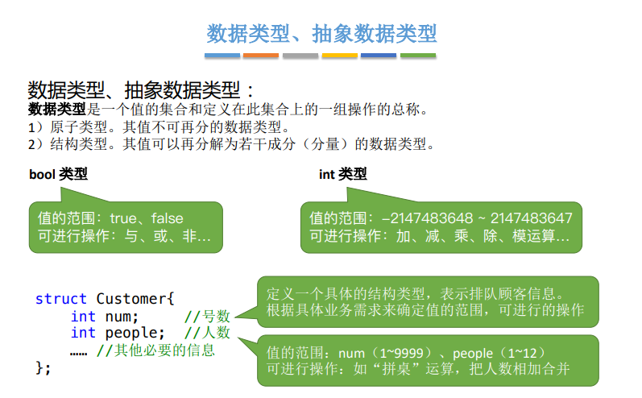

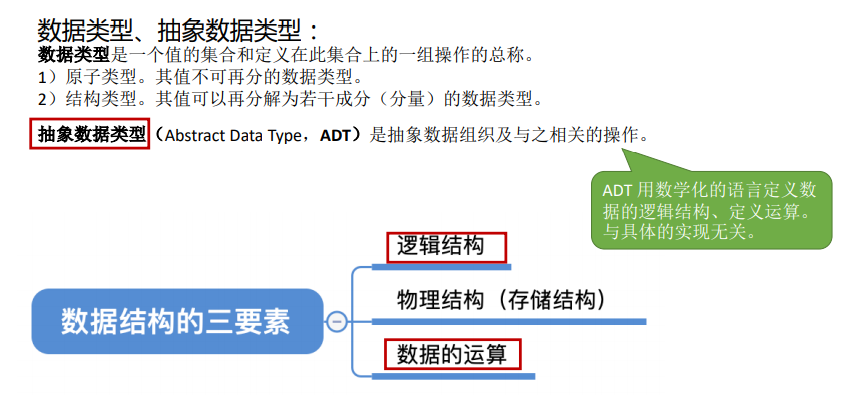

# 5，总结
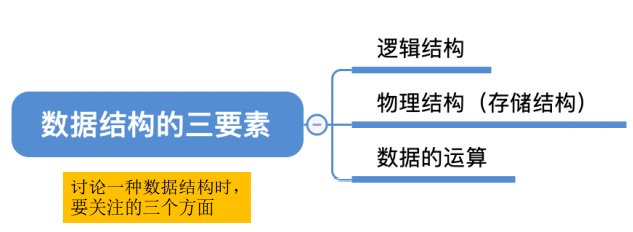

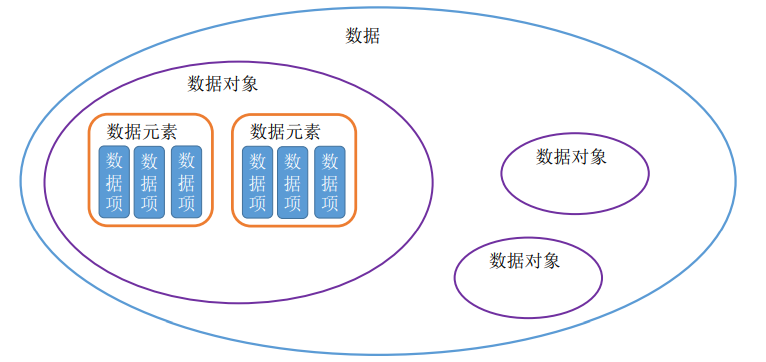
