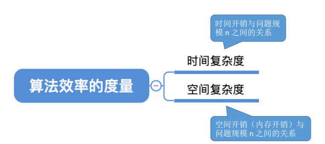
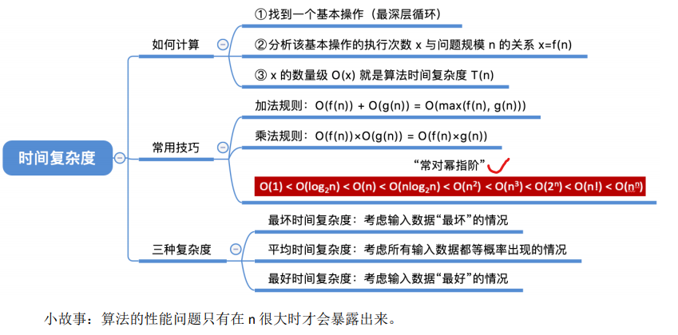
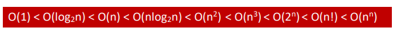
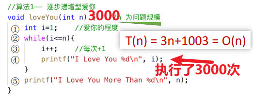
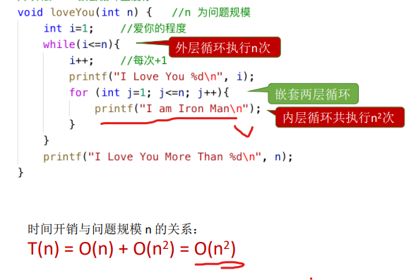
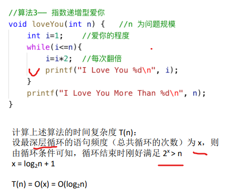
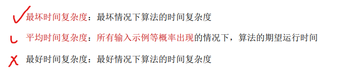
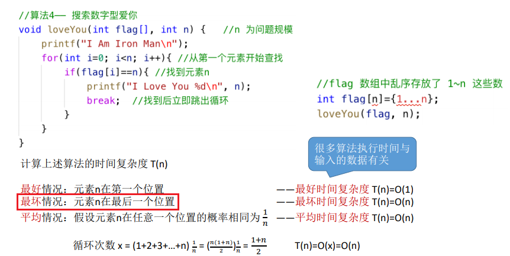

0，目录

1，时间复杂度概念
时间复杂度：事前预估算法时间开销T(n)与问题规模 n 的关系（T 表示 “time”）

2，计算时间复杂度
当n的规模足够大时…
1）可以只看最高阶的部分
2）可以省略常数项
3）计算大小，口诀：常对幂指阶

注意：
1）顺序执行的代码只会 影响常数项，可以忽略
2）只需挑循环中的一个 基本操作分析它的<u>执行次数 与 n 的关系</u>即可
3）如果有多层嵌套循环， 只需关注最深层循环循环了几次
案例

案例

案例

3，最坏时间复杂度

