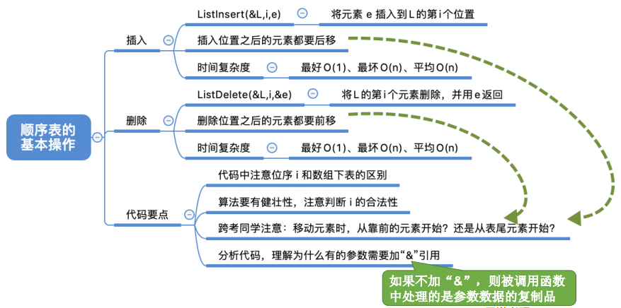
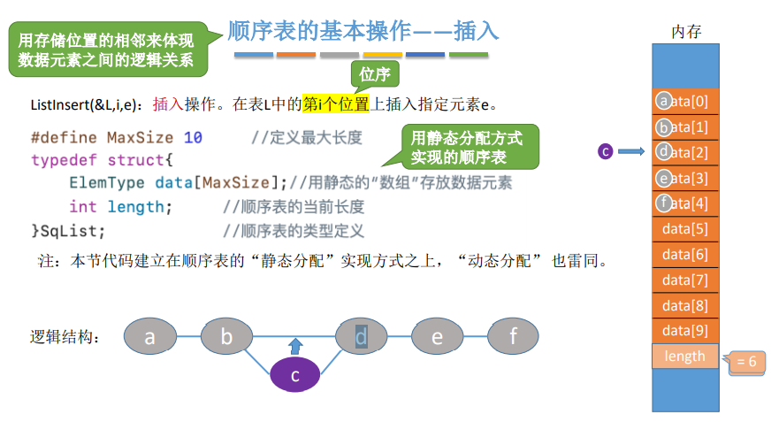
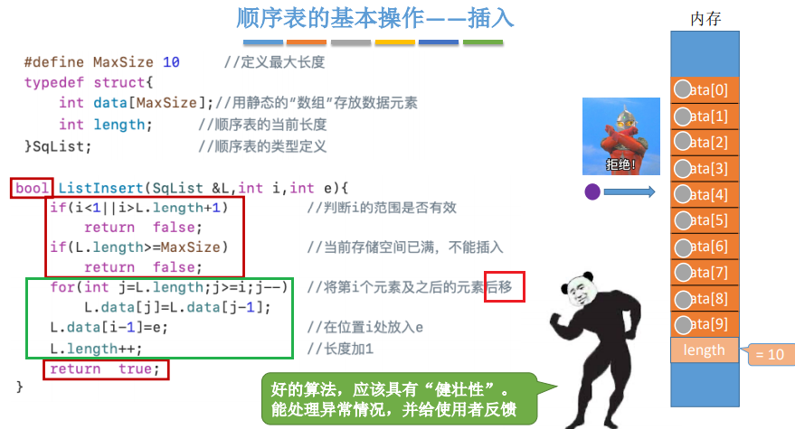
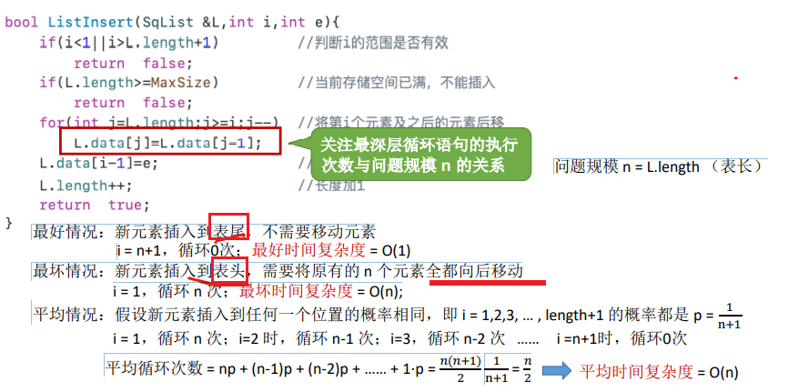
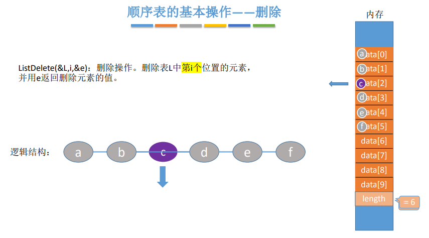
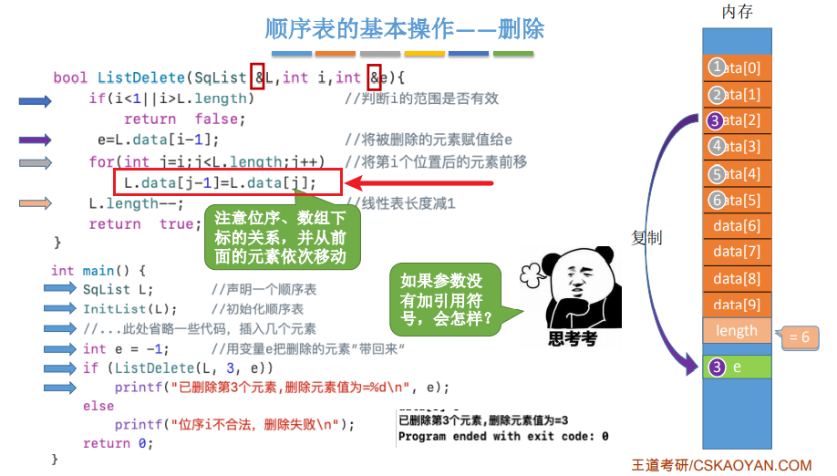
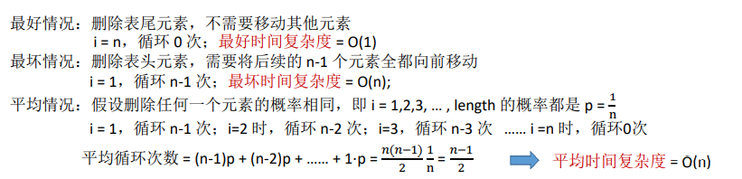

2.2.1顺序表的增删
2021年3月21日
9:45

0，顺序表：用存储位置的相邻来体现 数据元素之间的逻辑关系
本节代码建立在顺序表的“静态分配”实现方式之上，“动态分配” 也雷同。

1，插入
| ListInsert(&L,i,e) | 插入操作。在表L中的第i个位置上插入指定元素e |
|--------------------|---------------------------------------------|

1）在第i位插入，则后面元素后移，腾出位置

时间复杂度分析

2，删除
| ListDelete(&L,i,&e) | 删除操作。删除表L中第i个位置的元素， 并用e返回删除元素的值。 |
|---------------------|--------------------------------------------------------------|

