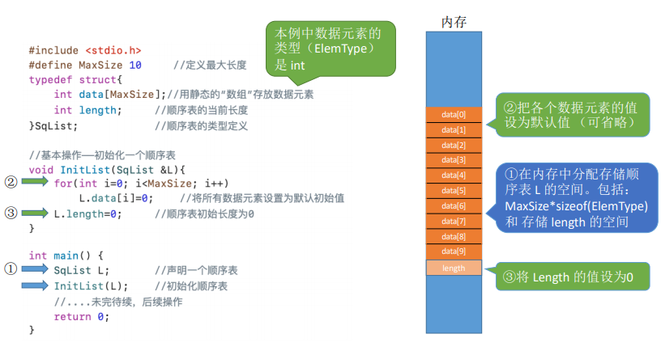
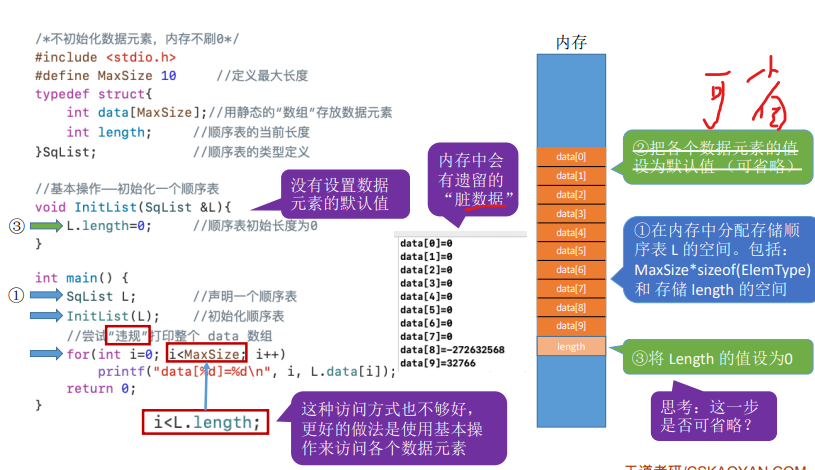
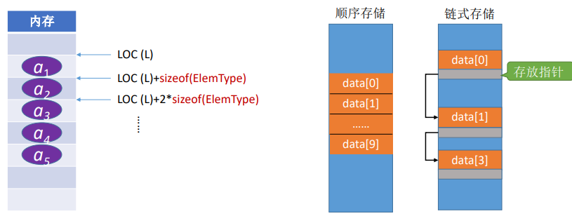

2.2顺序表
2021年3月21日
9:29

2.2.1顺序表的定义

一、顺序表的定义
1，顺序表——用**顺序存储的方式**实现线性表 顺序存储。把逻辑上相邻的元素存储在物理 位置上也相邻的存储单元中，元素之间的关 系由存储单元的邻接关系来体现。

<table>
<colgroup>
<col style="width: 53%" />
<col style="width: 46%" />
</colgroup>
<thead>
<tr class="header">
<th>

</th>
<th>

</th>
</tr>
</thead>
<tbody>
</tbody>
</table>

二、顺序表的实现
1，静态分配

可以省略初始化默认值，注意不要牵扯脏数据

Q：如果“数组”存满了怎么办？
A：可以放弃治疗，顺序表的表长刚开始确定后就无法更改（存储空间是静态的）
思考：如果刚开始就声明一个很大的内存空间呢？存在什么问题？
浪费内存空间---这是静态分配的局限性

2，动态分配
Key：动态申请和释放内存空间
C
<table>
<colgroup>
<col style="width: 85%" />
<col style="width: 14%" />
</colgroup>
<thead>
<tr class="header">
<th>
—— malloc

<strong>【</strong>malloc 函数的参数，指明要 分配多大的连续内存空间；【一次性给一篇连续存储的空间】

malloc 函数返回一个指针， 空间 需要强制转型为你定义的 数据元素类型指针<strong>】</strong>

L.data = (ElemType *) malloc (sizeof(ElemType) * InitSize);

---free 函数

</th>
<th>

</th>
</tr>
</thead>
<tbody>
</tbody>
</table>

C++ —— new、delete 关键字

3，顺序表的特点：
①随机访问，即可以在 O(1) 时间内找到第 i 个元素。
②存储密度高，每个节点只存储数据元素
③拓展容量不方便（即便采用动态分配的方式实现，拓展长度的时间复杂度也比较高）
④插入、删除操作不方便，需要移动大量元素

