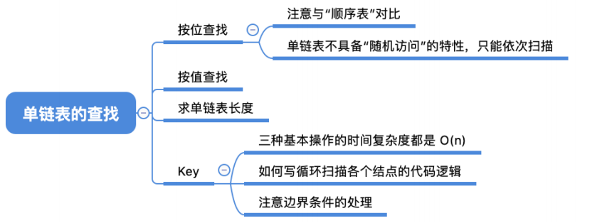
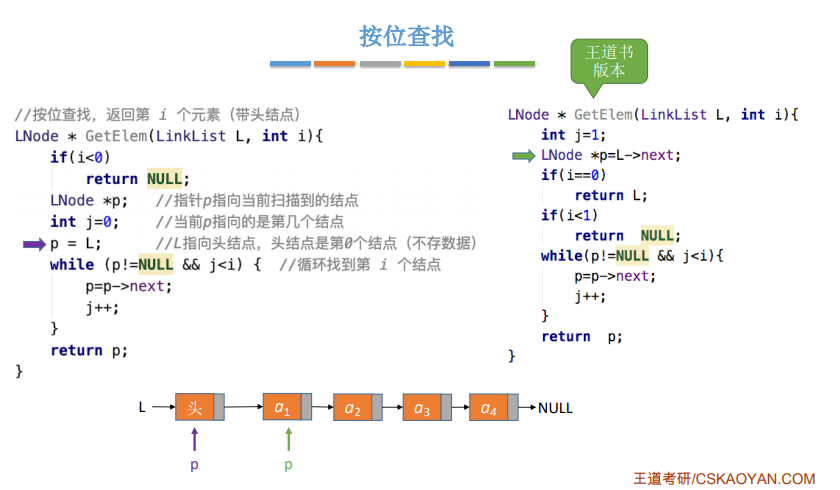
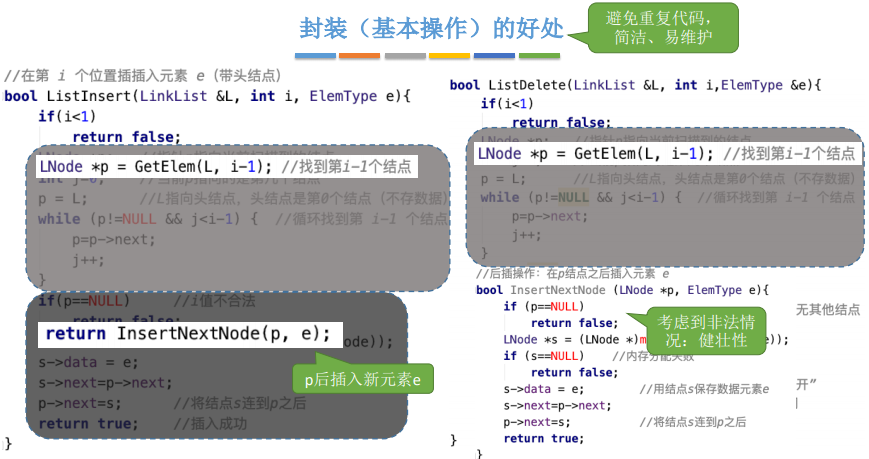
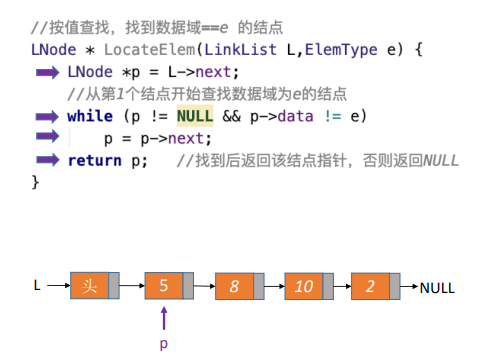
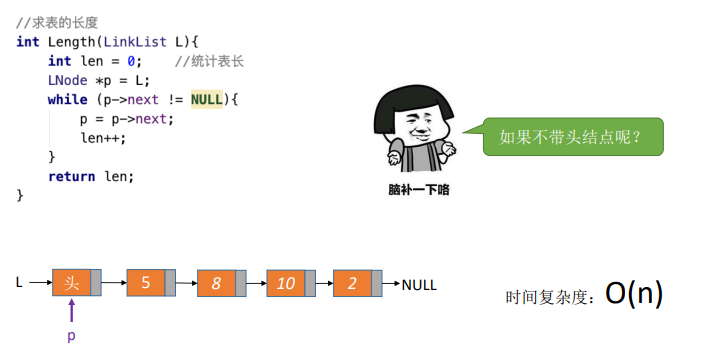

0，

1，按位查找操作，O(n)
| GetElem(L,i) | 按位查找操作。获取表L中第i个位置的元素的值。 |
|--------------|----------------------------------------------|
平均时间复杂度O(n)

<table>
<colgroup>
<col style="width: 49%" />
<col style="width: 50%" />
</colgroup>
<thead>
<tr class="header">
<th>

</th>
<th>

</th>
</tr>
</thead>
<tbody>
</tbody>
</table>

2,按值查找操作
| LocateElem(L,e) | 按值查找操作。在表L中查找具有给定关键字值的元素。 |
|-----------------|---------------------------------------------------|
平均时间复杂度：O(n)

3，求表的长度

