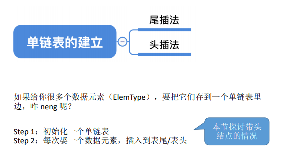
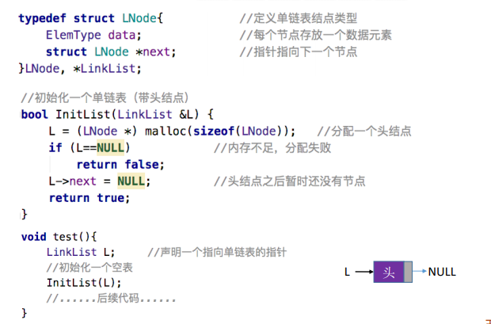
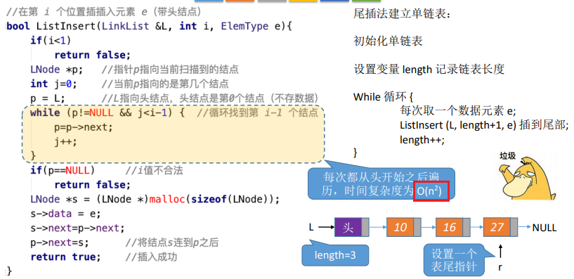
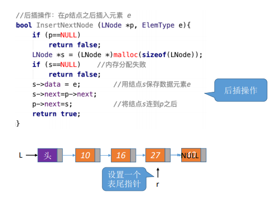
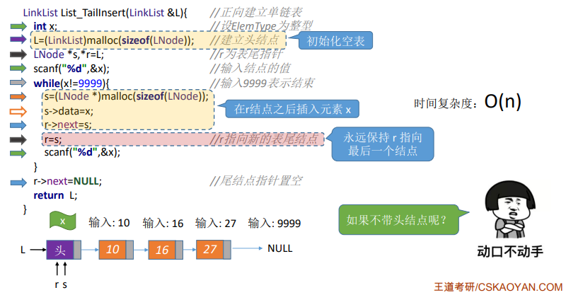
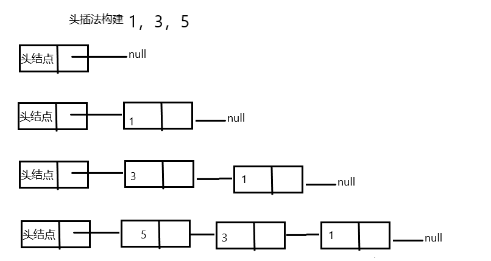
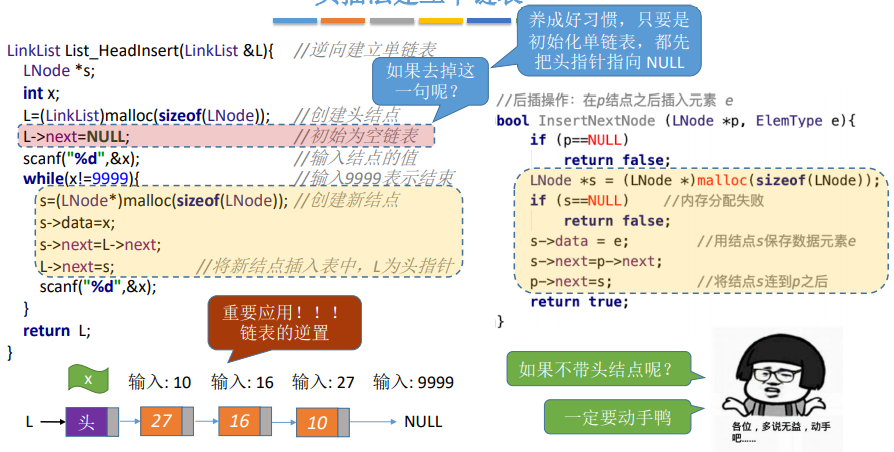

0头插法、尾插法：核心就是初始化操作、指定结点的后插操作

1，尾插法
<table>
<colgroup>
<col style="width: 100%" />
</colgroup>
<thead>
<tr class="header">
<th>初始化</th>
</tr>
</thead>
<tbody>
<tr class="odd">
<td>

</td>
</tr>
</tbody>
</table>

<table>
<colgroup>
<col style="width: 100%" />
</colgroup>
<thead>
<tr class="header">
<th>插入，在第i位置插入e</th>
</tr>
</thead>
<tbody>
<tr class="odd">
<td>

</td>
</tr>
</tbody>
</table>

尾插法--后插操作

尾插法建立单链表

2，头插法：对头结点的 后插操作

头插法、尾插法：核心就是初始化操作、指定结点的后插操作
