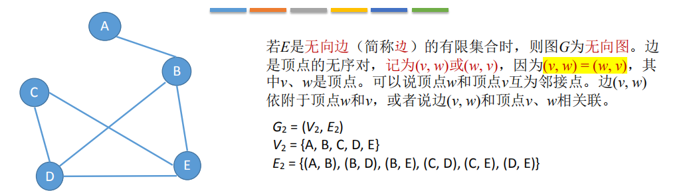

1，图的定义
图G由顶点集V和边集E组成，记为G = (V, E)，
其中V(G)表示图G中**顶点的有限非空集**；
E(G)表示图G中顶点之间的<u>关系（边）集合</u>。
若V = {v1, v2, … , vn}，则用\|V\|表示图G中顶点的个数，也称图G的阶，
E = {(u, v) \| u∈V, v∈V}，用\|E\|表示图G中边的条数。 B AC E D
<table>
<colgroup>
<col style="width: 100%" />
</colgroup>
<thead>
<tr class="header">
<th>
G: Graph

V: Vertex

E: Edge
</th>
</tr>
</thead>
<tbody>
</tbody>
</table>

注意：线性表可以是空表，树可以是空树，**但图不可以是空，即V一定是非空集**

2，有向图和无向图

2.1无向图

2.2有向图

3，简单图和复杂图
3.1 简单图
① 不存在重复边；
② 不存在顶点到自身的边

3.2，多重图
图G中某两个结点之间的边数多于一条，又允许顶点通过同一条边和自己关联，

4，顶点的度、入度、出度
4.1 无向图
对于无向图：顶点v的度是指依附于该顶点的边的条数，记为TD(v)。

4.2 有向图
对于有向图：
| 入度      | 是以顶点v为终点的有向边的数目，记为ID(v)；          |
|-----------|-----------------------------------------------------|
| 出度      | 是以顶点v为起点的有向边的数目，记为OD(v)。          |
| 顶点v的度 | 等于其**入度和出度之和**，即TD(v) = ID(v) + OD(v)。 |

4.3顶点和顶点之间的关系

5，连通图、强连通图
<table>
<colgroup>
<col style="width: 59%" />
<col style="width: 40%" />
</colgroup>
<thead>
<tr class="header">
<th>
5.1 连通图

若图G中任意两个顶点都是连通的，则称图G为连通图，否则称为非连通图。

</th>
<th>

</th>
</tr>
</thead>
<tbody>
</tbody>
</table>

<table>
<colgroup>
<col style="width: 58%" />
<col style="width: 41%" />
</colgroup>
<thead>
<tr class="header">
<th>
5.2 强连通图

若图中任何一对顶点都是强连通的，则称此图为

强连通图。

</th>
<th>

</th>
</tr>
</thead>
<tbody>
</tbody>
</table>

6，子图
6.1 无向图

6.2有向图

7，连通分量

8，树
**连通图**的生成树是包含图中全部顶点的一个极小连通子图。
若图中顶点数为n，则它的生成树含有 n-1 条边。对生成树而言，若砍去它的一条边，则会变成非连通
图，若加上一条边则会形成一个回路。

边尽可能的少，但要保持连通

9，生成树林
在**非连通图**中，连通分量的生成树构成了非连通图的生成森林。

11，边的权、带权图/网

12，几种特殊形态的图

