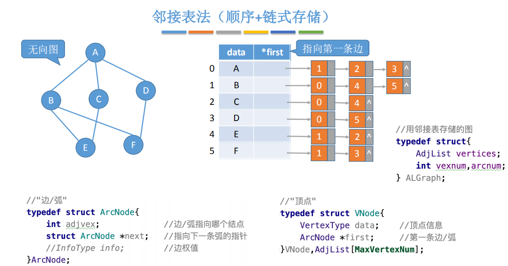
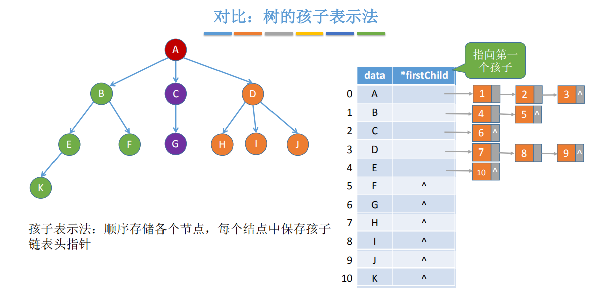
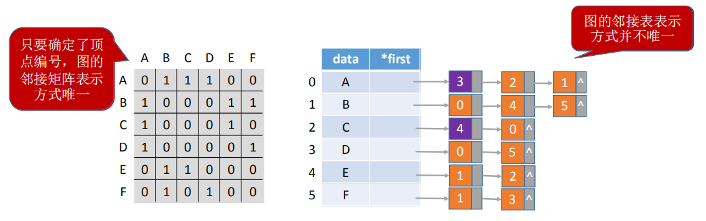
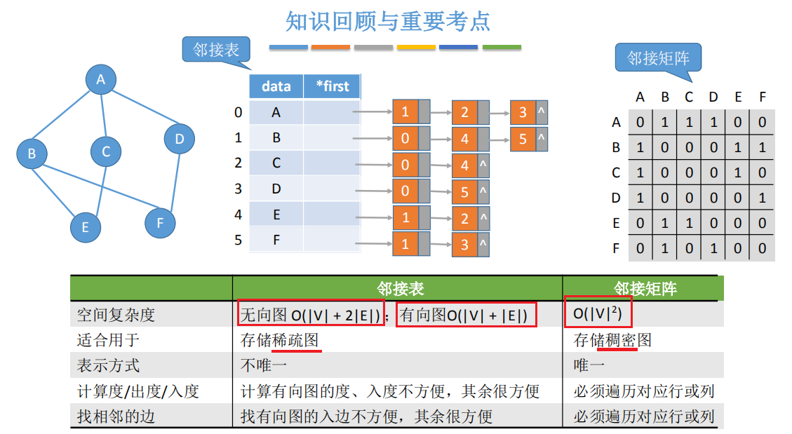

邻接表：顺序+链式存储
<table>
<colgroup>
<col style="width: 48%" />
<col style="width: 51%" />
</colgroup>
<thead>
<tr class="header">
<th></th>
<th>

</th>
</tr>
</thead>
<tbody>
</tbody>
</table>

1.1
无向图
边结点的数量是2\|E\|，
整体空间复杂度为O(\|V\| + 2\|E\|)

有向图
边结点的数量是\|E\|，
整体空间复杂度为O(\|V\| + \|E\|)

1.2 表示

总结

