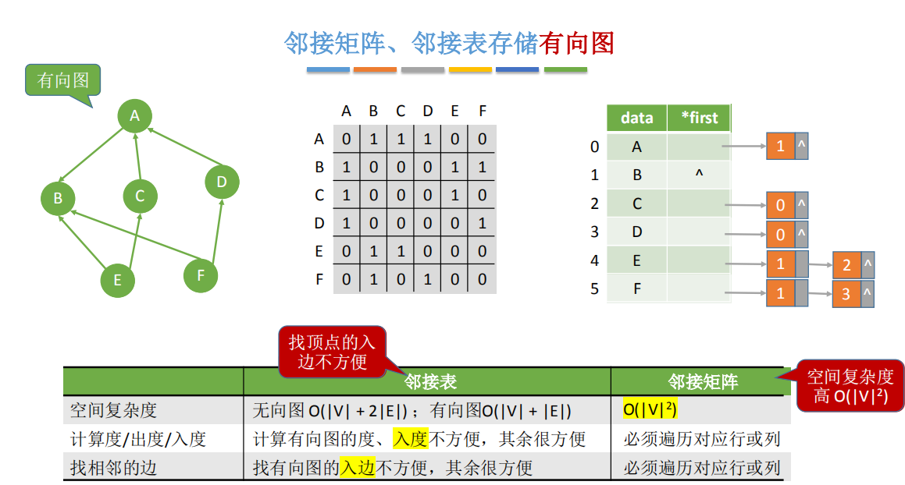
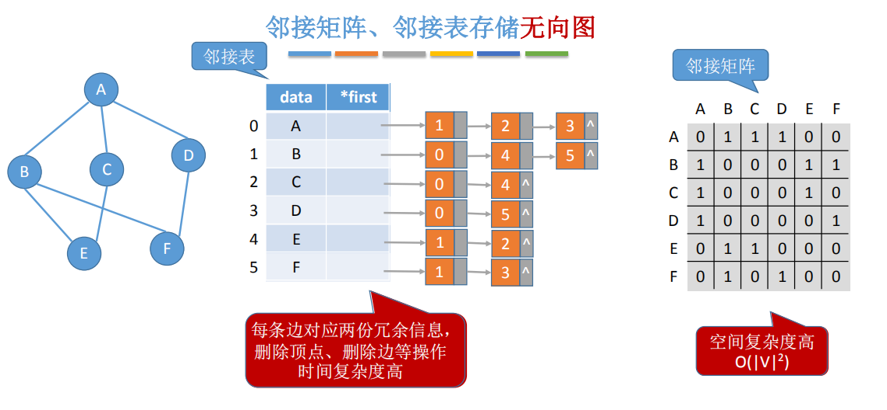
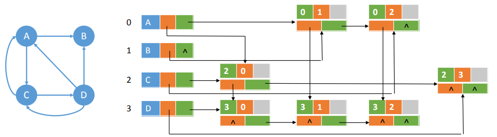
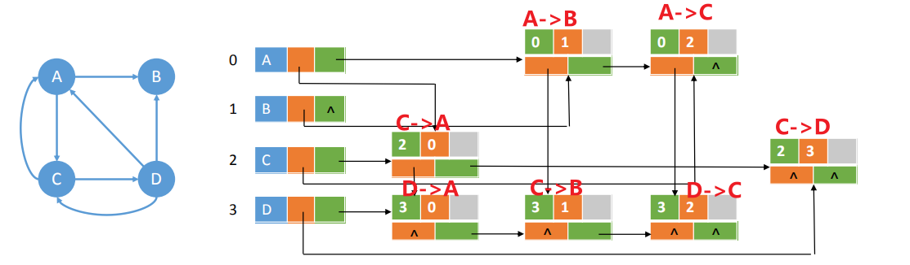
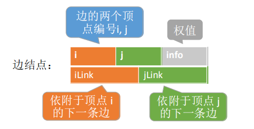
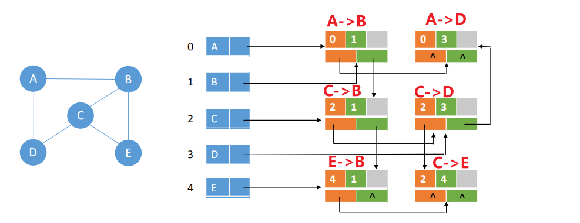
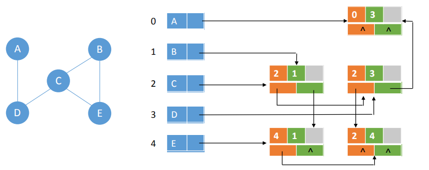
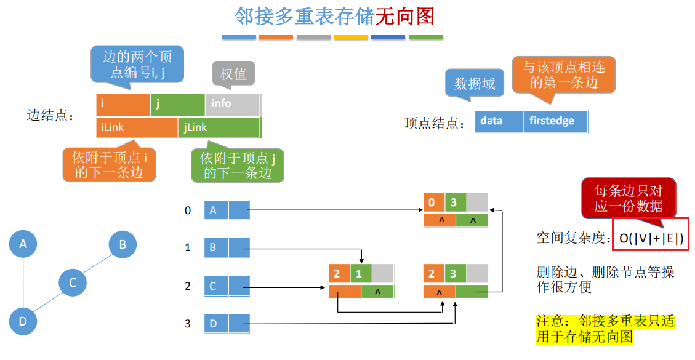
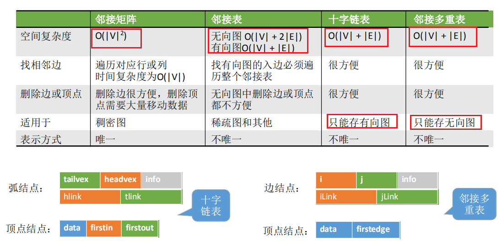

前两者的缺点
<table>
<colgroup>
<col style="width: 42%" />
<col style="width: 57%" />
</colgroup>
<thead>
<tr class="header">
<th></th>
<th>

</th>
</tr>
</thead>
<tbody>
</tbody>
</table>

1，十字链表--存储有向图
<table>
<colgroup>
<col style="width: 47%" />
<col style="width: 52%" />
</colgroup>
<thead>
<tr class="header">
<th></th>
<th>

</th>
</tr>
</thead>
<tbody>
</tbody>
</table>

**空间复杂度：O(\|V\|+\|E\|)**
| 如何找到指定顶点的所有**出边**？ | ——顺着**绿色线路**找 |
|----------------------------------|----------------------|
| 如何找到指定顶点的所有**入边**？ | ——顺着**橙色线路**找 |
注意：十字链表只用于存储有向图

2，存储无向图--存储无向图
<table>
<colgroup>
<col style="width: 56%" />
<col style="width: 43%" />
</colgroup>
<thead>
<tr class="header">
<th>

</th>
<th>

</th>
</tr>
</thead>
<tbody>
</tbody>
</table>

