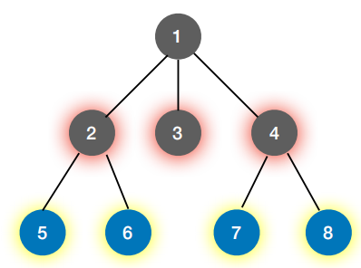
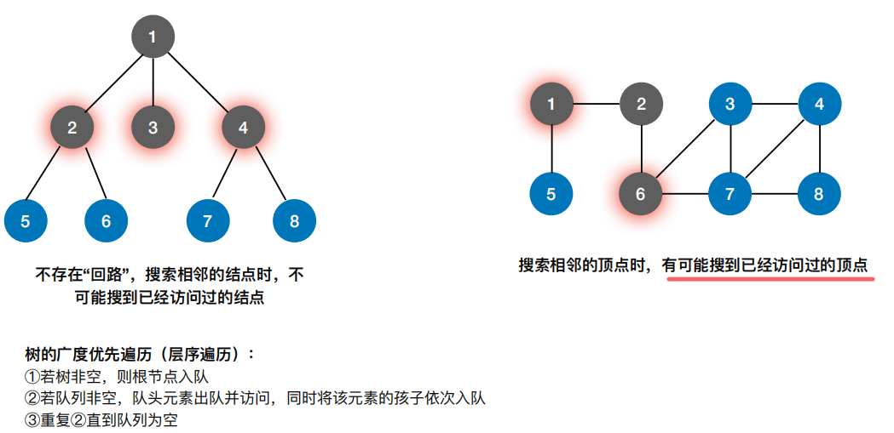
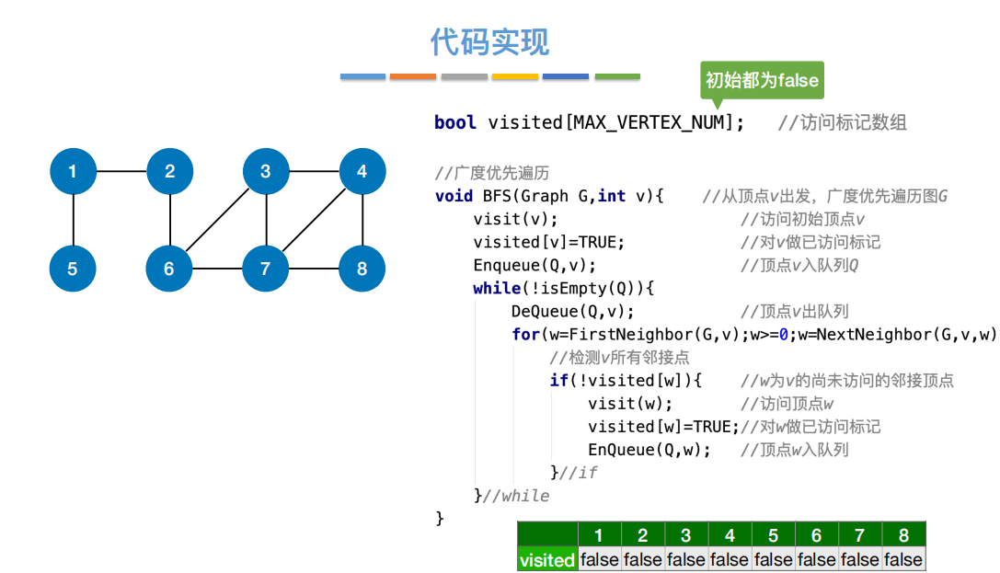
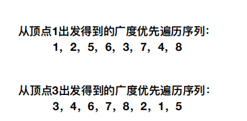
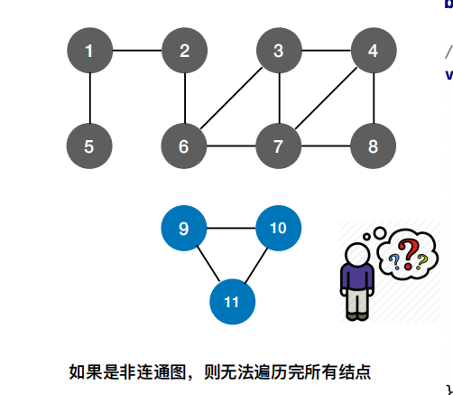
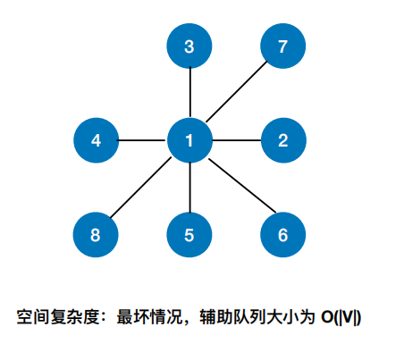
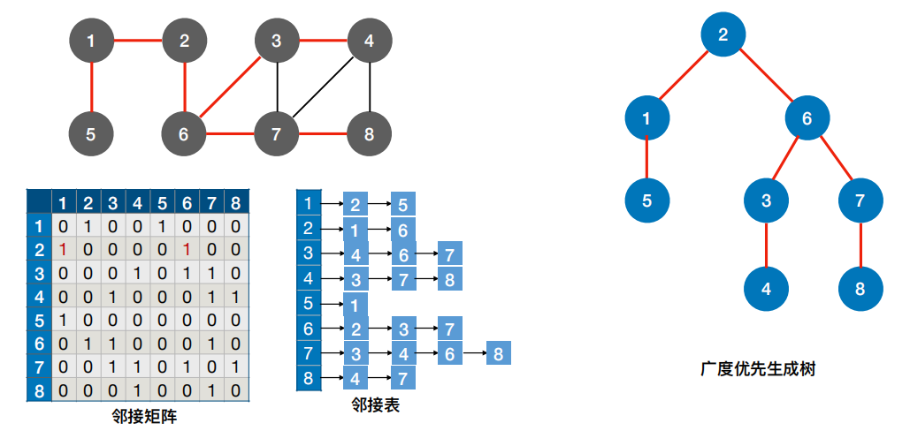
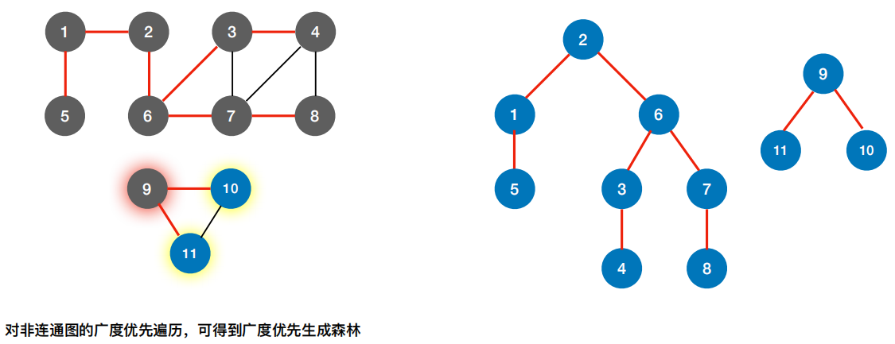
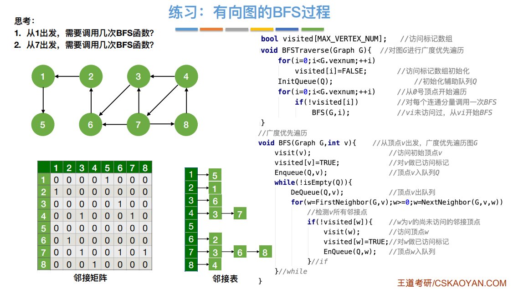
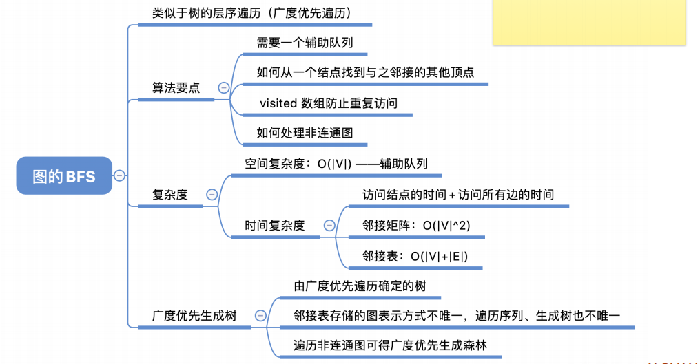

1，树的⼴度优先遍历
<table>
<colgroup>
<col style="width: 49%" />
<col style="width: 50%" />
</colgroup>
<thead>
<tr class="header">
<th>
树的⼴度优先遍历：

通过根节点，可以找到下⼀层的结点

2，3，4.通过234⼜可以找到再下⼀层

的结点5678
</th>
<th>

横向遍历
</th>
</tr>
</thead>
<tbody>
</tbody>
</table>

2，图的⼴度优先遍历
<table>
<colgroup>
<col style="width: 63%" />
<col style="width: 36%" />
</colgroup>
<thead>
<tr class="header">
<th>

</th>
<th>
从2入手，找到相连的1,6；

1找到5,2找到6；

6找到3,7；

3找到4，7找到8
</th>
</tr>
</thead>
<tbody>
</tbody>
</table>

3，图VS树

3，代码

得到
<table>
<colgroup>
<col style="width: 59%" />
<col style="width: 40%" />
</colgroup>
<thead>
<tr class="header">
<th></th>
<th>

</th>
</tr>
</thead>
<tbody>
</tbody>
</table>
【按照小到大排每一次找到的】
可变性

疑问
<table>
<colgroup>
<col style="width: 46%" />
<col style="width: 53%" />
</colgroup>
<thead>
<tr class="header">
<th>

</th>
<th>
解决方法：

从false的点再bfs

</th>
</tr>
</thead>
<tbody>
</tbody>
</table>

完整代码
**结论：对于⽆向图，调⽤BFS函数的次数=连通分量数**

4，时间复杂度分析
4.1

4.2
拆开分析：访问顶点+访问边

5，⼴度优先⽣成树
标红第一次访问的边，则n个顶点有n-1边

6，⼴度优先⽣成森林

7，

