## 1，概念
**连通图的生成树**是包含图中全部顶点的一个极小连通子图。【边尽可能的少，但要保持连通】
若图中顶点数为n，则它的生成树含有 n-1 条边。对生成树而言，若砍去它的一条边，则会变成非连通
图，若加上一条边则会形成一个回路。
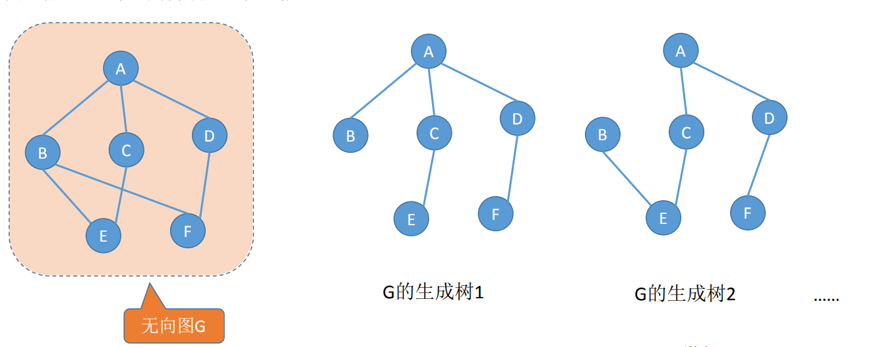

## 2，树
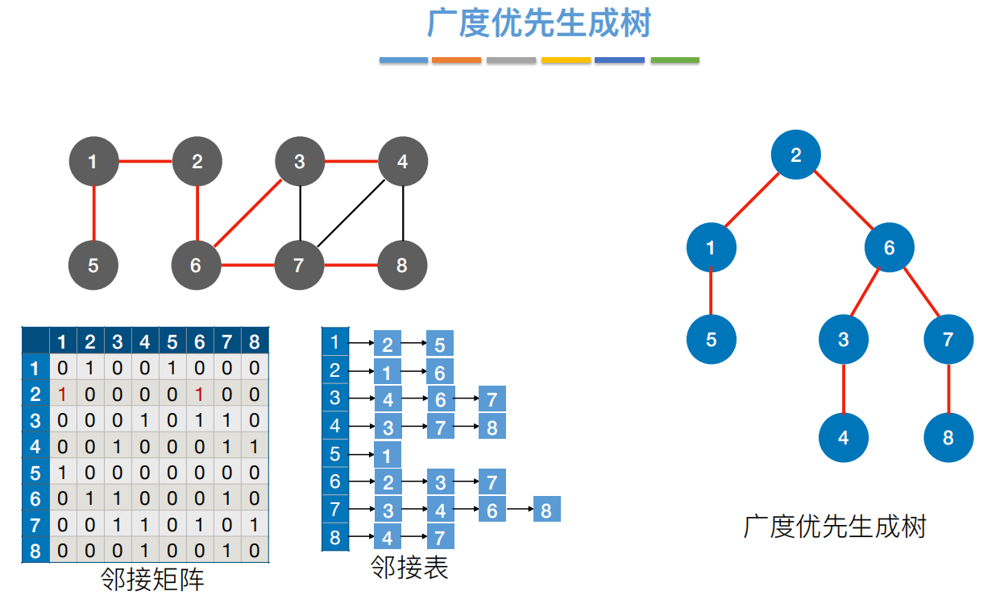

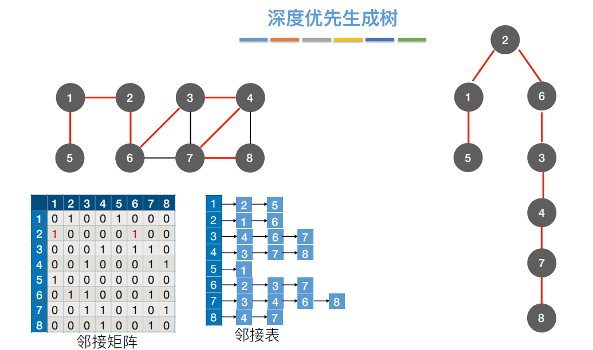

## 3，最小生成树
案例
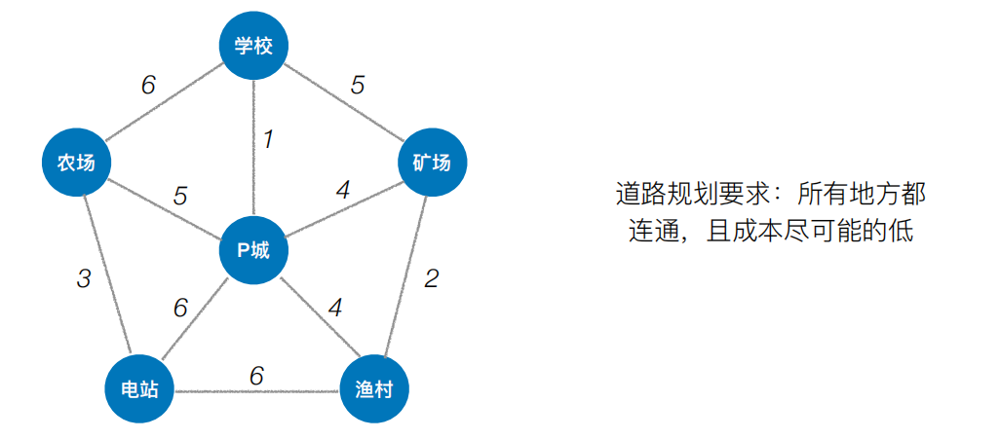
找出最便宜的修路方案

对于⼀个带权连通⽆向图G = (V, E)，⽣成树不同，每棵树的权（即树中所有边上的权值
之和）也可能不同。设R为G的所有⽣成树的集合，若T为R中边的权值之和最⼩的⽣成
树，则T称为G的最⼩⽣成树（Minimum-Spanning-Tree, MST）。

<table>
<colgroup>
<col style="width: 100%" />
</colgroup>
<thead>
<tr class="header">
<th>
<strong>最⼩⽣成树可能有多个，但边的权值之和总是唯⼀且最⼩的</strong>

<strong>最⼩⽣成树的边数 = 顶点数 - 1。砍掉⼀条则不连通，增加⼀条边则会出现回路</strong>
</th>
</tr>
</thead>
<tbody>
</tbody>
</table>

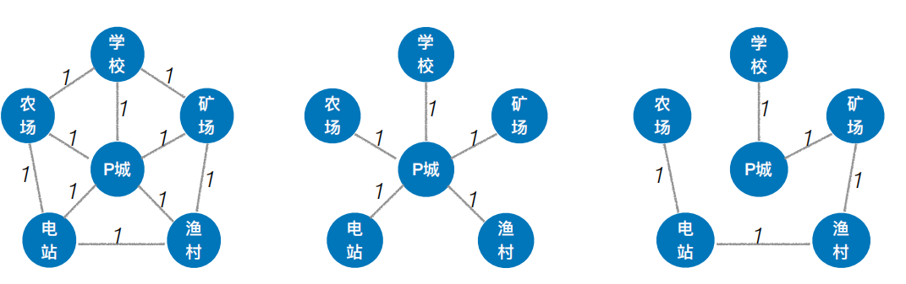

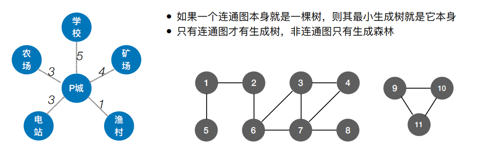

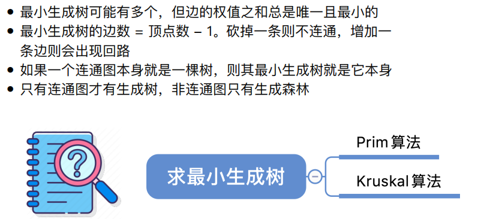

## 一、Prim 算法（普⾥姆）：
从某⼀个顶点开始构建⽣成树；
每次将代价最⼩的新顶点纳⼊⽣成树，**直到所有顶点都纳⼊为⽌**。
从学校开始

<table>
<colgroup>
<col style="width: 51%" />
<col style="width: 48%" />
</colgroup>
<thead>
<tr class="header">
<th>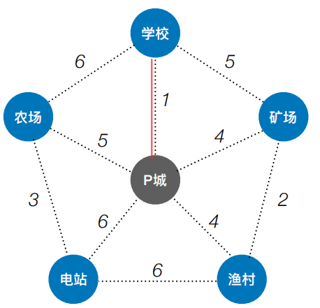</th>
<th>

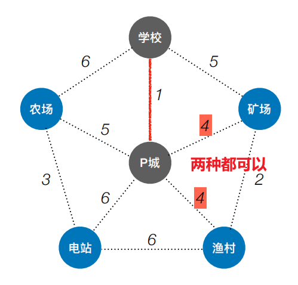
</th>
</tr>
</thead>
<tbody>
<tr class="odd">
<td>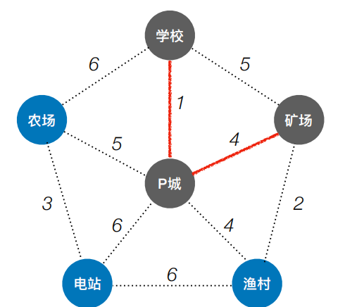</td>
<td>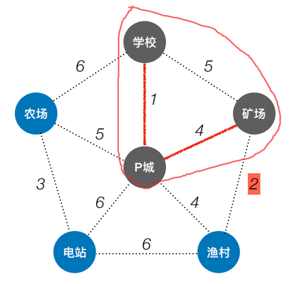</td>
</tr>
<tr class="even">
<td>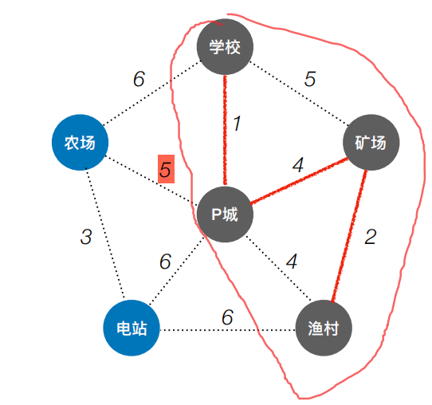</td>
<td>
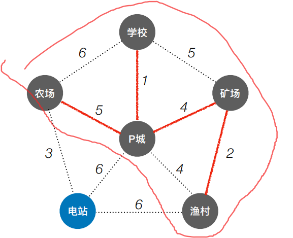

</td>
</tr>
<tr class="odd">
<td>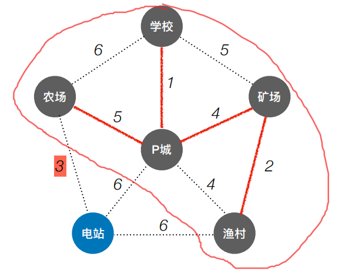</td>
<td>
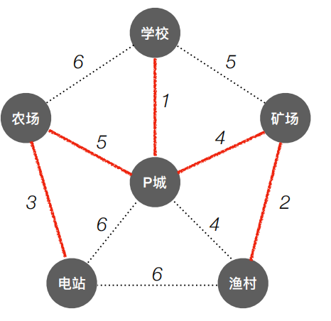

</td>
</tr>
</tbody>
</table>

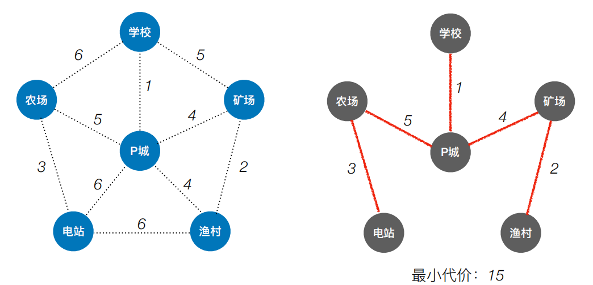
**不同的点出发，不同的分支选择，最小代价都一样**

## 二、Kruskal 算法（克鲁斯卡尔）
**每次选择⼀条权值最⼩的边，使这条边的两头连通（原本已经连通的就不选）直到所有结点都连通**
<table>
<colgroup>
<col style="width: 29%" />
<col style="width: 70%" />
</colgroup>
<thead>
<tr class="header">
<th>最小1，两头未通</th>
<th>
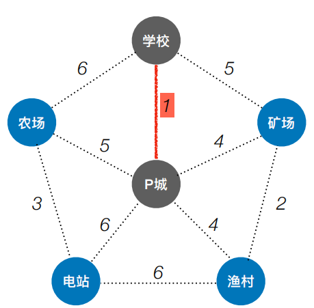

</th>
</tr>
</thead>
<tbody>
<tr class="odd">
<td>最小2，两头未通</td>
<td>
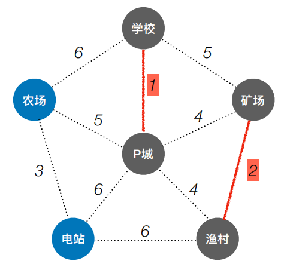

</td>
</tr>
<tr class="even">
<td>最小3，两头未通</td>
<td>
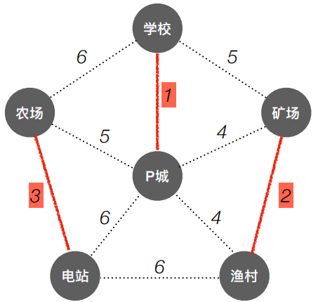

</td>
</tr>
<tr class="odd">
<td>最小4，两头未通</td>
<td>
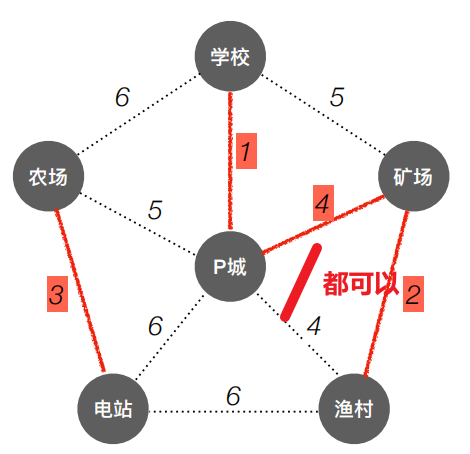

</td>
</tr>
<tr class="even">
<td>最小5，，两头未通</td>
<td>
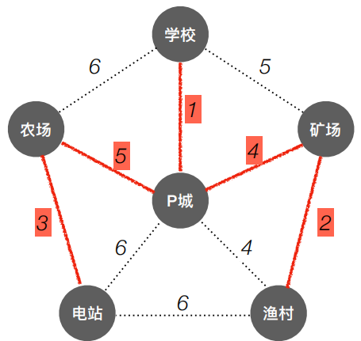

</td>
</tr>
<tr class="odd">
<td>全部走通</td>
<td>
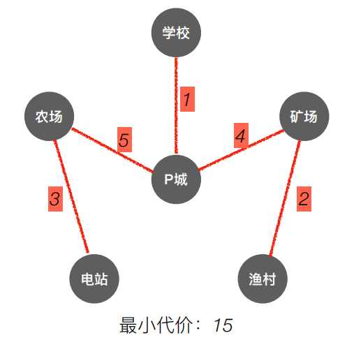

</td>
</tr>
</tbody>
</table>

**三、对比**
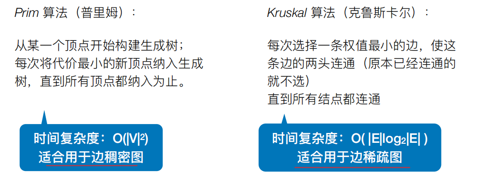

**四、实现思想**
**见PDF**

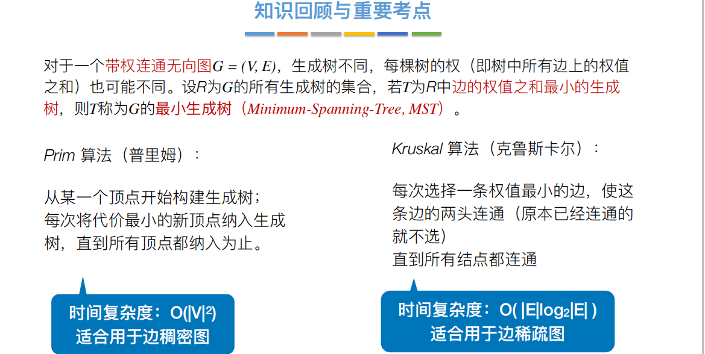

