BFS求⽆权图的单源最短路径
1，过程

<table>
<colgroup>
<col style="width: 28%" />
<col style="width: 33%" />
<col style="width: 38%" />
</colgroup>
<thead>
<tr class="header">
<th>
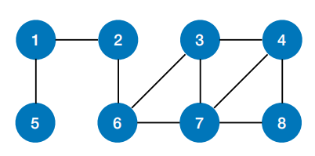

</th>
<th>
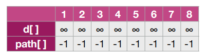

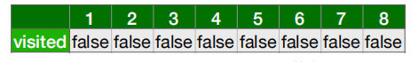

</th>
<th></th>
</tr>
</thead>
<tbody>
<tr class="odd">
<td>
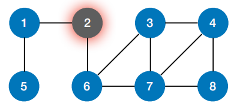

</td>
<td>
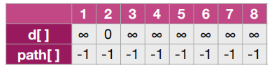

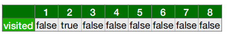

</td>
<td></td>
</tr>
<tr class="even">
<td>
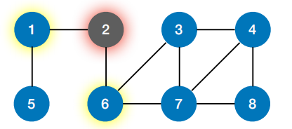

</td>
<td>
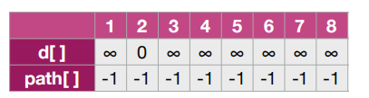

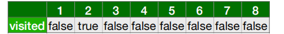

</td>
<td>

</td>
</tr>
<tr class="odd">
<td>。。。</td>
<td></td>
<td></td>
</tr>
<tr class="even">
<td>
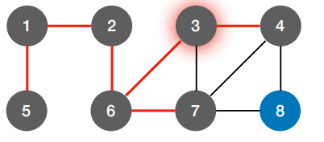

</td>
<td>
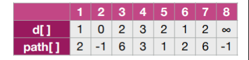

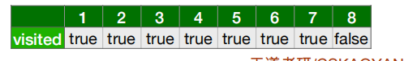

</td>
<td>

</td>
</tr>
<tr class="odd">
<td>
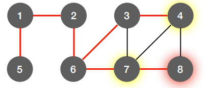

</td>
<td>
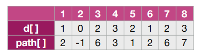

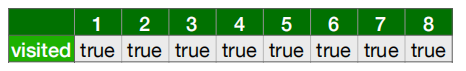

</td>
<td>

</td>
</tr>
</tbody>
</table>

2，代码
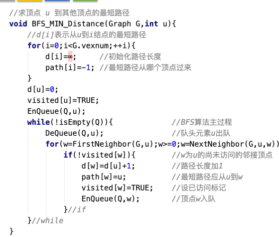
3，路径
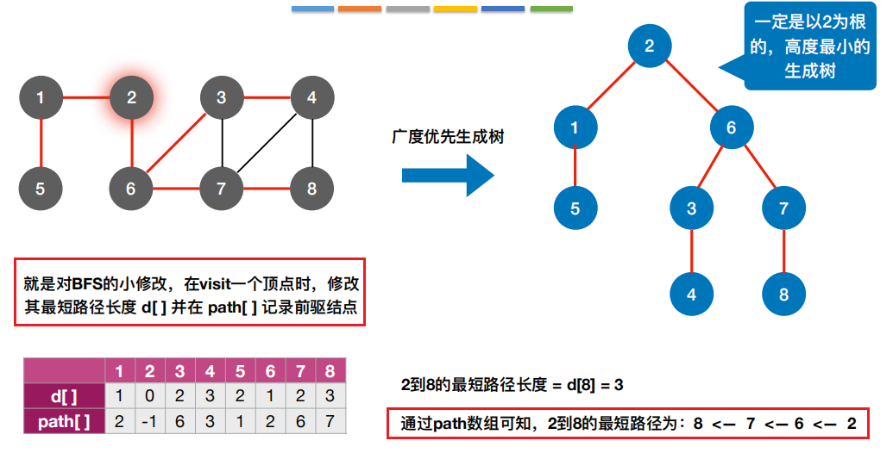

