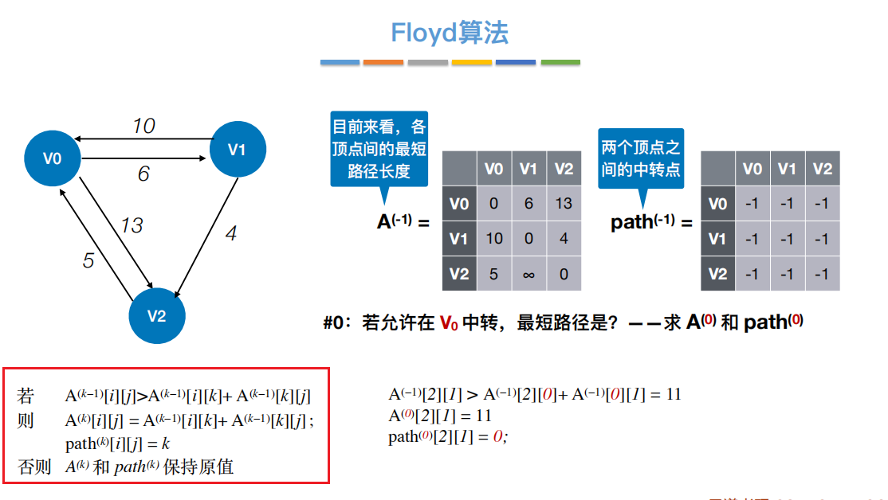
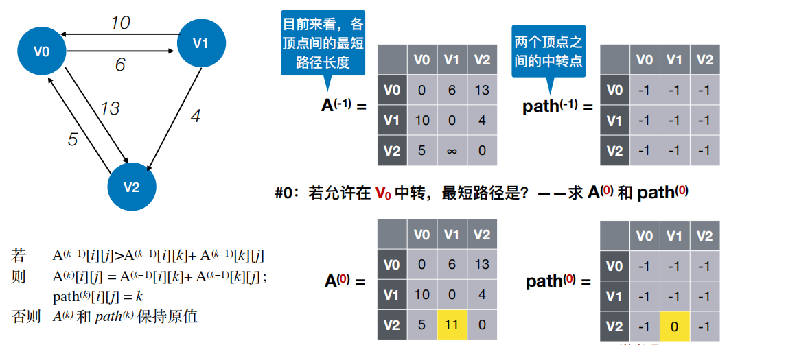
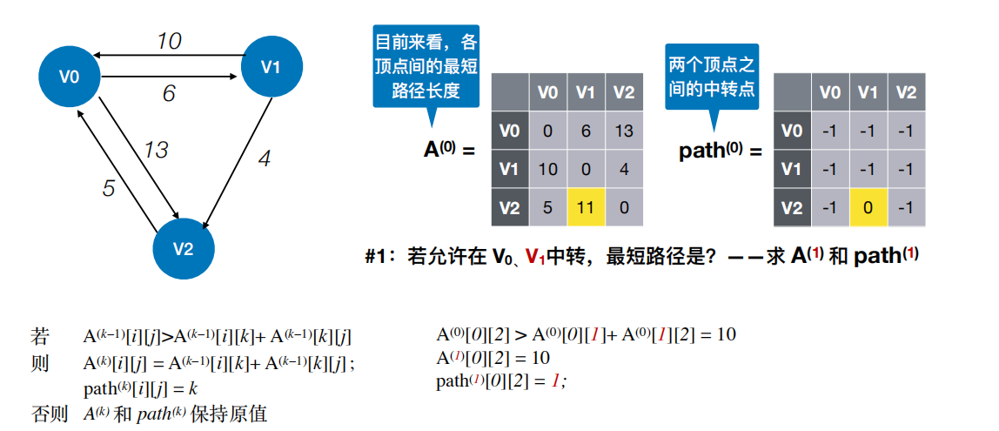
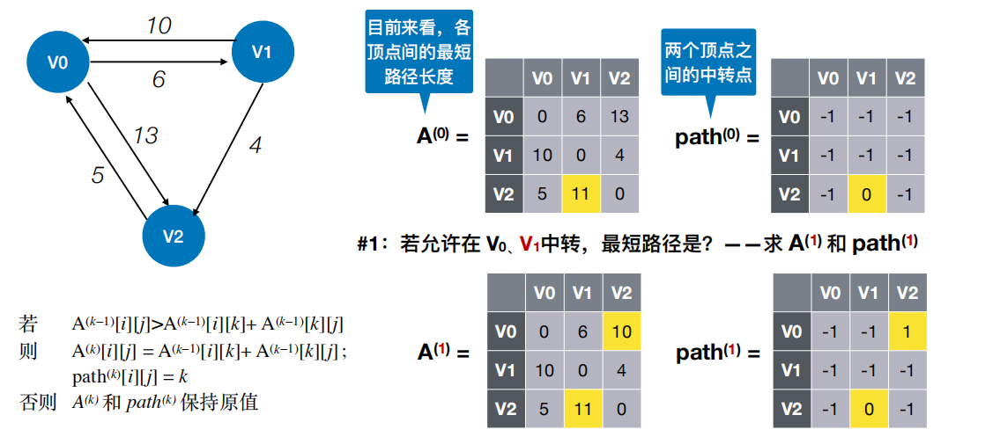
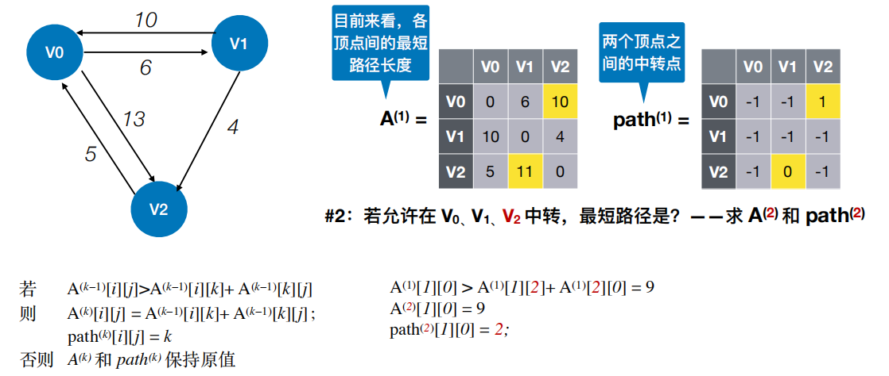
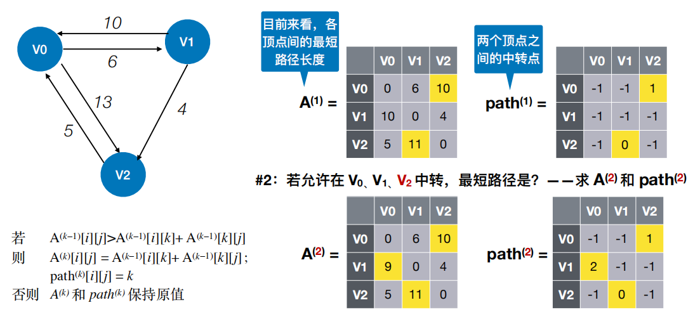
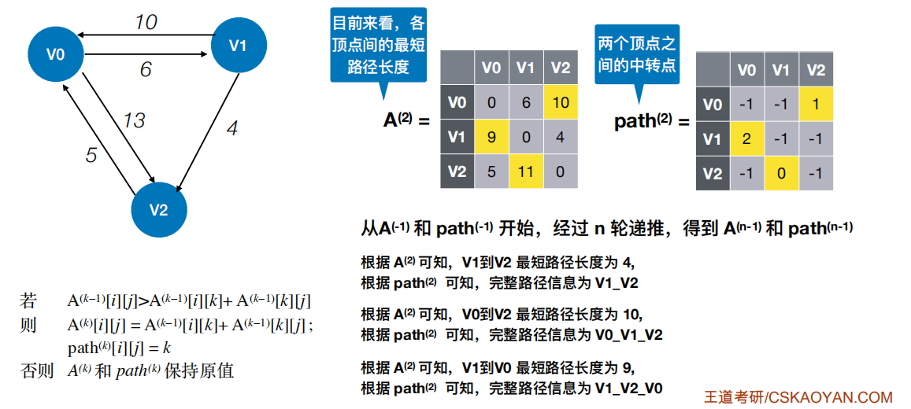
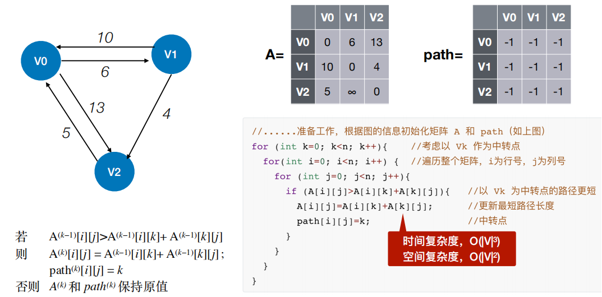

<table>
<colgroup>
<col style="width: 100%" />
</colgroup>
<thead>
<tr class="header">
<th>
Floyd算法：求出每⼀对顶点之间的最短路径

使⽤动态规划思想，将问题的求解分为多个阶段

对于n个顶点的图G，求任意⼀对顶点 Vi —&gt; Vj 之间的最短路径可分为如下⼏个阶段：

#初始：不允许在其他顶点中转，最短路径是？

<strong>#0：若允许在 V0 中转，最短路径是？</strong>

<strong>#1：若允许在 V0、V1 中转，最短路径是？</strong>

<strong>#2：若允许在 V0、V1、V2 中转，最短路径是？</strong>

<strong>…</strong>

<strong>#n-1：若允许在 V0、V1、V2 …… Vn-1 中转，最短路径是？</strong>
</th>
</tr>
</thead>
<tbody>
</tbody>
</table>
Floyd 算法不能解决带有“负权回路”的图（有负权值的边组成回路），这种图有可能没有最短路径

过程

核心代码

