核心：
**拓扑排序：找到做事的先后顺序**
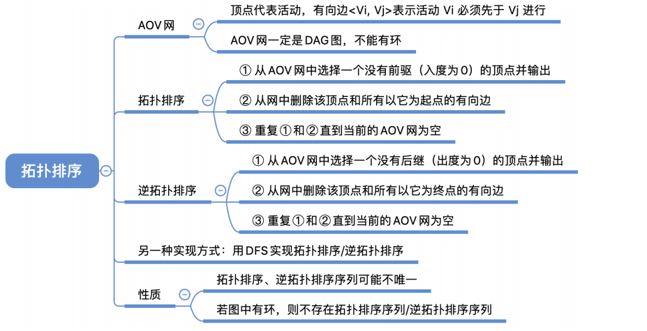
1，AOV概念
AOV⽹(Activity On Vertex NetWork，⽤顶点表示活动的⽹)： ⽤DAG图（有向⽆环图）表示⼀个⼯程。
**顶点表示活动**，有向边\<Vi, Vj\>表示活动**Vi必须先于活动Vj**进⾏
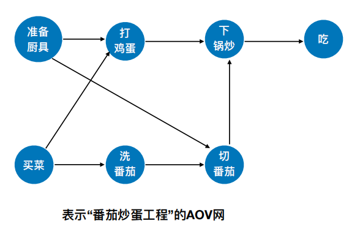

2，拓扑排序：**找到做事的先后顺序**
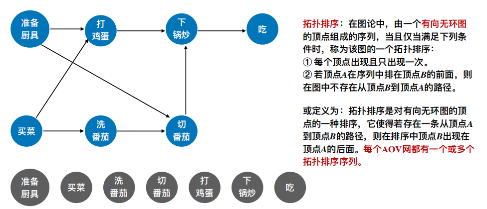

拓扑排序不唯一

3，拓扑排序的实现：
① 从AOV⽹中选择⼀个没有前驱（**⼊度为0）的顶点**并输出。
② 从⽹中删除该顶点和所有以它为起点的有向边。
③ 重复①和②直到当前的**AOV⽹为空**或**当前⽹中不存在⽆前驱的顶点**为⽌。【说明有回路】

4，对有回路的图进行拓扑排序
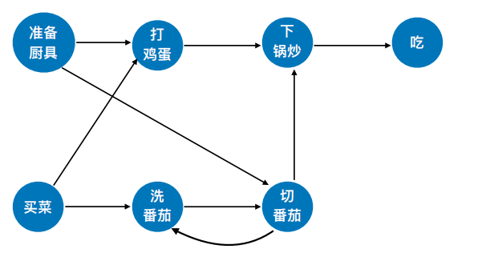

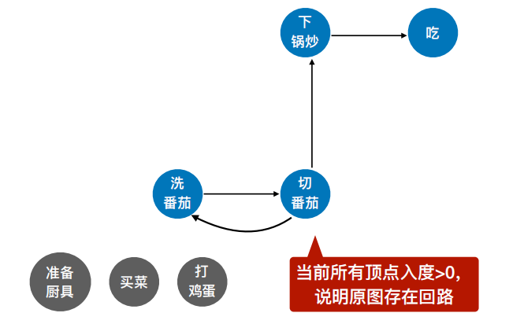

5，代码
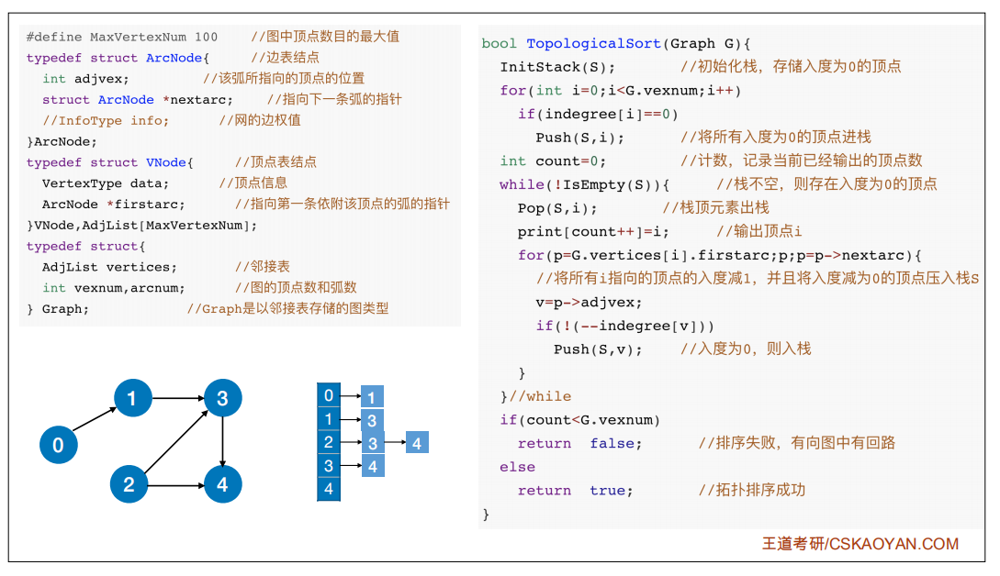

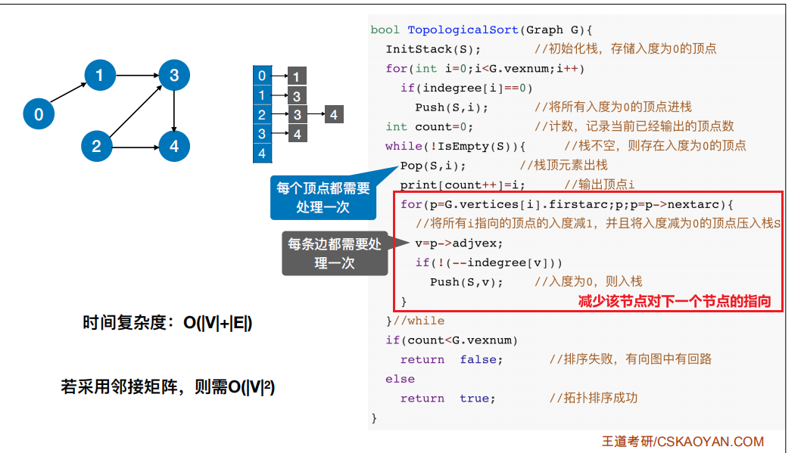

6，逆拓扑排序

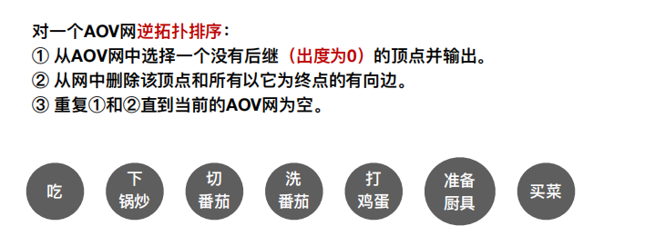

7，代码实现
7.1
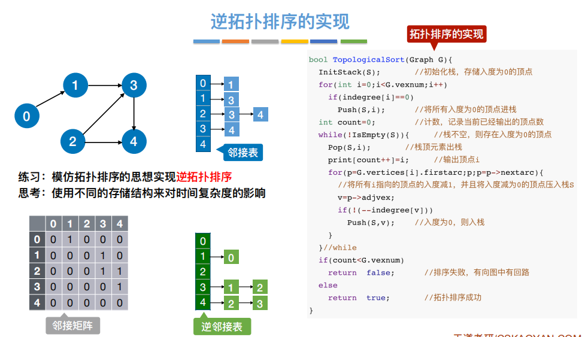

<table>
<colgroup>
<col style="width: 100%" />
</colgroup>
<thead>
<tr class="header">
<th>
1

</th>
</tr>
</thead>
<tbody>
</tbody>
</table>

7.2逆拓扑排序的实现（DFS算法）

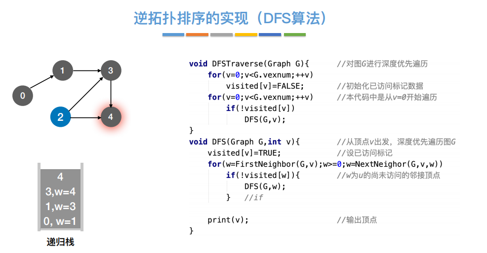

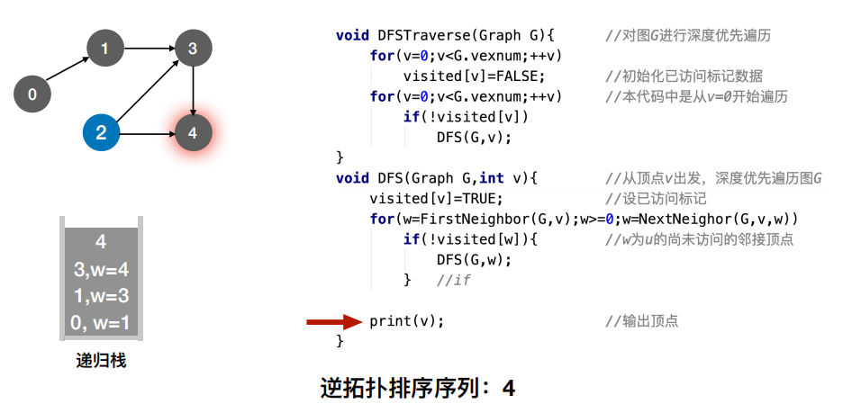

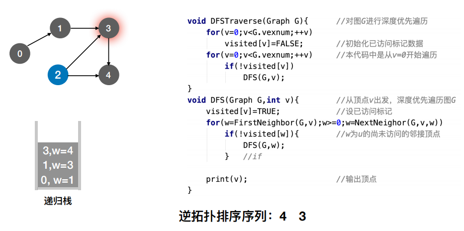

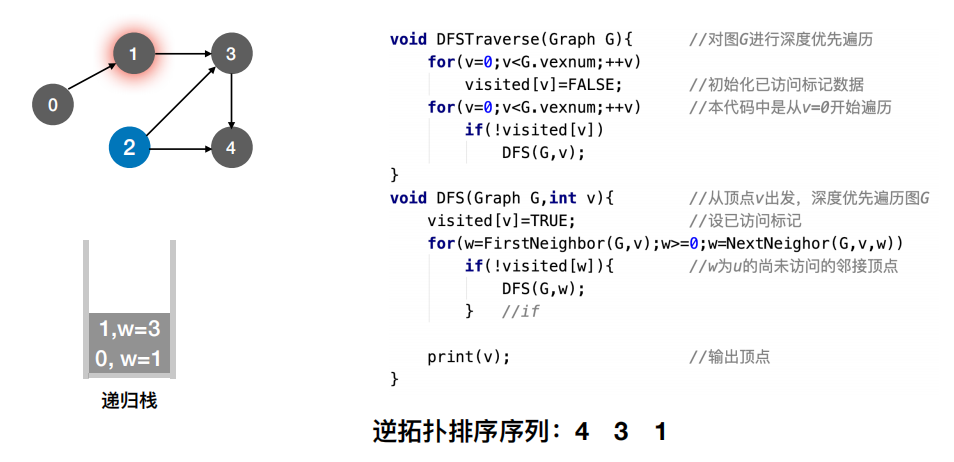

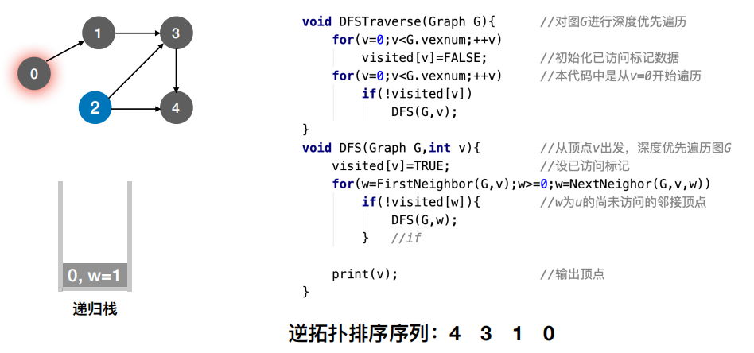

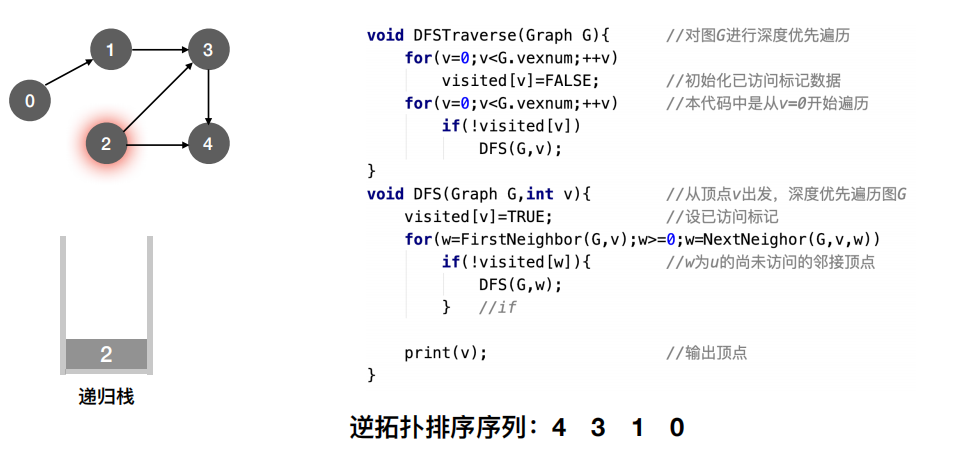

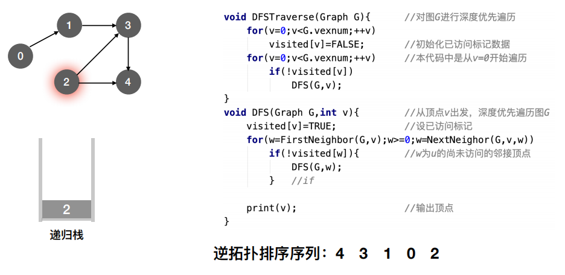

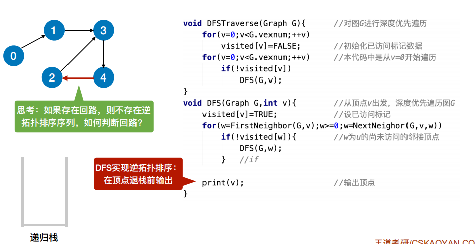
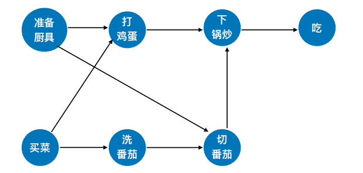
