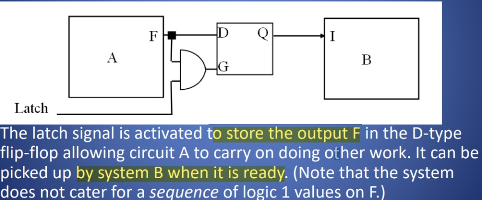
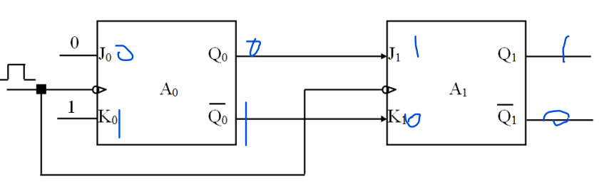
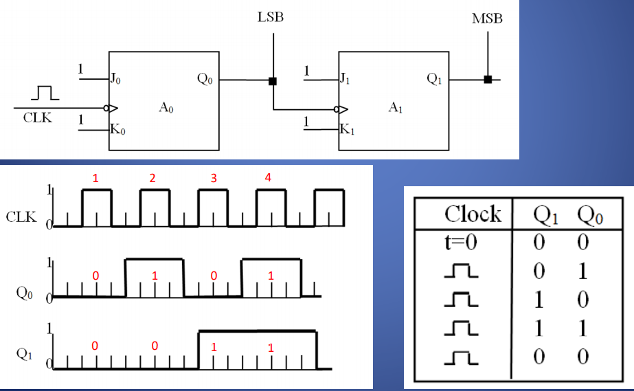
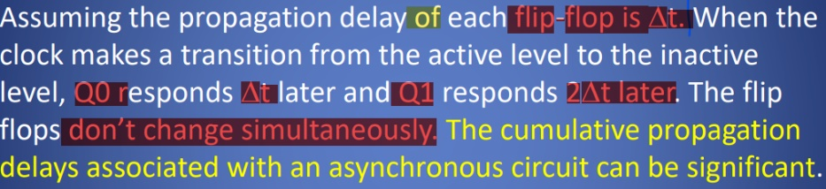
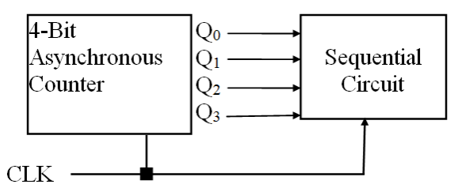
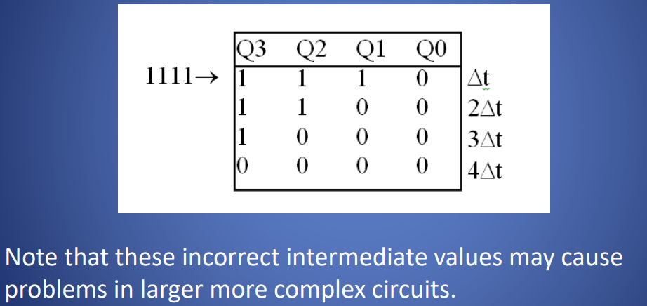
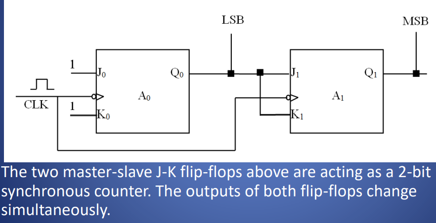
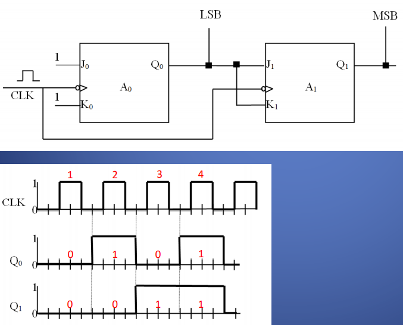
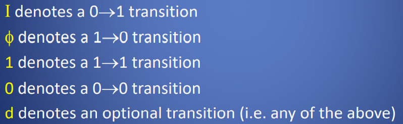

一、Applications of Flip-Flops
1，Example 1 - Data Latching

2，register
A register is a **group of flip-flops** connected together and operated as a
unit.
Each bit of the register is implemented as a flip-flop cell

Flip-Flop Transfers for Bit-Wise Shifting触发传输按位移动

In magnitude terms, a shift operation can be to the left (LSB to
MSB) or to the right (MSB to LSB).
**左×右÷**
Shifting to the right is the same as dividing the binary value by 2.
Shifting to the left is the same as multiplying by 2.

3，Shift Registers
a right shift operation takes place on a 4-bit register. Note that the value 0 has been used to replace the Most-Significant-Bit (MSB) and the least significant bit value has
been lost from the register.
| 0     | 1   | 1   | 0   |
|-------|-----|-----|-----|
| **0** | 0   | 1   | 1   |

二
Exp3，- Asynchronous Counter

**Note that the frequency of Q1 is half that of Q0**
.
1,Asynchronous Counter – Cumulative Propagation Delay

2,

If each flip-flop represented a **50ns propagation delay,** this
asynchronous counter circuit would have a **200ns propagation**
delay. The time delay between clock pulses must be longer than
this for correct operating sequence. This makes the circuit
slower

3,In the example above, consider the counter changing from 1111 to 0000 after a clock pulse occurs.

三、Synchronous Sequential Circuits
When all clocked flip-flops in a digital system have
**their clock lines connected to the same clock source**, the circuit
is said to be a synchronous circuit.

Example 4 - Synchronous Counter

1，

