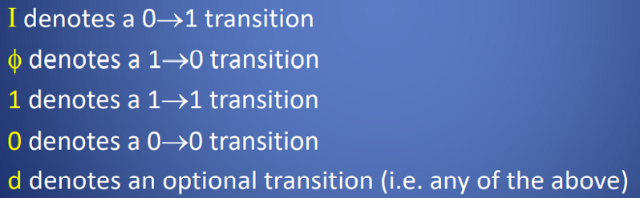

**步骤**
**1，state diagram**
**2，state table,列出下一个状态**

**3,Secondary Assignment**
**4，根据secondary assignment画出transition，根据**
| **0--》1** | **表示I，** |
|------------|-------------|
| **1--》0** |            |
**5，画Excitation Equations**

**6，circuit**
<table>
<colgroup>
<col style="width: 100%" />
</colgroup>
<thead>
<tr class="header">
<th>
1. Construct a State Diagram.

2. Convert State Diagram to a State/Output Table.

3. Eliminate Redundant States, if any, giving a Reduced State Table.

4. Make Appropriate Secondary State Assignment.

5. Derive Transition Table.

6. Derive Generic Circuit Excitation Table.

7. Choose Flip-Flop Type and Derive Excitation Equations from rules.

8. Derive Output Equations using Reduced State Table and Secondary

Assignments.

9. Construct Circuit Schematic.
</th>
</tr>
</thead>
<tbody>
</tbody>
</table>
一，- Design a Synchronous Modulo**-4 Counter**

1，state diagram

2，state table,列出下一个状态

3,Secondary Assignment

4，根据secondary assignment画出transition，根据
| 0--》1 | 表示I，                                                                                                               |
|--------|-----------------------------------------------------------------------------------------------------------------------|
| 1--》0 |  |

5，画Excitation Equations

1
6，circuit

**Design a Modulo-5 Synchronous Counter**
5个状态，用3个flipflop是八个状态，多出来的指向原始状态

<table>
<colgroup>
<col style="width: 10%" />
<col style="width: 89%" />
</colgroup>
<thead>
<tr class="header">
<th>1，state diagram</th>
<th>

</th>
</tr>
</thead>
<tbody>
<tr class="odd">
<td>2，state table,列出下一个状态</td>
<td></td>
</tr>
<tr class="even">
<td>3,Secondary Assignment</td>
<td>

</td>
</tr>
<tr class="odd">
<td>4，根据secondary assignment画出transition</td>
<td>

</td>
</tr>
<tr class="even">
<td>5，画Excitation Equations</td>
<td>

</td>
</tr>
<tr class="odd">
<td>6，circuit</td>
<td></td>
</tr>
</tbody>
</table>

二、

<table>
<colgroup>
<col style="width: 16%" />
<col style="width: 83%" />
</colgroup>
<thead>
<tr class="header">
<th>1，state diagram</th>
<th>

</th>
</tr>
</thead>
<tbody>
<tr class="odd">
<td>2，state table,列出下一个状态</td>
<td>

</td>
</tr>
<tr class="even">
<td>3,Secondary Assignment</td>
<td>

</td>
</tr>
<tr class="odd">
<td>4，根据secondary assignment画出transition，</td>
<td></td>
</tr>
<tr class="even">
<td>5，画Excitation Equations</td>
<td></td>
</tr>
<tr class="odd">
<td>6，circuit</td>
<td>

</td>
</tr>
</tbody>
</table>

三、Design a 3-bit **Right** Shift Register

<table>
<colgroup>
<col style="width: 9%" />
<col style="width: 90%" />
</colgroup>
<thead>
<tr class="header">
<th>1，state diagram</th>
<th>

</th>
</tr>
</thead>
<tbody>
<tr class="odd">
<td>2，state table,列出下一个状态</td>
<td>

</td>
</tr>
<tr class="even">
<td>3,Secondary Assignment</td>
<td>

</td>
</tr>
<tr class="odd">
<td>4，根据secondary assignment画出transition，</td>
<td>

</td>
</tr>
<tr class="even">
<td>5，画Excitation Equations</td>
<td></td>
</tr>
<tr class="odd">
<td>6，circuit</td>
<td>

</td>
</tr>
</tbody>
</table>

