一、Binary Multiplication
shifting each partial product to the left is the same as shifting the "sum so far" to the right and adding the multiplicand to the MSB's

1，方法一：shifting each partial product to the left
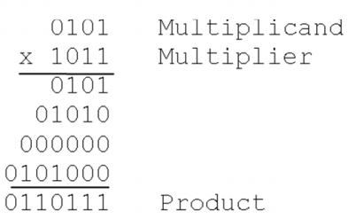
,

方法二：shifting the "sum so far" to the right and adding the multiplicand to the MSB's

具体
<table>
<colgroup>
<col style="width: 83%" />
<col style="width: 16%" />
</colgroup>
<thead>
<tr class="header">
<th>乘数位是1，形成partial product</th>
<th></th>
</tr>
</thead>
<tbody>
<tr class="odd">
<td>乘数位是1，下一个partial product 是上一位partial product右移一位后加被乘数的结果</td>
<td>

</td>
</tr>
<tr class="even">
<td>乘数位是0，下一个partial product 是上一位partial product右移一位后的结果</td>
<td>

</td>
</tr>
<tr class="odd">
<td>乘数位是1，下一个partial product 是上一位partial product右移一位后加被乘数的结果</td>
<td>
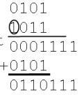

</td>
</tr>
</tbody>
</table>

2，Hardware for 4-bit multiplication
<table>
<colgroup>
<col style="width: 45%" />
<col style="width: 54%" />
</colgroup>
<thead>
<tr class="header">
<th>累加器accumulator 和寄存器 register R1 连接在一起</th>
<th>
can act synchronously as an 8-bit right shift register to store the

full product
</th>
</tr>
</thead>
<tbody>
</tbody>
</table>

步骤
1，如果R1的最右边是1，把R2加入Acc，如果是0则不作为
2，右移【Acc，R1】
3，重复4次

结果
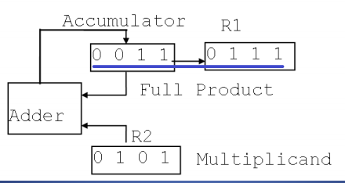

二、Binary Division
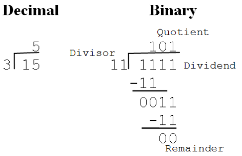

1,思路
1)必须在每次迭代中尝试从被除数的上半部分做除数的试减。
2)如果减法得到的结果是负数，则可以用加法还原该结果， 并使用更多的被除数，从而得到一个较小的商数。
3)注意除数必须与被除数的 MSB 对齐开始。

2，电路设计11 divided by 4 = ?
使用前：五位，最开始的表示符号位
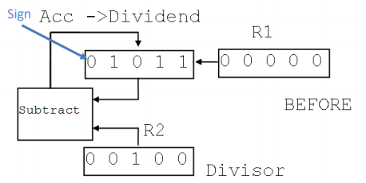
使用后
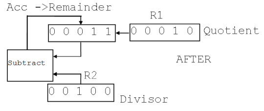

3，basic step
<table>
<colgroup>
<col style="width: 45%" />
<col style="width: 54%" />
</colgroup>
<thead>
<tr class="header">
<th>
*先对其MSB，【重复次数：如果除数小于或等于被除数，并左移 n 位以对齐 1，则基本步 骤重复 n+1 次。】

1，ANS=Acc(dividend被除数)-R2(divisor除数)

2，如果ANS&lt;0,则

<blockquote>

(1) 把R2加进Acc

(2)【Acc,R1】左移

(3) 把R1的最左边一位填充为0

</blockquote>

否则

<blockquote>

(1) 把【Acc,R1】左移

(2) 用1来补充R1的最后一位

</blockquote>

重复次数：如果除数小于或等于被除数，并左移 n 位以对齐 1，则基本步 骤重复 n+1 次。
</th>
<th>
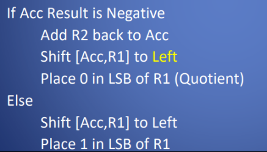

</th>
</tr>
</thead>
<tbody>
</tbody>
</table>

3，To **adjust the magnitude of the remainder**, the Accumulator should be shifted right 2+1 times to counter the number of shift left operations.

注意
如果初始除数\< =被除数，基本步骤只执行 1 次或更多 次。
重复基本步骤的额外次数取决于除数移位了多少位，以便与 被除数的MSB对齐。
如果除数小于或等于被除数，并左移 n 位以对齐 1，则基本步 骤重复 n+1 次。

例子：15/3
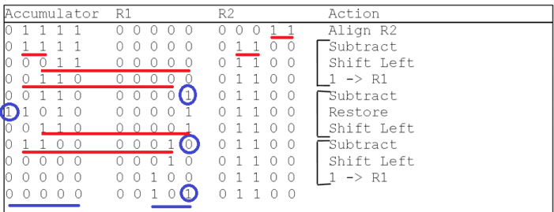
余数处理

四、 Floating Point Arithmetic
1，整数算术(和定点算术)可用于表示一个常规范围的值，该范围 内的一个值和下一个值之间的间隙相等。

Integers are represented internally using either sign-magnitude, or two's complement form. (

2，非常大的数字或非常小的分数不能用这种方法表示，除非求助于巨 大的比特长度。

此外，除法可以产生任意长的商，整数/定点表示法的精度只能近似 于结果，因为所有数字的比例因子都是相同的。

与相同位长的整数相比，**浮点运算运算的动态范围要大得 多**。可以在合理大小的数字字段中表示非常大和非常小的数 字。

注意X包括符号

就像整数一样，由于数字存储在固定大小的格式中，所以运算的精度 是有限的，**但是浮点格式大大扩展了这种精度的限制**。

**有限精度意味着超过精度限制的数字必须截断或四舍五入**，以在允 许的有效位数内提供有限精度。 整数和浮点数的格式不同，因此在处理器中使用不同的功能单 元。

五、浮点数运算标准格式

<table>
<colgroup>
<col style="width: 49%" />
<col style="width: 50%" />
</colgroup>
<thead>
<tr class="header">
<th></th>
<th>

</th>
</tr>
</thead>
<tbody>
</tbody>
</table>

1，IEEE表示
第一位表示符号：0正1负
<table>
<colgroup>
<col style="width: 42%" />
<col style="width: 57%" />
</colgroup>
<thead>
<tr class="header">
<th>
（1）32-bit

指数存储在 1 到 8 位中。尾数存储在位 9..31 的 23 位字段 中。

一个 8 位的指数允许 256 【1111 1111】个不同的指数值。指数以有偏形式存储。 从字段中减去一个称为偏差的固定值，从而得到真正的指数 值。当偏差为 127 时，真实的指数值被解释为-127 到+128 的范 围。当存储时，字段将保持范围为 0..255 的二进制数量级值。
</th>
<th>

</th>
</tr>
</thead>
<tbody>
</tbody>
</table>

（2）64-bit
<table>
<colgroup>
<col style="width: 42%" />
<col style="width: 57%" />
</colgroup>
<thead>
<tr class="header">
<th>
64 位浮点数格式如下，指数 11 位，尾数 52 位

</th>
<th></th>
</tr>
</thead>
<tbody>
</tbody>
</table>
2，浮点算术标准化

最左永远是1
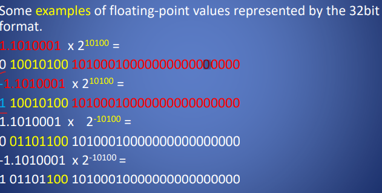

3，
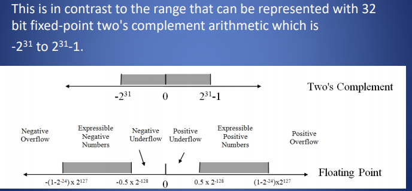

Underflow occurs when the fractional magnitude is too small to be represented accurately by the number of bits in the mantissa. Underflow can be approximated by zero.
当小数量级太小，尾数中的位数不能准确地表示时，就会发生欠流。底 流量可近似为零。

Overflow occurs when the magnitude of the number is greater than can be expressed with the number of bits in the exponent. This is an error situation
当数字的大小大于指数中的位数时，就会发生溢出。这是一个错误的情

The size of the exponent field determines the dynamic range. i.e. the gap between successive numbers varies with the magnitude of the exponent.

3，注意沿着数轴的分布是不均匀的。密度更接近 0，随着你的移 动，密度更宽，精度更低。这是浮点运算的一种折衷。

<table>
<colgroup>
<col style="width: 59%" />
<col style="width: 40%" />
</colgroup>
<thead>
<tr class="header">
<th>
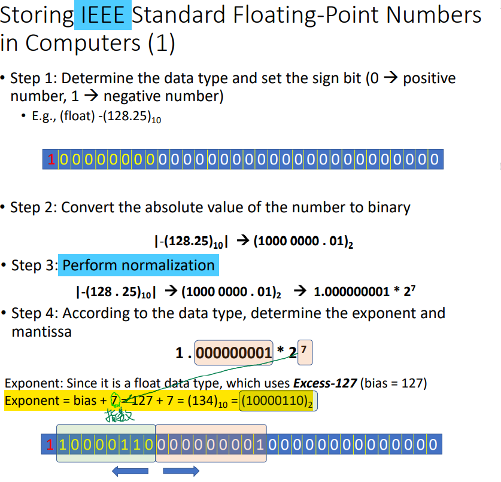

</th>
<th>
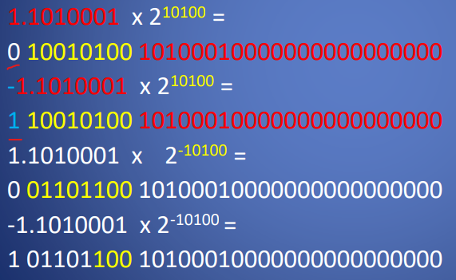

</th>
</tr>
</thead>
<tbody>
</tbody>
</table>

五、浮点数运算
1，Addition and Subtraction
1\. Check for zeros.
2\. Align the mantissas对齐尾数
3\. Add or subtract the mantissas. .加减尾数
4\. Normalize the result.标准化结果。

2，Multiplication and division不用对齐尾数
2.1乘法
如果任意一个操作数为 0，则返回 0。

<u>指数相加</u>。如果指数是有偏的，指数和将使偏差加倍，所以偏差 必须被减去。

将有符号尾数相乘，产生的结果可以是乘数和被乘数长度的两倍。
然后将结果进行标准化和四舍五入
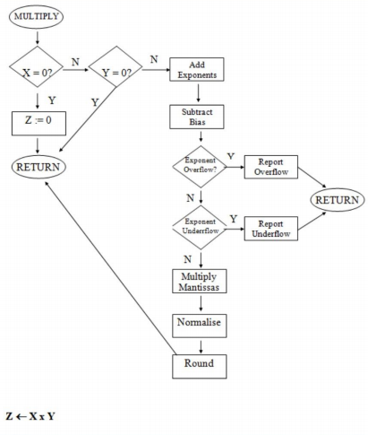

2.2 除法
If dividend is 0, then 0 is returned. If divisor is 0, infinity (error) is returned.

Subtract the exponents. This removes the bias which must be added back.

The signed mantissas are divided.

The result is then normalized and rounded.
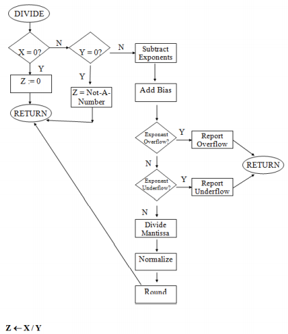

