19&20
2020年12月25日
9:26

一、校验原理
1，码字：若干位代码组成的一个字
将两位码字逐位对比，具有不同的位的个数称为两个码字间的距离
一种编码具有若干个合法码字，各合法码字的最小距离称为“码距”
码距=2，有检错能力
码距=3，可能有纠错能力
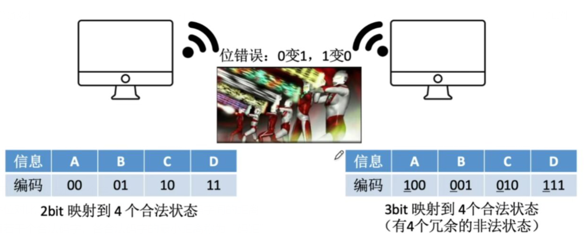

二、奇偶校验
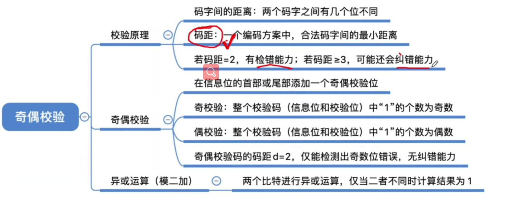
1，在首部或者尾部添加一个奇偶校验位
奇校验码：整个校验码（有效信息位+校验位）中1的个数为奇数
偶校验码：整个校验码（有效信息位+校验位）中1的个数为偶数
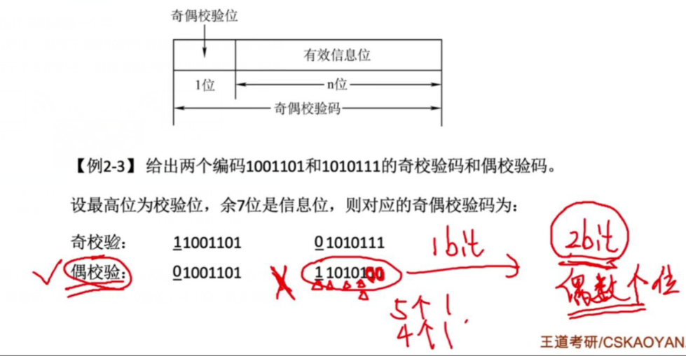

用异或求出编码的偶校验位
用异或求出奇偶校验码的偶检验（结果为1出错）
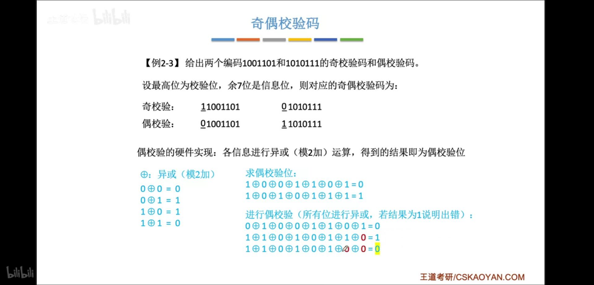

2，当奇偶校验码码距=2 只能检测出奇数位错误，没有纠错能力

三、汉明码（海明码）
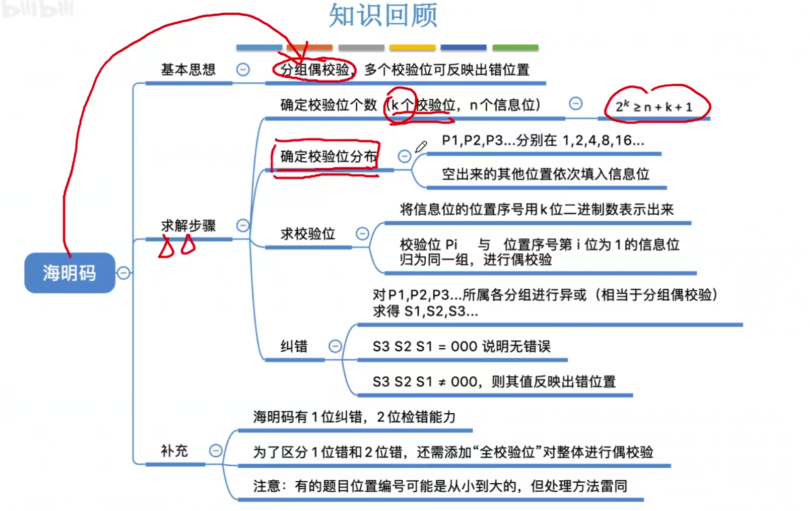
1，思路：将信息位分组进行奇偶校验--》多个校验位--》多个校验位标注出错位置
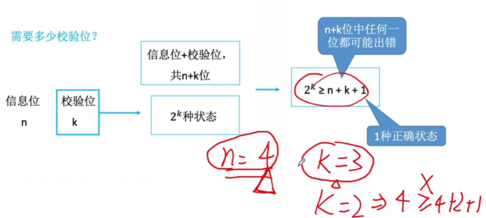

2，求解步骤
Step1：确定海明码位数
Step2：确定校验位分布
Step3：求校验位的值
Step4：纠错
Step5: 全偶校验

Step1：确定海明码位数
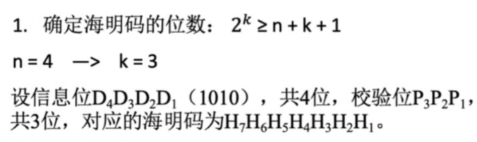
Step2：确定校验位分布【注意大--》小还是小--》大】
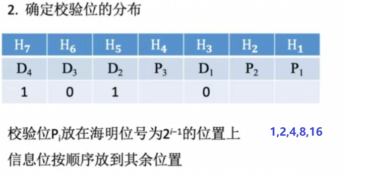
Step3：求校验位的值
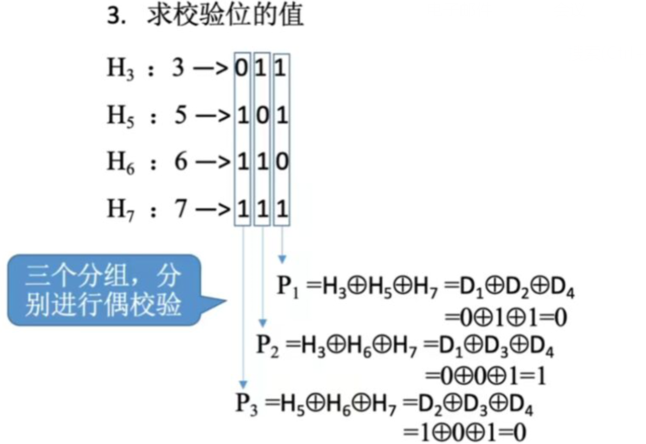
Step4：纠错
右边的三个圆圈是互相牵连的原理
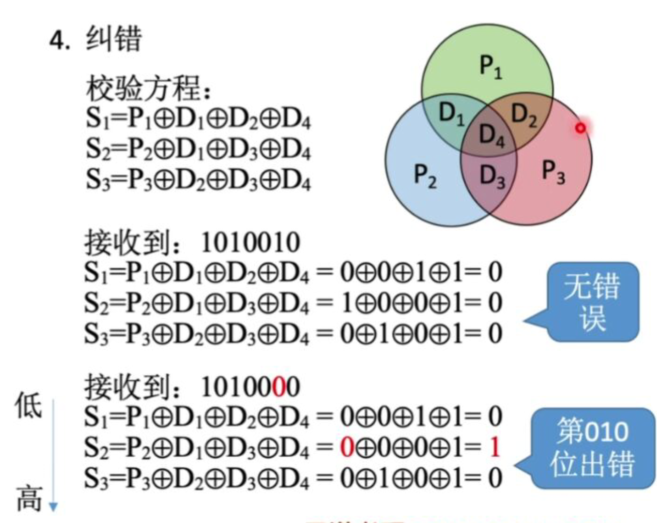

若S1S2S3=010 --》则第010位出错--》H2出错
若S1S2S3=011 --》则第110位出错--\>H6出错

Step5: 全偶校验
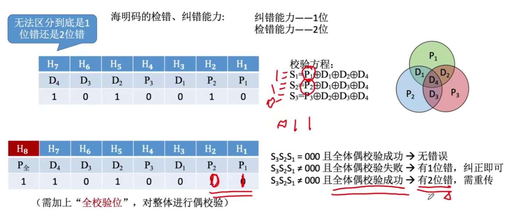

