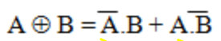
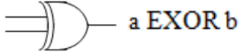

一、布尔代数
1，Boolean Algebra defines a set of laws, operations and theorems on the set of elements **{0, 1}**.

Algebra will **allow us to describe a circuit as a mathematical**
**expression**, as a functional specification of its outputs in terms of
its inputs.
It will allow us to **manipulate the functional specification** for the
purposes of simplification of a circuit reducing the number of
logic gates required to implement it.
Algebra will help us **substitute alternative implementation**
**solutions for circuits** or parts of circuits that may require using
certain types of logic gates.

二、Boolean Operators
<table>
<colgroup>
<col style="width: 22%" />
<col style="width: 31%" />
<col style="width: 25%" />
<col style="width: 20%" />
</colgroup>
<thead>
<tr class="header">
<th>NAND【inverse of AND】</th>
<th></th>
<th></th>
<th>

1 NOT +2NANDs
</th>
</tr>
</thead>
<tbody>
<tr class="odd">
<td>NOR【inverse if OR】</td>
<td></td>
<td></td>
<td>

1 NOT +2 NORs
</td>
</tr>
<tr class="even">
<td>
XOR

(Exclusive OR)

</td>
<td>

<strong>同0异1</strong>
</td>
<td>

</td>
<td></td>
</tr>
<tr class="odd">
<td>
XNOR【inverse of XOR】

</td>
<td></td>
<td></td>
<td></td>
</tr>
</tbody>
</table>

三、Boolean Functions
1，形式

2，函数的对偶【dual of a function】
函数的对偶是通过将AND运算符改为OR AND得到的
反过来1和0的关系也是一样的。变量保持不变。

**3，The complement of a function**
方法1：**先求对偶function，再对每一个单独变量求bar**
**The complement of a function can be found by complementing**
**each variable in the dual of that function.**

**方法2：De Morgan:**
<table>
<colgroup>
<col style="width: 100%" />
</colgroup>
<thead>
<tr class="header">
<th>
<strong>1.bar all</strong>

<strong>2.bar each term</strong>

<strong>3.change the sign (*and +)</strong>
</th>
</tr>
</thead>
<tbody>
<tr class="odd">
<td>

</td>
</tr>
</tbody>
</table>

4，运算符优先级别
（）\>NOT\>AND\>OR

5
any Boolean function can in fact be expressed using only **OR and NOT** operators.
any Boolean function can in fact be expressed using only **AND and NOT** operators.
,Boolean functions can be implemented entirely using **only NAND gates or alternatively NOR gates**.

6，常用公式

<table>
<colgroup>
<col style="width: 33%" />
<col style="width: 66%" />
</colgroup>
<thead>
<tr class="header">
<th>单个变量</th>
<th>多个变量</th>
</tr>
</thead>
<tbody>
<tr class="odd">
<td>

</td>
<td></td>
</tr>
</tbody>
</table>

7，化简

四、Truth Tables
A truth table is a method of describing a Boolean function
1，SOP【找1】 和POS【找0】表示
n个变量，2的n次方行

<table>
<colgroup>
<col style="width: 8%" />
<col style="width: 15%" />
<col style="width: 68%" />
<col style="width: 7%" />
</colgroup>
<thead>
<tr class="header">
<th>SOP</th>
<th>minterm</th>
<th>

</th>
<th>
<strong>找1，</strong>

<strong>"."</strong>
</th>
</tr>
</thead>
<tbody>
<tr class="odd">
<td>POS</td>
<td>maxterm</td>
<td>

</td>
<td>
<strong>找0</strong>

<strong>"+"</strong>
</td>
</tr>
</tbody>
</table>

3，Principle of Duality 对偶性原则

4，真值表的n不宜过大

5，常用

