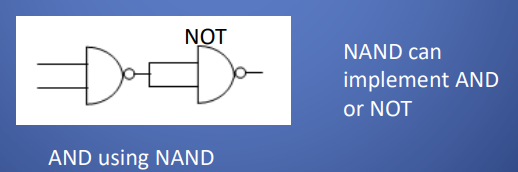
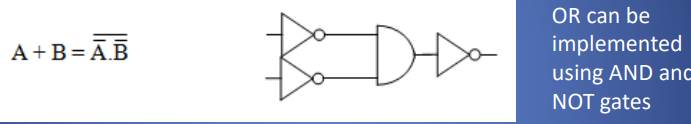
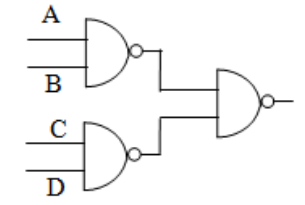
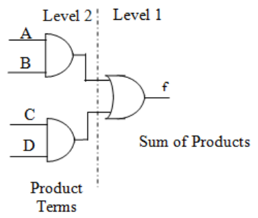
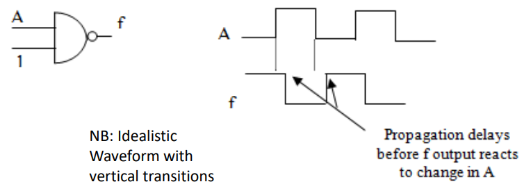
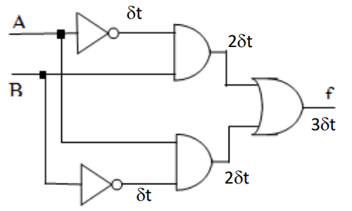
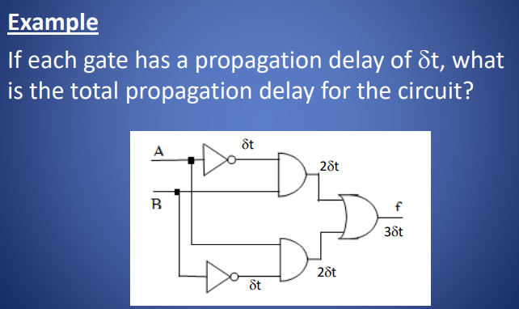
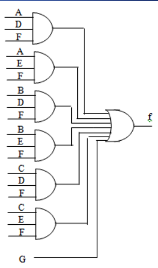
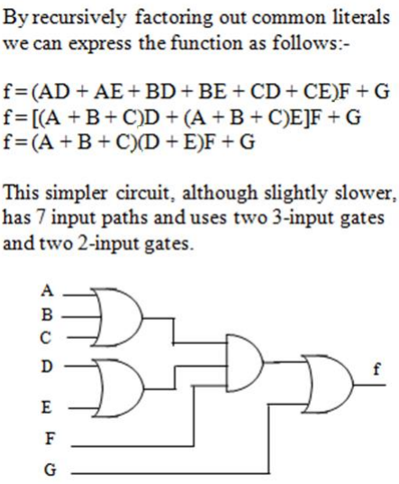

一、NAND Logic
【all Boolean functions can be expressed using NAND only】
Implementation of Sums-of-Products
1，

2，
<table>
<colgroup>
<col style="width: 45%" />
<col style="width: 54%" />
</colgroup>
<thead>
<tr class="header">
<th>

</th>
<th>

</th>
</tr>
</thead>
<tbody>
</tbody>
</table>

二、延迟问题Gate Propagation Delay
1，
**using combinations of semiconductor半导体 transistors.**
Each transistor switch takes a finite time to operate.

由于实现逻辑门所需的晶体管电路路径不同，与其他门相比，某些逻辑门的传播延迟可能略有不同。

2，
effects of gate propagation are cumulative.积累的

Generally, the **shorter** the signal path through the circuit, the faster the function can operate.

3，案例
If each gate has a propagation delay of dt, what is the total propagation delay for the circuit?

4，缓解延迟--Multilevel logic多级逻辑

4.1 限制门输入的数量

【电路复杂度通常用。来衡量所需的门数和门数】

limited to carrying out a fixed maximum number of function calculations per unit

time,

4.2电路路

the shorter the signal path through the circuit, the faster the function can operate

径。

尽量用较少的门和较短的路径

案例
1，

2，Consider the following function expressed as a minimal sum of products.
f(A,B,C,D,E,F,G) =ADF + AEF + BDF + BEF + CDF + CEF + G

