一、K-Maps
1，一种化简布尔代数式的方法，要Minimized Expressions
| 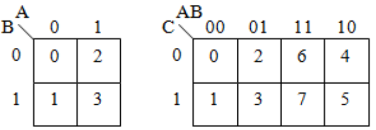                                                           |
|----------------------------------------------------------------------------------------------------------------------------------------------------------------------------------------------|
| 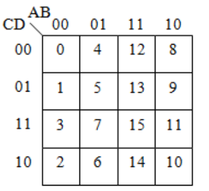 |
indices are labelled using a reflected **binary Gray code**

**2，格雷码**
<table>
<colgroup>
<col style="width: 86%" />
<col style="width: 13%" />
</colgroup>
<thead>
<tr class="header">
<th>
格雷码：格雷码属于可靠性编码，是一种错误最小化的编码方式

格雷码的构造方法为：

直接排列以二进制为0值的格雷码为第零项，

<strong>第一项改变最右边的位元，</strong>

<strong>第二项改变右起第一个为1的位元的左边位元，</strong>

第三、四项方法同第一、二项，如此反覆，即可排列出n个位元的格雷码。
</th>
<th>
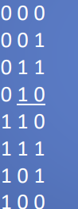

</th>
</tr>
</thead>
<tbody>
</tbody>
</table>

3,Implicant一类
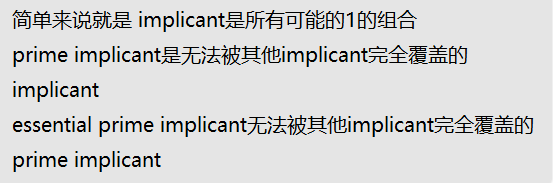

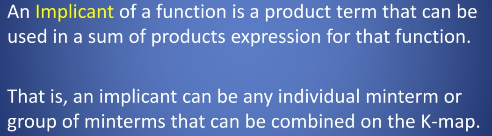
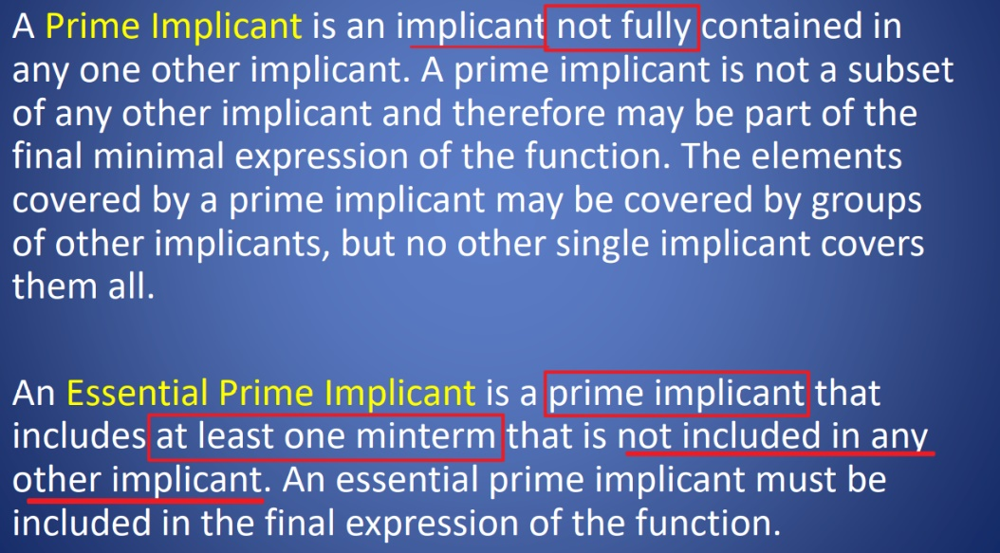

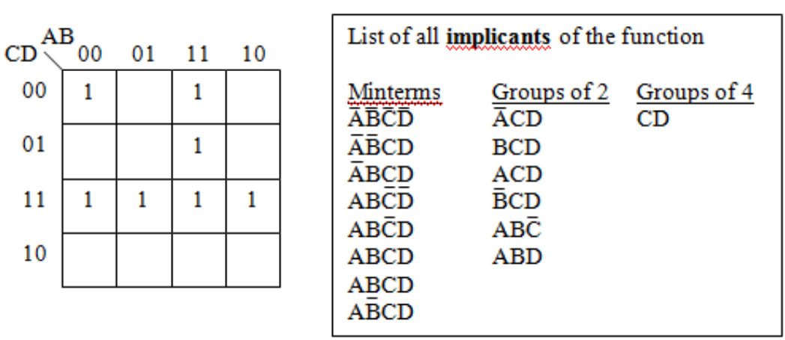

<table>
<colgroup>
<col style="width: 50%" />
<col style="width: 49%" />
</colgroup>
<thead>
<tr class="header">
<th>prime implicants</th>
<th>essential</th>
</tr>
</thead>
<tbody>
<tr class="odd">
<td>
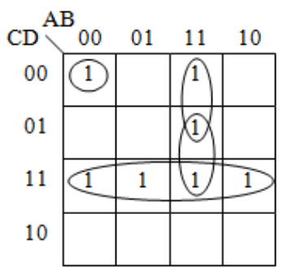

</td>
<td>
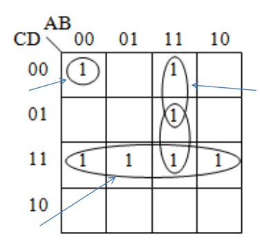

</td>
</tr>
</tbody>
</table>

4、K-maps案例
案例1

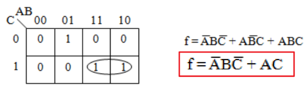

案例2
| 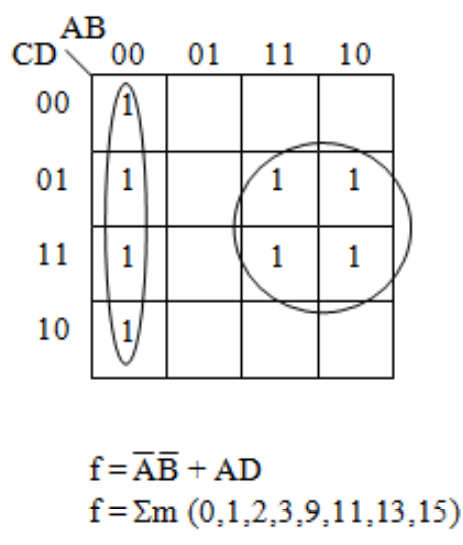 | 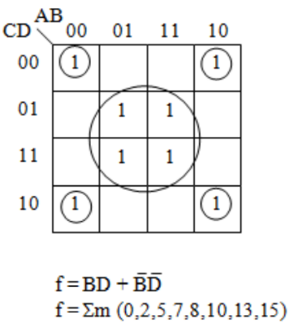 |
|----------------------------------------------------------------------------------------------------------------------------------------------------------------|-----------------------------------------------------------------------------------------------------------------------------------------------------------------|

案例3
<table>
<colgroup>
<col style="width: 84%" />
<col style="width: 15%" />
</colgroup>
<thead>
<tr class="header">
<th>
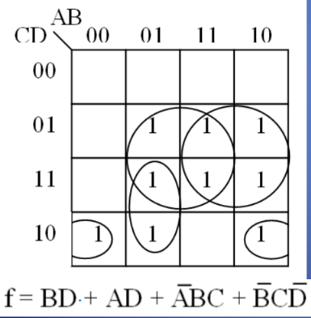

</th>
<th></th>
</tr>
</thead>
<tbody>
</tbody>
</table>

4，Don’t Care Terms on K-Maps
可0可1，对结果没有影响，用x来表示

案例
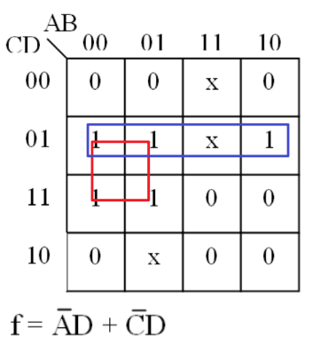

