一、半加器
1，半加法器
1.1 1-bit half adder circuit for adding two binary digits.
**SUM: XOR【保存本位的值】**
**Carry: AND【保存进位的值】**

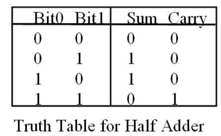
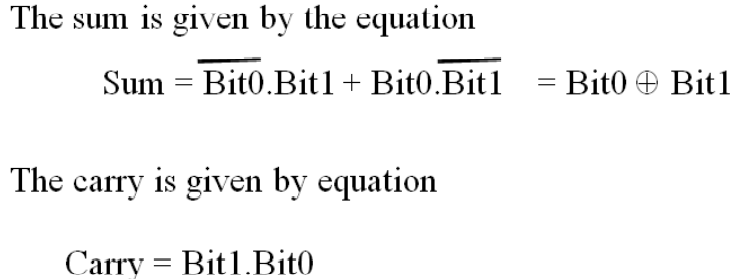

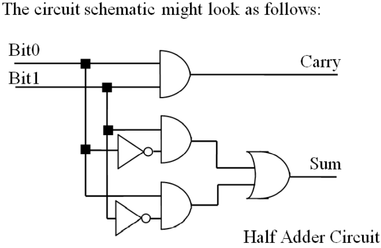
2缺点
Note that if there are several digits in the operands, **the half adder cannot account for carry-ins from lower bit positions.**
【如果操作数中有几个数字，半加法器不能计算较低位的进位。】

二，全加器
1定义
A full adder circuit is capable of adding two **1-bit** operands
and **a carry in from a previous bit position.用来保存bit0和bit1的值**

**2,电路**

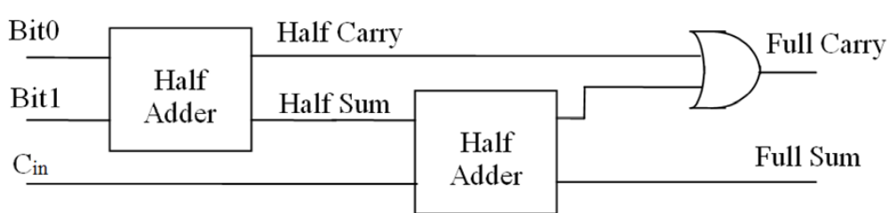

<table>
<colgroup>
<col style="width: 100%" />
</colgroup>
<thead>
<tr class="header">
<th>
A：加数

B：被加数

Cin：来自低位的进位

S：本位和

Co：向高位的进位
</th>
</tr>
</thead>
<tbody>
</tbody>
</table>

3，延迟问题
<table>
<colgroup>
<col style="width: 100%" />
</colgroup>
<thead>
<tr class="header">
<th>
What is the propagation delay of the full adder circuit,if each gate has a propagation delay of 10nsec?

</th>
</tr>
</thead>
<tbody>
<tr class="odd">
<td>
The longest path from inputs to outputs is in the calculation of the Full Sum.

This requires <strong>3 gate delays i</strong>n each half adder, so

the <strong>Full Sum becomes available after 60nsec.</strong>

The Full Carry becomes available <strong>after 50nsec</strong>. The maximum propagation

delay of the circuit is <strong>60nsec</strong>. The design involves <strong>13 gates</strong>
</td>
</tr>
</tbody>
</table>

| How many gates are needed in total? |
|-------------------------------------|
| The design involves 13 gates.       |

**重点**
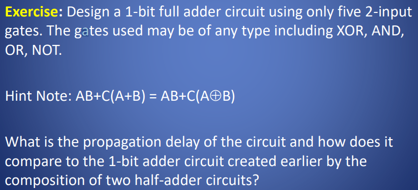

解答
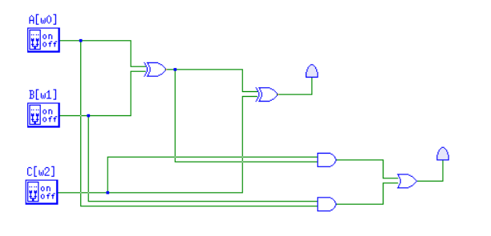
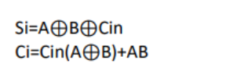

4，多位加法器
4.1 串行进位加法器【多个全加器组合】
4-bit Addition of A and B
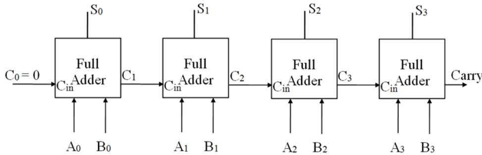

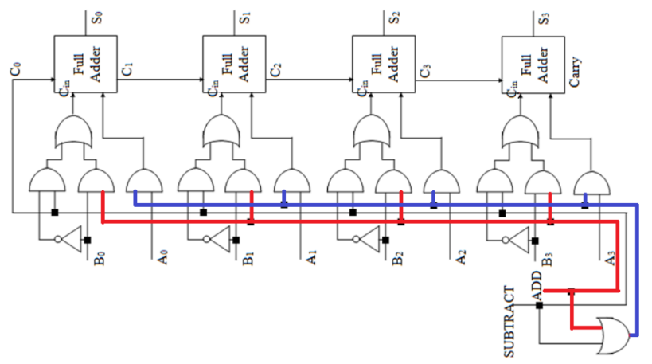

<table>
<colgroup>
<col style="width: 100%" />
</colgroup>
<thead>
<tr class="header">
<th>
特点：低位的输出=高位的输入

缺点：运算速度慢，有较大的传输延迟【前一位的计算结束才能把结果传给后一位】

若每个单位有ns延迟，则该四位加法器有4ns的延迟
</th>
</tr>
</thead>
<tbody>
</tbody>
</table>

The **delay** generated by **an n-bit adder is proportional to the length n of the two numbers A and B** that are added because each 1-bit full adder component cannot calculate its output until the carry from the previous bit position has propagated through.

**each bit position takes about three gate delays .** Two 32-bit numbers we are looking at a long propagation delay of about 96 gate delays before the adder computes the total sum of the numbers.

解决
Carry Look-Ahead Adder
4.2Carry Look-Ahead Adder超前进位加法器
【特点：simultaneously calculate all the carry bits 】

The design of the look-ahead carry generator involves two
Boolean functions named Generate and Propagate.

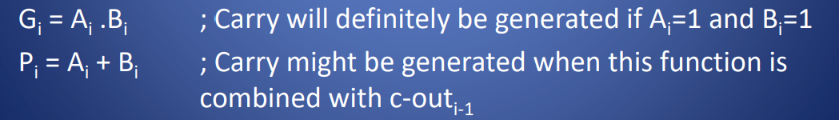

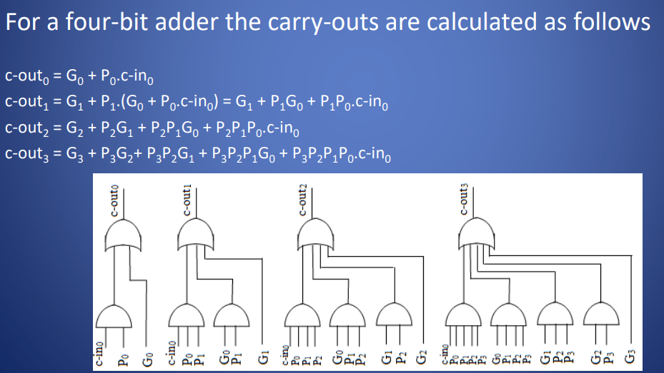
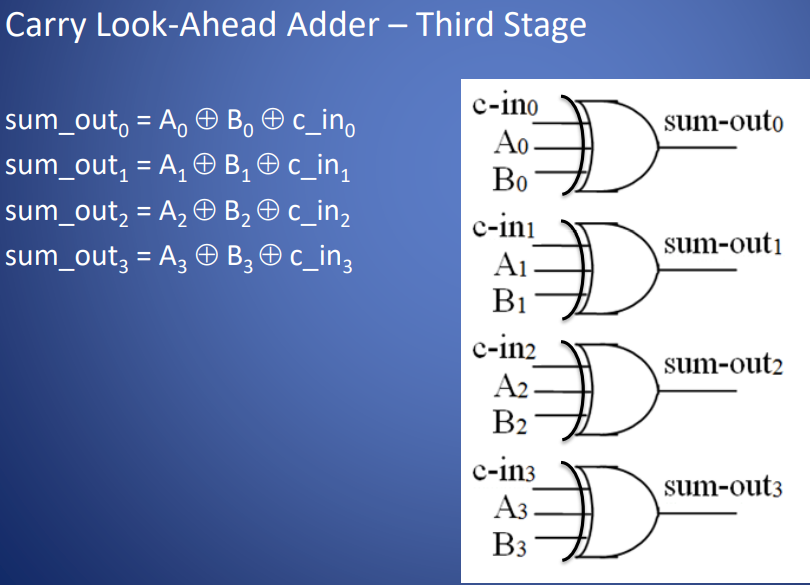

三、全减器
1，
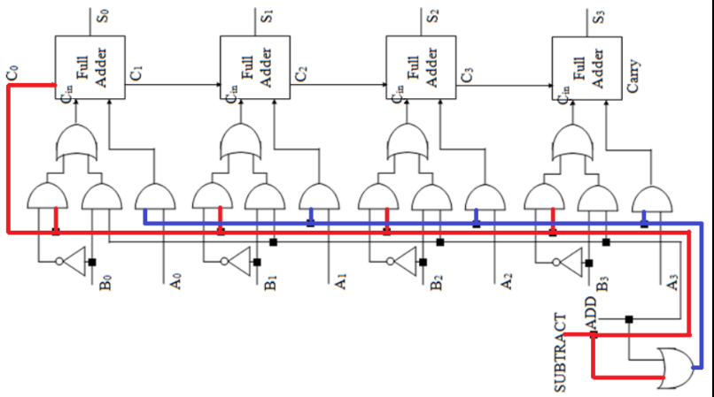

