**1，半加器**
缺点：只考虑了2位数，不全面，没有考虑到来自低位的进位
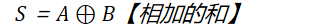
C0=AB【向高位进位】

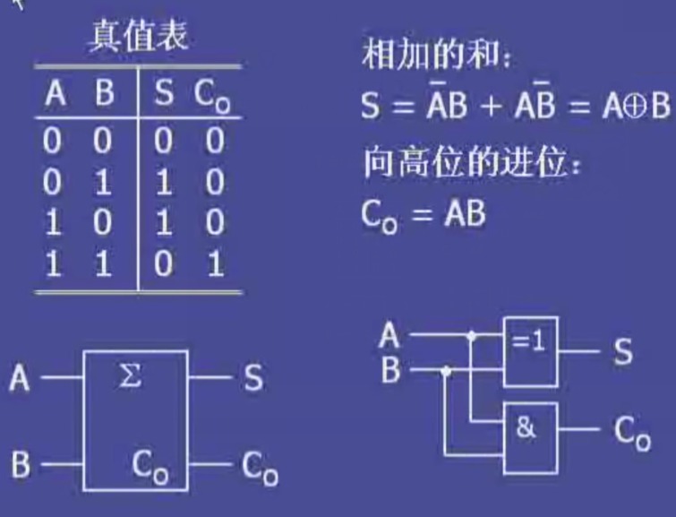

于是有了全加器，解决半加器的缺点【未考虑低位的进位】

**2，全加器**
A：加数
B：被加数
Cin：来自低位的进位

S：本位和
Co：向高位的进位

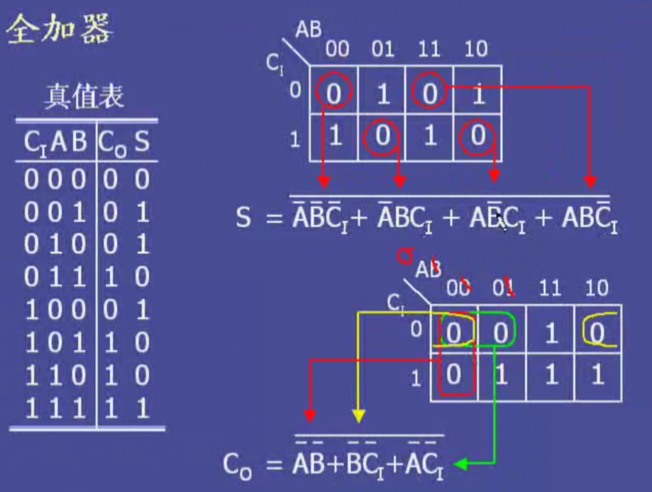

双位全加器
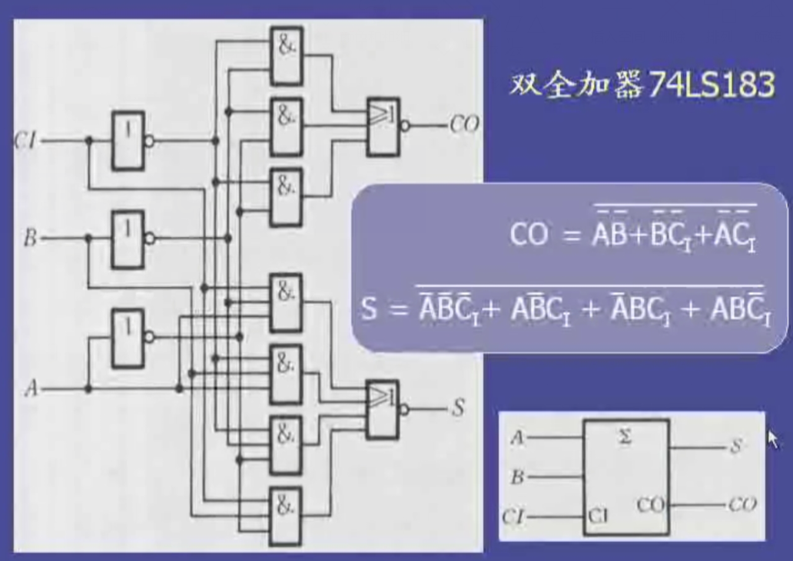

3，多位加法器
3.1 串行进位加法器【多个全加器组合】
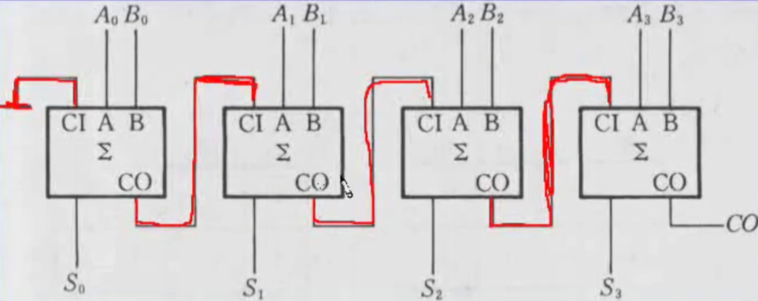
·
特点：低位的输出=高位的输入
缺点：运算速度慢，有较大的传输延迟【前一位的计算结束才能把结果传给后一位】
若每个单位有ns延迟，则该四位加法器有4ns的延迟
**Two's complement arithmetic can be used to construct an**
**adder/subtractor unit based on the ripple carry adder circuit.**

3.2 超前进位加法器【四位并行加法器】
同时进行运算
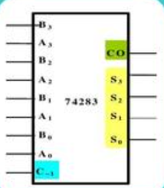
输入A，B【4位】
Ci是来自低位的进位
如果有进位，在Co输出
<table>
<colgroup>
<col style="width: 100%" />
</colgroup>
<thead>
<tr class="header">
<th>
A3 A2 A1 A0

+ B3 B2 B1 B0
</th>
</tr>
</thead>
<tbody>
<tr class="odd">
<td>S3 S2 S1 S0</td>
</tr>
</tbody>
</table>
如果有来自低位的进位，先和B【4位二进制数】相加，之后再和A进行加法运算
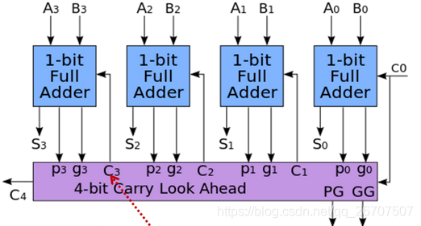
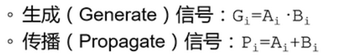
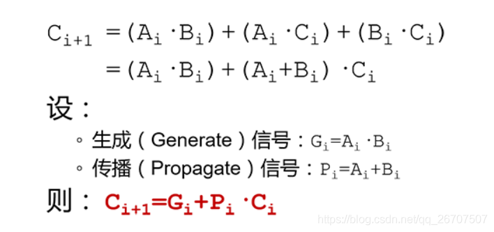
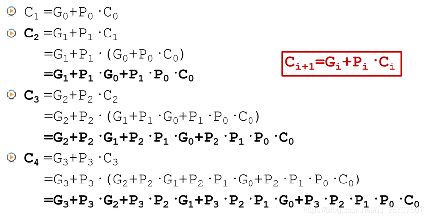
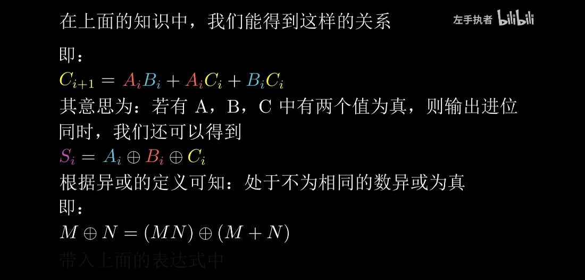
**A,B,C中有两个值同时为真，则同时输出进位**
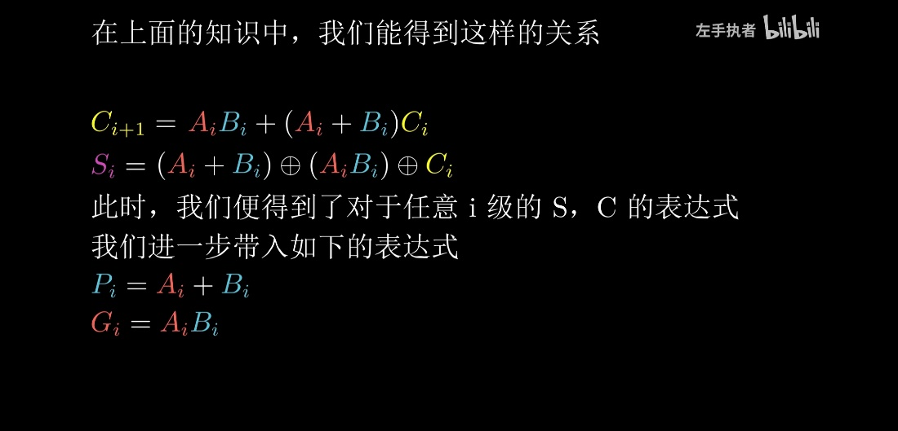

4，全减器
4.1 全减器是两个二进制的数进行减法运算时使用的一种运算单元，最简单的全减器是采用本位结果和借位来显示，二进制中是借一当二，所以可以使用两个输出变量的高低电平变化来实现减法运算。

4.2
全减器真值表如下：

其中Ai表示被减数，Bi表示减数，
Di表示本位最终运算结果，Ci表示低位是否向本位借位，Ci+1表示本位是否向高位借位。
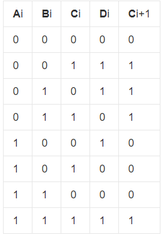

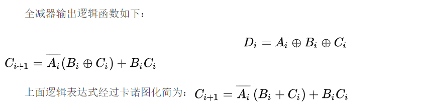
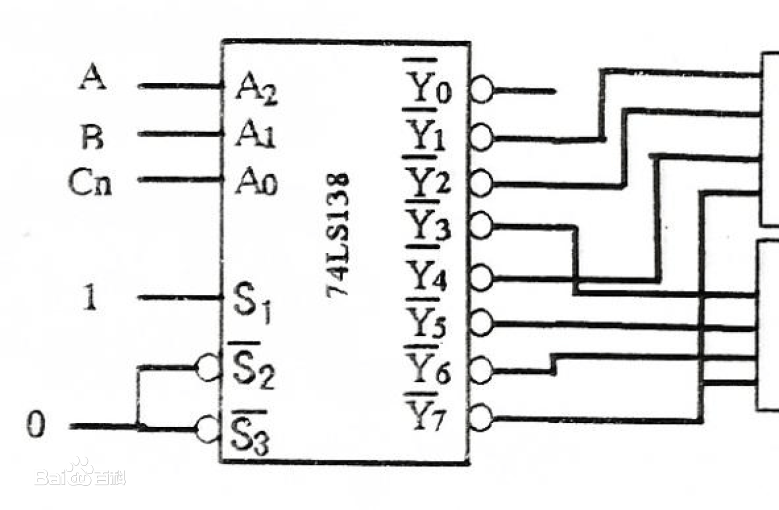

