7&8-信息传输和相关配件
2020年11月14日
9:11
一、Data Transmission
1，Data in digital systems is sometimes processed and transmitted in parallel

2，At very high signalling speeds, serial transmission may give higher performance than parallel transmission due to **synchronisation** and **crosstalk** problems with parallel signalling systems. 在非常高的信令速度下，由于并行信令系统的同步和串扰问题，串行传输可能比并行传输具有更高的性能。

3，devices share the signal wires

二、Multiplexers 数据选择器
1，一种更简单的方式做时分多路复用共享连接。是**一种连接许多输入以及共享一个输出的设备**。
它选择n个输入通道中的1个，并根据控制输入上的值将其路由到输出。
<table>
<colgroup>
<col style="width: 62%" />
<col style="width: 37%" />
</colgroup>
<thead>
<tr class="header">
<th>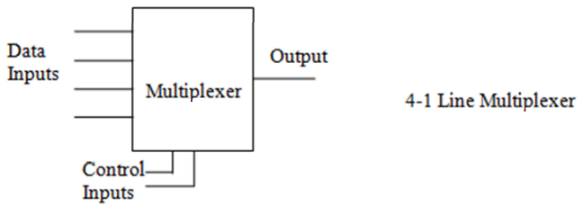</th>
<th>
内部结构

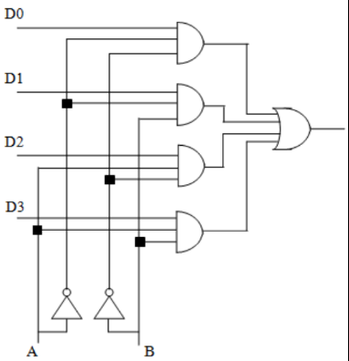
</th>
</tr>
</thead>
<tbody>
</tbody>
</table>

2,作用：用于信号的切换。
可用于共享数据源和它们被收集/发送和处理的地方之间的**单一电线连接**，节省互连成本，不需要网络协议或竞争硬件。
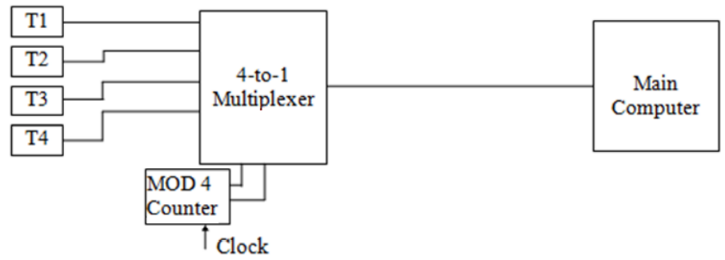
3，Multiplexer Applications
1，画出真值表，
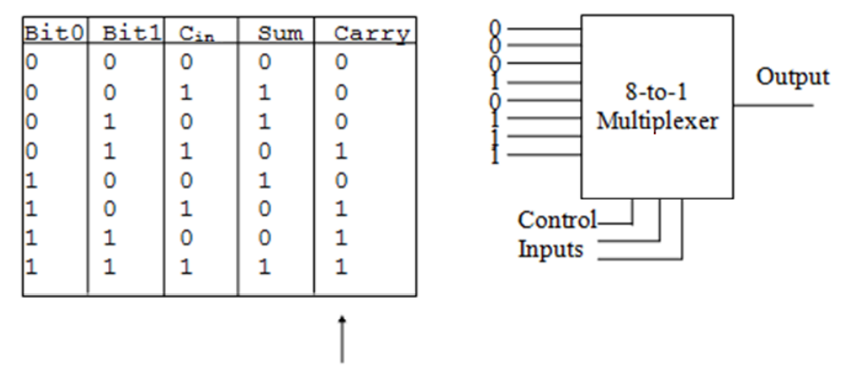
2，组合
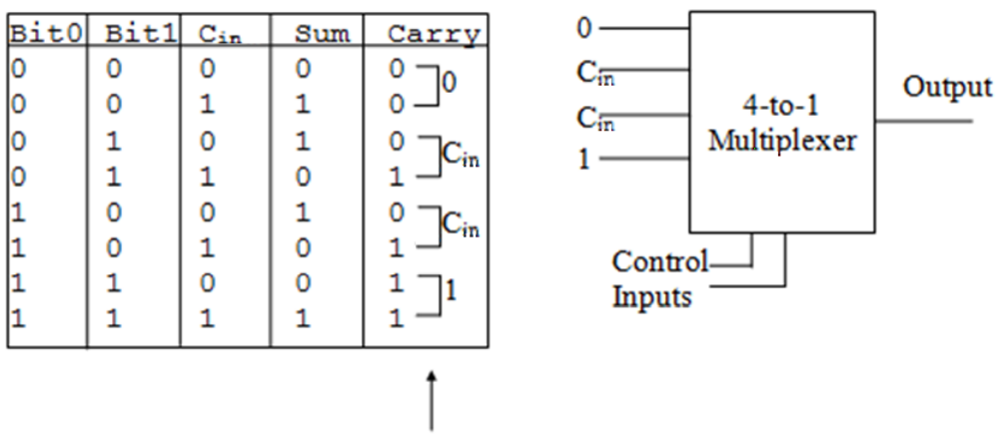
三、多路分配器Demultiplexer
1，能够将1个输入数据，根据需要传送到**m个输出端的任何一个输出端的电路**，叫做数据分配器，又称为多路分配器，
**其逻辑功能正好与数据选择器相反。**
| **数据选择器** | **选择n个输入通道中的1个，并根据控制输入上的值将其路由到输出** | **多个input，一个output**       |
|----------------|----------------------------------------------------------------|---------------------------------|
| **多路分配器** | **1个输入数据，根据需要传送到m个输出端的任何一个输出端的电路** | **一个input，可以有多种输出端** |
2，
<table>
<colgroup>
<col style="width: 51%" />
<col style="width: 48%" />
</colgroup>
<thead>
<tr class="header">
<th>
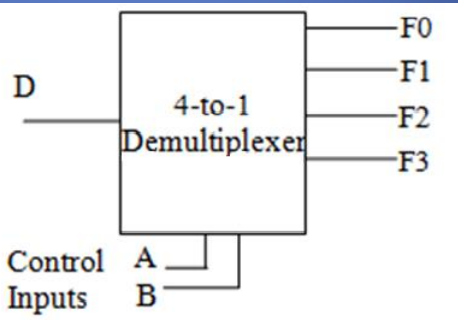

</th>
<th>
内部

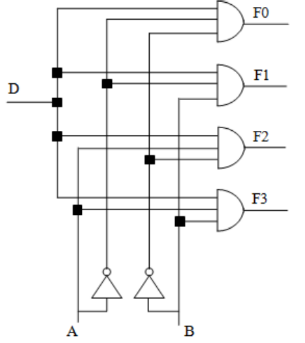
</th>
</tr>
</thead>
<tbody>
</tbody>
</table>

3，数据选择器和数据分配器 实用案例
Telecommunications Applications
输入端：Multiplexer将多个input整合到一个data用于传输
接收端：demultiplexer将单个数据流分割成原始的多个信号。
Multiplexer combining multiple inputs into a single data stream for transmission. On the receiving side, a demultiplexer splits the single data stream into the original multiple signals.
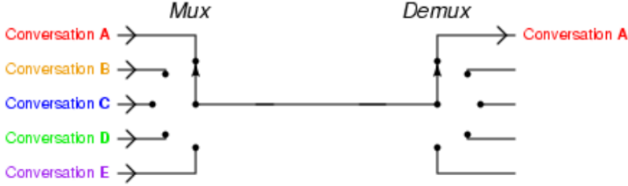

四，Tri-State Buffers三态缓冲器
| a tri-state buffer provides the ability to disconnect an output from a shared circuit such as a bus system. |    |
|-------------------------------------------------------------------------------------------------------------|-----|
|                                                                                                            |    |
1，三态缓冲器（Three-state buffer），又称为三态门、三态驱动器，
其**三态输出受到使能输出端的控制**，
当使能输出**有效**时，器件实现**正常**逻辑状态输出（逻辑0、逻辑1），
当使能输入**无效**时，输出处于**高阻状态**，即等效于与所连的电路断开
补充
<table>
<colgroup>
<col style="width: 100%" />
</colgroup>
<thead>
<tr class="header">
<th>
缓冲器对输入值<strong>不执行任何运算</strong>，其输出值和输入值一样，但它在计算机的设计中有着重要作用。

缓冲器分为两种，常用缓冲器（常规缓冲器）和三态缓冲器。

<table>
<colgroup>
<col style="width: 100%" />
</colgroup>
<thead>
<tr class="header">
<th>常规缓冲器总是将值直接输出，用于将电流输出到高一级电路系统。</th>
</tr>
</thead>
<tbody>
<tr class="odd">
<td>三态缓冲器除了常规缓冲器的功能外，还有一个选项卡通输入端，用E表示。当E=0和E=1时有不同的输出值。</td>
</tr>
</tbody>
</table>

缓冲器又可以分为输入缓冲器和输出缓冲器两种。

<table>
<colgroup>
<col style="width: 100%" />
</colgroup>
<thead>
<tr class="header">
<th><strong>输入缓冲器</strong>的作用是<strong>将外设送来的数据暂时存放</strong>，以便处理器将它取走；</th>
</tr>
</thead>
<tbody>
<tr class="odd">
<td>
输出缓冲器的作用是用来暂时存放处理器送往外设的数据。有了数控缓冲器，就可以使高速工作的CPU与慢速工作的外设起协调和缓冲作用，实现数据传送的同步。由于缓冲器接在数据总线上，故必须具有三态输出功能。

<strong>当E=1时，选通，其输入直接送到输出；</strong>

若E=0，缓冲器被阻止，无论输入什么值，输出的总是高阻态，用Z表示。高阻态能使电流降到足够低，以致于类似缓冲器的输出没有与任何东东相连。
</td>
</tr>
</tbody>
</table></th>
</tr>
</thead>
<tbody>
</tbody>
</table>

2，

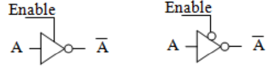
The buffer may be inverting(above) or non-inverting(below), again depending on its type.
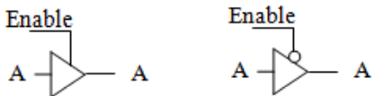

3，A bus is a shared set of communication lines and controlling logic that interconnects subsystem components in a computer system.
三态缓冲器提供了一种处理总线“争用”的机制，即当两个电路同时使用总线时。
如果一条线路不断开，当这两条线路试图在同一条线路上应用不同的逻辑电平时，它们可能会相互破坏并损坏总线系统本身。

五、解码器Decoders
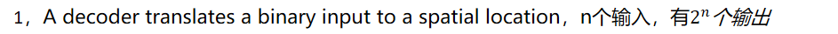
解码器（decoder），是一种能将数字视音频数据流解码还原成模拟视音频信号的硬件/软件设备。
<table>
<colgroup>
<col style="width: 35%" />
<col style="width: 64%" />
</colgroup>
<thead>
<tr class="header">
<th>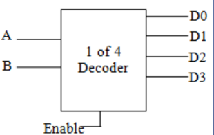</th>
<th>
内部结构

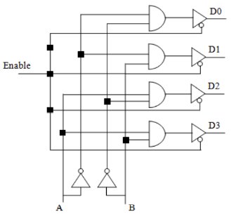
</th>
</tr>
</thead>
<tbody>
</tbody>
</table>
**Some decoders and multiplexers have Enable lines. The outputs of these devices incorporate tri-state buffers and function as if they were disconnected if the Enable line is not active.**
2，Decoders may be used to **select and enable other circuits.**
For example, A and B could represent part of **a memory address**. The output of the decoder could be used to select and activate the
appropriate memory device or to choose a row or column of cells out of a memory device

3，
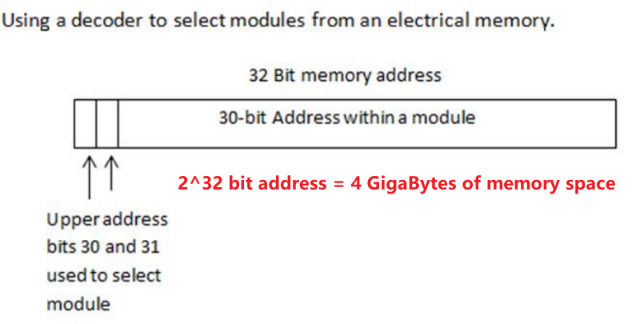

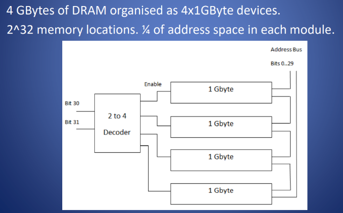

4，The decoder may also be regarded as **a minterm generator.**
Each output generates one minterm (a product of the control inputs A and B).
By combining the appropriate outputs from the decoder using an OR gate, you can implement a switching function.
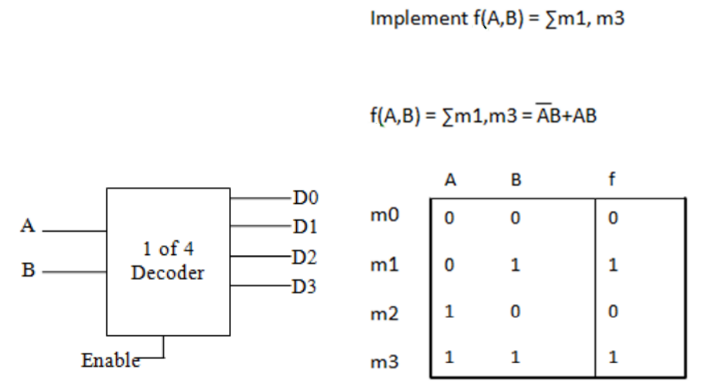

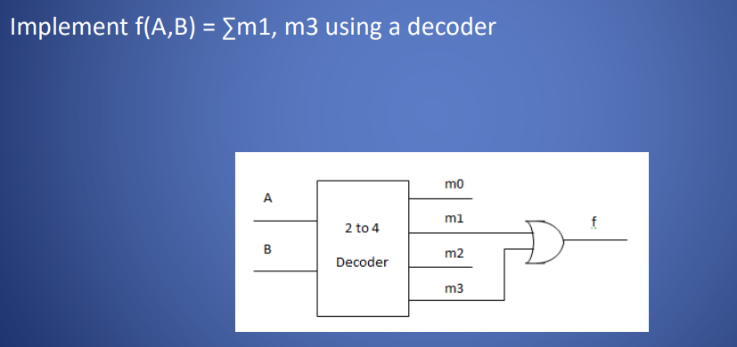

六、编码器encoders
1，Encoders translate a set of inputs into a binary encoding.

If one of the A inputs below is active, the F output represents its
appropriate binary code in the range 0..3.

2，
F0 = A1 + A3
F1 = A2 + A3
<table>
<colgroup>
<col style="width: 48%" />
<col style="width: 51%" />
</colgroup>
<thead>
<tr class="header">
<th>
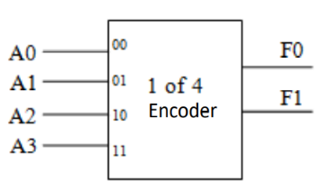

</th>
<th>
内部

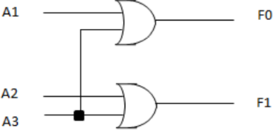

</th>
</tr>
</thead>
<tbody>
</tbody>
</table>
Note that this arrangement doesn’t differentiate between device
A0 and no device signalling. **Could ignore connection A0.**

应用
编码器的一个示例应用可能是在部署来自连接到输入的各种设备的中断，然后使用输出来通信中断号，该中断号使用较少的通信线路来发送信号。
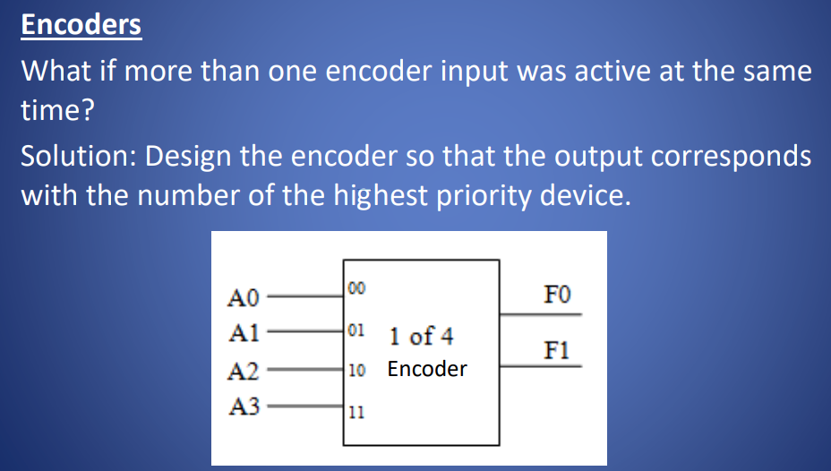
3，
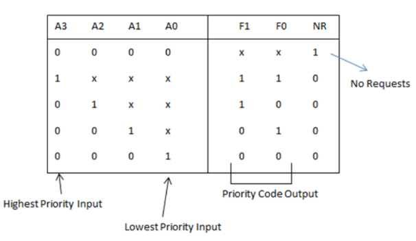

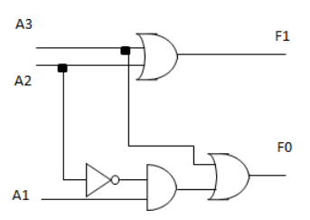

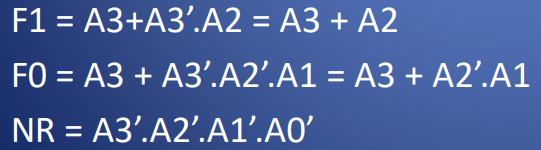

