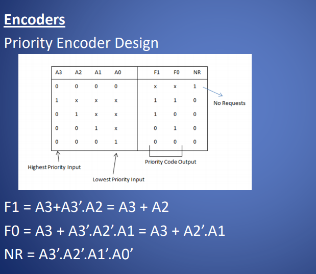

<table>
<colgroup>
<col style="width: 10%" />
<col style="width: 10%" />
<col style="width: 9%" />
<col style="width: 29%" />
<col style="width: 38%" />
</colgroup>
<thead>
<tr class="header">
<th></th>
<th>作用</th>
<th>输入输出</th>
<th>结构</th>
<th></th>
</tr>
</thead>
<tbody>
<tr class="odd">
<td>multiplexers</td>
<td>a Multiplexer is a device which connects a number of inputs to share a single output in time.</td>
<td>n个输入一个输出</td>
<td></td>
<td>

</td>
</tr>
<tr class="even">
<td>demultiplexer</td>
<td>A demultiplexer performs the opposite function to a multiplexer.</td>
<td>一个输入,n个输出</td>
<td></td>
<td>
Telecommunications Applications

Multiplexer combining multiple inputs into a single data stream

for transmission. On the receiving side, a demultiplexer splits the

single data stream into the original multiple signals.
</td>
</tr>
<tr class="odd">
<td>Tri-state</td>
<td>
a tri-state buffer provides the ability to

disconnect an output from a shared circuit such as a bus system
</td>
<td></td>
<td></td>
<td></td>
</tr>
<tr class="even">
<td>decoder</td>
<td>A decoder translates a binary input to a spatial location</td>
<td>n个输入，2的n次方个输出</td>
<td>

</td>
<td></td>
</tr>
<tr class="odd">
<td>encoder</td>
<td>Encoders translate a set of inputs into a binary encoding.</td>
<td>
If one of the A inputs below is active, the F output represents its

appropriate binary code in the range 0..3.
</td>
<td></td>
<td>

<strong>Could ignore connection A0.</strong>
</td>
</tr>
</tbody>
</table>

Encoder

