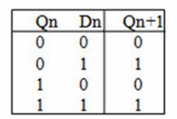
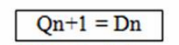

<table>
<colgroup>
<col style="width: 4%" />
<col style="width: 32%" />
<col style="width: 12%" />
<col style="width: 10%" />
<col style="width: 14%" />
<col style="width: 11%" />
<col style="width: 13%" />
</colgroup>
<thead>
<tr class="header">
<th></th>
<th>电路图</th>
<th>State table</th>
<th>Characteristic table</th>
<th>Excitation table</th>
<th>K-M</th>
<th>Characteristic equation</th>
</tr>
</thead>
<tbody>
<tr class="odd">
<td>D</td>
<td></td>
<td></td>
<td>

</td>
<td>

</td>
<td>

</td>
<td>

</td>
</tr>
<tr class="even">
<td>Master-Slave JK</td>
<td>

</td>
<td>

</td>
<td>

</td>
<td>

</td>
<td>

</td>
<td>

</td>
</tr>
</tbody>
</table>
