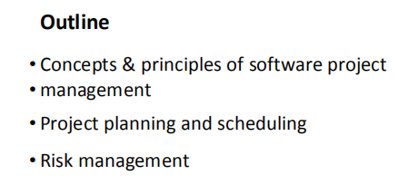
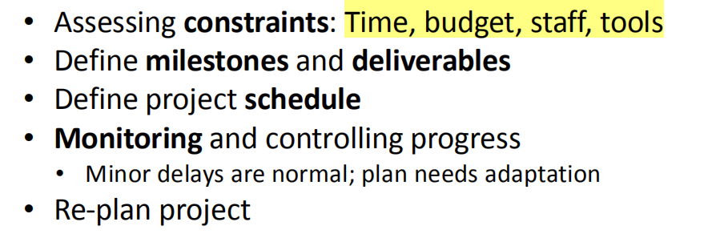
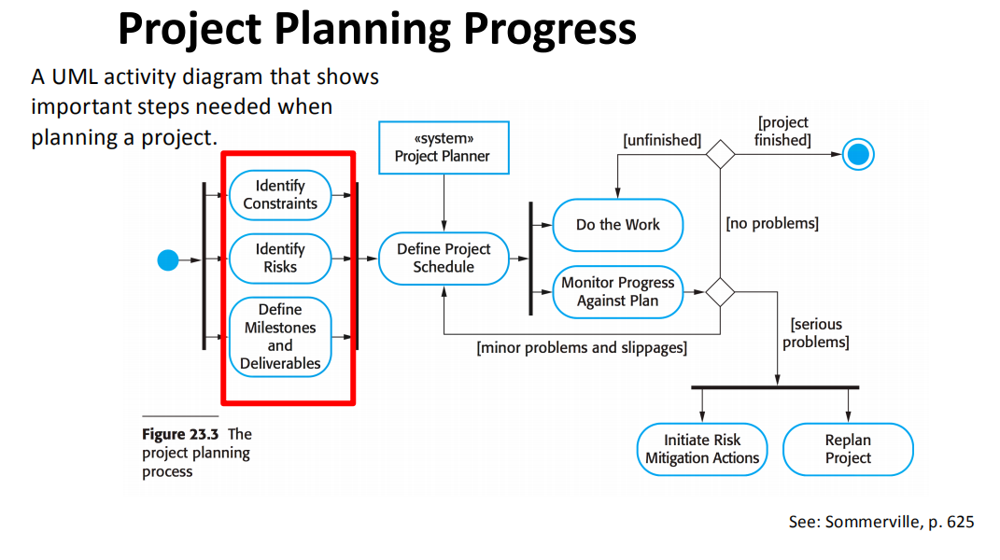
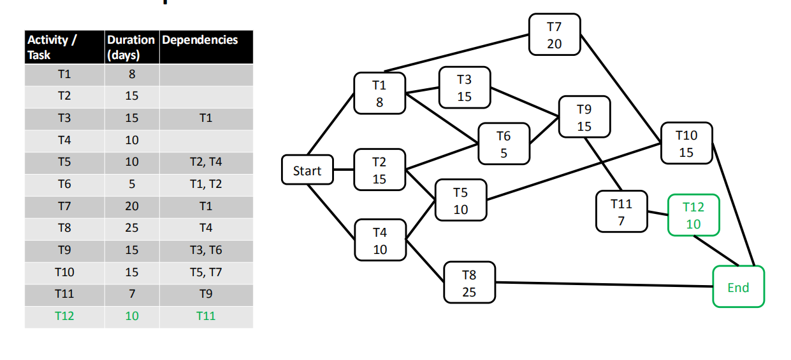
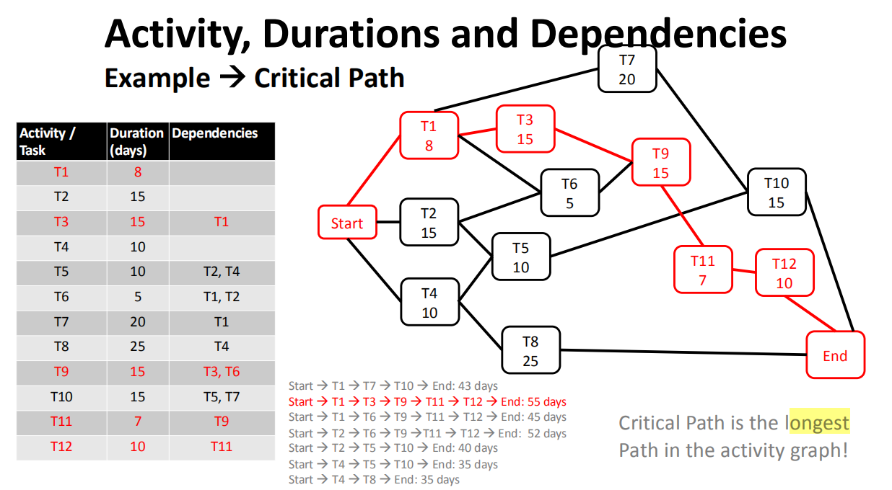
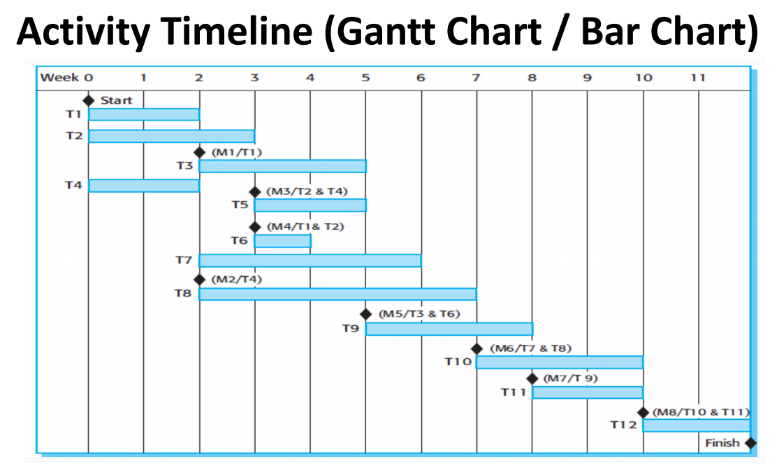
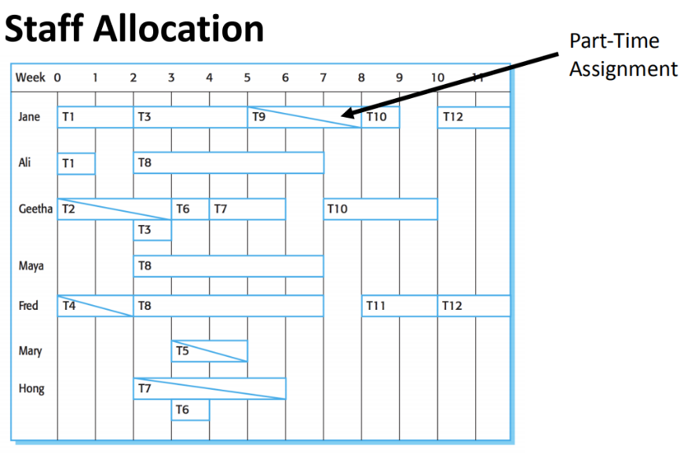
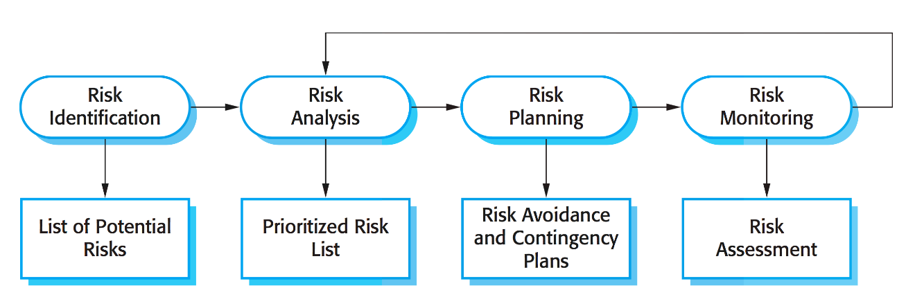

## 一、Project Management
**1，为什么要管理一个软件项目？**
限制条件：时间和预算Time and budget
项目管理成功标准
• Deliver in time按时交付

• Costs within budget在预算范围内的成本

• Meet customer's expectations满足客户的期望

• Keep team happy (!)
**2，典型的管理活动**
撰写提案Write proposals

计划和进度安排项目 Plan and schedule project

管理风险Manage risk

估算成本Estimate costs

Monitor and review project

选择和评估相关人员Select and evaluate personnel

撰写报告和提供演示文稿Write reports / give presentations

**2.1 Proposal Writing撰写提案**
写一个提案，赢得一个合同
描述项目目标以及如何执行
包括对成本和进度计划的估计数

**2.2 Project Planning**
1），
计划
定义可用资源，

将工作分解为单位，

安排流程
项目计划还定义了监控功能：
跟踪进度

与计划流程/成本的比较

项目期间必须修改进度计划、成本和风险
项目计划通常侧重于开发过程

2），项目规划活动
评估限制条件：时间、预算、员工、工具
定义里程碑【目标】和可交付成果
定义项目进度计划
监控工程进度
轻微延迟为正常情况；计划需要适应
重新规划项目

**i.里程碑和可交付成果**
Milestone
<table>
<colgroup>
<col style="width: 40%" />
<col style="width: 59%" />
</colgroup>
<thead>
<tr class="header">
<th>
进度计划中允许我们评估进展情况的要点；

一个过程活动的一个终点

原始含义：列出到位置/目的地的距离的路边标记。
</th>
<th>
• Points in the schedule which allow us to assess the progress;

• An end-point of a process activiy

• Original meaning: roadside marker that lists distance to

location/destination.
</th>
</tr>
</thead>
<tbody>
</tbody>
</table>
<table>
<colgroup>
<col style="width: 100%" />
</colgroup>
<thead>
<tr class="header">
<th>
Milestones

Milestones are <mark>checkpoints</mark> during a project and can be inserted at any point. They mark the completion of an important activity. They have no deadlines, but are simply <mark>a way to keep track of project progress.</mark>

Milestones are created to <mark>break down</mark> a <mark>complex result into its constituent parts</mark>.

Moreover, milestones are not meant for customers, but for the internal project team.

</th>
</tr>
</thead>
<tbody>
<tr class="odd">
<td>

<mark>里程碑是项目过程中的检查点，可以在任何时候插入</mark>。

它们标志着一项重要活动的完成。

它们没有最后期限，但只是<mark>一种跟踪项目进展的方法。</mark>

创建里程碑是为了将一个复杂的结果分解为其组成部分。

此外，里程碑不是针对客户的，而是针对内部项目团队的。
</td>
</tr>
</tbody>
</table>

应交付的产品Deliverable
项目结果交付给客户，例如。一个安全报告。
<table>
<colgroup>
<col style="width: 100%" />
</colgroup>
<thead>
<tr class="header">
<th>Q47: What are Deliverables in software development project? How would you identify deliverables for a given project?</th>
</tr>
</thead>
<tbody>
<tr class="odd">
<td>
Deliverables are <mark><u>the project results delivered to customers.</u></mark>

The deliverables of the project are the great customer-centered goals we talked about previously.

Any work done to satisfy customer requests or to fight competition is an external deliverable.

Any work done that is not part of the business with customers is an internal deliverable.

To define the deliverables of the project, it is necessary to have a look at the project goal and ask the following questions:

What is the project trying to achieve?

What is the purpose, goal or final result that the customer wants once the project closes?

What are the constituent parts of the project goal?

What is the form and function of each of these constituent parts?

How important is this part for the overall project?

How will it be possible to create this part?

What is the cost of production / acquisition of this part?

How long will it take to produce / acquire this part?

</td>
</tr>
<tr class="even">
<td>
可交付成果是交付给客户的项目结果。

项目的可交付成果是我们前面谈到的以客户为中心的伟大目标。

任何为满足客户要求或对抗竞争而做的工作都是外部可交付品。

任何与客户业务无关的工作都是内部交付物。

要确定项目的可交付成果，必须先看一看项目目标，然后问以下问题:

这个项目想要达到什么目的?

一旦项目结束，客户想要的目的、目标或最终结果是什么?

项目目标的组成部分是什么?

每个组成部分的形式和功能是什么?

这部分对整个项目有多重要?

如何才能创造出这个部分呢?

这个零件的生产/采购成本是多少?

生产/采购这个零件需要多长时间
</td>
</tr>
</tbody>
</table>

**Project Planning Progress项目规划进度**
显示计划项目时所需的重要步骤的UML活动图。

**3）Project Scheduling Activities项目进度安排活动**
将项目分成较小的任务

估计每个任务的时间和资源

同时组织任务以优化员工

最小化任务依赖性（=通过等待其他任务来最小化延迟）

这些活动的质量在很大程度上取决于一个项目经理的优秀程度。

**4）Activity Organization**
活动是一个项目，应该产生有形的产出，允许管理层判断进展
Milestones are the end-point of a process activity
可交付成果是指交付给客户的项目结果
**瀑布式过程模型允许直接定义进度里程碑**。

**5）Visualizing a Project Schedule**
项目计划可以以图形方式表示，以使其可访问
将项目细分项目显示为任务
任务不应该太小：~1-2周

条形图显示了==针对日历时间的时间表==
活动图显示了==任务依赖关系和关键路径==

6**）Project activities / tasks**
经理们经常使用项目规划工具
活动是基本的规划要素
• Activities have:

• Duration (e.g. in calendar days/months)

• Effort estimate (e.g. person days/months)

• Deadline

• Endpoint (milestone) with a tangible output

(e.g. a report or an event/meeting)

**7）Building an Activity Networ**k
<table>
<colgroup>
<col style="width: 39%" />
<col style="width: 60%" />
</colgroup>
<thead>
<tr class="header">
<th>
开发活动网络（具有里程碑、任务或任务依赖性）

确定关键路径（最长的路径）

调整里程碑以匹配截止日期

通过更改/添加人员来调整任务
</th>
<th>
• Develop activity network (with milestones, tasks, or task dependencies)

• Identify critical path (the longest path)

• Adjust milestones to match deadline

• Adjust task by changing / adding people
</th>
</tr>
</thead>
<tbody>
</tbody>
</table>

Activity Network: Example

Example à Critical Path

**Critical Path is the longest Path in the activity graph!**
这条关键路径无法造成任何延迟
关键路径中的任何延迟都会导致项目延迟

Activity Timeline (Gantt Chart / Bar Chart)

**计划的问题Scheduling problems**
- Estimating 估计是很困难的！
- 生产力与员工人数不成比例
- 将人员添加到后期项目中（一个沟通问题）
- 总是会发生意外事件
- 在你的计划中，总是要考虑到意外事件

## 二、Risk Management风险控制
**1，什么是风险管理部门？**
**识别风险并制定计划，以将其负面影响降到最低**
**Identifying risks and drawing plans to minimise their negative effects**

风险是指发生某些不利情况的可能性
1）.项目风险会影响项目进度和资源，例如。一个同事离开了，很难被替换。
2）.产品风险会影响正在开发的软件的质量或性能，例如。已购买的组件不能按预期进行工作
3）. 业务风险会影响生产该软件的组织，例如。竞争对手也推出了类似的软件。

**2，Examples of common risks**
,风险可能会发生重叠。高员工流动率、对新员工的需求、项目生产效率降低（项目风险）、产品质量降低（产品风险）、新合同签订能力降低（业务风险）

**3，Risk management process**
一个具有以下步骤的交互式过程：
项目/产品/业务风险的风险识别

风险分析评估风险的可能性和后果

风险计划会创建一个避免风险或尽量减少其影响的计划

风险监测会定期检查风险，并制定缓解和修订计划。可提供更多信息）

Risk planning
制定管理风险的策略
可能的策略
规避策略：降低发生风险的概率

最小化策略：将降低风险的影响

应急计划：做好最坏的准备，制定策略（以防万一）

Risk monitoring
检查关于风险的假设是否发生了改变
风险指标

三、Key points
良好的项目管理，项目成功；
软件项目管理很困难，因为软件是抽象管理（无形管理）
经理的所有估计和计划；
规划和估算是迭代的和连续的；
里程碑是其编制进度报告的可预测状态；
项目进度包括展示活动、持续时间和人员配备；
风险管理可以识别风险，并且需要制定计划来控制风险。

二、Project Planning

