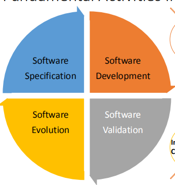
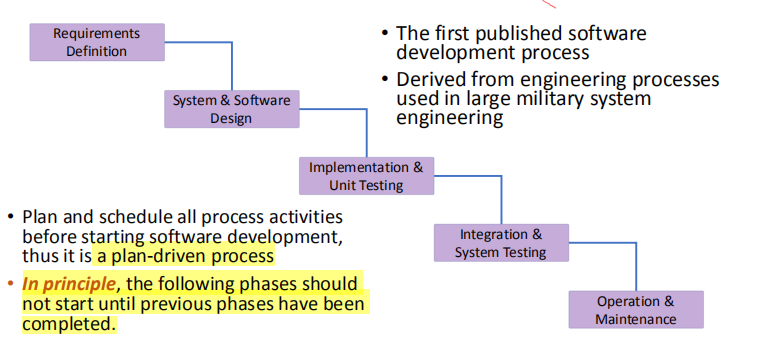
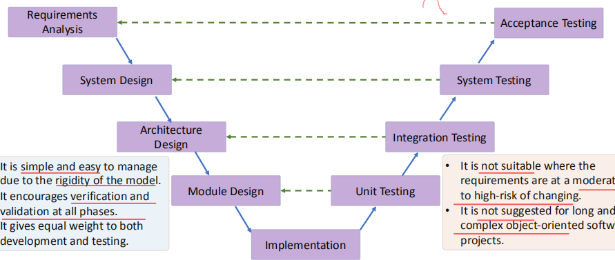
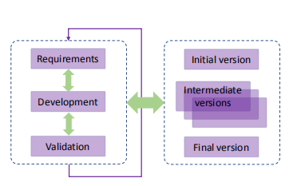
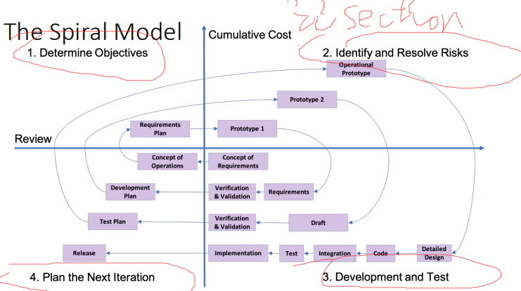
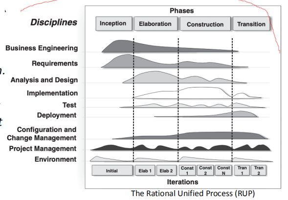
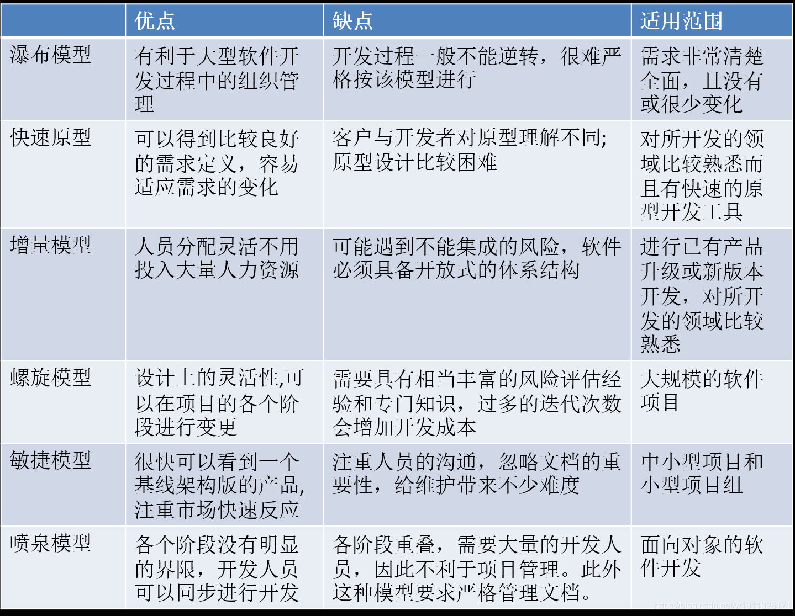

## 一、一般过程模型中的基本活动
1，一般过程模型中的基本活动
**列出需求和限制--》设计和制作--》测试--》发展（修改）**
记图和名字

<table>
<colgroup>
<col style="width: 33%" />
<col style="width: 66%" />
</colgroup>
<thead>
<tr class="header">
<th>The Waterfall Mode</th>
<th>基础的活动作为单独的过程阶段，包括需求规范、设计、实施、测试和维护。</th>
</tr>
</thead>
<tbody>
<tr class="odd">
<td>Incremental Development</td>
<td>
穿插各种基本活动；

系统作为一系列“增量”开发，每个增量都会为上一版本添加功能。
</td>
</tr>
<tr class="even">
<td>Integration &amp; Configuration</td>
<td>依赖于可重用组件的可用性；系统开发侧重于在新设置中使用的配置、组合和集成。</td>
</tr>
</tbody>
</table>

## 二、The Waterfall Model
（理解过程，记住优缺点）

1，过程图

源自于大型军事系统工程中使用的工程过程
在开始软件开发之前，计划和安排所有流程活动，因此这是一个计划驱动的过程
原则上，上一个阶段完成之前，下一个阶段不应该开始

2，各个阶段
<table>
<colgroup>
<col style="width: 100%" />
</colgroup>
<thead>
<tr class="header">
<th>
<strong>Requirements analysis and definition需求分析与定义</strong>

<ul>
<li>
收集有关所需功能的信息（例如，软件系统应提供登录功能）和约束条件（例如，软件系统应使用PostgreSQL作为后端数据库，因为它与组织中现有的IT基础设施兼容）
</li>
<li>
根据一组预算、时限、资源、技能和可用技术，分析软件系统是否可实现
</li>
<li>
创建详细的系统规范
</li>
</ul>
<blockquote>

</blockquote>

<strong>System and Software Design系统和软件设计</strong>

<ul>
<li>
将需求分配给硬件或软件系统
</li>
<li>
建立一个整体的系统体系结构（例如，识别和描述组件的接口及其关系等）。
</li>
</ul>
<blockquote>

</blockquote>

<strong>Implementation and Unit Testing实施和单元测试</strong>

<ul>
<li>
软件设计作为一组程序或程序单元实现
</li>
<li>
测试程序单元以符合其规范
</li>
</ul>

<strong>Integration and System Testing集成和系统测试</strong>

<ul>
<li>
单个程序单元或程序作为一个完整的系统进行集成和测试
</li>
<li>
验证的软件系统在测试后交付给用户
</li>
</ul>

<strong>Operation and Maintenance使用和维护</strong>

<ul>
<li>
该系统已被部署并投入实际使用
</li>
<li>
软件系统可能会不断更新，以修补错误或安全威胁；以提高系统的稳定性；或增强系统的功能
</li>
</ul></th>
</tr>
</thead>
<tbody>
</tbody>
</table>

3，何时使用（重点）
**适用**
<table>
<colgroup>
<col style="width: 100%" />
</colgroup>
<thead>
<tr class="header">
<th>
<strong>Embedded Systems嵌入式系统</strong>

<ul>
<li>
软件需要与硬件系统进行接口
</li>
<li>
通常，硬件是不灵活的；在软件实现之前延迟对软件功能的决策
</li>
</ul>

<strong>Critical Systems关键的系统</strong>

<ul>
<li>
需要对软件规范和设计进行广泛的安全性分析
</li>
<li>
软件规范和设计文件必须齐全
</li>
<li>
与安全相关的问题通常花费昂贵
</li>
</ul>

<strong>Large Software Systems大型软件系统</strong>

<ul>
<li>
多个合作伙伴共同开发软件系统，可能需要完整的规范，以允许不同子系统的独立开发。
</li>
</ul></th>
</tr>
</thead>
<tbody>
</tbody>
</table>

**不适合**
<table>
<colgroup>
<col style="width: 100%" />
</colgroup>
<thead>
<tr class="header">
<th>
<strong>Software Systems that must <mark>cope with changes</mark>必须应对变化的软件系统</strong>

<ul>
<li>
变化在许多软件项目中是不可避免的，瀑布模型的<strong>单向过程的性质不能有效地应对变化</strong>
</li>
</ul>
<blockquote>

“one-way process”

</blockquote></th>
</tr>
</thead>
<tbody>
</tbody>
</table>

4，优缺点
优点
<table>
<colgroup>
<col style="width: 100%" />
</colgroup>
<thead>
<tr class="header">
<th>
<strong>每个阶段的任务与目标很明确</strong>；

可为每个阶段指定开发计划，进行成本预算，组织开发力量了；

通过阶段评审，将开发过程纳入正确轨道；

<strong>严格的计划性保证软件产品按时交付</strong>。
</th>
</tr>
</thead>
<tbody>
</tbody>
</table>

缺点
<table>
<colgroup>
<col style="width: 100%" />
</colgroup>
<thead>
<tr class="header">
<th>
<strong>缺乏灵活性，无法适应用户需求的改变</strong>；

<strong>开始阶段的小错误被逐渐放大</strong>，可能导致软件<strong>产品报废；</strong>

<strong>返回上一级的开发需要十分高昂的代价；</strong>

随着软件规模和复杂性的增加，<strong>软件成品成功的概率大幅下降</strong>。
</th>
</tr>
</thead>
<tbody>
</tbody>
</table>

## 二、V-Model
(重点，理解过程，记优缺点)
1，过程

2,优缺点
<table>
<colgroup>
<col style="width: 100%" />
</colgroup>
<thead>
<tr class="header">
<th>
优点

由于模型的刚性，它是简单而易于管理。

它鼓励在所有阶段的验证和验证

它对开发和测试都具有同等的重视程度。

缺点

不适合于要求存在中至高风险的变更风险。

它不建议用于长而复杂的面向对象软件项目。
</th>
</tr>
</thead>
<tbody>
</tbody>
</table>

## 三、Incremental Development
（how?）

1,从软件系统的一部分的简单实现开始。
随着每次增量，产品每次都添加增强，直到最终版本完成。
代码以较小的部分编写和测试，从而降低了与该过程相关的风险。
它允许在开发过程中轻松地包括更改。

2,优缺点(重要)
优点
<table>
<colgroup>
<col style="width: 100%" />
</colgroup>
<thead>
<tr class="header">
<th>
<strong>降低了实施需求变更的成本</strong>

<ul>
<li>
需要重做的分析和文档的数量明显低于瀑布模型的要求
</li>
</ul>

<strong>提前收到反馈意见</strong>

<ul>
<li>
更容易获得用户对所完成工作的反馈，用户可以评论该软件并提供有用的建议
</li>
</ul>

<strong>部分工作产品的提前交付</strong>

<ul>
<li>
用户可以从早期发布的软件中开始使用和获得值
</li>
<li>
增量开发并不意味着每个增量都需要交付给用户
</li>
</ul></th>
</tr>
</thead>
<tbody>
</tbody>
</table>

缺点
<table>
<colgroup>
<col style="width: 100%" />
</colgroup>
<thead>
<tr class="header">
<th>
<strong>该进程不可见</strong>

<ul>
<li>
需要定期的可交付成果来衡量进度
</li>
<li>
如果增量迭代较短，则为系统的每个版本生成文档并没有成本效益
</li>
</ul>

<strong>随着新增量的增加，系统结构容易降低</strong>

<ul>
<li>
频繁的变化会导致对源代码和项目管理的额外负担
</li>
<li>
这也可能对软件系统体系结构有害，随着在系统中添加更多功能组件，现有架构可能需要相应地修改，从而导致级联效应。因此，通常需要进行重构
</li>
</ul></th>
</tr>
</thead>
<tbody>
</tbody>
</table>

3，何时使用
增量开发模型可能不适用于大型、复杂和长寿命的软件系统项目的开发。(瀑布模型可以

## 四、术语-重构Refactoring
通俗：整理，优化代码
对软件内部结构的更改，使修改更容易理解和更便宜，而不改变其可观察行为。”

When
当必须向程序添加功能，但代码结构不方便时，首先重构以轻松添加功能，然后添加功能。”
重构以小步骤更改程序，所以如果您犯了错误，很容易找到错误的位置。”
在开始重构之前，请确保您有一套可靠的测试。”
<table>
<colgroup>
<col style="width: 100%" />
</colgroup>
<thead>
<tr class="header">
<th>Q3 What is refactoring? Use an example to explain why we should refactor our codes over a long development process. Should we refactor the architectures of the program? Explain why.</th>
</tr>
</thead>
<tbody>
<tr class="odd">
<td>
1.Refactor : <mark>A change made</mark> to the internal structure of software to make it <mark>easier to understand and cheaper to modify without changing its observable behavior.</mark>

2.For a long development process, there are complex structures, complex codes and a great number of functions. We had better to refactor while adding functions, fixing a bug or reviewing code. Refactor helps us improve the software design, more easy to understand the code and find the bug, also it improve the coding speed and design quality.

3.I do not think we should refactor the architectures of the program

Refactoring is a small and safe step, preferably a reversible one.

If we have to consider whether it will work, then it is no longer a refactoring activity.

Refactor the architectures is a big and unsafe operation. It is not suitable.

1.

重构:对软件的内部结构进行的更改，使其更容易理解，所耗成本更低

在不改变可观察行为的情况下进行修改。

2.

开发过程漫长，结构复杂，代码复杂，功能繁多。

我们最好在添加功能、修复bug或审查代码时进行重构。

重构有助于我们改进软件设计，更容易理解代码和发现bug，提高了编码速度和设计质量。

3.

我认为我们不应该重构程序的架构

重构是一个小而安全的步骤，最好是可逆的。

如果我们必须考虑它是否会工作，那么它就不再是一个重构活动。

重构体系结构是一个庞大且不安全的操作。

它不合适。

</td>
</tr>
</tbody>
</table>

## 五、The Spiral Model

1，determine objectives
2，identity the resolve risks
3，development and test
4，plan the next iteration

## 六、术语-Prototype, Proof-of-Concept and Skeleton System
（重点）
Prototype
原型是系统某些功能子集的临时实现，通常呈现给用户进行反馈和验证，当验证练习完成时，它会被丢弃

Proof-of-Concept
概念验证是一些代码，旨在证明所提出的架构中的一个风险元素是可行的，并突出任何问题和陷阱。概念验证也是一种临时的实现，当它已经达到其目的和理解正在调查的风险时，它将进行讨论

Skeleton System
骨架实现了系统的主要体系结构结构，但只包含系统功能的最小子集。骨架系统被保留而不是废弃，并成为施工阶段的基础。骨架系统有时被称为“进化原型”。

## 七、Integration and Configuration
(理解步骤)
1，面向重用的开发过程侧重于对现有软件的重用。
E.g.、现有的类、库、模式、设计、独立的应用程序系统、web服务等
它依赖于可重用的软件组件的基础和这些组件组成的集成框架

2，过程
<table>
<colgroup>
<col style="width: 44%" />
<col style="width: 55%" />
</colgroup>
<thead>
<tr class="header">
<th>
<strong>Requirements Specification 要求说明</strong>

<ul>
<li>
已收集了对该系统的初始要求
</li>
<li>
它应包括对基本要求和系统特性的简要说明
</li>
</ul>

<strong>Software Discovery and Evaluation软件的发现和评估</strong>

<ul>
<li>
概述软件需求，并搜索提供所需功能的组件和系统。
</li>
<li>
将评估候选部件和系统，以确定它们是否适合在系统中使用。
</li>
</ul>

<strong>Requirements Refinement需求细化</strong>

<ul>
<li>
使用有关可重用组件和应用程序的信息进行改进或修改
</li>
</ul>

<strong>！Application System Configuration应用程序系统的配置</strong>

<ul>
<li>
如果现成的应用系统可用，可以配置为创建新系统，则应首先考虑。
</li>
</ul>

<strong>Component Adaptation and Integration组件的自适应和集成</strong>

<ul>
<li>
如果没有可用的现成应用系统，应考虑可用组件和/或开发新组件，然后集成以创建系统
</li>
</ul></th>
<th>

</th>
</tr>
</thead>
<tbody>
</tbody>
</table>

3，优缺点（要）
<table>
<colgroup>
<col style="width: 100%" />
</colgroup>
<thead>
<tr class="header">
<th>
<strong>优点</strong>

减少要开发的软件的数量

降低成本和风险

<ul>
<li>
开发活动的减少会导致了成本的降低
</li>
<li>
现有的组件/应用程序系统通常被证明是正确、稳定和安全的
</li>
<li>
现有的组件/应用程序系统提供了适合集成的应用程序编程接口(API)
</li>
</ul>

快速的软件交付

<strong>缺点</strong>

系统可能不完全满足用户的真实需求。

对系统演化的控制有限

<ul>
<li>
较新版本的可重用组件可能与当前使用的版本不兼容，例如，重构的API、新功能、不推荐用的函数调用等。
</li>
</ul></th>
</tr>
</thead>
<tbody>
</tbody>
</table>

## 八、软件模型的适用性
“没有一个适合各种软件开发的通用流程模型
==正确的流程取决于客户和法规要求、软件使用的环境以及正在开发的软件类型==
大多数实际的软件过程都基于通用模型，但通常包含其他模型的特性。”

## 九、The Rational Unified Process (RUP)
在通用进程模式下的一次尝试
在开发组织内分配任务和职责的自律方法
确保在可预测的计划和预算内生产满足用户需求的高质量软件

要看懂图

<table>
<colgroup>
<col style="width: 100%" />
</colgroup>
<thead>
<tr class="header">
<th>
<strong>1，Inception</strong>

概念是为项目<strong>建立共同愿景和基本范围的第一步。</strong>

开始阶段的目的不是定义所有需求，或生成可信的估算或项目计划

分析部分用例

对关键的非功能需求的分析

<ul>
<li>
例如，安全性、可靠性、可扩展性等。
</li>
</ul>

创建业务案例

开发环境的准备

<strong>2，Elaboration</strong>

构建<strong>核心体系结构</strong>，<strong>解决高风险要素，定义大多数需求，并估计总体计划和资源</strong>。”

核心的，有风险的软件体系结构被编程和测试

大部分的需求都被发现并稳定下来

减轻主要风险

它涉及到一系列的迭代

<ul>
<li>
建议在两到六周
</li>
</ul>

<strong>3，Construction and Transition</strong>

Construction

<ul>
<li>
涉及系统设计、实施和测试
</li>
<li>
系统的部分被开发和集成
</li>
<li>
完成本阶段后，应准备将部分工作系统和相关文件交付给用户
</li>
</ul>
<blockquote>

</blockquote>

<strong>Transition</strong>

在实际的生产环境中部署系统

在完成此阶段后，软件系统应为

<blockquote>

1. well documented

2. working correctly

3. running in its operational environment

</blockquote></th>
</tr>
</thead>
<tbody>
</tbody>
</table>

