体系结构设计，架构设计
## 
## 一、软件系统架构
1，什么是软件系统架构
- 系统的软件体系结构是推理系统所需的一组结构，它包括软件元素、它们之间的关系以及两者的属性。
- **系统的体系结构**是系统在其环境中的一套基本概念或属性，体现在其元素、关系及其设计和演化的原则中
- 软件系统架构是理解**软件系统应该如何组织，并设计该系统的整体结构**

架构设计，说到底还是**一个设计过程**，在system design process的**早期阶段**进行，并且是和需求分析specification同步进行的，最终产出一个software architecture的description。这个description描述了系统的sub-system之间的control和communication

2，软件架构的重要性
- 加强利益相关者之间的沟通
- 允许建筑师和项目经理估算成本和进度安排
- 定义对后续实现的约束
- 包含最基本和难以更改的设计决策
- 为软件产品创建可转移的和可重用的模型
- 促进系统分析

3，架构是一个抽象结构
- 在现代的系统中，元素通过接口相互交互
- 将有关元素的分区详细信息接口到公共部分和私有部分中
  - private：内部实施中的细节，**Private details of element are NOT architectural!**
  - public：元素如何排列、与他人交互、组成及其支持设计推理的属性
- 抽象化的级别（重点）
  - Architecture in the small
    - 独立项目的架构
    - 主要关注的是如何将==单个程序分解成组件==
    - 各个组件实现了功能系统的要求
  - Architecture in the large
    - 分布式组件的复杂系统的体系结构
    - 主要关注如何由分布式组件==组成一个新的系统==

4,架构设计生命周期
- 在所有需求中，有一些对架构具有特殊重要性的需求，称为**架构重要需求(ASR)：**
  - 例如，系统中最重要的功能、约束条件和质量属性，如高性能和高可用性等。
- 设计是一种从**需求到解决方案的转换**，它可以是由代码、框架和组件组成的结构。
- 结构的初步文件（草图）应作为建筑设计的一部分来创建
- 如果正在开发的项目并不重要，那么应对设计进行评估，以确保所做出的决策适合解决ASR问题。
- 在实施过程中，架构师的责任是确保规范符合设计要求
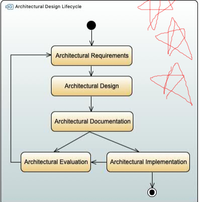

5,原则方法
- 我们如何实际执行一个设计？
- 执行设计以确保满足业务要求需要一个有原则的方法
- 一种方法提供了指导
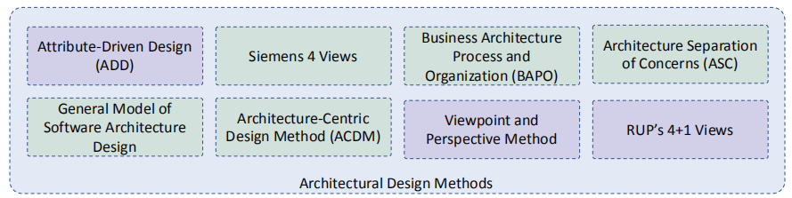

## 二、Architecture Views(4+1)
每一个architecture model 都只展现了 1 个 view or perspective of the system

我们要对系统进行设计、写文档，我们就需要不同的views，因而需要不同的architecture model

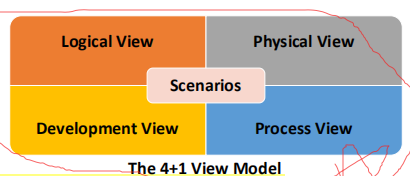

(重点)

1，4views
- **A logical view：**将系统中的关键抽象显示为对象或对象类。
  - 用于将系统需求与逻辑视图中的元素关联起来
- A physical view ：显示了系统硬件以及软件组件在系统中的分布方式。
  - 可用于规划系统部署
- A process view：显示系统如何在运行时由交互的流程组成
  - 用于判断非功能的系统特征
- A development view：显示了如何分解软件以进行开发。
  - 适用于分配工作和规划开发

**一个Scenario用于说明和验证这4个view**

2，Structures and Views(ADD)（理解）

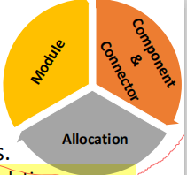

- 一个视图是一组架构元素集合的表示
  - 视图由一组元素及其之间的关系组成。
- 结构是元素本身的集合，因为它们存在于软件或硬件中
  - **Module structures**：如何将**系统结构化为一组必须构建或采购的代码或数据单元。**
  - **Component-and-connector structures**：如何将系统结构为一组具有运行时行为（组件）和交互（连接器）的元素。
  - **Allocation structures**显示了软件元素与其操作环境中的元素之间的关系。
- 建筑师设计结构。它们记录了这些结构的视图。

3，Viewpoints & Perspectives（重点）

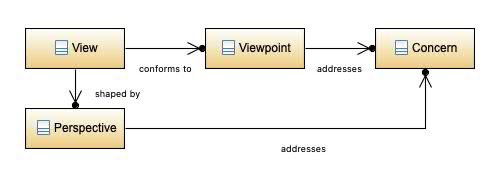
<table>
<colgroup>
<col style="width: 100%" />
</colgroup>
<thead>
<tr class="header">
<th>
<strong>Viewpoint</strong>是用于构建一种视图类型的模式、模板和约定的集合

A <strong>Viewpoint</strong> is a collection of patterns, templates, and conventions for constructing one type of view

<strong>View</strong>是体系结构的一个或多个结构方面的表示，它说明了体系结构如<mark>何解决其一个或多个利益相关者所持有的一个或多个问题。</mark>

A <strong>View</strong> is a representation o<mark>f one or more structural aspects</mark> of an <mark>architecture</mark> that illustrates how the architecture addresses one or more concerns held by one or more of its stakeholders

An architectural perspective是体系结构活动、策略和指导方针的集合，用于确保系统显示出一组特定的相关质量属性，这些属性需要跨系统的一些体系结构视图进行考虑。

An <strong>architectural perspective</strong> is a collection of <mark>architectural activities,</mark> tactics, and guidelines that are used to ensure that a system exhibits a particular set of related quality properties that require consideration across a number of the system’s architectural views.
</th>
</tr>
</thead>
<tbody>
</tbody>
</table>

区别和联系

联系

A viewpoint provides a template for the construction of a view.

1）Viewpoints(理解)

记住

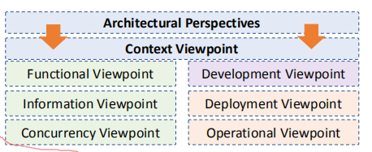

视图提供了一个构建视图的模板。

Context viewpoint: 描述系统与环境之间的关系、依赖关系和交互作用。

Functional viewpoint: 描述了系统的功能要素、其职责、接口和交互作用。

Information viewpoint: 描述系统如何存储、操作、管理和分发信息。操作和管理数据

Concurrency viewpoint: 描述了系统的并发结构，并将功能元素映射到并发单元。.

Development viewpoint: 描述了支持软件开发过程的体系结构。

Deployment viewpoint: 描述了如何在其具有相关依赖关系的操作环境中安装和部署系统.

Operational viewpoint: 描述了将如何操作、管理和支持该系统

View Relationships（理解）

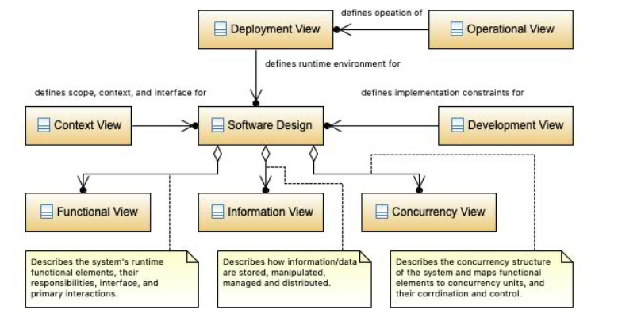

## 三、Architectural Patterns
（都很重要）
- 架构元素可以以解决特定问题的方式来组成
  - 随着时间的推移，这些成分在许多不同的领域中都被发现很有用
  - 它们已被记录和传播。
  - 这些模式为解决一种特定类型的问题提供了打包的策略。建筑元素的组成部分，被称为建筑模式
  - 模式提供了解决一种特定问题的打包策略
- 一种体系结构模式描述了在解决该问题时所使用的元素类型及其交互形式。
  - Context, problem, and solutions

通俗而言

对于一些具体domain的软件问题，可能会有相同的解决方案。

我们将：能解决一类特定问题的体系结构设计，称之为：architecture patterns

1，Client-Server Architecture？

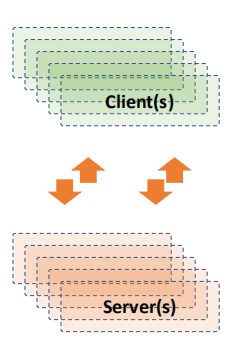

1）
<table>
<colgroup>
<col style="width: 100%" />
</colgroup>
<thead>
<tr class="header">
<th>
Context：有大量分布式客户端希望访问的共享资源和服务，我们希望为此控制其访问或服务质量。

Problem ：通过管理一组共享资源和服务，我们可以通过分解公共服务，并必须在单个位置或少数位置修改这些服务，来促进可修改性和可重用性。我们希望通过集中对这些资源和服务的控制，同时在多个物理服务器上分发资源本身，来提高可扩展性和可用性。

Solution：客户端通过请求提供一组服务的服务器的服务进行交互。某些组件可以同时充当客户端和服务器。可能有一台中央服务器或多个分布式服务器
</th>
</tr>
</thead>
<tbody>
<tr class="odd">
<td>
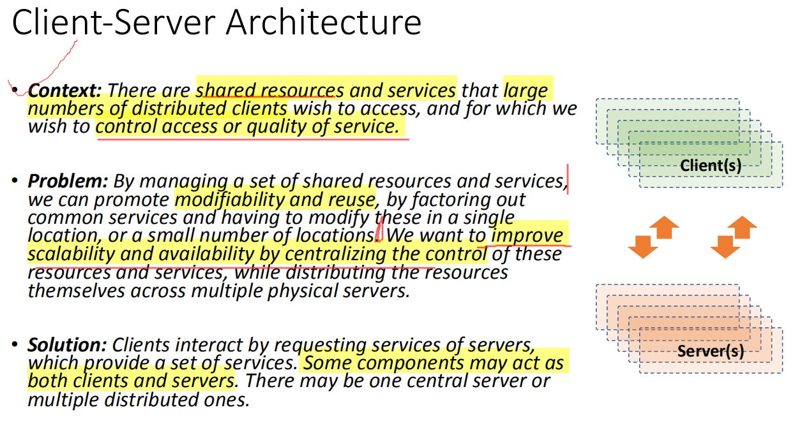

</td>
</tr>
</tbody>
</table>
。

2） Features（要记住）
<table>
<colgroup>
<col style="width: 10%" />
<col style="width: 89%" />
</colgroup>
<thead>
<tr class="header">
<th>
优点

<ul>
<li>
服务器可以跨网络进行分发
</li>
<li>
可以向所有客户提供一般功能
</li>
</ul>

限制

<ul>
<li>
客户端通过请求/回复连接器连接到服务器。
</li>
<li>
服务器组件也可以是其他服务器的客户机。
</li>
</ul>

弱点

<ul>
<li>
服务器可能是一个性能的瓶颈。
</li>
<li>
服务器可能是一个单一的故障点
</li>
<li>
在系统构建后，确定功能（客户端或服务器）通常很复杂且成本高昂。
</li>
</ul></th>
<th>
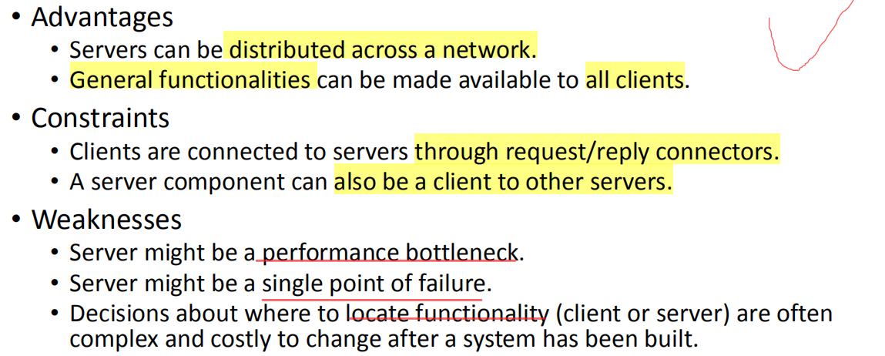

</th>
</tr>
</thead>
<tbody>
</tbody>
</table>

<table>
<colgroup>
<col style="width: 100%" />
</colgroup>
<thead>
<tr class="header">
<th><ul>
<li>
Client-Server pattern
</li>
<li>

<ul>
<li>
Client：提交服务请求。
</li>
</ul></li>
</ul>
<blockquote>

</blockquote>
<ul>
<li>
Server：处理请求并返回结果。
</li>
</ul>
<blockquote>

</blockquote>
<ul>
<li>
好处：<mark>功能易扩展（加server就行）</mark>
</li>
</ul>
<blockquote>

</blockquote>
<ul>
<li>
种类：Two-tier 和 Multi-tier 两种。
</li>
</ul>
<blockquote>

</blockquote>
<ul>
<li>
Thin &amp; Fat client
</li>
</ul>
<blockquote>

</blockquote>
<ul>
<li>
Thin-client model：客户端承担少，比如浏览器。
</li>
</ul>
<blockquote>

</blockquote>
<ul>
<li>
Fat-client model：客户端承担多，比如ATM取款机。
</li>
</ul>
<blockquote>

</blockquote>
<ul>
<li>
Two-tier client server
</li>
</ul>
<blockquote>

</blockquote>
<ul>
<li>
比如QQ就是2层结构。Two-tier又分为两种：
</li>
</ul>
<blockquote>

</blockquote>
<ul>
<li>
Multi-tier client server
</li>
<li>

<ul>
<li>
系统有很多个client-server的层次。
</li>
</ul></li>
</ul>
<blockquote>

</blockquote>
<ul>
<li>
每个层次 提供的功能是递进的【比如浏览器】。
</li>
</ul>
<blockquote>

</blockquote>
<ul>
<li>
通常是Thin-client
</li>
</ul></th>
</tr>
</thead>
<tbody>
</tbody>
</table>

2，Layered Architecture

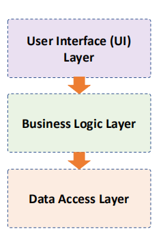

1）
<table>
<colgroup>
<col style="width: 100%" />
</colgroup>
<thead>
<tr class="header">
<th>
Context：所有复杂系统都需要独立开发和开发系统的部分。因此，系统的开发人员需要一个清晰的文档分离，以便系统的模块可以独立开发和维护。

Problem ：软件<mark>需要进行分割</mark>，使模块可以单独开发和开发，部件之间几乎没有交互，支持可移植性、可修改性和重用。

Solution：为了实现这种关注点的分离，分层模式将软件划分为称为层的单元。每一层都是提供一组有凝聚力的服务。该用法必须是单向的。层完全分区一组软件，每个分区通过一个公共接口公开。
</th>
</tr>
</thead>
<tbody>
<tr class="odd">
<td>

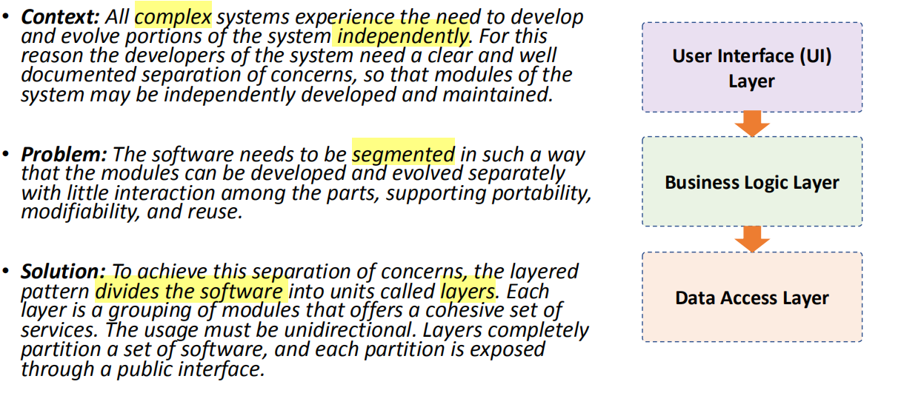
</td>
</tr>
</tbody>
</table>

2）
<table>
<colgroup>
<col style="width: 10%" />
<col style="width: 89%" />
</colgroup>
<thead>
<tr class="header">
<th>
优点

<blockquote>

如果维护接口，允许替换整个层。

各层均可提供冗余设施，以提高系统的可靠性。

</blockquote>

限制

<blockquote>

每一个软件都被精确地分配到了一层

至少有两层（但通常是三层或三层以上）。

允许使用的关系不应为圆形（即，较低的一层不应使用上面的一层）。

</blockquote>

缺点

<blockquote>

层的增加增加了<mark>系统的前期成本和复杂性</mark>。

图层会造成性能损失

</blockquote></th>
<th>

</th>
</tr>
</thead>
<tbody>
</tbody>
</table>

<table>
<colgroup>
<col style="width: 100%" />
</colgroup>
<thead>
<tr class="header">
<th>
用于建模子系统的接口 model the interfacing of sub-systems 。

组织成一系列的层的集合，每一层提供一层功能【例如计网中的模型】

能很好的支持：Incremental 增量式开发和交付

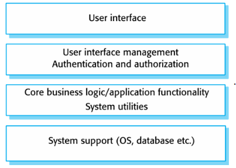

案例

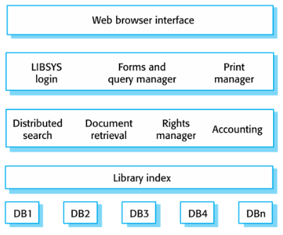
</th>
</tr>
</thead>
<tbody>
</tbody>
</table>

3，Model-View-Controller (MVC) Architecture）

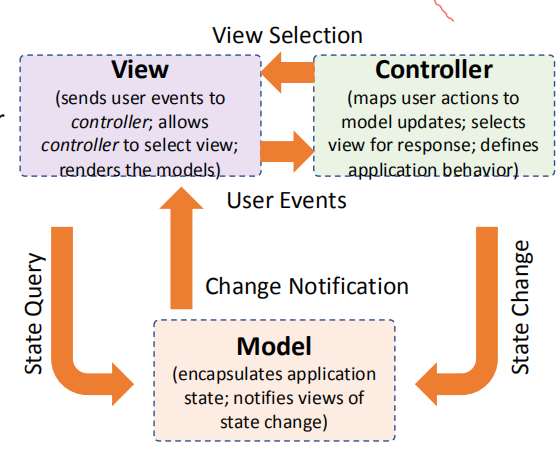

1）
<table>
<colgroup>
<col style="width: 100%" />
</colgroup>
<thead>
<tr class="header">
<th>
Context：<mark>用户界面通常是交互式应用程序中最频繁修改的部分</mark>。用户通常希望从不同的角度来看数据。这些表示形式都应反映数据的当前状态。

Problem 如何将用户界面功能与应用程序功能分开，同时仍然能对用户输入或底层应用程序数据的变化做出响应？当底层应用程序数据发生更改时，如何创建、维护和协调用户界面的多个视图？：

Solution：模型视图控制器(MVC)模式将应用程序功能划分为三种组件：

<blockquote>

包含应用程序数据的模型

显示部分基础数据并与用户交互的视图

一种控制器，它在模型和视图之间进行中介，并管理状态变化的通知

</blockquote></th>
</tr>
</thead>
<tbody>
<tr class="odd">
<td>
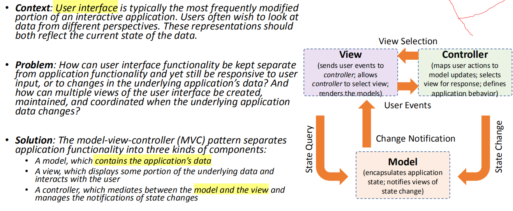

</td>
</tr>
</tbody>
</table>

2）
<table>
<colgroup>
<col style="width: 8%" />
<col style="width: 91%" />
</colgroup>
<thead>
<tr class="header">
<th>
优点

<blockquote>

<mark>允许数据独立于其表示方式进行更</mark>改，反之亦然。

以<mark>不同方式显示相同数据</mark>

</blockquote>

限制

<blockquote>

以不同方式显示相同数据

模型组件不应与控制器直接交互。

</blockquote>

缺点

<blockquote>

对于<mark>简单的用户界</mark>面来说，这种<mark>复杂性可能不值得</mark>。

它可能<mark>不太适合一些用户界面工具包</mark>

</blockquote></th>
<th>

</th>
</tr>
</thead>
<tbody>
</tbody>
</table>

3）要会分析这三类

Model-view-controller pattern 三个逻辑部件组成，彼此互相交互。
- Model：管理数据，封装数据。
- View：展示数据，可视化。
- controller：控==制数据流向模型对象==，并在数据变化时更新视图。它使视图与模型分离开。

<table>
<colgroup>
<col style="width: 54%" />
<col style="width: 45%" />
</colgroup>
<thead>
<tr class="header">
<th>
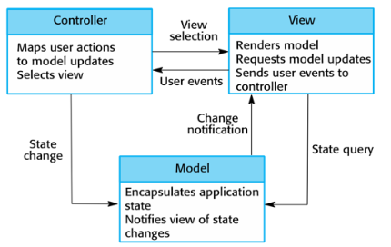

</th>
<th>
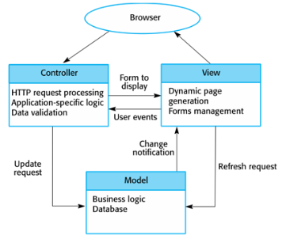

</th>
</tr>
</thead>
<tbody>
</tbody>
</table>
例子：Web application 使用 MVC pattern

<table>
<colgroup>
<col style="width: 34%" />
<col style="width: 65%" />
</colgroup>
<thead>
<tr class="header">
<th>
参考体系结构---Web应用程序

参考体系结构是指为特定类型的应用程序提供整体逻辑结构的蓝图

web应用程序通常通过使用HTTP协议与后端服务器进行通信的Web浏览器进行访问。

考虑使用参考体系结构时

When

<blockquote>

不需要一个丰富的用户界面

不希望安装任何客户端软件

可移植性和可访问性被导入到软件体系结构中

最小化对客户端资源的使用

</blockquote></th>
<th>
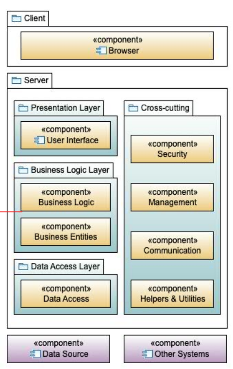

</th>
</tr>
</thead>
<tbody>
</tbody>
</table>

<table>
<colgroup>
<col style="width: 32%" />
<col style="width: 67%" />
</colgroup>
<thead>
<tr class="header">
<th>
参考体系结构--移动应用程序

移动应用程序通常安装在移动设备上，并由后端基础结构提供支持。

在以下情况下，请考虑使用参考体系结构：

<ul>
<li>
该移动应用程序有两个部分。<strong>在移动设备上运行的客户端部分和在这样的后端服务器上运行的服务部分</strong>，例如云环境
</li>
</ul>
<blockquote>

</blockquote>
<ul>
<li>
网络连接性不可靠。当网络不稳定时，客户端软件可以在没有后端服务时运行。
</li>
</ul></th>
<th>
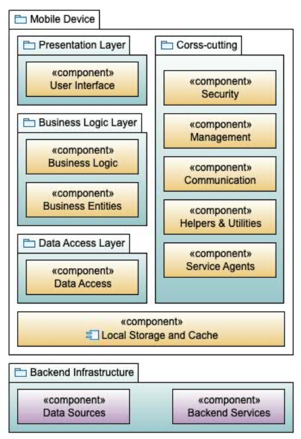

</th>
</tr>
</thead>
<tbody>
</tbody>
</table>

四、

1.建筑设计过程中的“拇指规则”
- 软件体系结构应该是一个架构师或一小组架构师的产品
  - 更好的概念完整性和技术一致性
- 架构师应根据定义良好的质量属性要求的优先级列表来建立体系结构
- 应评估体系结构提供系统重要质量属性的能力。
- 该体系结构不应依赖于商业产品或工具的特定版本。

2,“Good Design” vs. “Bad Design”

良好的架构可以成功地解决利益相关者的担忧，当这些问题发生冲突时，以利益相关者可以接受的方式平衡它们。”

没有所谓的好的或坏的架构。架构或多或少适合某种目的。

