9-用户界面(UI)设计和用户体验(UX)设计
2021年6月25日
8:20

## 一、Stress Testing应激测试
1，测试系统的故障行为。如果系统上的负载超过最大预期负载，可能通过意外的事件组合出现情况。在这些情况下，系统故障不应导致数据损坏或用户服务的意外丢失。压力测试检查系统过载是否会导致其“软故障”，而不是在负载下崩溃。

2，显示仅在系统满载时显示的缺陷。尽管可以认为这些缺陷不太可能导致系统故障，但可能存在压力测试复制的不同情况组合。
<table>
<colgroup>
<col style="width: 100%" />
</colgroup>
<thead>
<tr class="header">
<th>Q20: What is stress testing in software testing? In what situation, we should consider performing stress tests for a software system? Give an example to support your answer.</th>
</tr>
</thead>
<tbody>
<tr class="odd">
<td>
1.It refers to the <mark>testing of the software</mark> in determining whether its performance is satisfactory <mark>under extreme load conditions or not.</mark>它是指对软件进行测试，以确定其在极端负载条件下的性能是否令人满意。

2.We should consider this when <mark>circumstances may arise</mark> through <mark>an unexpected combination of events</mark> where the load placed on the system exceeds the maximum anticipated load.

For example, during festival time, an online shopping site may witness a spike in traffic, or when it announces a sale. It is imperative to perform Stress Testing to accommodate such abnormal traffic spikes. Failure to accommodate this sudden traffic may result in loss of revenue and repute.

当系统上的负载超过最大预期负载时，可能会出现意外的事件组合，我们应该考虑这一点。

例如，在节日期间，在线购物网站可能会出现流量高峰，或者当它宣布销售时。

必须执行压力测试以适应这种不正常的流量峰值。

不能容纳这种突然的流量可能会导致收入和声誉的损失。

1.

它是指对软件进行测试，以确定其在极端负载条件下的性能是否令人满意。

2.

当系统上的负载超过最大预期负载时，可能会出现意外的事件组合，我们应该考虑这一点。

例如，在节日期间，在线购物网站可能会出现流量高峰，或者当它宣布销售时。

必须执行压力测试以适应这种不正常的流量峰值。

不能容纳这种突然的流量可能会导致收入和声誉的损失。
</td>
</tr>
</tbody>
</table>

# User Interface (UI) Design & User Experience (UX) Design
用户界面(UI)设计和用户体验(UX)设计
考法：
给一个设计
让你评价
从各个角度出发

## 一、用户界面(UI)设计和用户体验(UX)设计
1，日常生活中的事物的设计
设计涉及事物是如何工作的，如何控制它们，以及人和技术之间互动的本质。
当做得好时，结果是辉煌的，令人愉快的产品
当做得不好时，这些产品就无法使用，会导致极大的沮丧和刺激。或者它们可能是可用的，但要强迫我们按照产品的意愿行事，而不是按照我们的意愿行事。

2，**Principles of Interactive UI Design**
计算机和接口应功能齐全、易于使用和直观

==The gulf of execution== and the ==gulf of evaluation:==
执行的鸿沟和评估的鸿沟：
执行的分歧：这是用户行动的意图与系统允许他们实现该行动的容易程度之间的差距。

评估的分歧：这是用户能够轻松理解和理解他们所执行的操作是否成功的程度。
• **Gulf of Execution**: This is the ==gap== between the intention of the user’s action
and how easily the system will allow them to achieve it. 【理想和现实的差距】
• **Gulf of evaluation**: This is the ==degree== of ease with which a user can perceive
and interpret whether, or not, the action they performed was successful.

3，Six Principles of Interactive UI Design
<table>
<colgroup>
<col style="width: 100%" />
</colgroup>
<thead>
<tr class="header">
<th>
<strong>1.可见性Visibility</strong>

用户需要知道所有的选项是什么，并立即知道如何访问它们

<strong>2.反馈Feedback</strong>

每个行动都需要一个反应。需要有一些迹象，比如声音、移动的拨盘、旋转的彩虹轮，表明用户的动作导致了一些东西

<strong>3.功能可见性Affordance</strong>

一旦有人看到一些东西，他们就必须知道如何使用它。

<strong>4.映射Mapping</strong>

<strong>Mapping is the relationship between <mark>control</mark> and <mark>effect</mark>.</strong>

映射是控制和效果之间的关系。其想法是，设计良好，对事物的控制会与它们的影响非常相似。一个很棒的映射例子是垂直滚动条。它告诉您在页面中的位置，当您向下拖动页面时，页面会以相同的速度向下移动；<mark>控制和效果被紧密映射</mark>

<strong>5.限制Constraints</strong>

约束是对交互或接口的限制。有些是非常明显的和物理physical的，例如手机上的屏幕大小。

<strong>6.一致性Consistency</strong>

同样的行动每次都必须引起同样的反应。
</th>
</tr>
</thead>
<tbody>
</tbody>
</table>

## 二，User Interface
1，UI
用户界面(UI)设计==侧重于预测用户可能需要做什么==，并确保界面包含的元素易于访问、理解和使用来方便这些操作。
UI汇集了来自交互设计、视觉设计和信息架构的概念。

- 用户界面设计 comes after system architecture design
- 为客户端的每个组件设计用户界面（或在MVC架构模式中的视图）
- 系统用户通常根据系统的界面而不是其功能来判断系统
- 一个设计不当的界面可能会导致用户出现错误
- 用户界面不良可能导致软件系统永远被使用
案例
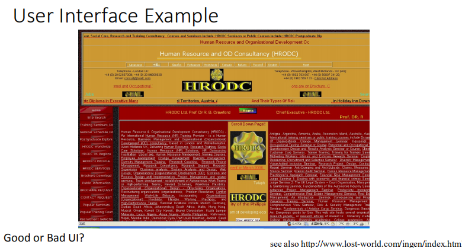

回答：坏的？

2，Interface Design Errors
典型的设计错误（可以从这里出发回答如何设计好的设计
- 缺乏一致性Lack of consistency
- 记忆太多了，没有指导/帮助Too much memorization No guidance / help
- 没有上下文敏感性No context sensitivity
- 反应不良Poor response
- 不友好的Unfriendly ，从常见的用户习惯考虑

3，Before Designing
需要考虑到：
- 用户是谁
- 互动的地方
- 进行什么活动（环境）

用户是谁在互动的地方进行什么活动（环境）
以使它们匹配用户的活动和需求

4，UI Principles
用户熟悉性/用户友好性User familiarity/User friendly，用户习惯出发
界面应该基于用户的角度而不是计算机的概念。

好的习惯，比如。从左侧读取并输入数据
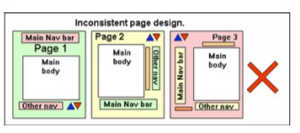
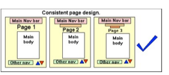

8，UI Principles (contd.)
<table>
<colgroup>
<col style="width: 100%" />
</colgroup>
<thead>
<tr class="header">
<th>
<strong>用户指导书User guidance</strong>

<blockquote>

一些用户指导，如帮助系统、在线手册等。应提供

</blockquote>

<strong>减少用户的内存负荷Reduce the user’s memory load</strong>

<blockquote>

减少对短期内存的需求，例如。用视觉线索来回忆起过去的行动，而不是必须回忆起它

e.g.亚马逊（和许多其他电子商务网站）向用户显示了他们最近访问过的物品列表。这些列表帮助用户记住完成几天前开始的购买。

</blockquote>

<strong>建立有意义的默认值Establish meaningful defaults</strong>

<strong>可恢复性（宽恕性）Recoverability (forgiveness)</strong>

<blockquote>

系统应为用户错误提供一些弹性，并允许用户从错误中恢复。这可能包括撤消设施、破坏性行动的确认、“软”删除等。

</blockquote></th>
</tr>
</thead>
<tbody>
</tbody>
</table>

9，用户界面开发过程
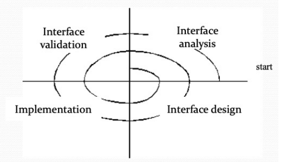

二、Interface
1，界面分析‘
界面分析意味着理解
将通过界面与系统进行交互的人员（最终用户）

最终用户在完成其工作时必须执行的任务

作为接口的一部分而呈现的内容

执行这些任务的环境。

2，界面设计步骤
使用界面分析过程中开发的信息来定义接口对象（GUI组件）和操作
定义将导致用户界面状态更改的事件（用户操作）。模拟这种行为。
删除每个界面状态，因为它实际上将面向最终用户。
指示用户如何从通过界面提供的信息中解释系统的状态
页面施工
从一个能够评估使用场景的原型开始

继续使用开发工具来完成施工
页面验证
页面正确实现每个用户任务、适应所有任务变化并实现所有一般用户需求的能力

该界面易于使用和易于学习的程度

用户接受界面作为他们工作中的有用工具
案例
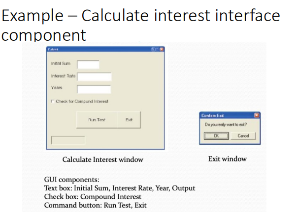

3，UI State diagram
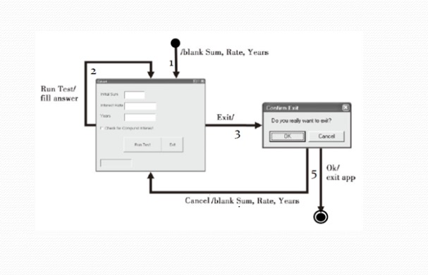

4，用户与系统之间的交互作用
交互式系统设计中必须解决的两个问题
- 应如何将来自用户的信息提供给计算机系统？
- 来自计算机系统的信息应如何提供给用户？

5，Interaction Styles
（要）
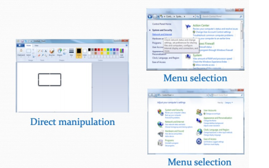

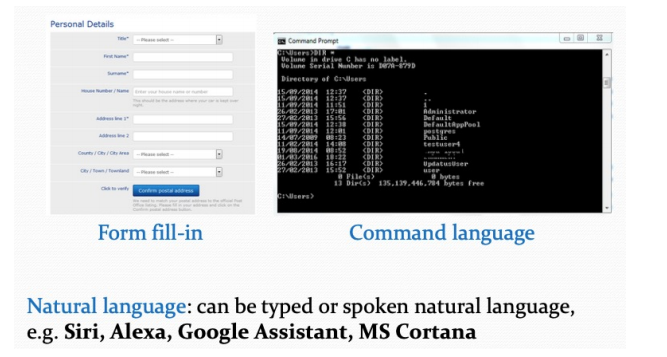
记住style
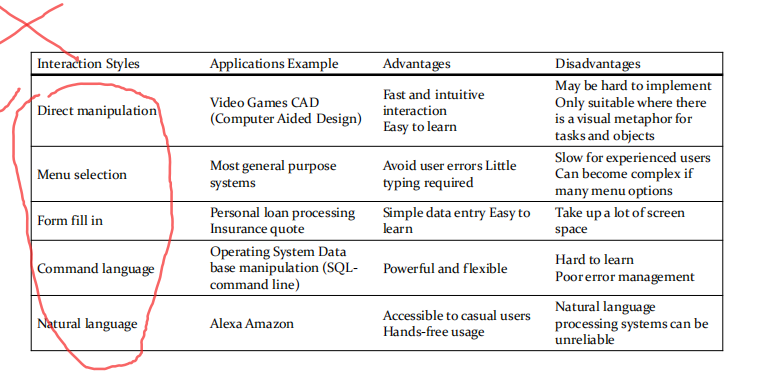
Interaction styles:
- Direct manipulation
- Menu selection
- Form fill in
- Command language
- Natural Language

## 三、information
1.Information presentation
信息表示是指向系统用户展示系统信息
这些信息可以直接呈现出来。或者可以以某种方式进行表示(例如。以某些图形形式表示）

2，信息呈现的因素
用户是否对精确的信息或数据关系感兴趣？
信息值变化的速度如何？必须立即指出该变更吗？
用户必须采取一些措施来应对更改吗？
是否有一个直接的操作接口？
信息是文本的还是数字？相对值是否重要？

3，Colour displays
(要)
- 颜色为界面添加了一==个额外的维度，并可以帮助用户理解复杂的信息结构==
- 颜色可以用==来突出特殊事件==
- 在界面设计中使用颜色时出现的常见错误包括：
  - 用来传达意义的颜色选择较差；
  - 显示屏中颜色的过度使用

4，GUI components
- 个人应用程序GUI
  - 内容设计
    - 主窗口
    - 第二个窗口：可以是对话框、消息框、标签文件夹、下拉列表
    - 表单、菜单栏、工具栏、滚动栏、状态栏、文本框、复选框、单选按钮、命令按钮等

- Web GUI
  - 内容设计
    - 类似的组件，如个人应用程序GUI和链接
  - 导航系统设计
    - 考虑导航的逻辑，用户不会迷失在网页的“超空间”。

5，User Interface evaluation
(根据这些回答问题)
应对用户界面设计进行一些评估，以评估其适宜性
理想情况下，应根据可用性规范来评估接口
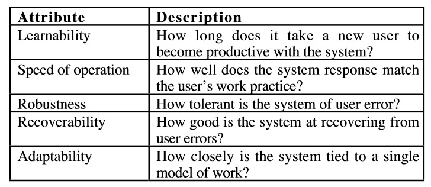
| learnability易学性 | 一个新用户需要多长时间才会对系统产生信息（让用户快速使用？ |
|--------------------|------------------------------------------------------------|
| Speed of operation | 对于用户的操作，系统需要多长时间响应                       |
| robustness         | 系统对于用户的错误操作的容忍性                             |
| recoverability     | 系统从用户错误中的恢复的能力如何                           |
| adaptability       | 系统和单一工作的联系有多紧密                               |
6，Key points
界面设计应以用户为中心。界面应该具有逻辑和一致，帮助用户从错误中恢复
交互样式包括直接操作、菜单系统、表单填写、命令语言和自然语言
应使用图形显示器来显示趋势和近似值。需要精确精度时的数字显示器
颜色应谨慎地使用和一致地使用
系统应提供在线帮助
错误消息应该是正的，而不是负的
应提供一系列不同类型的用户文档
理想情况下，用户界面应根据可用性规范来评估用户界面
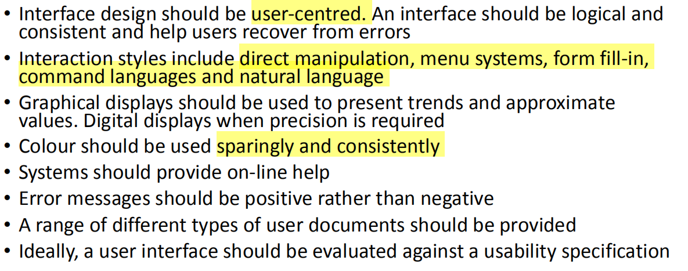
# 
# 四，User Experience (UX) Design
1，用户体验设计
用户体验（缩写为UX）是==用户与系统交互时的感觉==。how a person feels when interfacing with a system.
要想获得成功，无论它的功能有多好，用户都必须享受使用和浏览它

该系统可以是一个网站、一个网络应用程序或桌面软件，在现代情况下，通常用某种形式的人机交互(HCI)来表示。

2，Formal definition
用户与构成用户对整体感知的产品、服务或公司交互的各个方面。用户体验设计作为一门学科，涉及到共同构成该界面的所有元素，包括布局、视觉设计、文本、品牌、声音和交互。UX可以协调这些元素，以允许用户进行最佳的交互。

User experience professionals associated:

3，Hierarchy of Needs(重点)
最基本的需求从金字塔的底部开始，以最高需求结束。
如果基本需求没有得到满足，就很难找到满足更高需求的愿望和动力。
UX金字塔中的基本需求是functionality功能和信息information
更高的需求是美学和可用性。
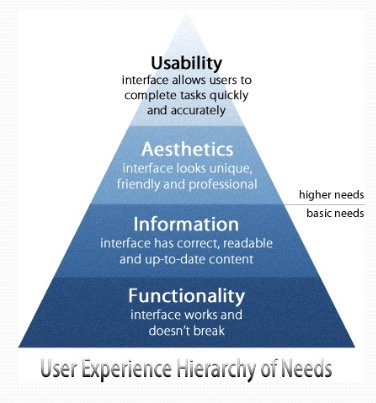

4，Functionality
界面最基本的需求是功能。当接口将工作而不中断时，就可以满足这种需求。它几乎没有错误，点击的一切都会把用户带到他们想要去的地方

要开始处理界面功能，必须知道界面将执行的任务以及如何执行。

5，Information and UX
要想有一个有意义的和有价值的用户体验，信息必须是
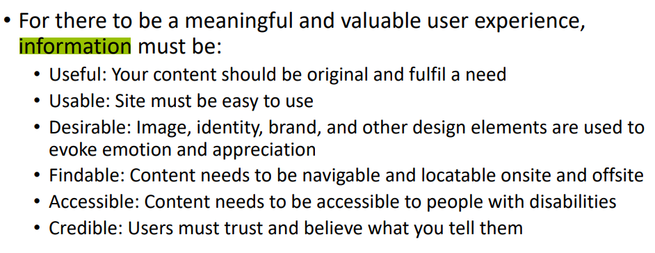

| Useful     | 您的内容应该是原创的，并满足了一种需要                     |
|------------|------------------------------------------------------------|
| Usable     | 网站必须易于使用                                           |
| Desirable  | 形象、身份、品牌等设计元素被用来唤起情感和欣赏             |
| Findable   | 内容需要在现场和场外定位                                   |
| Accessible | Content needs to be accessible to people with disabilities |
| Credible   | 用户必须信任和相信你告诉他们的话                           |
6，Aesthetics美学
美学是第一个更高的需求。为了满足这一需求，界面需要一个独特、友好和专业的外观，使其脱颖而出
良好的美学是会让用户记住的界面。它甚至可以帮助在你的用户中创建一个忠实的追随者。

通过检查美学，用户应该了解您的界面的价值和个性。

7，Usability
当大多数人谈到用户体验时，它们指的是可用性，即UX层次结构的最高需求。
可用性是指可==提高用户生产效率的界面的易用性。==
具有高可用性的界面允许用户快速、准确地完成任务。
然而，大多数界面很少实现其全容量的可用性。这是因为大多数界面都有许多任务，而且总是有些任务用户会犯错误。
为了充分满足这一需求，有必要分析用户完成界面中每项任务所需的准确性和速度
这就需要将界面放在用户面前，并观察他们的行为方式
它还需要关键的设计思维来想出澄清和简化用户流程的解决方案
当用户可以始终如一地快速完成每项任务而不会犯错误时，界面就会满足其可用性需求。
在最后一点上，用户体验可以总结为“用户是否有尽可能令人愉快的体验？”

8，UX is interdisciplinary

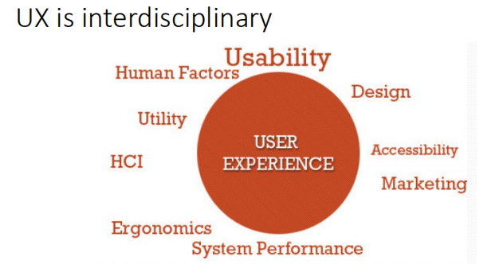

9，UX Designer
用户体验设计人员研究和评估用户对系统的感受，观察诸如易用性，以及对系统价值的感知
有在认知心理学方面的经验是很有用的
他们根据认知和行为的细节来描述人物形象，如动机、期望的结果和知识库。他们避免使用市场营销的人口统计术语，如婚姻状况、收入和就业状况。

10，UX Tools
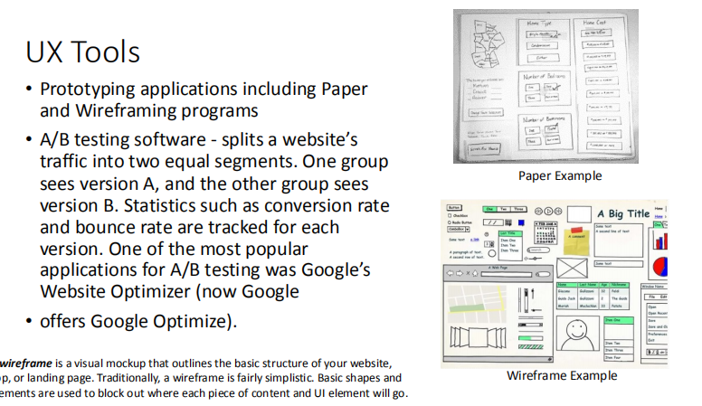

**11，UX Limitations & Difficulties**(要)
还不能有一个理想的UX设计，适合每个人，一些妥协必须发生
很难客观地衡量UX的有效性
传统的网页评估指标，如“已查看的页面”，不能用于评估UX设计的有效性
UX设计人员可能不一定有技术背景，这可能会导致与开发人员对设计建议的紧张关系

• ==Cannot yet== have the one ==ideal UX design== that works for everyone, some compromise has to happen
• Difficult to ==measure the effectiveness of UX objectively==
• Traditional web page assessment metrics such as ‘pages viewed’cannot be used to assess the effectiveness of a UX design
• UX designers may not necessarily have a technical background and this can lead tensions with the developers over design recommendations

