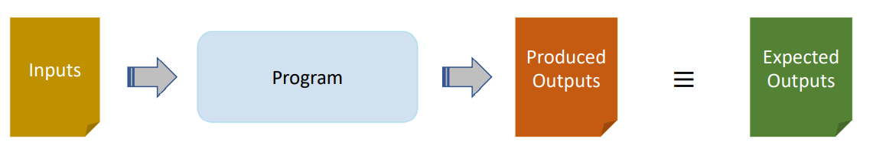
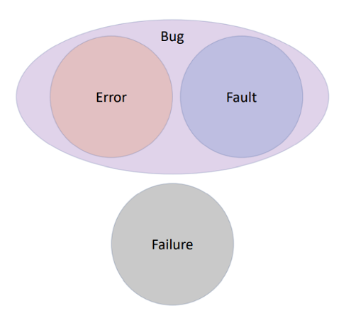
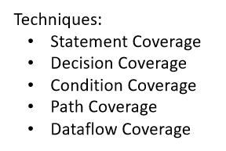

**L1, you need know all the concept about the software testing; you don't have to remember the use cases; you need to know all the terms associated with testing.**
## 
## 1，The Reasons for Testing Software
• To make a judgment about the quality of the software;
• To discover problems.

案例：
注：浮点数不能用等号比较
\|𝒏𝒖𝒎𝟏− \| 𝒏𝒖𝒎𝟐\<10^12成立，他们相等

## 2，Types of Testing
| Black-Box Testing                                                                                                                                                                                                                                                            | White-Box Testing                                                                                                                                                                                                           |
|------------------------------------------------------------------------------------------------------------------------------------------------------------------------------------------------------------------------------------------------------------------------------|-----------------------------------------------------------------------------------------------------------------------------------------------------------------------------------------------------------------------------|
| 基于requirement和specification                                                                                                                                                                                                                                               | 基于具体的软件实现                                                                                                                                                                                                          |
| 无需知道内部执行                                                                                                                                                                                                                                                             | 需要详细的编程能力                                                                                                                                                                                                          |
|  |  |
| Tests只依赖specification                                                                                                                                                                                                                                                     | 依赖implementation和specification                                                                                                                                                                                           |
| implementation的改变不影响test cases                                                                                                                                                                                                                                         | code的改变有影响test cases                                                                                                                                                                                                  |
| 测试和软件开发可以并行                                                                                                                                                                                                                                                       | 实现后才能测试                                                                                                                                                                                                              |
| 不能保证都测试                                                                                                                                                                                                                                                               | 难以保证specification被完全覆盖                                                                                                                                                                                             |
| 难以衡量测试的效率                                                                                                                                                                                                                                                           | Relatively easy to automate measure of the effectiveness.                                                                                                                                                                   |
## 3，Specification and Requirement
| requirement   | 一个系统或系统组件必须满足或拥有的软件能力，以满足合同、标准、规范或其他正式实施的文件。 |
|---------------|------------------------------------------------------------------------------------------|
| specification | 为开发或验证某一系统而提供对该系统的明确描述的文件形式的详细表述。                       |
## 4，Levels of Testing
| Unit Testing        | 测试一小块单独程序                                                         |
|---------------------|----------------------------------------------------------------------------|
| Integration Testing | 把units组合到子系统，确保他们交互操作正确                                  |
| System Testing      | 整个软件，可能包含软件硬件和开发环境                                       |
| Acceptance Testing  | 测试完整的系统，测试后客户会接受的程度                                     |
|                    |                                                                           |
| Regression Testing  | 当添加了新的单元，或者修改了现有的单元时，执行先前的测试以确保软件的完整性 |
| Module Testing      | 评估软件的详细设计                                                         |
