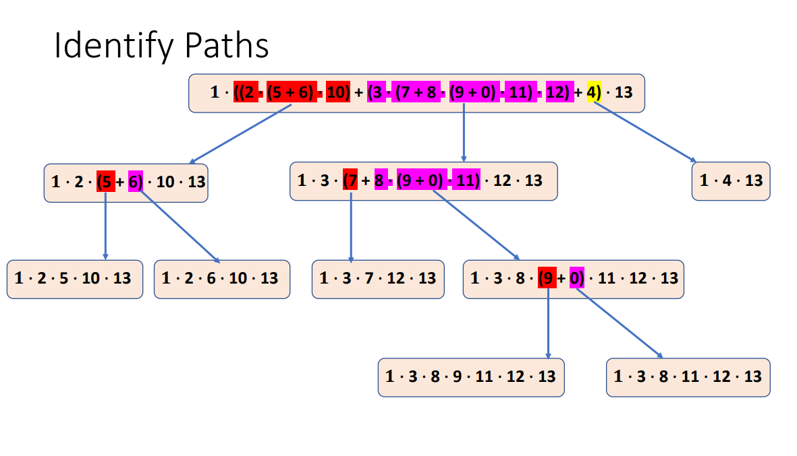

一，基本了解
1，路径测试测试**从入口到出口的所有可能路径**
2，选择输入数据来触发每个路径的执行，分析源代码。
期望输出来自规范。
3，**目标是实现代码中所有路径的完全覆盖。**

二、步骤
1，步骤
**1）根据题目画出流程图**
**2）画path情况，必须经过所有的可能（注意分支的多种情况）**
**3）每一种path都是一条test case**
**4）列出test data**
**5）测试**
案例

1）根据题目画出流程图
2）画path情况，必须经过所有的可能（注意分支的多种情况）

3）每一种path都是一条test case
4）列出test data

5）测试

三，Deal with Loops
1，

,2，
**The flow of contro**l can be represented as a **regular expression**.
The regular expression for the control flow graph can be used to identity the number of source-to-sink (end-to-end) paths.
Code segments for loops can be assumed to executed exactly zero or one times.

| Concatenation | .     | represents a sequence of nodes in the graph   |
|---------------|-------|-----------------------------------------------|
| Selection     | \+    | represents a decision in the graph            |
| Iteration     | ( )\* | represents a repetition in the graph.表示重复 |

三、计算路径【if有else的情况】

2,所有数字换1
3，计算的出路径数目
4，确定路径分支：针对加号的数，分出，为一条路径
5，注意 **（xxx）\* 计算的时候 (xxx+0)\*【**很重要，对后面换1有影响

四、计算路径--》处理没有else的情况

• For null else statements, where there is an if, but without else, the expression (n + 0) is used.
• The node n represents the true decision.
• The **node 0 represents the null else decision.**

|          |
|----------------------------------------------------------------------------------------------------------------------------------------------------------------------------------------------|
|  |

一条路径为一个test data

总结
Summary
•与决策和条件覆盖相比，它测试了**一些使用其他技术无法找到的路径组合** Compare to the Decision and Condition Coverage, it tests some combinations of
paths that cannot be found using other techniques.
• 如果程序包含许多路径，就测试执行时间而言是昂贵的 It can be expensive in terms of test execution time, if the program contains many
paths.
•**它没有明确评估每个决策的条件** It does NOT explicitly evaluate the conditions in each decision.
•在一个复杂的程序中很难识别所有路径 It can be difficult to identify all paths in a complex program.

补充案例

