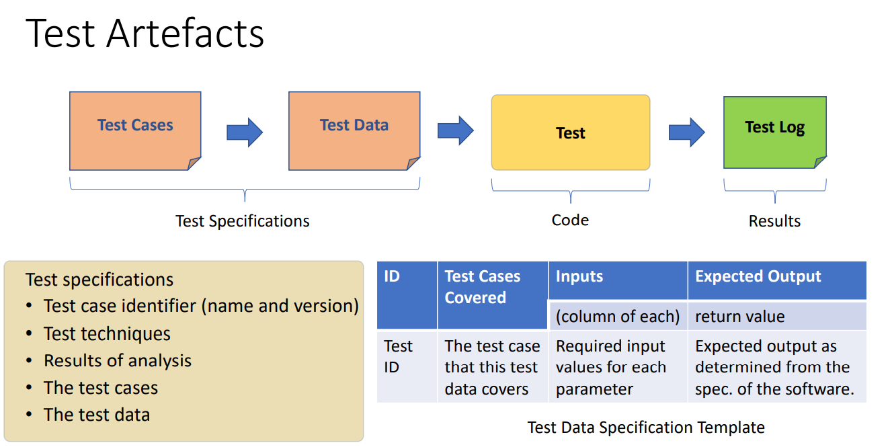

1，Software Testing Approaches
| Static Verification  | 人工看code来测试        |
|----------------------|-------------------------|
| Dynamic Verification | 通过程序（本课程focus） |

2，Static Verification三种方法
Walk-throughs, Code Reviews/Inspections, Formal Methods

3，Test Design Process
• Analyzing the Software Under Test (SUT)
• Generating the test cases
• Generating the test data
• Implementing the test

4，

