一，基本了解
1，Functional Testing
别名：Black-Box Testing ,Specification-Based Testing
优点：助我们选择有效的有错误的子测试
缺点：无法确定测试的系统个数
2，
Techniques
Each was developed to cover a particular aspect of the specification
<table>
<colgroup>
<col style="width: 100%" />
</colgroup>
<thead>
<tr class="header">
<th>
Equivalence Class Testing

Boundary Value Testing

Combinational Testing

Sequential (State-based) Testing

Testing with Random Data

Error Guessing/Expert Testing
</th>
</tr>
</thead>
<tbody>
</tbody>
</table>

3，Equivalence Class Testing
A，概述
（1）将测试用例的数量减少到一个可管理的水平，同时保持合理的测试覆盖率。
（2）将输入域或输出范围分割为有限数量的子域/子范围(即分区或价类)
（3）选一个代表值测试
（4）如果被测试的软件使用代表值通过，测试时，我们假设等价类中的所有值都是正确的
B，性质
互斥 and collectively exhaustive

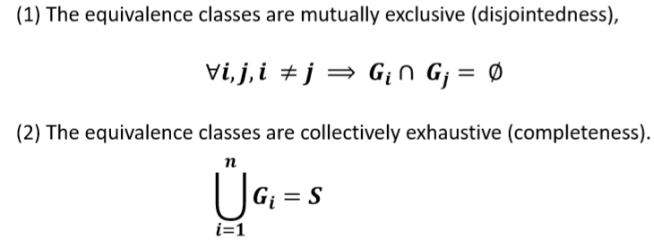

二，等价测试的步骤
1，步骤
<table>
<colgroup>
<col style="width: 100%" />
</colgroup>
<thead>
<tr class="header">
<th>
1，根据题目，分析出所有的输入和输出的可能性【合法+非法】

输入的数：如果是连续范围，要全覆盖；如果是一个集合，所有情况都包含

2，列出Test Case

（1）要写出非法输入和不预期出现的值

<blockquote>

非法的值标志*，<strong>(*)表示错误(此时的错误不代表false)的test，必须被单独测试</strong>

</blockquote>

3，Test Data

（1）根据指定范围选取代表值作为测试数据

<blockquote>

非法的放在最后一起测，非法不要和合法的一起测试

</blockquote>

（2）再次出现的值打[]

4，进行测试
</th>
</tr>
</thead>
<tbody>
</tbody>
</table>

案例
<table>
<colgroup>
<col style="width: 100%" />
</colgroup>
<thead>
<tr class="header">
<th>
2，案例

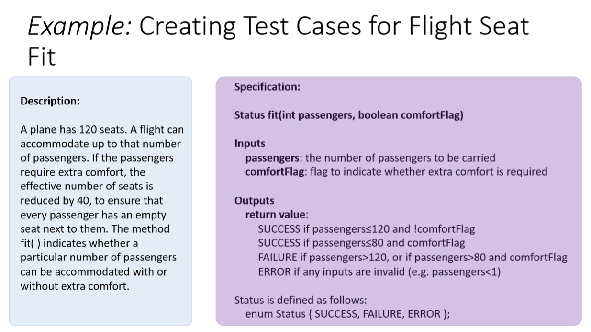

1，根据题目，分析出所有的输入和输出的可能性【合法+非法】

输入的数：如果是连续范围，要全覆盖；如果是一个集合，所有情况都包含

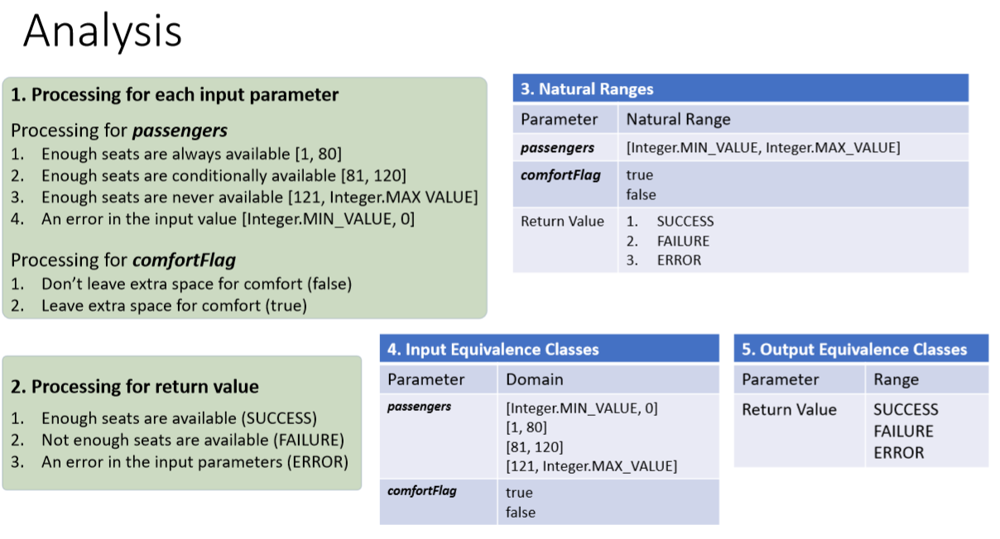

2，列出Test Case

（1）要写出非法输入和不预期出现的值

<blockquote>

非法的值标志*，<strong>(*)表示错误(此时的错误不代表false)的test，必须被单独测试</strong>

</blockquote>

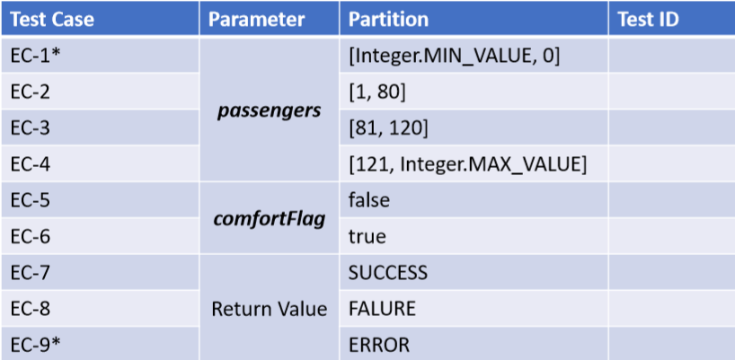

3，Test Data

（1）根据指定范围选取代表值作为测试数据

非法的放在最后一起测，非法不要和合法的一起测试

（2）再次出现的值打[]

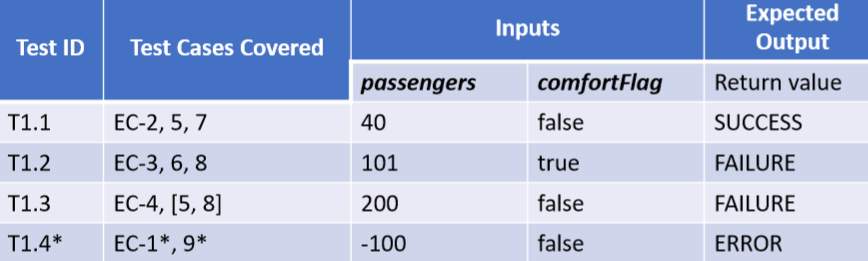

完善test case

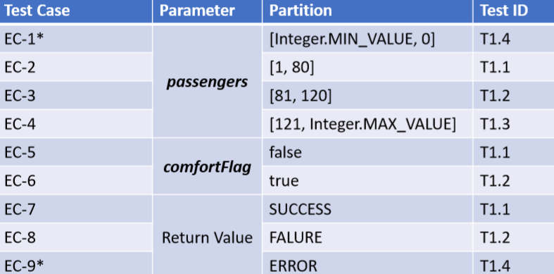

4，进行测试

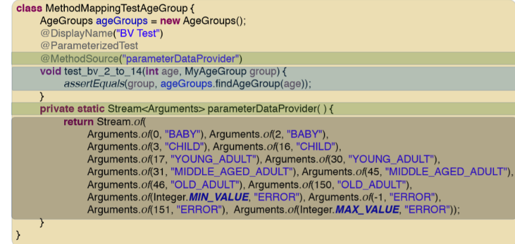

</th>
</tr>
</thead>
<tbody>
</tbody>
</table>
2，测试方式
方法1：A Naïve Approach

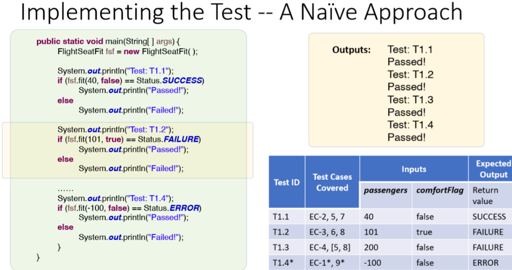

方法2：Using Testing Frameworks
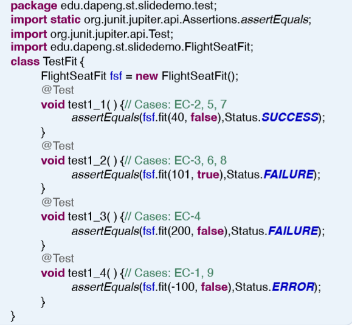

方法3【常用】

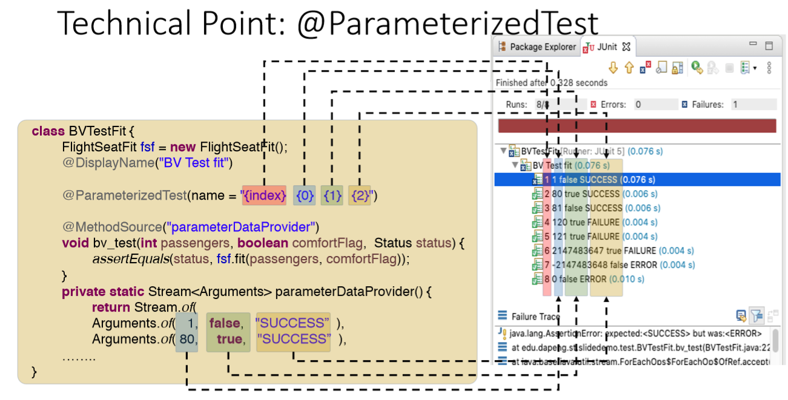

3，导入数据方式
导入数据方式【少量数据时】
方法1

方法2
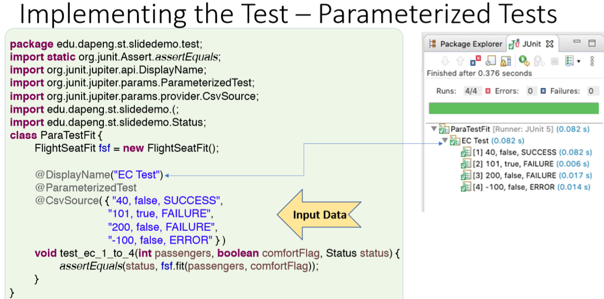

导入数据方式2【大量数据】
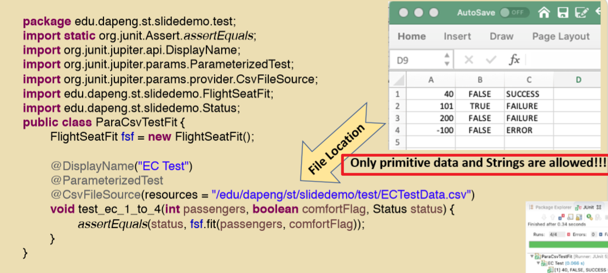

| @DisplayName   | 测试的名字                         |
|----------------|------------------------------------|
| @Parameterized | 参数化测试使用不同参数多次运行测试 |

<table>
<colgroup>
<col style="width: 92%" />
<col style="width: 7%" />
</colgroup>
<thead>
<tr class="header">
<th>
@CsvSourse（{数据1，数据2，数据三1}）

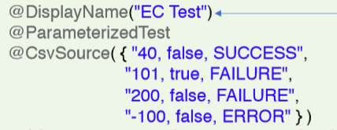

</th>
<th>在此处输入要测试的数据，此时输入的都为字符串类型，在对应的方法中，数据会自动转换成所要求的类型</th>
</tr>
</thead>
<tbody>
<tr class="odd">
<td>
@CsvFileSource(resources="文件路径")

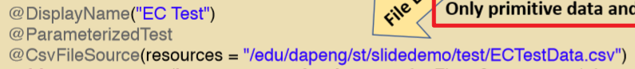

</td>
<td>通过excel文件来获取数据，文件存放的只允许是基本数据类型和字符串</td>
</tr>
</tbody>
</table>

5，其他测试
5.1，Weak Normal Equivalence Class Testing
<table>
<colgroup>
<col style="width: 100%" />
</colgroup>
<thead>
<tr class="header">
<th>
弱正规测试

1.在测试用例中从每个等价类中使用一个变量（单故障假设）

2.在期望值比较低的时候，可以使用此方法
</th>
</tr>
</thead>
<tbody>
</tbody>
</table>

5.2 Strong Normal Equivalence Class Testing
<table>
<colgroup>
<col style="width: 100%" />
</colgroup>
<thead>
<tr class="header">
<th>
<strong>测试所有有效域的组合(多故障假设)</strong>

它的测试用例数量等于所有参数的有效域数量的乘积。
</th>
</tr>
</thead>
<tbody>
</tbody>
</table>

5.3Weak Robust Equivalence Class Testing
<table>
<colgroup>
<col style="width: 100%" />
</colgroup>
<thead>
<tr class="header">
<th>
每个有效和无效域的一个测试用例(单一故障假设)

仍然基于单一故障假设，但测试有效和无效域,比弱正规等价类测试强

注意如何为无效域选择测试用例(提示:假设单个故障)
</th>
</tr>
</thead>
<tbody>
</tbody>
</table>

5.4Strong Robust Equivalence Class Testing
**测试有效和无效域的所有组合(多故障假设**

完全符合完整性和不完整性的性质(全面)
执行这样一个完整的测试可能太耗时。
•根据软件设计过程的不同，可能根本不需要一个健壮的测试

5.5
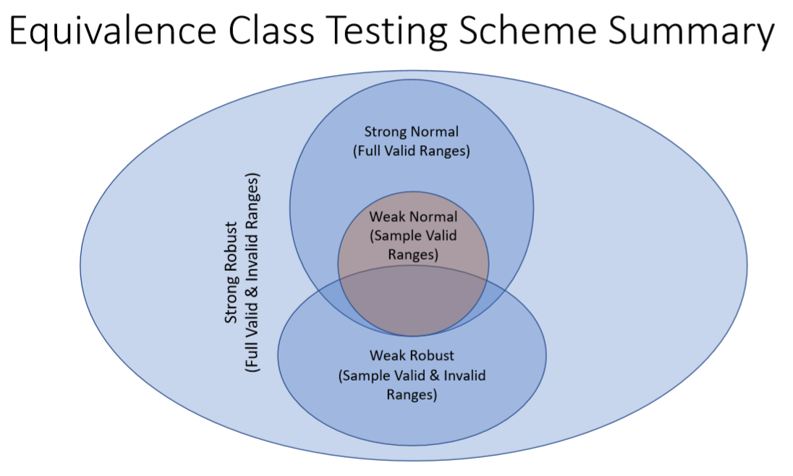
| Weak Normal Equivalence Class Testing   | 部分样本的有些范围       |
|-----------------------------------------|--------------------------|
| Strong Normal Equivalence Class Testing | 所有的有效范围           |
| Weak Robust Equivalence Class Testing   | 部分有效范围和无效范围   |
| Strong Robust Equivalence Class Testing | 所有的有效范围和无效范围 |

6，Design-by-Contract vs. Defensive Design
不同情况选择不同测试
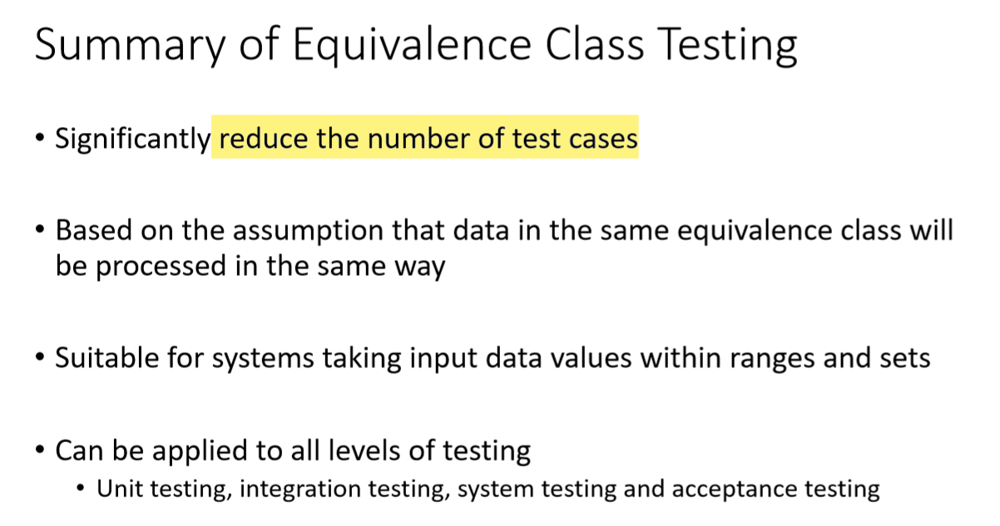

