真值表
1,
• Identify all the combinations of input to the software and associated output.

• The **inputs** to the software is called the **Causes**; the associated **output** is called the **Effects**.
| 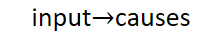 |
|------------------------------------------------------------------------------------------------------------------------|
| 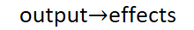 |

• These Causesand Effectsare combined in **a truth table** that describes their relationship.

2,目的：To identify **a minimum subset of the possible combinations** that will test all the different behaviors of the program.

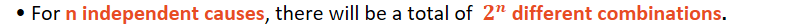

• **Causes and Effects** must be expressed as **Boolean expressions**.

3，步骤：
<table>
<colgroup>
<col style="width: 100%" />
</colgroup>
<thead>
<tr class="header">
<th>
1，根据题目，列出causes【input】和effects【output】

2，对于causes：

<blockquote>

1）先分裂开单个形式

2）根据符号组合

3）根据大小排序

4）消除多余的causes（消除相反的causes，不要冗余）

（为什么要组合和排序的过程呢？）

</blockquote>

3，画真值表

<blockquote>

1）<strong>表内不包含非法的情况【为了控制真值表的大小】</strong>

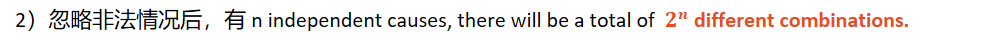

3）effects完全相同，causes只有一个不相等的不同列，该不相等的cause可以视为 don't care condition,(对结果没有影响)，用<strong>*</strong>来表示，合并不同列

4）剩余的情况作为rules

</blockquote>

4，画出test case，test data

5，进行测试，找出错误

6，修改原码

<strong>7，如果输入的组合可能导致错误，那么可以使用单独的表，只包含错误输出</strong>

<strong>If combinations of inputs can cause errors, a separate table may be used, covering just the error outputs</strong>

</th>
</tr>
</thead>
<tbody>
</tbody>
</table>

案例
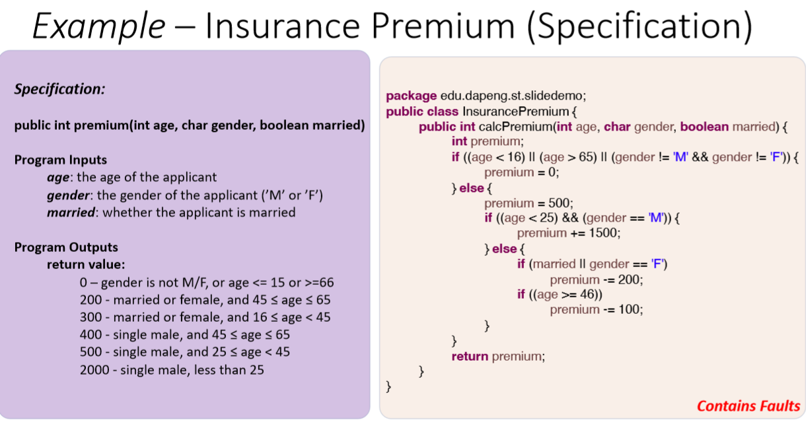

1，根据题目，列出causes和effects
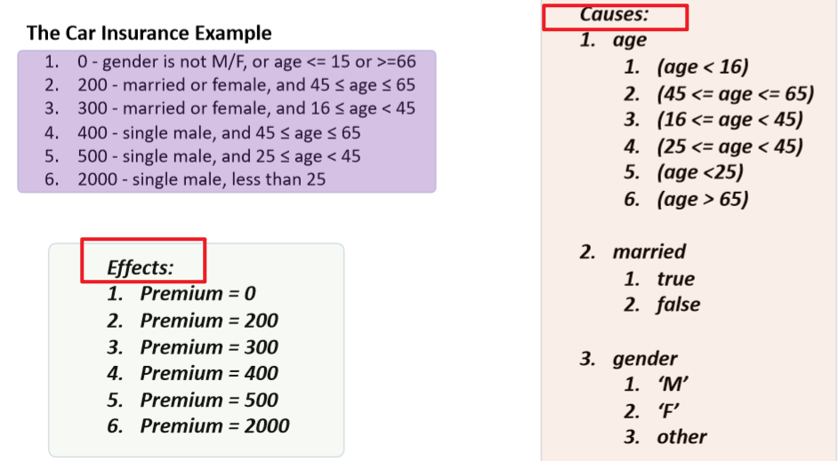

2，对于causes：
1）先分裂开单个形式

2）根据符号组合

3）根据大小排序

4）消除多余的causes**（消除相反的causes，不要冗余）**

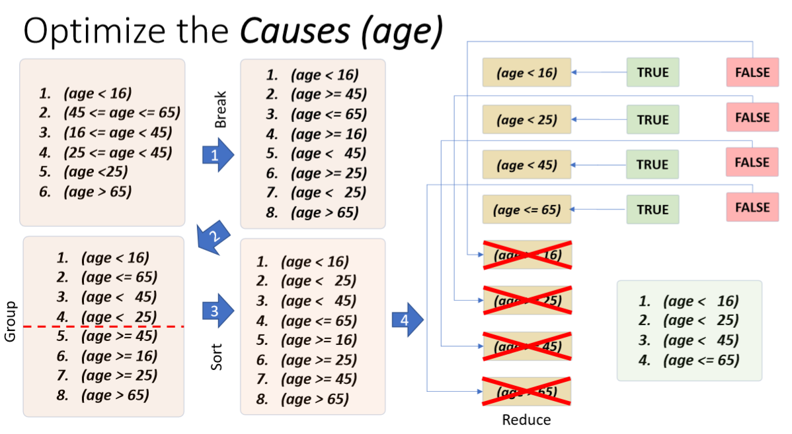

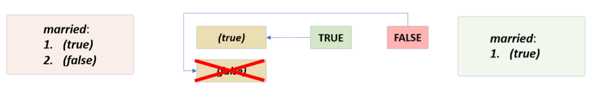

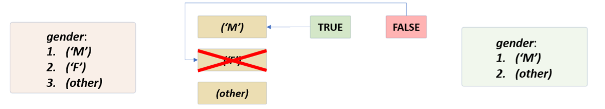
3，画真值表
1）表内不包含非法的情况：为了控制真值表的大小

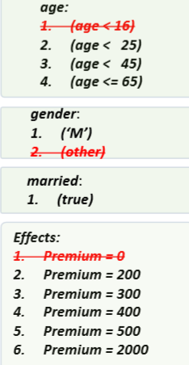

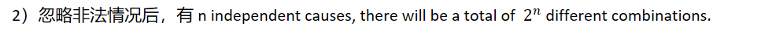

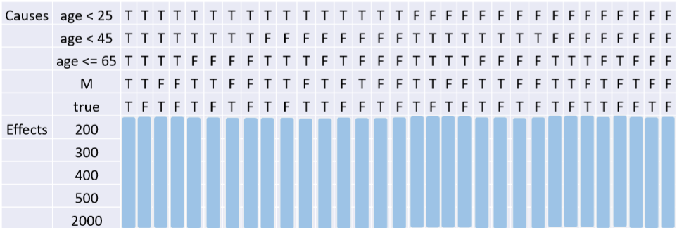

3）effects完全相同，causes只有一个不相等的不同列，该不相等的cause可以视为 don't care condition,(对结果没有影响),用\*来表示，合并不同列

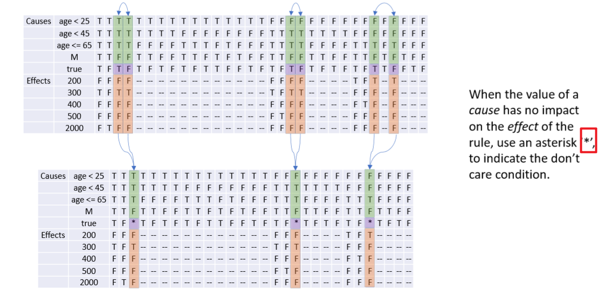

4）剩余的情况作为rules

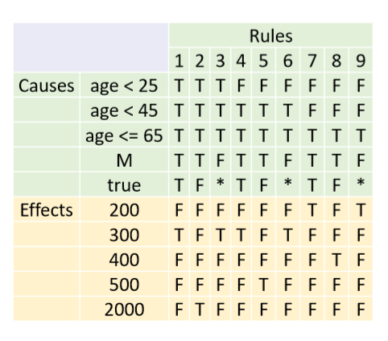
4，画出test case，test data

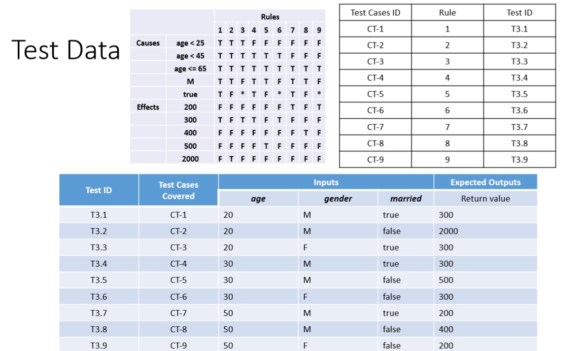
5，进行测试，找出错误

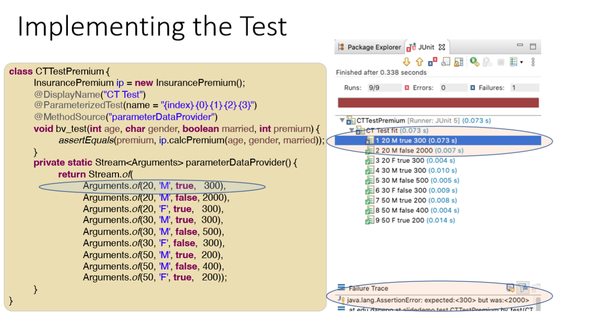

6，修改原码

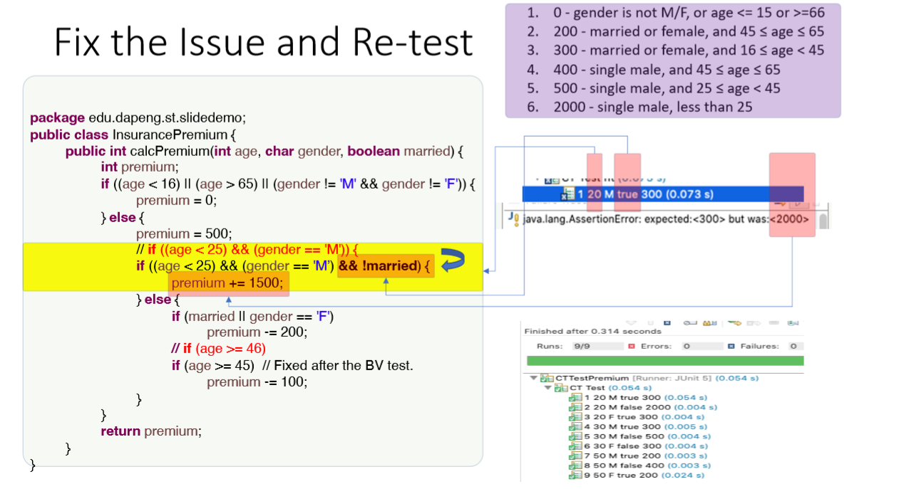

