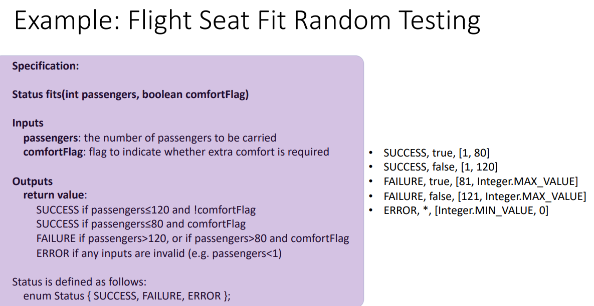
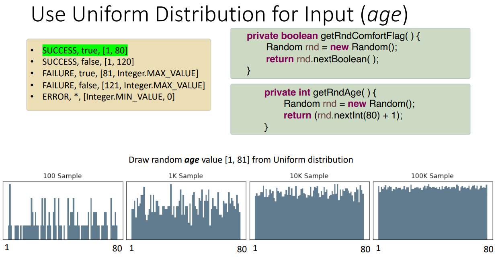
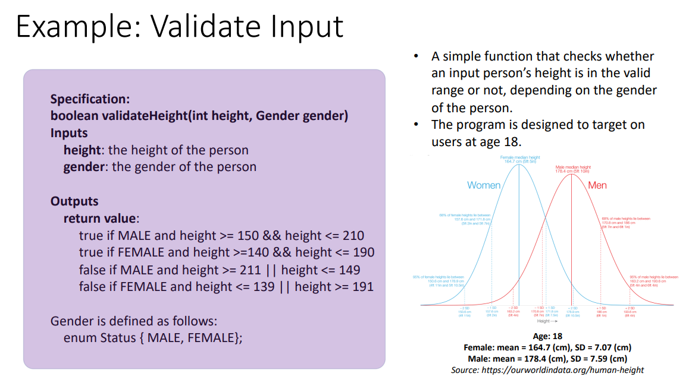
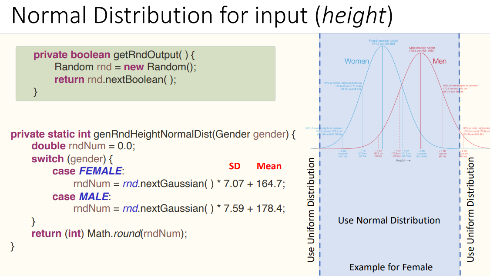
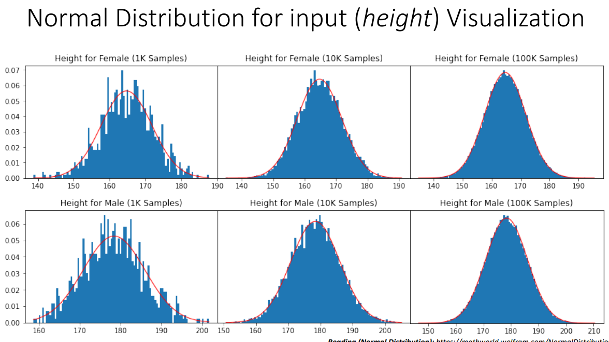

一，基本知识
1，随机测试
•搜索故障的概率方法。
•以统计的方式评估软件的质量。
•**随机生成的数据被用作软件的输入。**
•分布可以是均匀的，也可以选择模仿输入的类型
该软件将得到实际使用。
•单元测试中经常使用**均匀分布的随机数据**。

2，test cases
每个测试用例由一组随机选择/生成的值表示，通常以每个参数为基础。
每个测试用例由一个特定参数的值分布表示。
通常包括上界和下界以及用于在范围内选择随机值的分布。

3，test data
based on the test case.
<table>
<colgroup>
<col style="width: 100%" />
</colgroup>
<thead>
<tr class="header">
<th>
生成测试数据的常见方法:

1.

随机选择输出，然后选择将产生所选输出的匹配输入值。

2.

用高级语言编写测试Oracle。

3.

使用后置条件来确定输出在生成之后的有效性(而不是在测试运行之前使用预期的输出值)。
</th>
</tr>
</thead>
<tbody>
</tbody>
</table>

案例

案例2

总结
快速生成测试用例。
•可以为选择一组合适的输入值提供数学基础。
•可能测试的是一组不充分的极端值或非法值。
•如果输入的分布是未知的，所选的输入值可能不能反映典型的用法。
If the distribution of the input is unknown the input value chosen may
not reflect typical usage.

