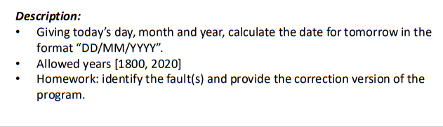
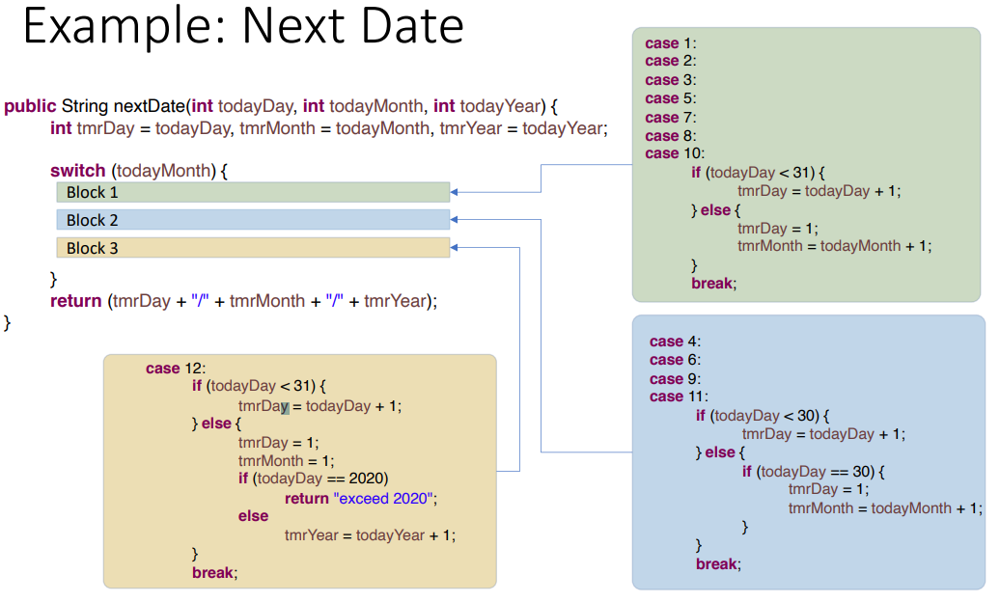

1，It is an ad-hoc approach based on domain expert knowledge and
experience, aka, Expert Opinion .

• Test data is selected that is likely to **expose faults in the implementation.**

Empty/null strings, uninitialized list, zero in division, indicator of a battery

level is over 100%, passenger airplane cannot take off when ground

temperature is above 120oF.

• The technique is very efficient, as **it focuses on likely faults.**

**2，案例**

