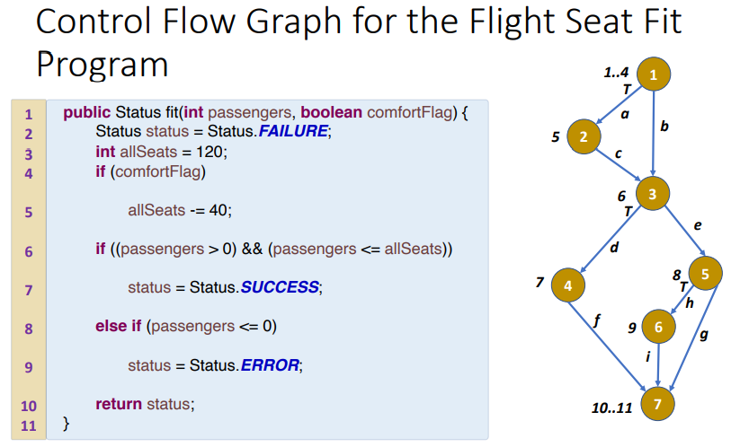
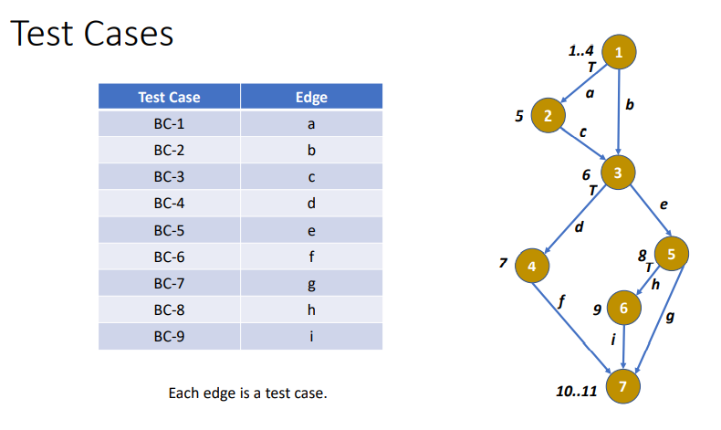
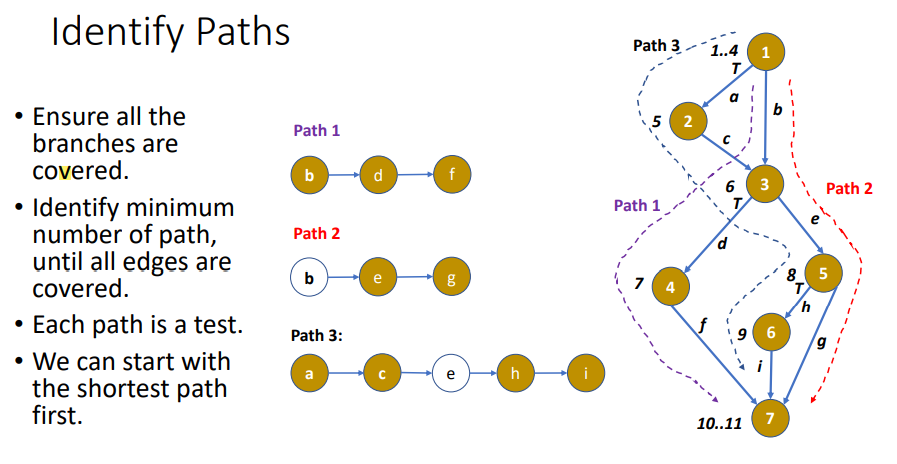
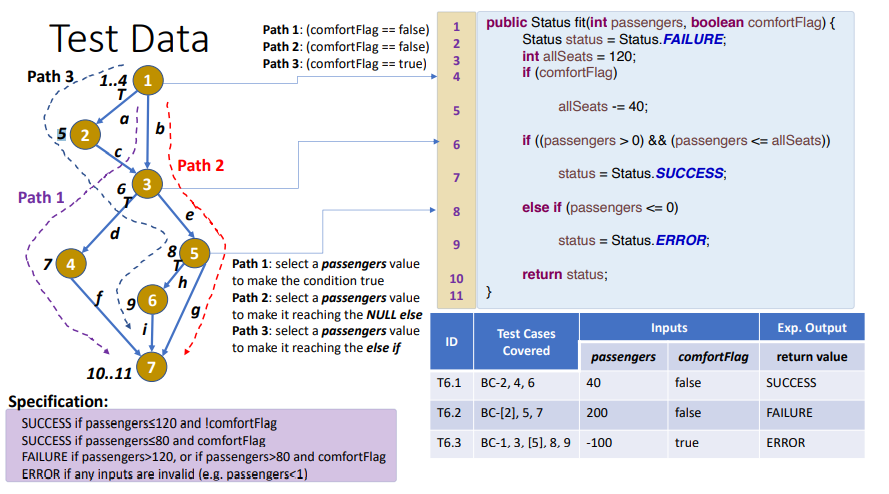
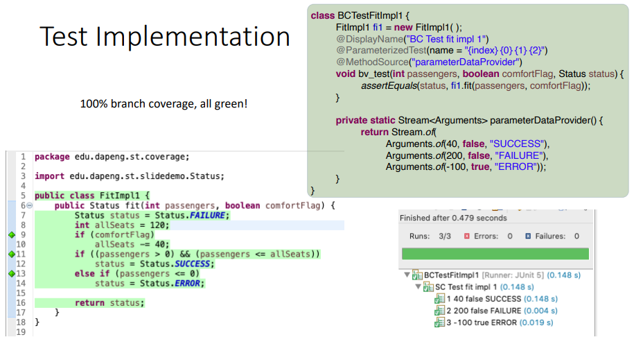

一，基础知识
1，与statement coverage类似，statement coverage是要覆盖所有nodes，branch coverage是要覆盖所有分支（a,b,c,d…）
• Branch coverage is **a stronger form** of testing than Statement Coverage

2,The goal of Branch Coverage is to **make sure that all branches** in the
source code have been **checked** during testing,
**100% branch coverage guarantees 100% statement coverage**.

**3,基于节点图【**control flow graph.**】**

4，Test Cases and Test Data
在控制流图中，源代码中的每个分支都是一个测试
用例，即图中的每条边都是一个测试用例。

二、步骤
1，根据代码，画出节点图
2，确定test cases，每条分支为一个case
3，find paths，所有的**分支**都要被覆盖，path数量要最小的，
4，列出test data
5，测试，找出错误，修正

案例

1，根据代码，画出节点图
2，确定test cases，每条分支为一个case

3，find paths，所有的**分支**都要被覆盖，path数量要最小的，

4，列出test data

