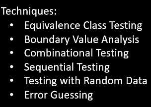

黑盒测试
2020年9月25日
8:56

| Black-Box Testing                                                                                                                                                                                                                                                            |
|------------------------------------------------------------------------------------------------------------------------------------------------------------------------------------------------------------------------------------------------------------------------------|
| 基于requirement和specification                                                                                                                                                                                                                                               |
| 无需知道内部执行                                                                                                                                                                                                                                                             |
|  |
| Tests只依赖specification                                                                                                                                                                                                                                                     |
| implementation的改变不影响test cases                                                                                                                                                                                                                                         |
| 测试和软件开发可以并行                                                                                                                                                                                                                                                       |
| 不能保证都测试                                                                                                                                                                                                                                                               |
| 难以衡量测试的效率                                                                                                                                                                                                                                                           |
