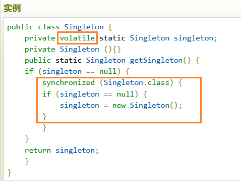

## 1，定义
<table>
<colgroup>
<col style="width: 8%" />
<col style="width: 91%" />
</colgroup>
<thead>
<tr class="header">
<th>官方的</th>
<th>
这种类型的设计模式属于创建型模式，它提供了一种创建对象的最佳方式。

这种模式涉及到一个单一的类，该类负责创建自己的对象，同时确保只有单个对象被创建。这个类提供了一种访问其唯一的对象的方式，可以直接访问，不需要实例化该类的对象。
</th>
</tr>
</thead>
<tbody>
<tr class="odd">
<td>通俗的</td>
<td></td>
</tr>
<tr class="even">
<td>意图</td>
<td><strong>保证一个类仅有一个实例，并提供一个访问它的全局访问点</strong>。</td>
</tr>
</tbody>
</table>
注意
1、单例类只能有一个实例。

2、单例类必须自己创建自己的唯一实例。

3、单例类必须给所有其他对象提供这一实例

## 2，各类含义，UML

（1）懒汉式，线程不安全
是否 Lazy 初始化：是
是否多线程安全：否
实现难度：易
描述：这种方式是最基本的实现方式，这种实现最大的问题就是不支持多线程。因为没有加锁 synchronized，所以严格意义上它并不算单例模式。
这种方式 lazy loading 很明显，不要求线程安全，在多线程不能正常工作。

（2）、懒汉式，线程安全

是否 Lazy 初始化：是

是否多线程安全：是

实现难度：易

描述：这种方式具备很好的 lazy loading，能够在多线程中很好的工作，但是，效率很低，99% 情况下不需要同步。

**优点：第一次调用才初始化，避免内存浪费。**
**缺点：必须加锁 synchronized 才能保证单例，但加锁会影响效率**。
getInstance() 的性能对应用程序不是很关键（该方法使用不太频繁）。

（3）、饿汉式

是否 Lazy 初始化：否

是否多线程安全：是

实现难度：易

描述：这种方式比较常用，但容易产生垃圾对象。
优点：没有加锁，执行效率会提高。
缺点：类加载时就初始化，浪费内存。
它基于 classloader 机制避免了多线程的同步问题，不过，instance 在类装载时就实例化，虽然导致类装载的原因有很多种，在单例模式中大多数都是调用 getInstance 方法， 但是也不能确定有其他的方式（或者其他的静态方法）导致类装载，这时候初始化 instance 显然没有达到 lazy loading 的效果。

（4）双检锁/双重校验锁（DCL，即 double-checked locking）

是否 Lazy 初始化：是
是否多线程安全：是
实现难度：较复杂

描述：这种方式采用双锁机制，安全且在多线程情况下能保持高性能。
getInstance() 的性能对应用程序很关键。

枚举式 好于 饿汉式
静态内部类式 好于 懒汉式

4，优缺点
优点：
1、在内存里只有一个实例，减少了内存的开销，尤其是频繁的创建和销毁实例（比如管理学院首页页面缓存）。
2、避免对资源的多重占用（比如写文件操作）。

缺点：
没有接口，不能继承，与单一职责原则冲突，一个类应该只关心内部逻辑，而不关心外面怎么样来实例化。

5，适用场景
：当您想控制实例数目，节省系统资源的时候。
1、要求生产唯一序列号。
2、WEB 中的计数器，不用每次刷新都在数据库里加一次，用单例先缓存起来。
3、创建的一个对象需要消耗的资源过多，比如 I/O 与数据库的连接等。

