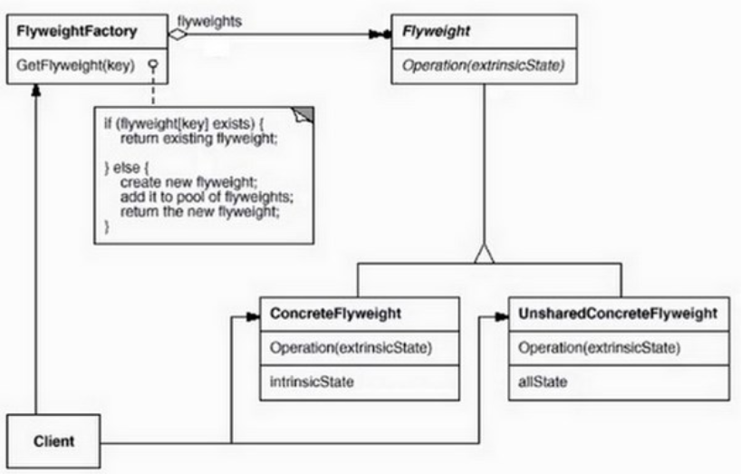
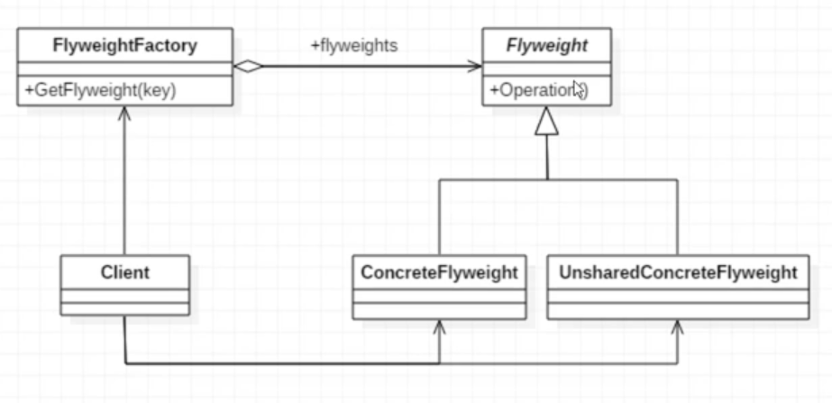
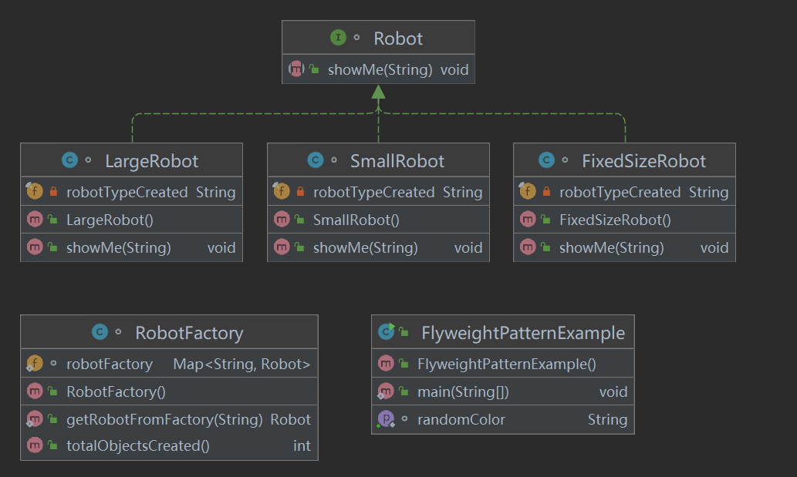
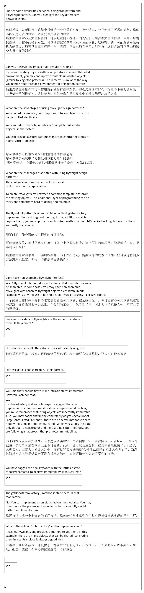

## 1，定义
<table>
<colgroup>
<col style="width: 10%" />
<col style="width: 89%" />
</colgroup>
<thead>
<tr class="header">
<th>官方的</th>
<th>运用共享技术有效的支持大量细粒度对象的重用。</th>
</tr>
</thead>
<tbody>
<tr class="odd">
<td>通俗的</td>
<td>
应用场景：如果项目中有很多完全相同或相似的对象，则可以使用享元模式，节省内存。

享元对象能做到共享的关键就是区分了内部状态和外部状态。

内部状态：可以共享，不会随环境变化而变化

外部状态：不可以共享，会随环境变化而变化
</td>
</tr>
</tbody>
</table>
## 2，各类含义，UML

FlyweightFactory（享元工厂类）：创建并管理享元对象，享元池一般设计成键值对

FlyWeight（抽象享元类）：通常是一个接口或者抽象类，声明公共方法，这些方法可以向外界提供对象的内部状态，设置外部状态。

ConcreteFlyWeight（具体享元类）：为内部状态提供成员变量进行存储

UnsharedConcreteFlyWeight（非共享享元类）：不能被共享的子类可以设计为非共享享元类

## 3，代码

## 4，优缺点
优点：大大减少对象的创建，降低系统的内存，使效率提高。

缺点：提高了系统的复杂度，需要分离出外部状态和内部状态，而且外部状态具有固有化的性质，不应该随着内部状态的变化而变化，否则会造成系统的混乱。

优点：

1.极大的减少内存中对象的数量

2.相同或相似对象内存中只存在一份，极大的节约资源，提高系统性能

3.外部状态相对独立，不影响内部状态

缺点：

1.模式较复杂，使程序逻辑复杂化

2.为了节省内存，共享了内部状态，分离出外部状态，而读取外部状态使运行时间变长。

## 5，适用场景
1、系统有大量相似对象。 2、需要缓冲池的场景。

