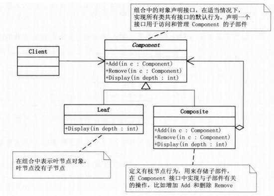
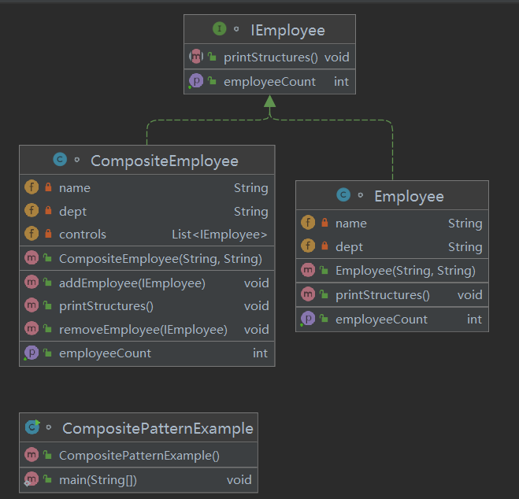
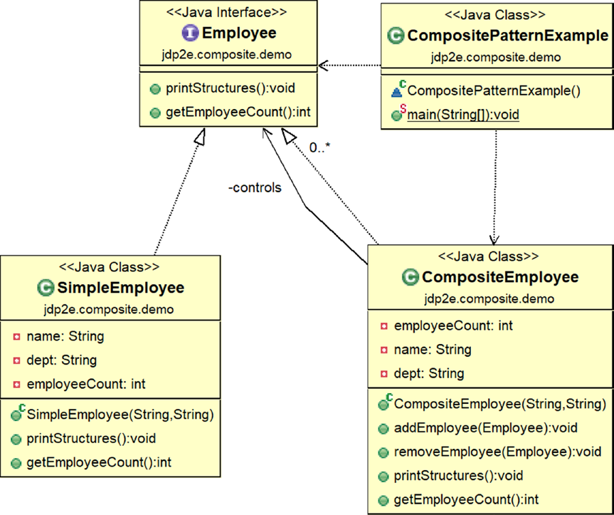
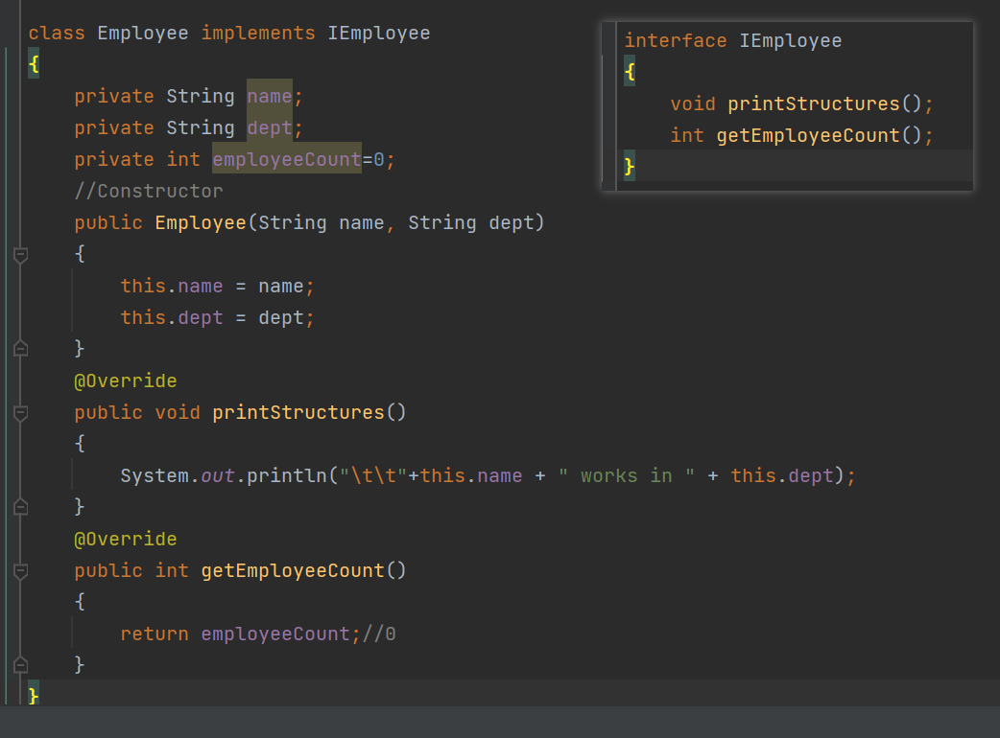
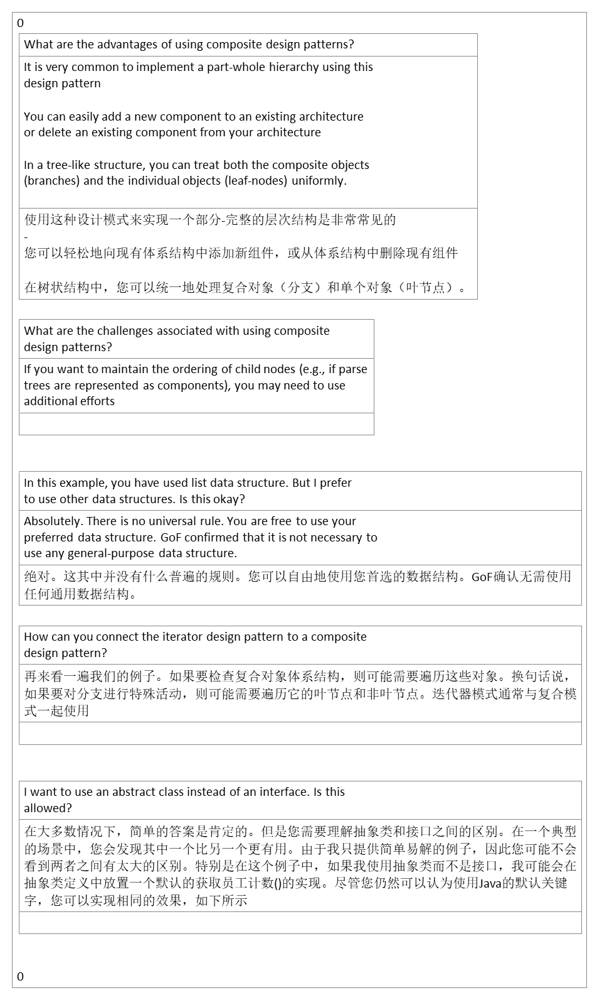

## 1，定义
<table>
<colgroup>
<col style="width: 9%" />
<col style="width: 90%" />
</colgroup>
<thead>
<tr class="header">
<th>官方的</th>
<th>是用于把一组相似的对象当作一个单一的对象。组合模式依据树形结构来组合对象，用来表示部分以及整体层次。这种类型的设计模式属于结构型模式，它创建了对象组的树形结构。</th>
</tr>
</thead>
<tbody>
<tr class="odd">
<td>通俗的</td>
<td>
java中的组合是指：在A类里定义一个B类的引用，A拥有了B，叫组合。

只是单纯的组合而已，而不是一种设计模式。

组合和组合模式不是一回事！

基本上见到的树形结构都使用到了组合模式。
</td>
</tr>
</tbody>
</table>
## 2，各类含义，UML

组合模式中有几个核心的部分：

Leaf（叶子）：表示该节点下面没有其他子节点了，就称为叶子
Compostie（容器构件）：容器构件，该节点下还有其他子节点，理解为一个容器，里面包含了其他子节点。就叫做容器构件
Component（抽象构件）：抽象构件中定义了叶子和容器构件的共同点。比如，有公共的添加删除叶子功能，有显示节点功能。

## 3，代码
<table>
<colgroup>
<col style="width: 47%" />
<col style="width: 52%" />
</colgroup>
<thead>
<tr class="header">
<th></th>
<th>

</th>
</tr>
</thead>
<tbody>
</tbody>
</table>

<table>
<colgroup>
<col style="width: 100%" />
</colgroup>
<thead>
<tr class="header">
<th>
import java.util.ArrayList;

import java.util.List;

class CompositeEmployee implements IEmployee

{

//private static int employeeCount=0;

private int employeeCount=0;

private String name;

private String dept;

//The container for child objects

private List&lt;IEmployee&gt; controls;

//Constructor

public CompositeEmployee(String name, String dept)

{

this.name = name;

this.dept = dept;

controls = new ArrayList&lt;IEmployee&gt;();

}

public void addEmployee(IEmployee e)

{

controls.add(e);

}

public void removeEmployee(IEmployee e)

{

controls.remove(e);

}

@Override

public void printStructures()

{

System.out.println("\t" + this.name + " works in " + this.dept);

for(IEmployee e: controls)

{

e.printStructures();

}

}

@Override

public int getEmployeeCount()

{

employeeCount=controls.size();

for(IEmployee e: controls)

{

employeeCount+=e.getEmployeeCount();

}

return employeeCount;

} }
</th>
</tr>
</thead>
<tbody>
</tbody>
</table>

<table>
<colgroup>
<col style="width: 100%" />
</colgroup>
<thead>
<tr class="header">
<th>

class CompositePatternExample {

/**Principal is on top of college.

*HOD -Maths and Comp. Sc directly reports to him

*Teachers of Computer Sc. directly reports to HOD-CSE

*Teachers of Mathematics directly reports to HOD-Maths

*/

public static void main(String[] args) {

System.out.println("***Composite Pattern Demo ***");

//2 teachers other than HOD works in Mathematics department

Employee mathTeacher1 = new Employee("Math Teacher-1","Maths");

Employee mathTeacher2 = new Employee("Math Teacher-2","Maths");

//teachers other than HOD works in Computer Sc. Department

Employee cseTeacher1 = new Employee("CSE Teacher-1", "Computer Sc.");

Employee cseTeacher2 = new Employee("CSE Teacher-2", "Computer Sc.");

Employee cseTeacher3 = new Employee("CSE Teacher-3", "Computer Sc.");

//The College has 2 Head of Departments-One from Mathematics, One

//from Computer Sc.

CompositeEmployee hodMaths = new CompositeEmployee("Mrs.S.Das(HOD-Maths)","Maths");

CompositeEmployee hodCompSc = new CompositeEmployee("Mr. V.Sarcar(HOD-CSE)", "Computer Sc.");

//Principal of the college

CompositeEmployee principal = new CompositeEmployee("Dr.S.Som (Principal)","Planning-Supervising-Managing");

//Teachers of Mathematics directly reports to HOD-Maths

hodMaths.addEmployee(mathTeacher1);

hodMaths.addEmployee(mathTeacher2);

//Teachers of Computer Sc. directly reports to HOD-CSE

hodCompSc.addEmployee(cseTeacher1);

hodCompSc.addEmployee(cseTeacher2);

hodCompSc.addEmployee(cseTeacher3);

/*Principal is on top of college.HOD -Maths and Comp. Sc directly

reports to him*/

principal.addEmployee(hodMaths);

principal.addEmployee(hodCompSc);

/*Printing the leaf-nodes and branches in the same way i.e.

in each case, we are calling PrintStructures() method

*/

System.out.println("\n Testing the structure of a Principal object");

//Prints the complete structure

principal.printStructures();

System.out.println("At present Principal has control over "+

principal.getEmployeeCount()+ " number of employees.");

System.out.println("\n Testing the structure of a HOD-CSE object:");

//Prints the details of Computer Sc, department

hodCompSc.printStructures();

System.out.println("At present HOD-CSE has control over "+

hodCompSc.getEmployeeCount()+ " number of employees.");

System.out.println("\n Testing the structure of a HOD-Maths object:");

//Prints the details of Mathematics department

hodMaths.printStructures();

System.out.println("At present HOD-Maths has control over "+

hodMaths.getEmployeeCount()+ " number of employees.");

//Leaf node

System.out.println("\n Testing the structure of a leaf node:");

mathTeacher1.printStructures();

System.out.println("At present Math Teacher-1 has control over "+

mathTeacher1.getEmployeeCount()+ " number of employees.");

/*Suppose, one computer teacher is leaving now

from the organization*/

hodCompSc.removeEmployee(cseTeacher2);

System.out.println("\n After CSE Teacher-2 resigned, the organization has following members:");

principal.printStructures();

System.out.println("At present Principal has control over "+

principal.getEmployeeCount()+ " number of employees");

System.out.println("At present HOD-CSE has control over "+

hodCompSc.getEmployeeCount()+ " number of employees");

System.out.println("At present HOD-Maths has control over "+

hodMaths.getEmployeeCount()+ " number of employees");

} }
</th>
</tr>
</thead>
<tbody>
</tbody>
</table>

<table>
<colgroup>
<col style="width: 100%" />
</colgroup>
<thead>
<tr class="header">
<th>
***Composite Pattern Demo ***

Testing the structure of a Principal object

<blockquote>

Dr.S.Som (Principal) works in Planning-Supervising-Managing

Mrs.S.Das(HOD-Maths) works in Maths

Math Teacher-1 works in Maths

Math Teacher-2 works in Maths

Mr. V.Sarcar(HOD-CSE) works in Computer Sc.

CSE Teacher-1 works in Computer Sc.

CSE Teacher-2 works in Computer Sc.

CSE Teacher-3 works in Computer Sc.

</blockquote>

At present Principal has control over 7 number of employees.

Testing the structure of a HOD-CSE object:

<blockquote>

Mr. V.Sarcar(HOD-CSE) works in Computer Sc.

CSE Teacher-1 works in Computer Sc.

CSE Teacher-2 works in Computer Sc.

CSE Teacher-3 works in Computer Sc.

</blockquote>

At present HOD-CSE has control over 3 number of employees.

Testing the structure of a HOD-Maths object:

<blockquote>

Mrs.S.Das(HOD-Maths) works in Maths

Math Teacher-1 works in Maths

Math Teacher-2 works in Maths

</blockquote>

At present HOD-Maths has control over 2 number of employees.

Testing the structure of a leaf node:

<blockquote>

Math Teacher-1 works in Maths

</blockquote>

At present Math Teacher-1 has control over 0 number of employees.

After CSE Teacher-2 resigned, the organization has following members:

<blockquote>

Dr.S.Som (Principal) works in Planning-Supervising-Managing

Mrs.S.Das(HOD-Maths) works in Maths

Math Teacher-1 works in Maths

Math Teacher-2 works in Maths

Mr. V.Sarcar(HOD-CSE) works in Computer Sc.

CSE Teacher-1 works in Computer Sc.

CSE Teacher-3 works in Computer Sc.

</blockquote>

At present Principal has control over 6 number of employees

At present HOD-CSE has control over 2 number of employees

At present HOD-Maths has control over 2 number of employees

</th>
</tr>
</thead>
<tbody>
</tbody>
</table>

## 4，优缺点
优点： 1、高层模块调用简单。 2、节点自由增加。

缺点：在使用组合模式时，其叶子和树枝的声明都是实现类，而不是接口，违反了依赖倒置原则。
“依赖倒置原则（Dependence Inversion Principle）是程序要依赖于抽象接口，不要依赖于具体实现。简单的说就是要求对抽象进行编程，不要对实现进行编程，这样就降低了客户与实现模块间的耦合。

## 5，适用场景
部分、整体场景，如树形菜单，文件、文件夹的管理。

