## 1，定义
| 官方的 |                                                                                 |
|--------|----------------------------------------------------------------------------------|
| 通俗的 | 将抽象部分与它的实现部分分离，使它们都可以独立的变化。而不会直接影响到其他部分。 |

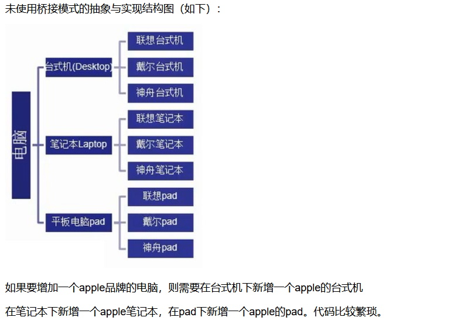

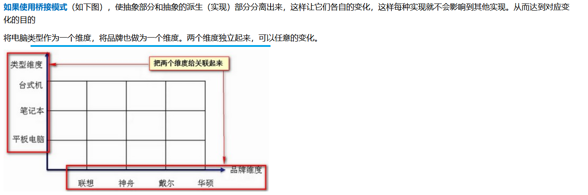

桥接模式解决了多层继承的结构，处理多维度变化的场景，将各个维度设计成独立的继承结构。使各个维度可以独立的扩展在抽象层建立联系。

最终类图如下：
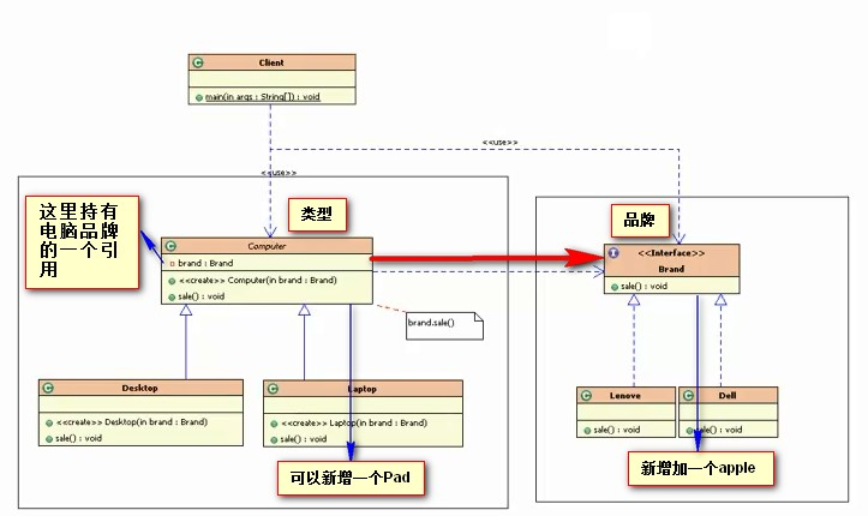

## 2，各类含义，UML

## 3，代码

<table>
<colgroup>
<col style="width: 43%" />
<col style="width: 56%" />
</colgroup>
<thead>
<tr class="header">
<th>
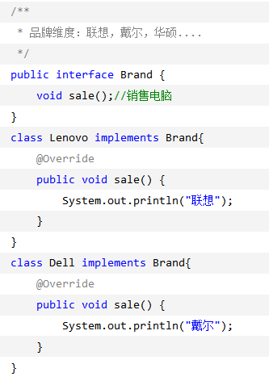

</th>
<th>
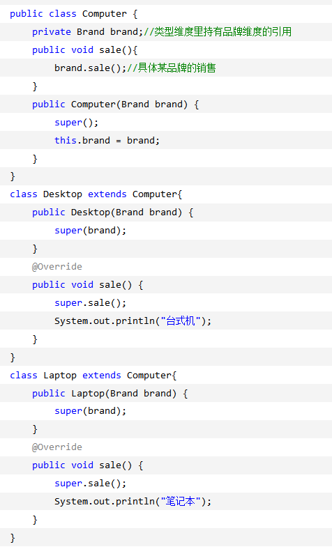

</th>
</tr>
</thead>
<tbody>
</tbody>
</table>
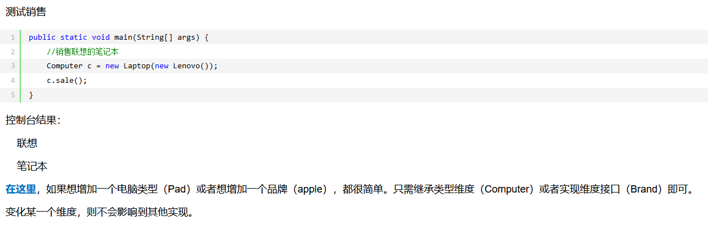

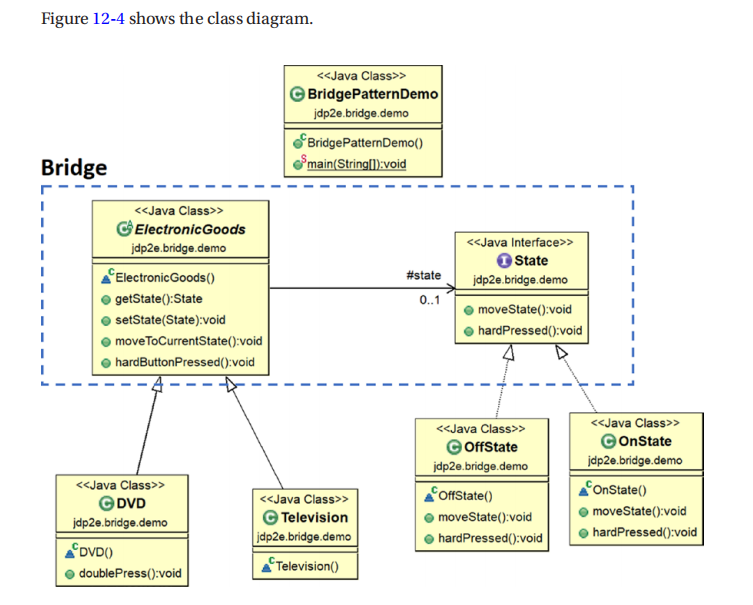
例子2
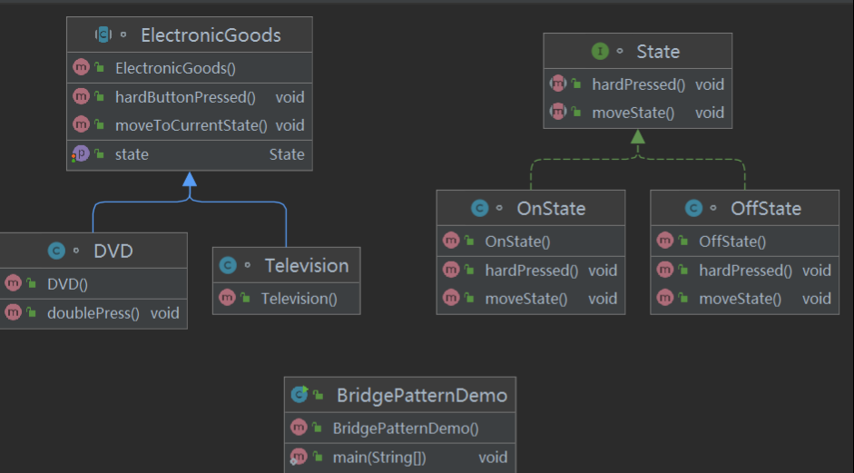

例子3
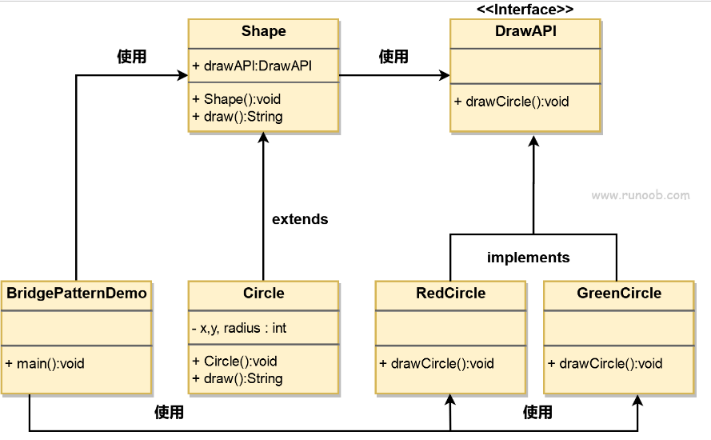

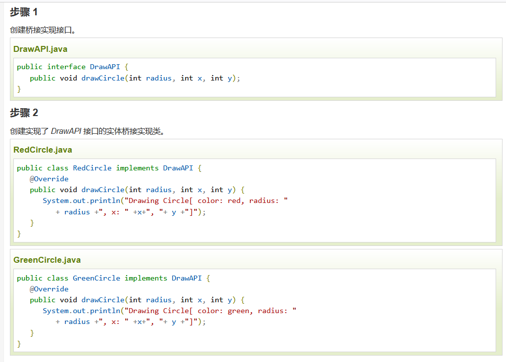

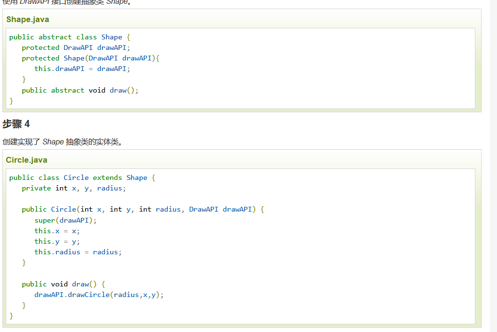

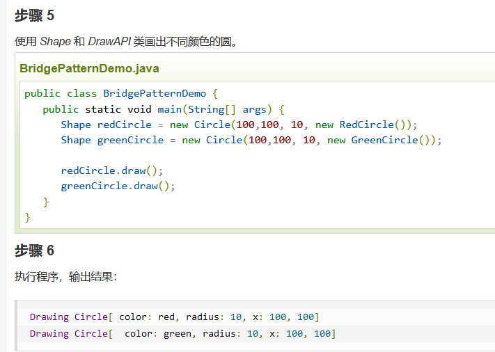

## 4，优缺点
优点： 1、抽象和实现的分离。 2、优秀的扩展能力。 3、实现细节对客户透明。

缺点：桥接模式的引入会增加系统的理解与设计难度，由于聚合关联关系建立在抽象层，要求开发者针对抽象进行设计与编程。

## 5，适用场景
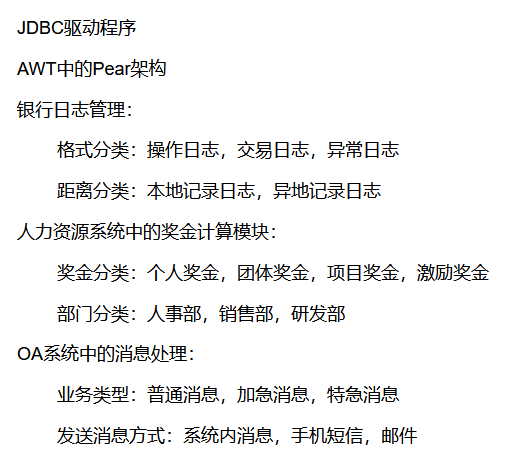

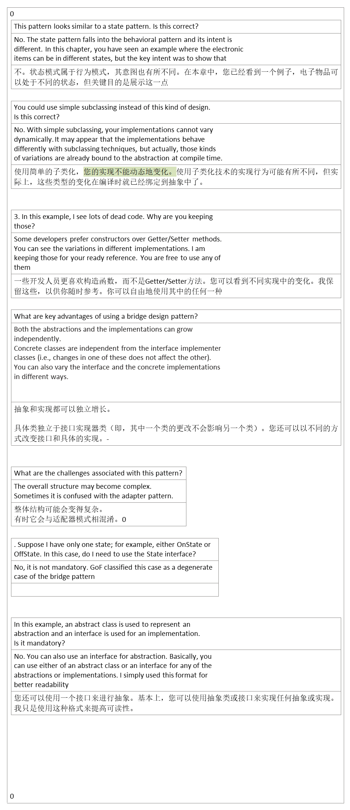

