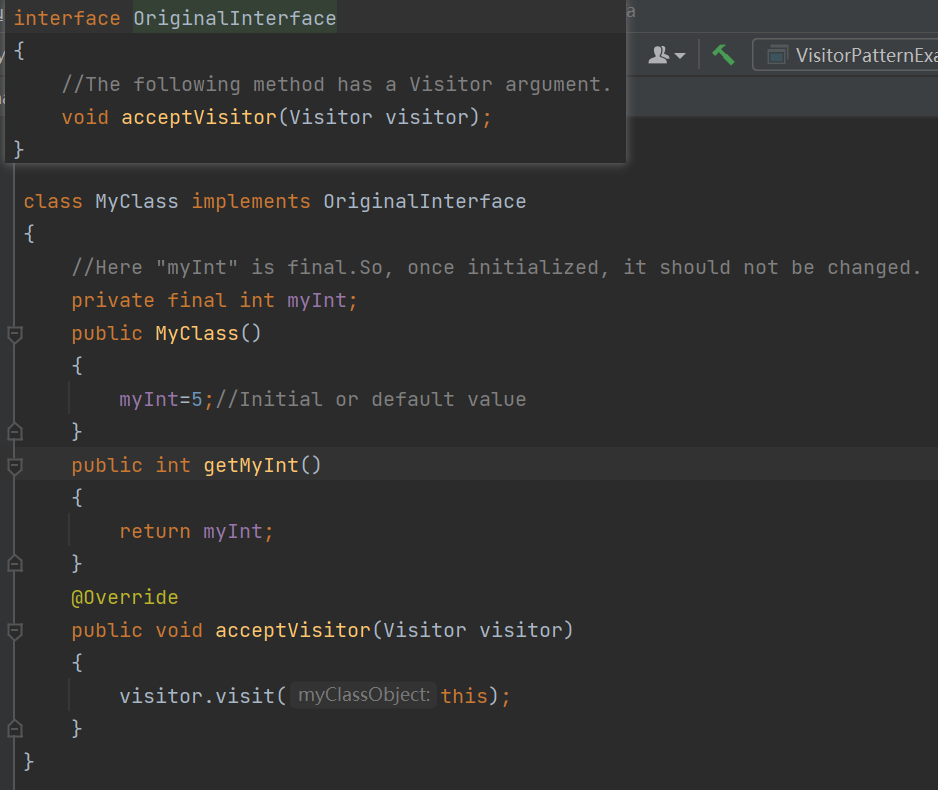

## 1，定义
| 官方的 | 表示一个作用于某对象结构中的各元素的操作。它使你可以在不改变各元素的类的前提下==定义作用于这些元素的新操作。== |
|--------|--------------------------------------------------------------------------------------------------------------------------------------|
| 通俗的 | 针对不同对象做一些不同的操作，则可以使用访问者模式。                                                                                 |
## 2，各类含义，UML

我们将创建一个定义接受操作的 ComputerPart 接口。
Keyboard、Mouse、Monitor 和 Computer 是实现了 ComputerPart 接口的实体类。
我们将定义另一个接口 ComputerPartVisitor，它定义了访问者类的操作。Computer 使用实体访问者来执行相应的动作。

VisitorPatternDemo，我们的演示类使用 Computer、ComputerPartVisitor 类来演示访问者模式的用法。

## 3，代码
例子1

例子2

## 4，优缺点
优点：
1、符合单一职责原则。
2、优秀的扩展性。
3、灵活性。

缺点：
1、具体元素对访问者公布细节，违反了迪米特原则。
2、具体元素变更比较困难。
3、违反了依赖倒置原则，依赖了具体类，没有依赖抽象。

## 5，适用场景
XML文档解析器设计
编译器设计
复杂集合对象的处理

