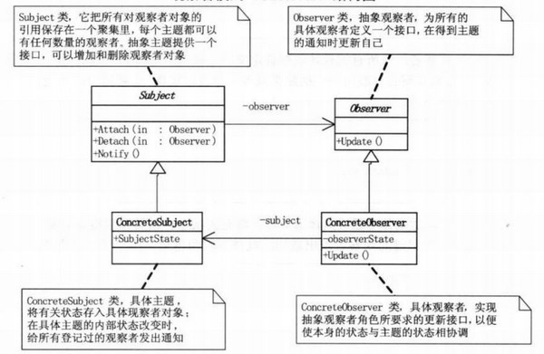
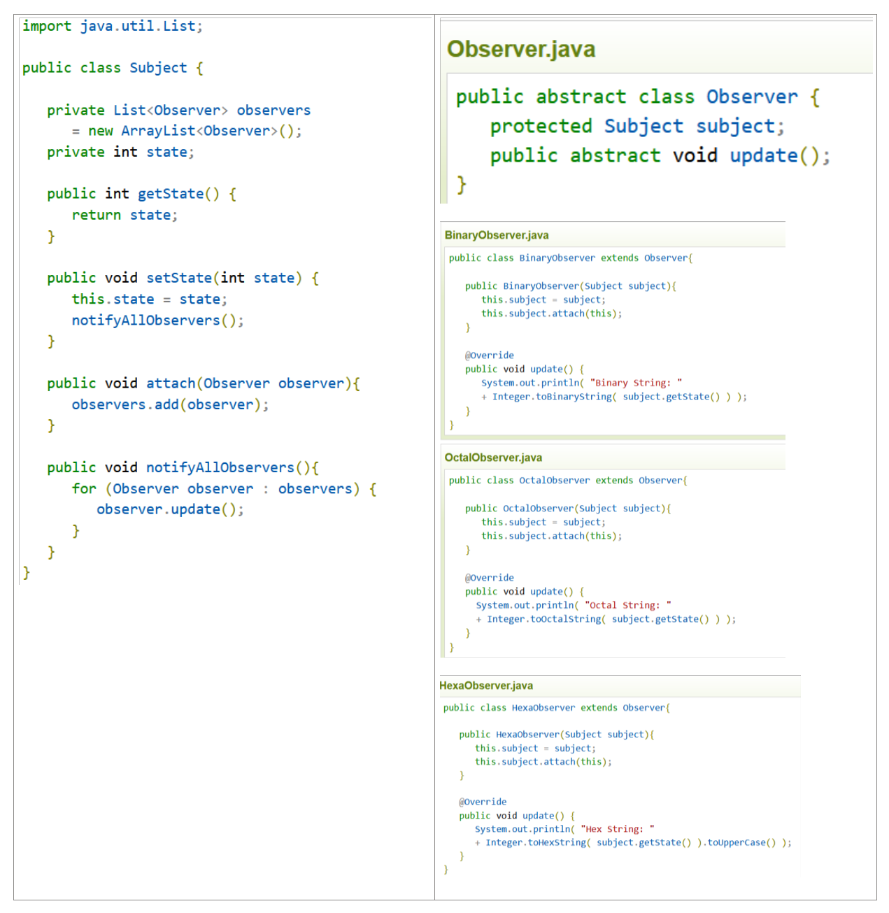
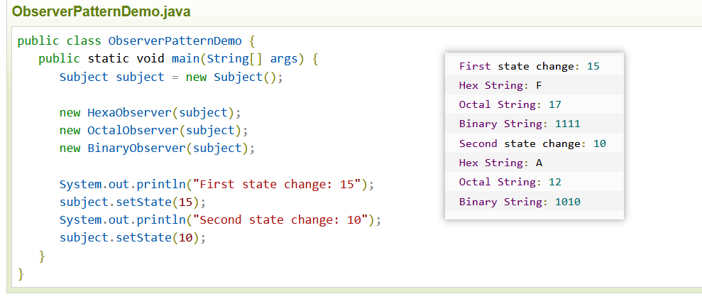
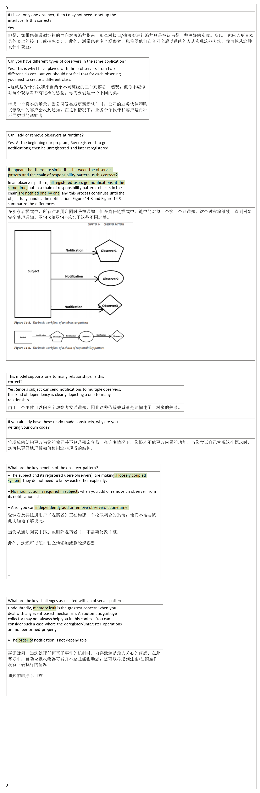

14-Observer Pattern
2021年12月11日
9:14

## 1，定义
<table>
<colgroup>
<col style="width: 8%" />
<col style="width: 91%" />
</colgroup>
<thead>
<tr class="header">
<th>官方的</th>
<th>（发布-订阅模式）：定义了一种一对多的依赖关系，让多个观察者对象同时监听某一个主题对象，这个主题对象在状态发生变化时，会通知所有观察者对象。使它们能够自动更新自己。</th>
</tr>
</thead>
<tbody>
<tr class="odd">
<td>通俗的</td>
<td>
1、游戏中的例子：游戏中，当进入新人的时候，大喇叭会通知所有的玩家。所有的游戏玩家是订阅者，而大喇叭就是一个发布者。

2、QQ群聊天中：在群里聊天的时候，你发一句话，大家都可以看到。那么，这个群里的人就是订阅者，而通过群发消息的服务器则作为了一个发布者
</td>
</tr>
</tbody>
</table>
## 2，各类含义，UML

Subject（抽象主题）：抽象主题中把所有观察者对象的引用都保存在一个集合里，每个主题都可以有任何数量的观察者，这个主题提供一个接口。来增加或者删除具体的观察者对象。

ConcreteSubject（具体主题）：具体主题中就操作了具体的观察者对象，将有关状态存入具体的观察者对象中，假如具体主题内部状态发生了改变。则给所有注册过的观察者发出更新的通知。然后具体的观察者则更新自己的状态。

Observer（抽象观察者）：为所有观察者定义一个接口，在得到主题的通知时则更新自己。

ConcreteObserver（具体观察者）：实现抽象观察者定义的接口，自身的状态随着主题的更新而更新。

## 3，代码

## 4，优缺点
优点： 1、观察者和被观察者是抽象耦合的。 2、建立一套触发机制。

缺点： 1、如果一个被观察者对象有很多的直接和间接的观察者的话，将所有的观察者都通知到会花费很多时间。 2、如果在观察者和观察目标之间有循环依赖的话，观察目标会触发它们之间进行循环调用，可能导致系统崩溃。 3、观察者模式没有相应的机制让观察者知道所观察的目标对象是怎么发生变化的，而仅仅只是知道观察目标发生了变化。

# 5，适用场景

1.聊天室程序，服务器转发信息给所有客户端

2.网络游戏（多人联机对战）场景中，服务器将客户端的状态进行分发

3.邮件订阅

